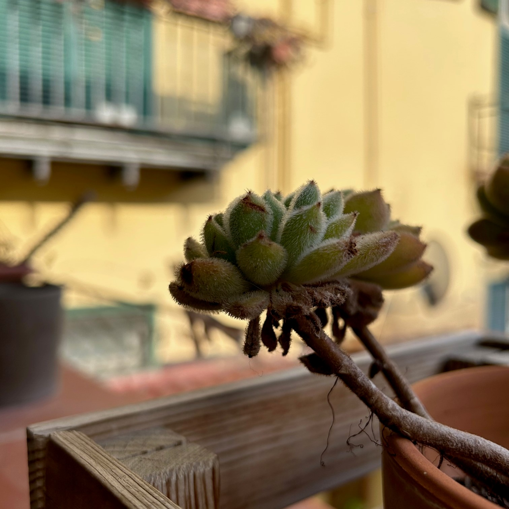
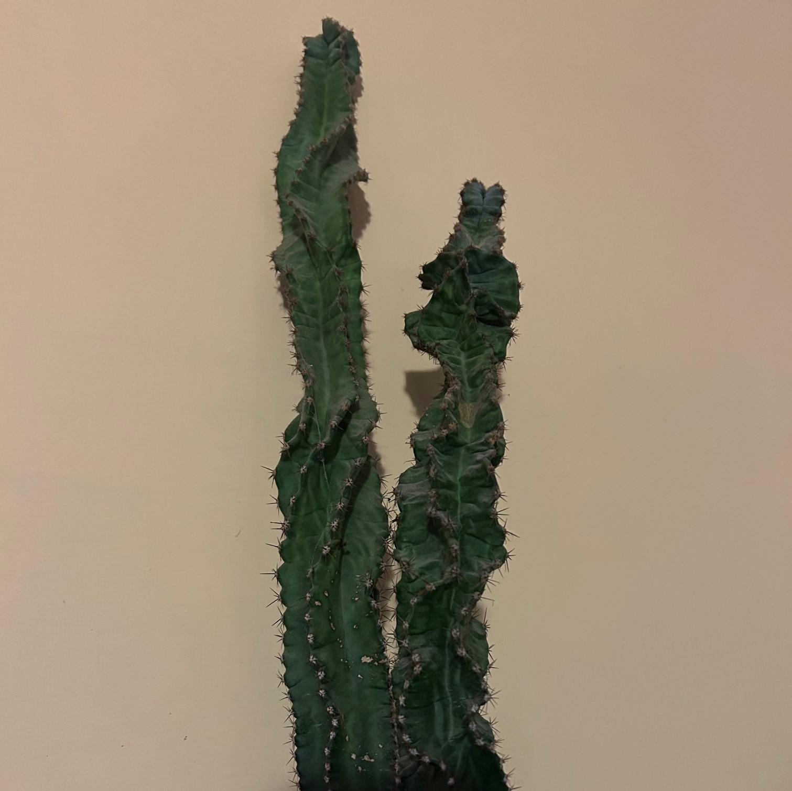
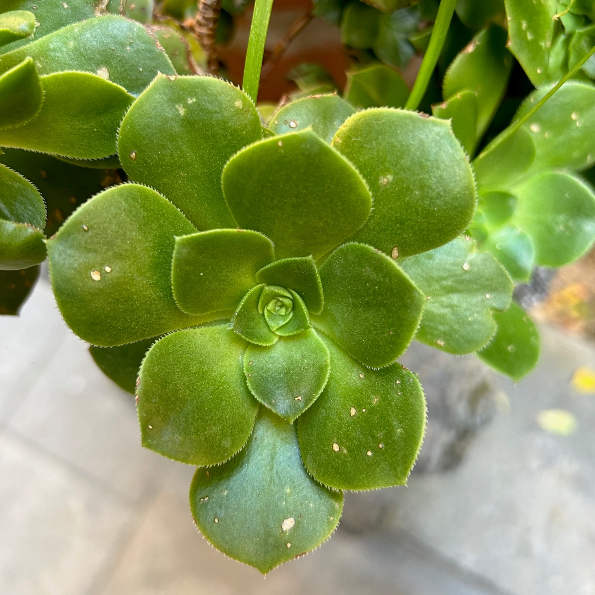
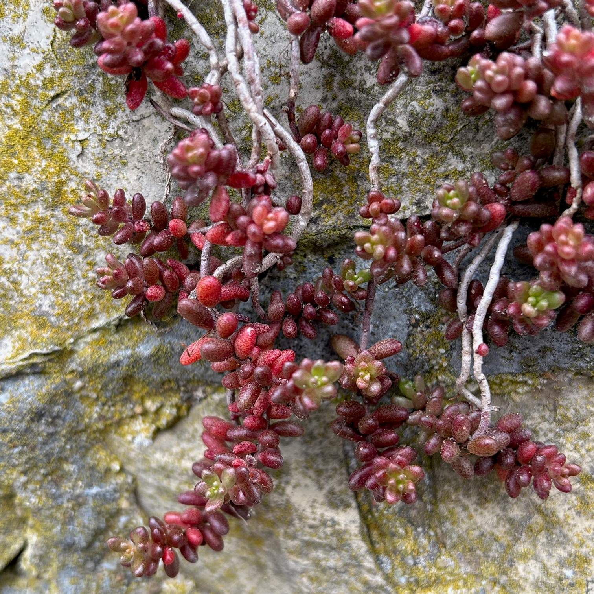
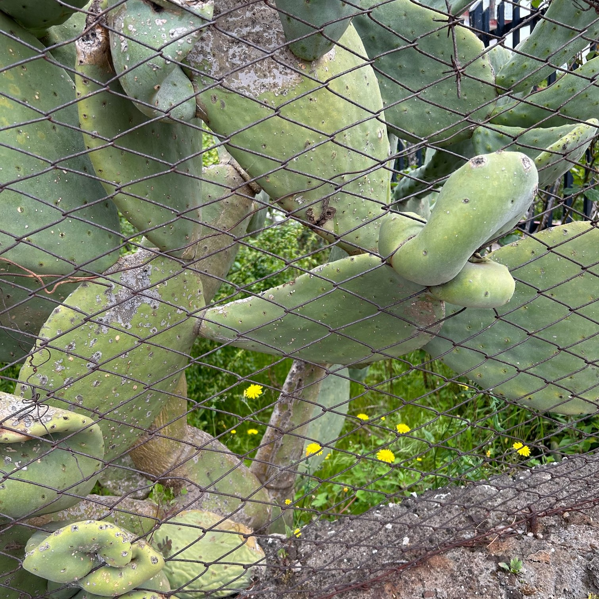
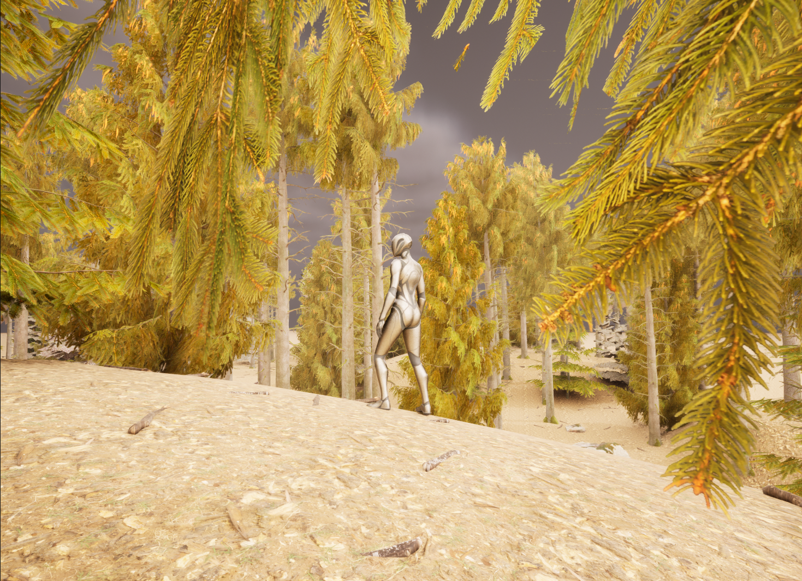
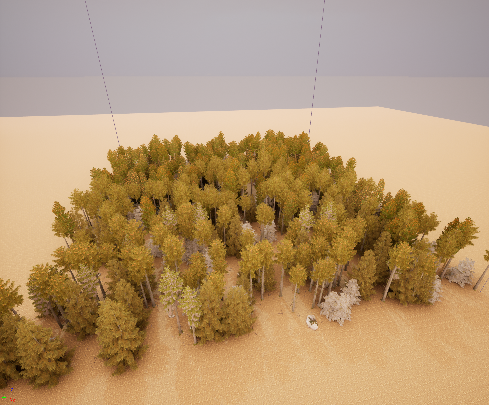
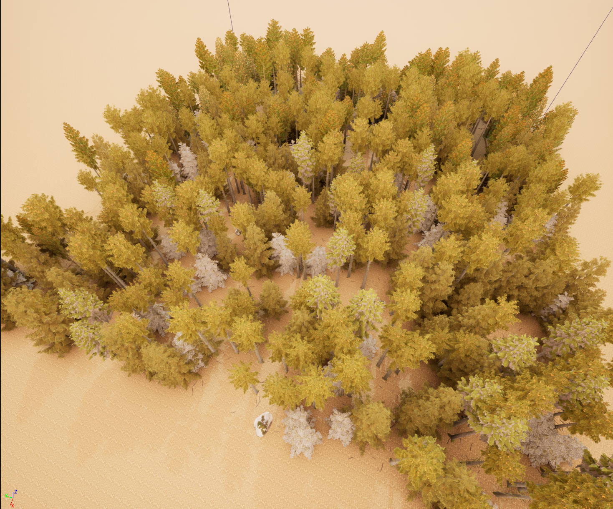

**Procedural Generation and Simulation**  

Prof. Dr. Lena Gieseke \| l.gieseke@filmuniversitaet.de  
Teaching Assistant: Sylvia Rybak \| sylvia.rybak@filmuniversitaet.de

---

# Session 02 - Beauty in Maths (10 points)

This session is due on **Monday, May 8th** and we will discuss the results on Wednesday, May 10th.  

This assignment should take <= 4h. If you need longer, please comment on that in your submission.

* [Session 02 - Beauty in Maths (10 points)](#session-02---beauty-in-maths-10-points)
    * [The Theory](#the-theory)
    * [Task 02.01 - Creative Project Development Numbers and Curves](#task-0201---creative-project-development-numbers-and-curves)
    * [Unreal](#unreal)
        * [Task 02.02 - Procedural Generation Plugin](#task-0202---procedural-generation-plugin)
    * [Learnings](#learnings)
        * [Task 02.03](#task-0203)

## Task 02.01 - Creative Project Development Numbers and Curves

**Project concept**

My idea for a project is inspired by the visual beauty of mathematical formulas and their strong influence on our perception, combined with the aesthetics of lo-fi music. When I am listening to lo-fi, I cannot help myself but always imagine surreal and abstract places, usually full of both vibrant and pastel colors, especially pink nuances. This is not a surprise since, nowadays, those are exactly the aesthetics that artists use for lo-fi illustrations and visualizations.

That being the case, I would love to work on the creation of a non-linear video story where the emphasis would be not only on the colors, but also on the movements and shapes of the actors. All the actors would be plants and animals, created as a mixture of real organisms and abstract details. 

*Shapes*

The different plants and animals should be built mostly with circles and rectangular forms, following the Fibonacci sequence and the Golden ratio. I imagine the majority of plants with rather long leaves or being climbing plants. They would be inspired by some of my favourite ones, e.g. the spider plant, Dracaena trifasciata, common ivy, Ficus benjamina. The animal characters would include most likely deer-inspired pink creatures (see sketch below) as main characters, and bird-like and fish-like secondary characters around. All colors would be rather flat and picked from a small predefined color palette.

*Movements*

I imagine that some of the plants will be growing their leaves, following the golden angle, so that the beauty and visual satisfaction of this process are to be experienced simultaneously for the viewer. There would also be plants that unfurl in a similar way to the fern plant, following the Fibonacci sequence. I also imagine the movements of the deer being slow and emphasizing on specific small details. As an example, their long legs would fold and unfold like a golden spiral. Moreover, all movements in the scene should follow some patterns, so that they look like a symbiotic dance.

Using mathematical formulas for the static and moving visuals, I would like to try to capture and represent the natural connections around us.

*Fast sketch of the main character*

*Some plant inspiration photos I have taken*

    

*Art style inspiration*

 * https://margaux-peltat.artstation.com/

 * https://www.behance.net/leileimo

 * https://www.youtube.com/watch?v=V0lB-kIooOg

 * https://www.youtube.com/watch?v=5Yz2t1QeIHQ

 * https://www.youtube.com/watch?v=IJrKlSkxRHA

*Color palette ideas*

## Unreal

### Task 02.02 - Procedural Generation Plugin

## Learnings

### Task 02.03

I really enjoyed this session because introducing mathematical concepts with visual examples of their practical application is what I have been missing in the math courses during my bachelor's degree. I always knew that math is *actually very cool*, but I was struggling to really enjoy it because it was never introduced to me in a more interesting manner, or at least in a way that clicks. Therefore, now I feel motivated to invest time, on one hand, in remembering in more details all I have learnt in the past years, and on the other hand, in exploring further mathematical concepts, while trying to embrace them more in my creative ideas and projects.

---
