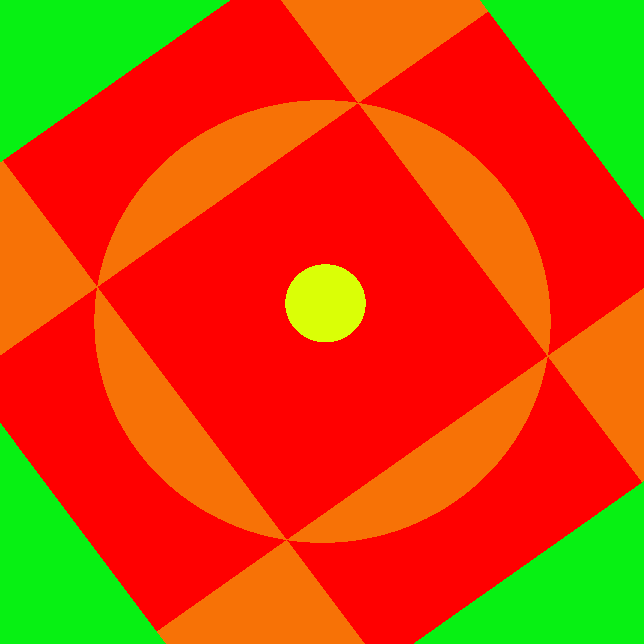
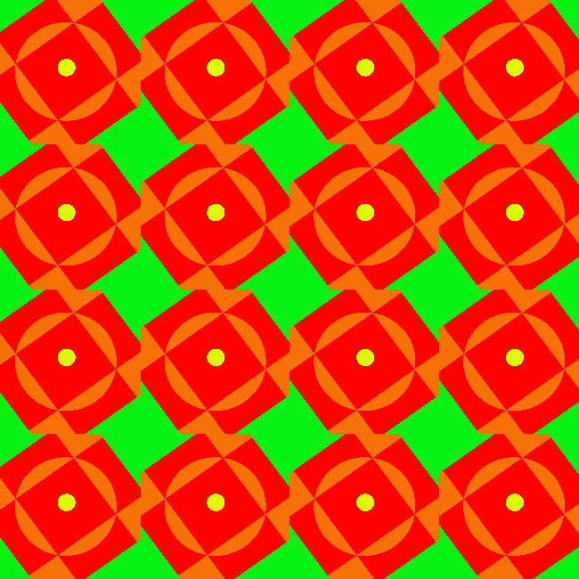

**Procedural Generation and Simulation**  

Prof. Dr. Lena Gieseke \| l.gieseke@filmuniversitaet.de  
Teaching Assistant: Sylvia Rybak \| sylvia.rybak@filmuniversitaet.de

---

# Session 03 - Function Design (10 points)

This session is due on **Monday, May 15th** and we will discuss the results on Wednesday, May 17th. You can already keep in mind that I will add the other half of this exercise next week and that it will also be due on May 15!

This assignment should take <= 4h. If you need longer, please comment on that in your submission.

* [Session 03 - Function Design (10 points)](#session-03---function-design-10-points)
    * [A New Environment](#a-new-environment)
        * [Task 03.01 - Setup Fragment Shader](#task-0301---setup-fragment-shader)
    * [Function Design](#function-design)
        * [Task 03.02 - Brick Pattern](#task-0302---brick-pattern)
        * [Task 03.03 - Experiments](#task-0303---experiments)
        * [Task 03.04 - Inspiration](#task-0304---inspiration)
    * [Unreal](#unreal)
    * [Learnings](#learnings)
        * [Task 03.05](#task-0305)

---

## A New Environment

### Task 03.01 - Setup Fragment Shader

*Done - set it up using the glsl extension for VS Code*

### Task 03.02 - Brick Pattern

*Submission:* `brick_angelova.frag`

### Task 03.03 - Experiments

 

I tried to create a pattern inspired by a flower-like design. The colors are influenced by illustration styles with bold and vibrant colors (e.g. [1](https://i.pinimg.com/564x/e1/ea/82/e1ea825e9935f1ea4fe95ae642cb4d07.jpg), [2](https://i.pinimg.com/564x/47/e0/09/47e00944bfb014c021d013b4da9b9d8a.jpg)). Moreover, I really liked the shader example from Nina Warmerdam in *The Book of Shaders*, Chapter 09 (https://thebookofshaders.com/09/), therefore I wanted to play around and imeplement the spinning effect for my design. 

*Submission:* `experiments_angelova.frag`

### Task 03.04 - Inspiration

https://www.shadertoy.com/view/XslGRr

https://www.shadertoy.com/view/ld3Gz2

https://www.shadertoy.com/view/lsl3RH

https://www.shadertoy.com/view/ldlcRf

## Learnings

### Task 03.05

This session was very interesting to me, because I only had a vague idea what shaders are. Therefore, after the detailed introduction, I think that this field is pretty fascinating and I feel motivated to explore it further - *The Book of Shaders* is very nice and beginner-friendly for that purpose. Since it is always difficult for me to imagine low-level concepts, I found it a bit challenging at first to understand how the shader space works and what exactly happens with the coordinates, but I think that now I have a better understanding.

---
