**Procedural Generation and Simulation**  

Prof. Dr. Lena Gieseke \| l.gieseke@filmuniversitaet.de  
Teaching Assistant: Sylvia Rybak \| sylvia.rybak@filmuniversitaet.de

---

# Session 05 - Noise (10 points)

This session is due on **Monday, May 29th**. This assignment should take <= 4h. If you need longer, please comment on that in your submission.

* [Session 05 - Noise (10 points)](#session-05---noise-10-points)
    * [Noise](#noise)
    * [Seeing Noise](#seeing-noise)
        * [Task 05.01 - Collecting Inspiration](#task-0501---collecting-inspiration)
    * [Unreal](#unreal)
        * [Task 05.02 - A Fancy Noise Material in Unreal](#task-0502---a-fancy-noise-material-in-unreal)
    * [Learnings](#learnings)
        * [Task 05.03](#task-0503)

---

## Seeing Noise 

### Task 05.01 - Collecting Inspiration

Natural noise patterns

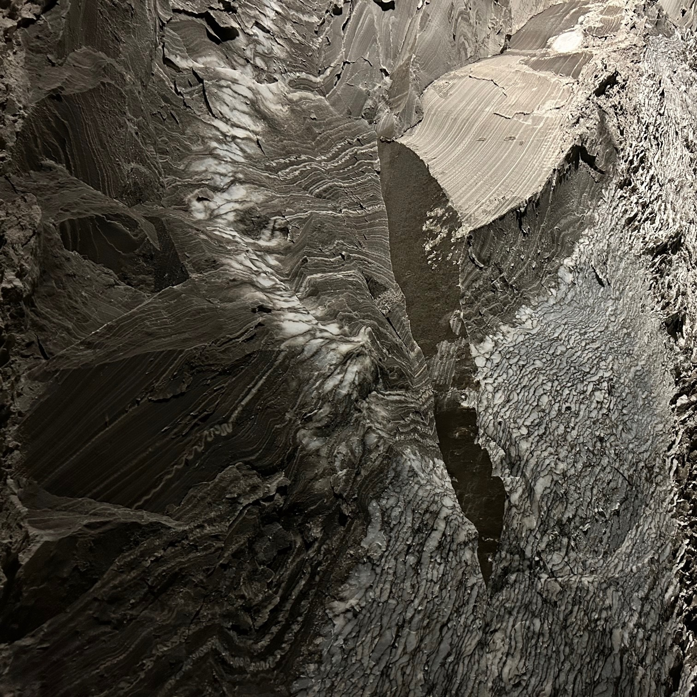 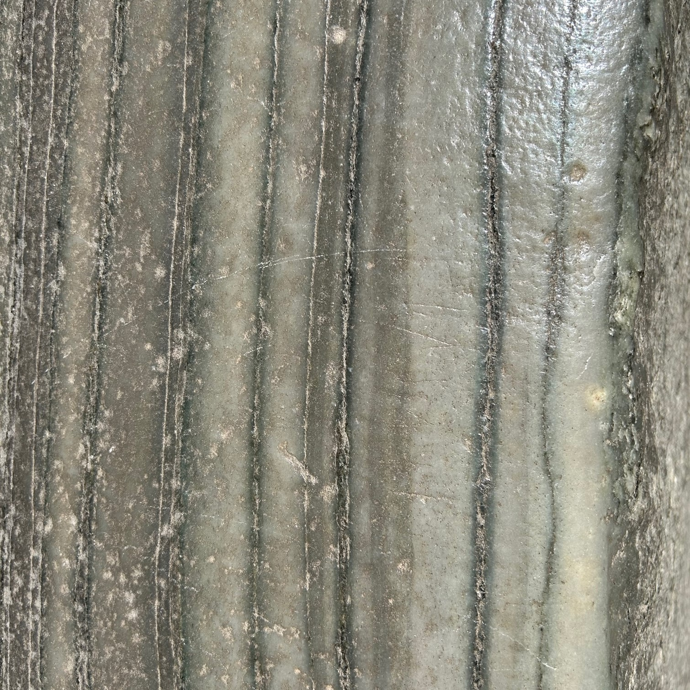 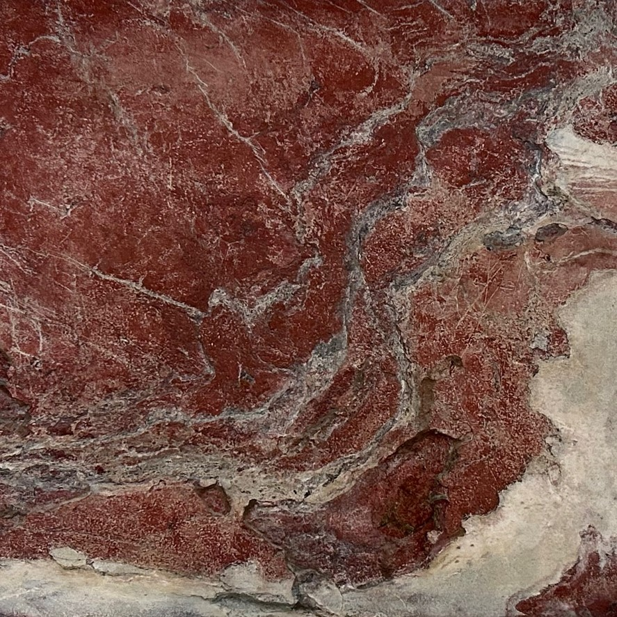 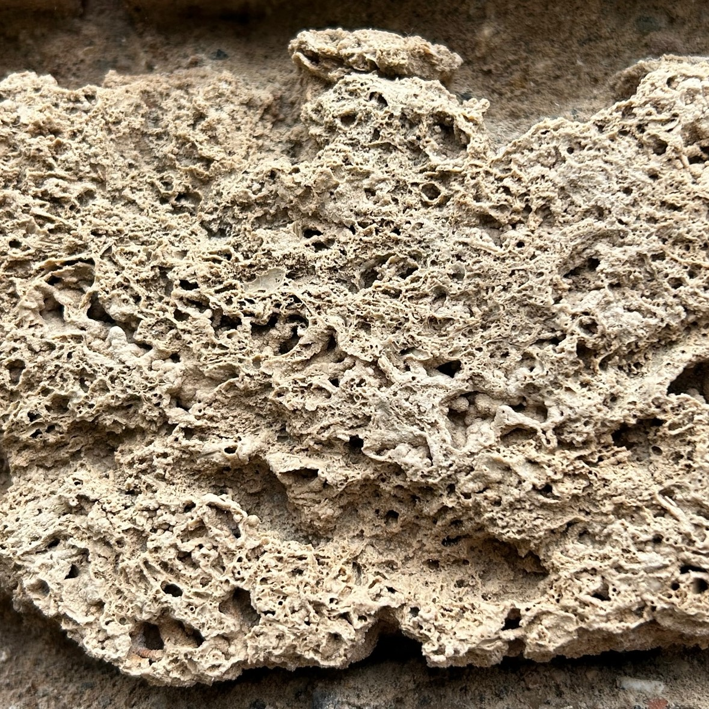 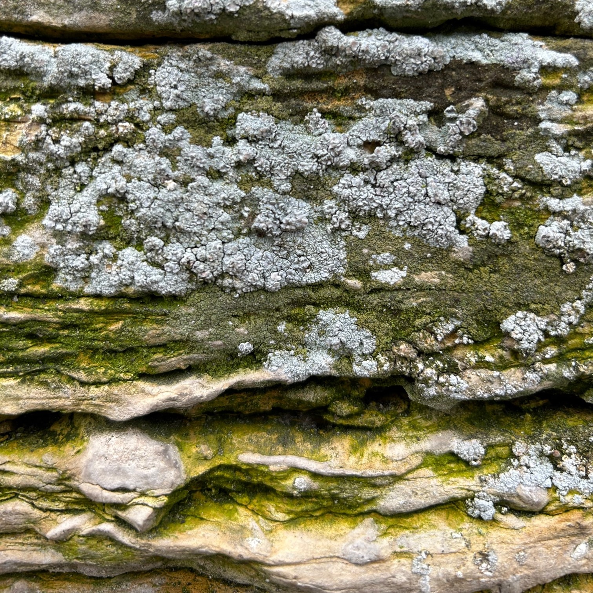 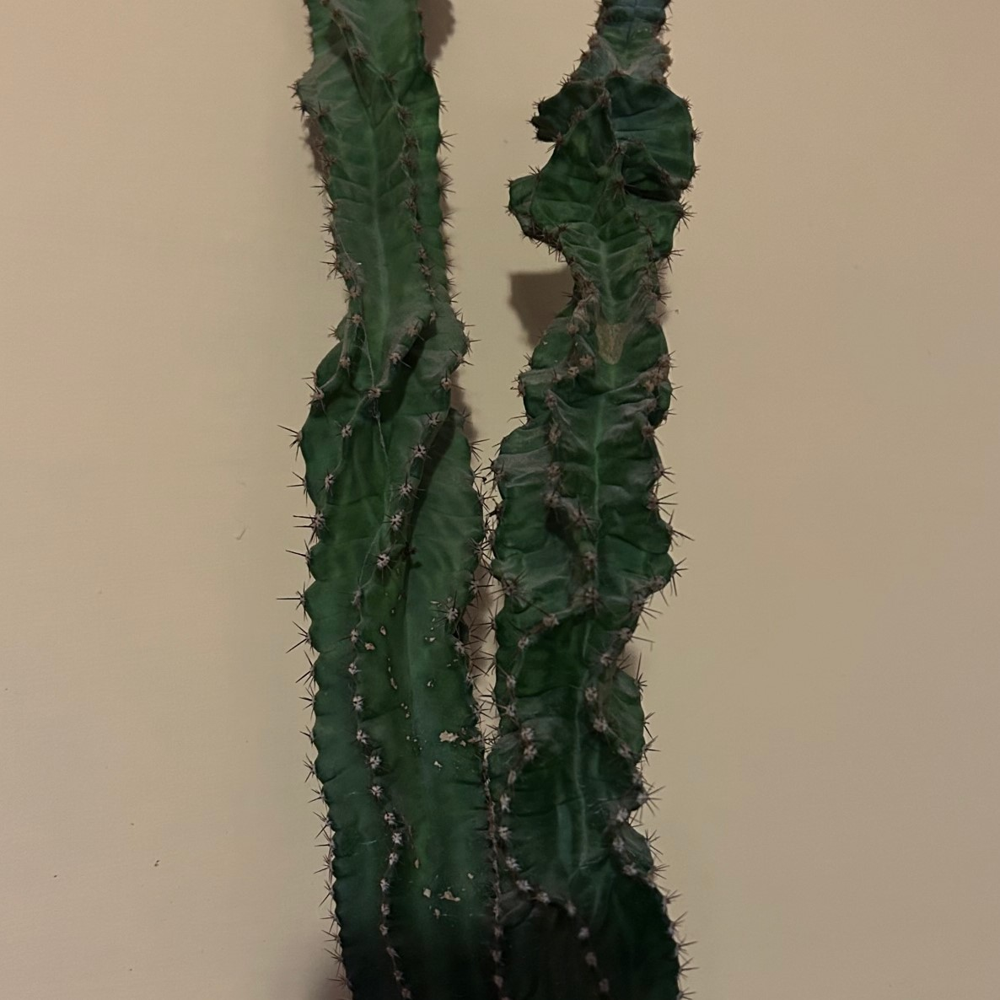 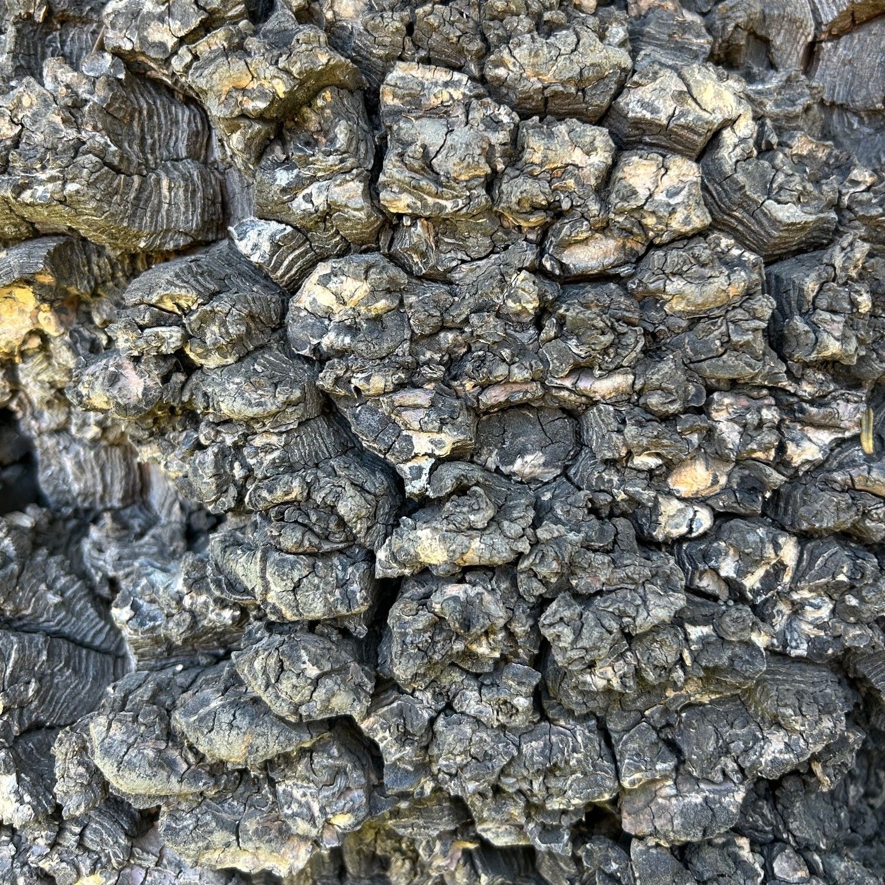 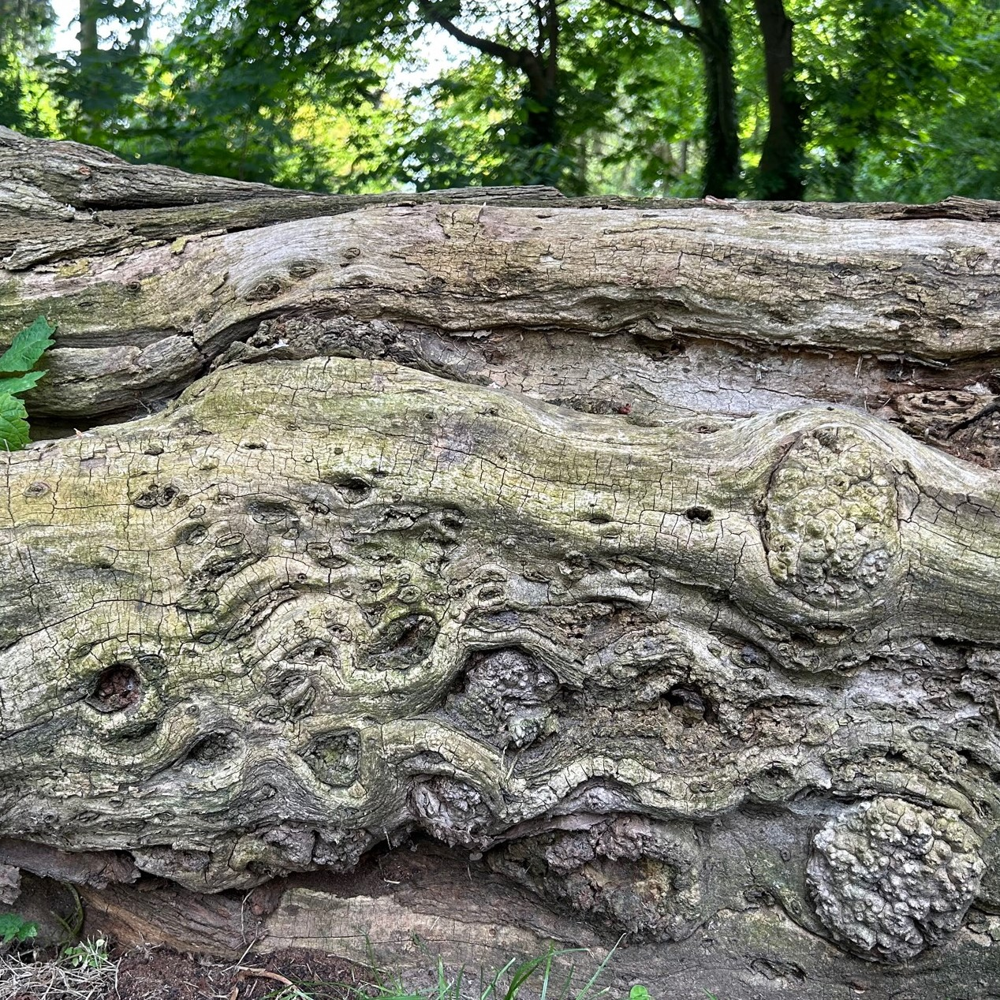

Artistic image using noise as generating principle (or design element)

If I have to be honest, I find almost everything made with Perlin noise or Curl noise visually pleasing - even the simplest wavey lines (especially white ones on black background), therefore instead of putting here many pictures of this type, I decided to share two projects, which use noise and have very interesting outcomes. [This one](https://www.behance.net/gallery/46624687/Curl-Noise) absolutelly won me with the dog sculpture, and in [the second one](https://jonmccormack.info/project/noise-drawings) I really like the idea of combinging generative art with traditional mediums. 

## Unreal

### Task 05.02 - A Fancy Noise Material in Unreal

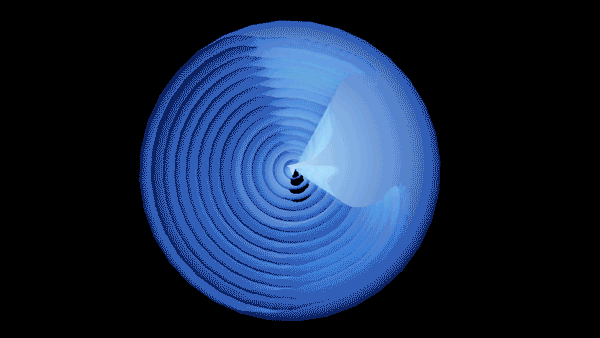

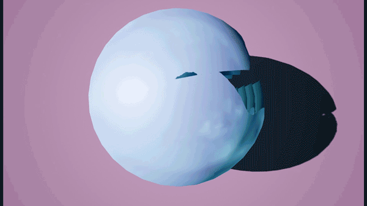

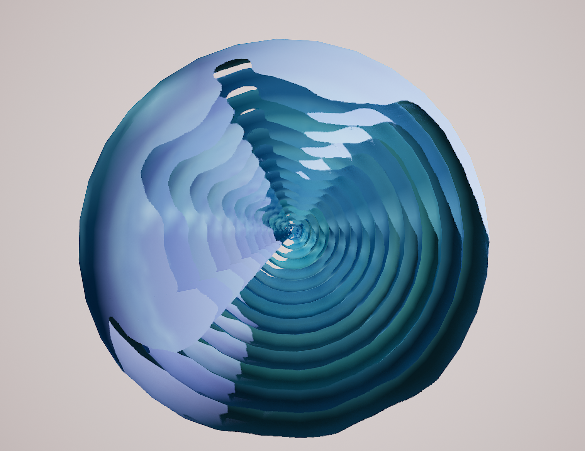

For my visualization, I tried to achieve a kind of fluidlike feeling. Therefore, I picked the blueish colors and also adjusted the parameters in a way that the motion appears calmer and flowing.  

## Learnings

### Task 05.03

I think that one challenging aspect for me was to really grasp the definition of procedural noise, and to understand the difference between totally random systems and systems with noise. What really helped me, was to learn the requirements for noise functions, as well as to get to know different types of such functions. I also tried to understand the concept behind Perlin noise more thoroughly.

On the practical side, I spent more time playing around with Unreal Engine after reading the two recommended tutorials, trying to generate my version of a Niagara system with noise, and to also render it. I also watched further video tutorials on YouTube, which really inspired me to explore this software further. Moreover, I read more about Niagara in the Unreal documentation and I find it very fascinating how powerful of a tool it is. Therefore, I think that it is definitely a challenge to start understanding Unreal's functionalities and tools in more depth with the goal of producing visually nice results, but this does also make it more exciting.

---
