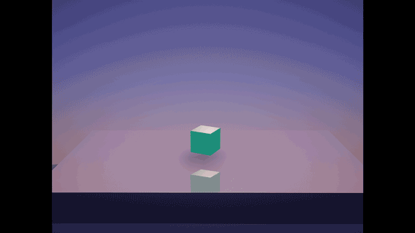
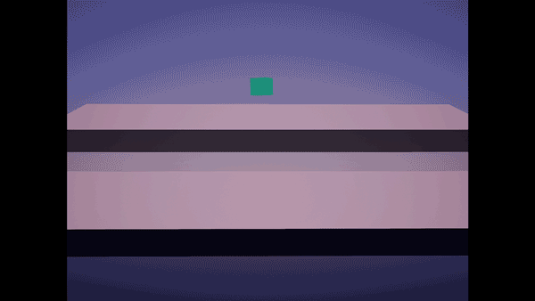
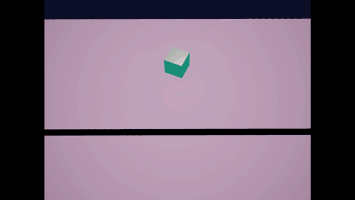

**Procedural Generation and Simulation**  

Prof. Dr. Lena Gieseke \| l.gieseke@filmuniversitaet.de  
Teaching Assistant: Sylvia Rybak \| sylvia.rybak@filmuniversitaet.de

---

# Session 06 - Dynamics (10 points)

This session is due on **Monday, June 12th**. This assignment should take <= 4h. If you need longer, please comment on that in your submission.

* [Session 06 - Dynamics (10 points)](#session-06---dynamics-10-points)
    * [Dynamics](#dynamics)
    * [Unreal](#unreal)
        * [Task 06.01 - Fancy Cubes](#task-0601---fancy-cubes)
    * [Learnings](#learnings)
        * [Task 06.02](#task-0602)

---

## Dynamics

## Unreal

### Task 06.01 - Fancy Cubes

For this task, I played around a little bit, trying to find an interesting angle and some dynamics for the scene. Therefore, I decided to use two platforms, where the higher one is tilted, so that the cubes can slide, displaying the gravity force once again. Moreover, I experimented with different lighting and material setups with the idea of visualizing light, shadows and reflections in a more obvious way. For the versions shown below, the floor's material is mirror-like and it reflects the color of the scene's light. 

Note: I invested more time in understanding and working with FFmpeg and it really is a small, but very powerful tool. I even saved the specific commands that I need to create high-quality gifs as a note, so that I can just copy and paste them, whenever I need. Unfortunately, I could not upload the created gifs, because each one was more than 500MB. Therefore, I am sticking to my not so high-quality gifs, created in Photoshop.

## Learnings

### Task 06.02

I really enjoyed this session and could even say that it is one of my favorite topics until now. I liked the big overview, starting with traditional animation and transitioning to procedural systems. I once more appreciate the nicely scoped mathematical background, which helped me to really recall topics I learned a long time ago in school, but have also been to some extent forgotten. Definitely challenging was to find more diverse tutorials on simulation of rigid bodies in Unreal Engine. Although I found some for Blender and Houdini, I didn't have any luck with ones for UE. I only discovered Chaos Destruction - the Unreal Engine's system for creating high-performance destruction systems. I tried out one tutorial, but didn't really manage to create something that I liked.

---
