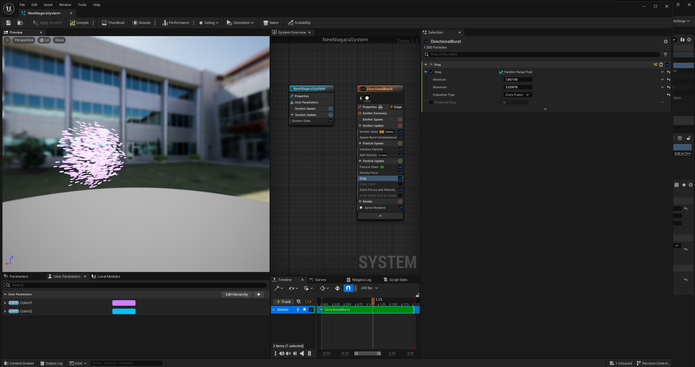

**Procedural Generation and Simulation**  

Prof. Dr. Lena Gieseke \| l.gieseke@filmuniversitaet.de  
Teaching Assistant: Sylvia Rybak \| sylvia.rybak@filmuniversitaet.de

---

# Session 07 - Particles (10 points)

Task 07.01 and 07.02 are due next class, meaning on Wednesday, June 14th. Task 07.03 and 04 are due on **Monday, June 19th**.

This assignment should take <= 4h. If you need longer, please comment on that in your submission.

* [Session 07 - Particles (10 points)](#session-07---particles-10-points)
    * [Particles](#particles)
        * [Task 07.01 - Lecture Topics](#task-0701---lecture-topics)
    * [Unreal](#unreal)
        * [Task 07.02 - Introduction To Niagara](#task-0702---introduction-to-niagara)
        * [Task 07.03 - Particles](#task-0703---particles)
    * [Learnings](#learnings)
        * [Task 07.04](#task-0704)

---

## Particles

### Task 07.01 - Lecture Topics

Read [Chapter 08 - Particles](../../02_scripts/pgs_ss23_07_dynamics_script.md). You can also have a look at the [slides](../../03_slides/pgs_ss23_07_slides.html), if that works better for you.

## Unreal

### Task 07.02 - Introduction To Niagara

To begin with, I watched the [UE5 Niagara in 300 Seconds](https://www.youtube.com/watch?v=Wxx_2ZLoKbI) tutorial.

Then I moved on to some other tutorials, for example [this one](https://www.youtube.com/watch?v=04k9JDx-KTM) and [this one](https://www.youtube.com/watch?v=_6YbcMhfHWg&t=40s).

### Task 07.03 - Particles

I tried [this tutorial](https://www.youtube.com/watch?v=N3Bwa_urhG8), because I like the idea and, while I was doing it, it helped to get a better understanding of how the Niagara system works and how to control the particles. However, I am still in the very beginner phase. I tried to come up with my own individual visual result... and I also realized that I am probably overusing the bluish-purple-pink palette.

--- 
