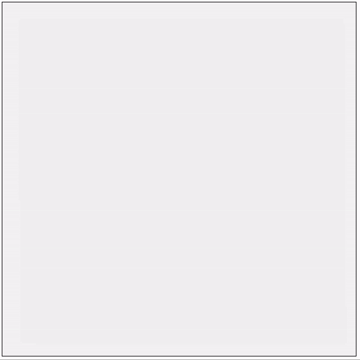

**Procedural Generation and Simulation**

Prof. Dr. Lena Gieseke \| l.gieseke@filmuniversitaet.de  
Teaching Assistant: Sylvia Rybak \| sylvia.rybak@filmuniversitaet.de

---

# Final Project - Fluids 

*Because of my personal fascination with natural phenomena, I found the last topic of the PGS lecture, Fluids, very interesting. Since it is both a difficult topic to grasp and a very interesting one, I decided that it would be a great idea to challenge myself and explore it as the subject of my final project. Therefore, here is a short story about my fluid journey, which, unfortunately, did not go that smoothly.* 

---

## Concept & Inspiration 

I started with some research about the topic - reading mainly blog posts, some papers, and looking into projects of other people. I was also creating a visual library of different fluid phenomena, e.g. different vortices in water, created by plants or swimming animals, interesting vortex patterns in the sky, for example, Kármán vortex streets. I also thought of Monet's paintings of water lilies, very favourite paintings of mine, and wanted to somehow include them in my final project. The other major inspiration for me was the book *"An Album of Fluid Motion"* by Milton Van Dyke, where the first two images (above and below ) come from. Code can be found in `./fluids`.

---

## Implementation 

I decided that my first step would be to read the paper [Real-Time Fluid Dynamics for Games](http://graphics.cs.cmu.edu/nsp/course/15-464/Fall09/papers/StamFluidforGames.pdf) by Jos Stam and then, to implement the base algorithm. From there, I wanted to experiment further, trying some interesting visualizations of the above-mentioned phenomena. But little did I know, that working with fluids is *not* as straight-forward as I thought.

### Day 1

I read the paper and realized that I understood almost *nothing*, because I had zero knowledge of the described fluids behaviours. Therefore, I tried to make more sense of the Navier-Stokes equations. I also set up a basic project structure, so that I am ready to start with the implementation once I understand it better. I decided to use JavaScript - since it is a language I am comfortable with, I thought the coding wouldn't be very time-consuming (again, *big mistake*). 

### Day 2 and Day 3

I won't lie by saying that I fully understood the Navier-Stokes equations, but at least I tried and had a slightly better idea what fluids do. Moreover, I decided to just implement the algorithm from the paper, and start from there with further experiments. Oh well, this was also *not as smooth as I thought*. After two days of implementing and testing, I still had no working algorithm. What I had can be seen in the figures below, which all go by the caption *"What is even going on?"*. Moreover, I slowly started realizing some of my mistakes.  

#### Mistake #1 
First of all, I underestimated the difficulty of the subject (or at least how difficult it would be for me), and as a result, I had planned a project too ambitious. Therefore, I decided that from that point on my new final goal would be to just try and understand the algorithm, and also eventually develop some kind of a working prototype. 

#### Mistake #2 
Even though JavaScript is a language I am usually comfortable working with, it is *NOT* a language I should use when performance matters. In the case of this algorithm, it absolutely does. Thus, it would have been a better decision to initially invest a little bit more time into getting familiar with another language, more suitable for the purpose, e.g. webGL, c++. This would have saved me time in the end. I could have also used Python, since I am familiar with it and it is a much better option for prototyping. Moreover, doing math in JavaScript is not the most convenient thing. So, a lesson learned - the JavaScript canvas is *not* the answer to every question.  

### Day 4 and Day 5
*Reading the paper, reading my code line by line, debugging, scratching my head - repeat.*

This sums it up pretty much. At least I learned two new useful things as a result of my bad decisions. 

#### Learning #1
I was trying to paint very naively on the canvas - using `ctx.fillStyle`, followed by `ctx.fillRect`, in order to paint pixel by pixel. This is indeed very slow, and a lot better option is to use the `ImageData` Interface. I first saw the idea in [this project here](https://github.com/topaz1008/canvas-fluid-solver), and researched further about it, in order to use it in my implementation. As a result, the algorithm was running around *5x* faster.

#### Learning #2 
Another important fix to increase the performance was to always use a *fixed-size* canvas, e.g. `canvas.width=canvas.height=CANVAS_SIZE` and rescale it. In this case, I am using `CANVAS_SIZE=200`, a scaling factor of 3, and as a result, I am working with canvas with constant size of 600px for the visualization in the browser.

Eventually, after a lot of sweating, I finally debugged my code, and made it work (*to the best of my abilities and as far as I am concerned*). However, I could not experiment further with it that much, because of time constraints, and also because I believe that it is not so straight-forward to find a way to introduce forces into the system (for the velocity field), different than using input from mouse events, which I don't like and did not want to implement. Hence, here I have some final visualizations of the density, moved by the velocity, which I managed to achieve after some explorational playing around with parameters. 

---

## Reflection

In a nutshell, I learned that gaining a more in-depth understanding of the technical part of some project is *very crucial* for its further development. I should not get too excited about ideas for the final results if I am not at all sure if and how these could be achieved. Moreover, choosing the right tools for the job is another important point to be considered. However, overall, I absolutely do not regret choosing this topic and investing so much time in it even though I did not get great results, because it is still a topic I find very fascinating, and now I have a better understanding of it. Therefore, I can use my current knowledge and my lessons learned to further work on it. And who knows - maybe I could find a way to paint some water lilies with vortices, using the fluids algorithm. :)   

--- 

## Results

Some of the first (somehow interesting) results I could render 

 

Some smooth flowing effects 

  

Trying to achieve some *more splash*

 

Adding some color and, of course, some *blink*

  

And let's finish with the one I liked the most, therefore picked as my final result

--- 
