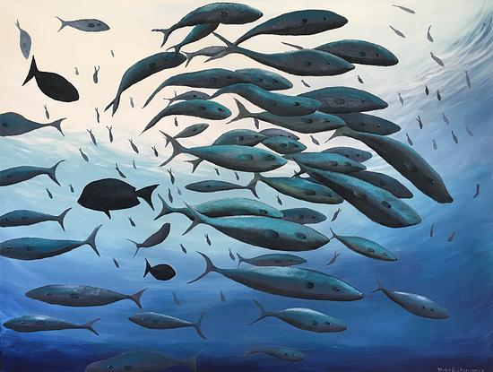
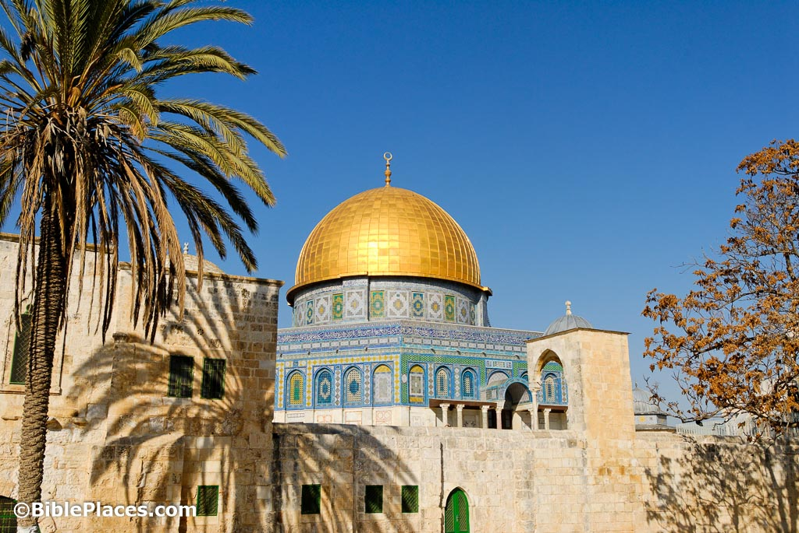
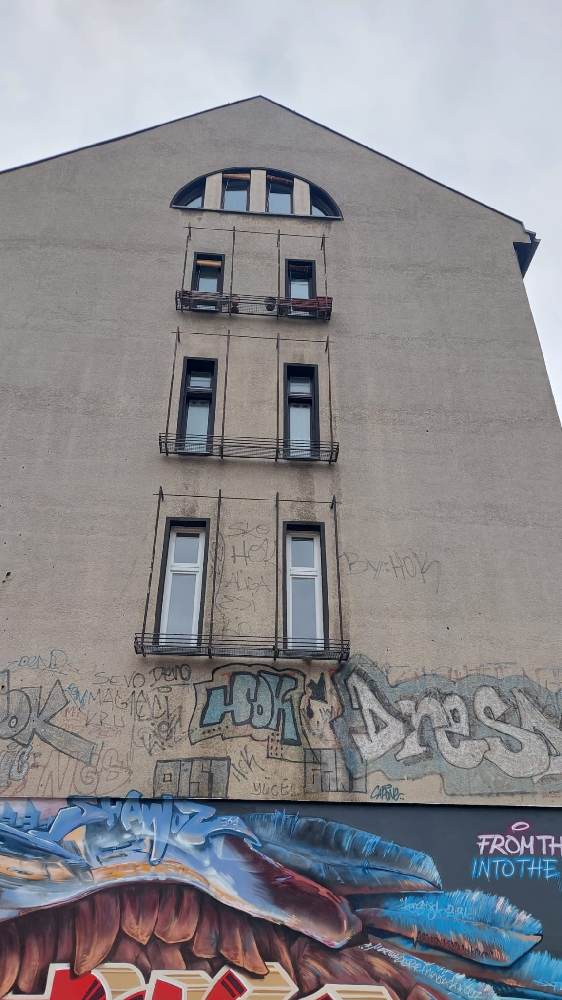
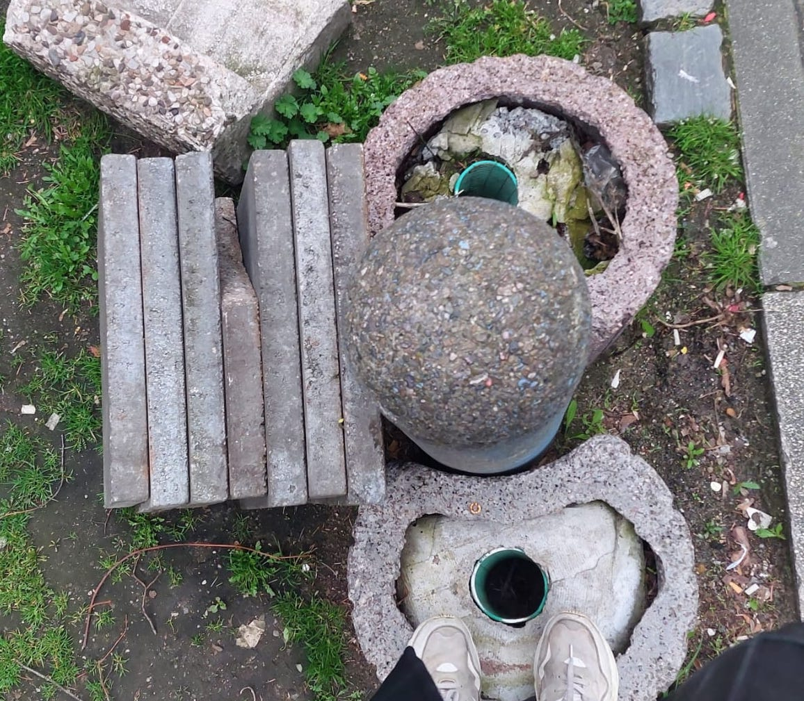
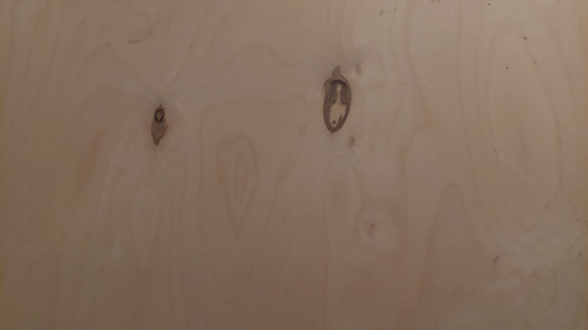

### Task 01.01

* Which of the chapter topics given in the syllabus are of most interest to you? Why?

≈Are there any further topics in regard to procedural generation and simulation that would interest you?
I really enjoyed the first class and reading the syllabus for the next lessons. I see nature as the ‘perfect’ and find inspiration in it.
I hope to learn more about how to imitate a group of fish, learn about them as a group, and about the behavior of outsider individuals.

Those are the topics I find the most interesting:
- Pattern. When I first used the computer as a child and draw in Microsoft Paint, I enjoyed creating patterns (to use as a tile background for my blog, if you wonder why). I will be very excited to learn how to create interesting 3D patterns.
- Tilings and Islamic patterns. When I lived in Jerusalem I was lucky to see beautiful mosques and learned in the past a bit about the theory behind Islamic design. The idea of decorating holy places with patterns made from geometric, organic shapes and typography, and not representing the god in human familiar shapes, but with perfect simple above human motifs. My knowledge of it ends here and I would love to learn more and experiment with the idea of math and design. Other than this, I also really love creating patterns and tilling.

- Noise: I used to be interested in noise music, and I will love to learn about the thin line between noise as aesthetic and as a random mistake.

* Which tool would you personally prefer to use for the practical tasks (e.g. Houdini, Unreal, Unity, Maya, Blender, JavaScript, p5, GLSL, ...)?
I would use Unreal with the rest of the class. I am both interested in Unity and Unreal, and learning how to create 3D graphics and spaces there (hopefully for creating a VR Installation)
* Which tool would you personally prefer to use for the practical tasks (e.g. Houdini, Unreal, Unity, Maya, Blender, JavaScript, p5, GLSL, ...)?
I would use Unreal with the rest of the class. I am both interested in Unity and Unreal, and learning how to create 3D graphics and spaces there (hopefully for creating an VR Installation)
* How would you rate your level of experience with Unreal Engine?
    * [x] Novice
    * [ ] Intermediate
    * [ ] Advanced
    * [ ] God-like

## Introduction

* Recap [Chapter 01 - Introduction](../../02_scripts/pgs_ss22_01_intro_script.md)

###  Task 01.02 - Procedural Generation

Briefly in your own words: how would you explain your nanny what *procedural generation* means? 
A procedural generation means creating a large group of visuals or a background (as computer graphics) by creating only the basic and writing it toghter with a basic set of rules, with some variables. 

## Patterns

### Task 01.03 - Seeing Patterns

Take at least three pictures of natural patterns and at least three pictures of man-made ones (patterns can be two or three-dimensional). Try to include at least one pattern with self-similarity. Taking pictures with your smartphone is just fine. Link all images in this markdown file.
Patterns in nature:

Men made patterns:

self-similarity examples:

### Task 01.04 - Understanding and Implementing Patterns

Write for one of your pattern images a generating algorithm in pseudo-code or code. Submit the code below.

I'll try writing a code for the last self similarity spider plant:

declare spider-plant

if(spider-plant) >= max_size

loop => {

spider-plant / ( 
    [random(size)* spider-plant].random(location)
) * spider-plant( random(0-1.5) )

}

### Task 01.05 - Seeing Faces

As an exercise to see and understand the environment around you (and to have some fun 😊), try to find at least two faces. Link all images in this file.

here I found a parrot:

## Abstraction

### Task 01.06 - Abstraction in Art

Chose one "traditional" painting, which is inspirational to you. The image can come from the script or you can refer to any artists or image you like.  

Explain briefly what you like about the painting and how it might inspire you for your own work.

I chose the "Madonna" by Edvard Munch.
On one hand, the painter paints a beautiful classic figure which aligns with the art nouveau aesthetics of beauty and femme fatale. Still, then from the second hand, there are very modern graphic elements that could have been drawn today and resemble street art. This painting is unforgettable for me because of its timeless uniqueness, its particular style, and originality for the time.

### Task 01.07 - Abstracted Artistic Expression in CGI

Chose one CG image, which you like and of which you think that it has an artistic quality to it. The image doesn't need to be from the script, again you can chose any CGI image you like (it should use 3D graphics). You can find more examples in the [Summary of Artists](../../02_scripts/pgs_ss23_01_intro_script.md#summary-of-artists) section.  

Those pictures are taken from animation but stand on their own for their beauty. The figure is a 'Sirena' creature called "Jibaro" from the animation by the same name. It is a CGI animation about a group of Spanish knights seeing a mythological creature in the story. The Spanish 16th-century style is translated in a beautiful way to CGI, and there is special attention to details, textures, and colors.
It is hard to belive the character is done in CGI and only based partially on a real figure. The background was filmed separately but the way they combine together is very realistic. This work brings a mythological creature in the most beautiful way to life, and that's, for me, an inspiring example of computer graphics. 

Jibaro:
https://www.youtube.com/watch?v=JeUuk-g_Qws

The second example of a classic style translated to computer graphics in a style called digital grotesque. This image is an actual stage of a 3d printing of the style.
The way the old style is translated to new technology and gives a heavenly atmosphere makes it art for me. Also here, I saw this stage design a few years ago and keep on returning to it as inspiration.

The magic flute stage design:
 https://www.michael-hansmeyer.com/zauberfloete
 

## Unreal Engine

### Task 01.07 - First Steps

This task is about installing and getting to know Unreal Engine. The goal of this task is that you get to know Unreal and are somewhat knowledgeable about the basic functionalities. If you already know Unreal, learn something new about it and summarize it briefly.
  
You have to submit at least one preview image of the scene that you worked on. This can be a really simple scene, e.g. just a couple elements. Even though the scene can be simple, also try to design the scene a bit in which ever visual direction you want.
  
For archiving this goal, we recommend the tutorial [Your First Hour in Unreal Engine 5.0: Introduction](https://dev.epicgames.com/community/learning/courses/ZpX/your-first-hour-in-unreal-engine-5-0/E7L/your-first-hour-in-unreal-engine-5-0-introduction) (which also guides you through the installation steps). Ultimately, it is up to you how, e.g. with which tutorial, you want to get into Unreal. 

Done!

<!-- We started a collection of tutorials and resources for you in the script. -->

*Hint:* Make sure to plan in a bit of time for the installation of Unreal as it takes a while.

## Learnings

### Task 01.08

Please summarize your personal learnings (text or bullet points - whatever you prefer). What was challenging for you in this session? How did you challenge yourself?

- The most challenging part was to try and think of pseudo code for self-similarity.
- Loading time and installation of packs was a challenge, and also how much memory unreal required (I needed to delete many apps to make room). I hope it won't be an issue in more complex assignments. 
I looked at example formulas and they seem very complex.
- Installing Unreal and following the tutorial was pretty straightforward. I am familiar with the structure of it from other 3D programs I learned in the past.
- I am looking forward to learning more about patterns and seeing more inspiration, and hoping I could build interesting visuals in unreal.

---
  
Answer all questions directly in a copy of this file and **also link and display all of your images in that file**. Submit your copy as `pgs_ss23_XX_lastname.md` in your assignments folder (replace the XX with the number of the session). 
  
For example: `assignments/gieseke/01/pgs_ss23_01_gieseke.md`

---

**Happy Abstracing!**

