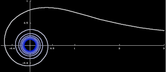
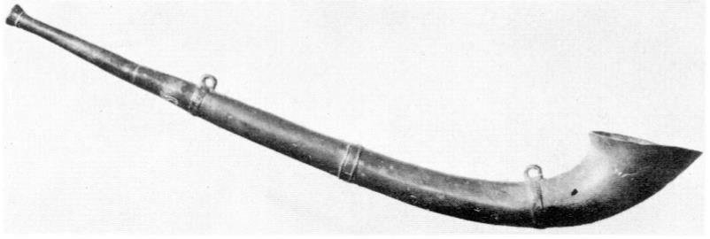
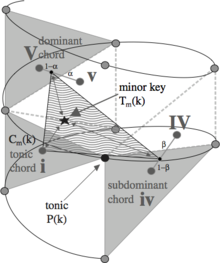

## Task 02.01 - Creative Project Development Numbers and Curves
Develop a creative and / or visual and / or auditive concept in regard to one of the topics of Chapter 3, be it a number or numbers, spirals or specific curves, or all of them. The project doesn’t need to be executable by you but you should be able to plan it thoroughly. Imagine it as if you are the creative and technical director but you don’t have to do everything yourself. You can use any setup, framework, tool, etc. you like for this concept, it does not have to be with Unreal.

This concept should ideally include

the idea and goal,
references and inspiration (feel free to investigate your topic further),
the specific concept,
optional: concept sketches,
execution and implementation details on how to do it.
Submission: Your concept.

## Task 02.01 - Creative Project Development Numbers and Curves

I've chose to create a audio visual project about the Lituus Curve. Mostly because it's so visually beautiful.  
  
I'm creating an audio-visual project centered around the visually stunning Lituus Curve. The goal is to immerse the viewer in the "eye of the storm" of the curve, without directly showing it. Instead, we will use the mathematical equation of the spiral to inform our visuals. 
For the visual we will use a colorful projection in a dark large gallery room. By editing the transition of color based on the equation, we hope to get by it an interesting and dynamic transition effect. 
In terms of sound, we will draw inspiration from the Lituus horn and use an orchestra to create horn sounds. We will also incorporate the spiral concept from music theory to create an immersive experience. To achieve this, we will use a surround sound system to make the sound move around the viewer, creating the sensation of being in the center of the spiral. 
  
  
s this project is a research exploration of the visual and sound effects of the Lituus Curve's mathematical equation, it is difficult and not recommended to provide a sketch of the installation, 
but to leave place to where the research will lead us.

## Task 02.02 - Procedural Generation Plugin

  
  
  

# Learnings
## Task 02.03
Please summarize your personal learnings (text or bullet points - whatever you prefer). What was challenging for you in this session? How did you challenge yourself?

- It took a long time, because of technical issues. I had not enough space to save or download the necessary assets for the exercise. I used a friend's computer but it was very slow and crashed. Finally, I got an external disk and made some room in my computer, but this is not a long-term solution. Maybe its time to buy a better computer 💁‍♀️.
- On the positive side, because I had to redo the first tutorial several times, I learned really well how to use the tool, understood every step and remembered it well.
- I managed to finish 2 tutorials. At the end of the second one I was very invested in finding out how to create flying particles, but it took too long so I'll leave it for the next time.
- I know we were supposed to create an impressive visual, and not only follow the tutorial, but bec cause of lack of computer space I couldn't download very creative assets (like the Nordic shore package :relieved:), but I used the light European forest one. I am still happy with it and I learned a lot, next time it will be easier to start and I could achieve a better result.

