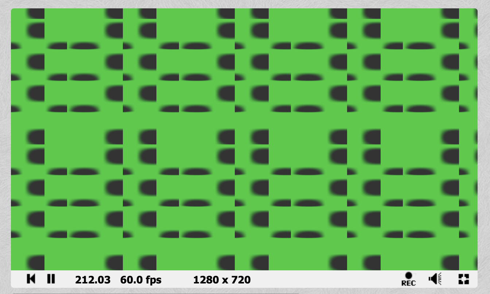

## Task 03.03 - Experiments

## Task 03.04 - Inspiration
Go to the shadertoy site and browse the examples a bit. Submit the link to one example you like:

I loved many shaders, but this shader my favorite [Beauty of the sea](https://www.shadertoy.com/view/wljXD1).
unfortunately it has really annoing music attached, and the animation is too quick, but the water shader cimbined with the animation of the sea snake both create a devine visual.

I assume the creature combined two shaders, probably this one of the [snake movememenrt](https://www.shadertoy.com/view/mt23WR), and another water shader.

## Learnings
- Playing with the shader code was very very challenging. It is very fragile. It was impossible to comment out lines, and replacing parts of it dragged many errors.
- Finally, when I figured out how to edit the code and alter it a bit, it was easy to understand what each line stood for.
- I feel that shaders are the most challenging code I would deal with. It was not very approachable.
- But no doubt, the possible results are beautiful.

