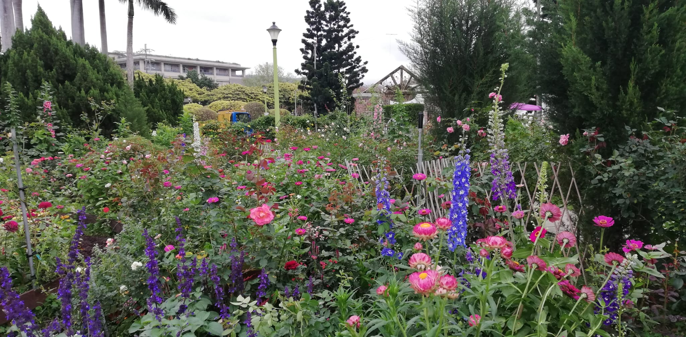
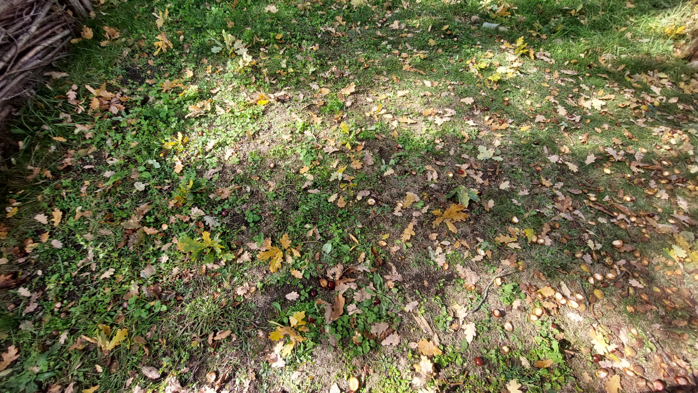
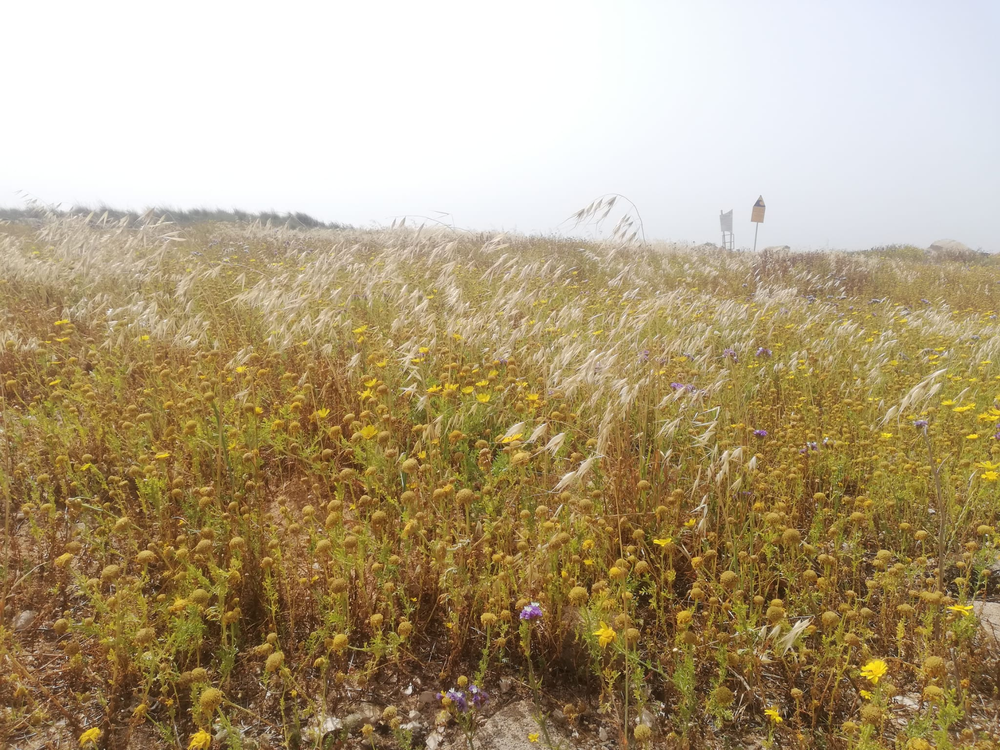
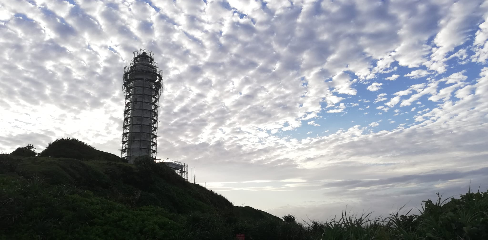
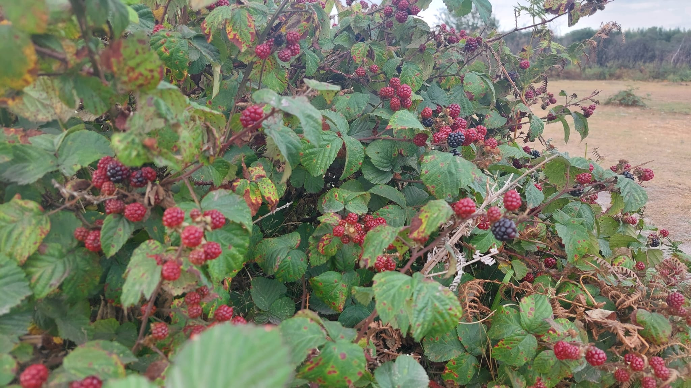
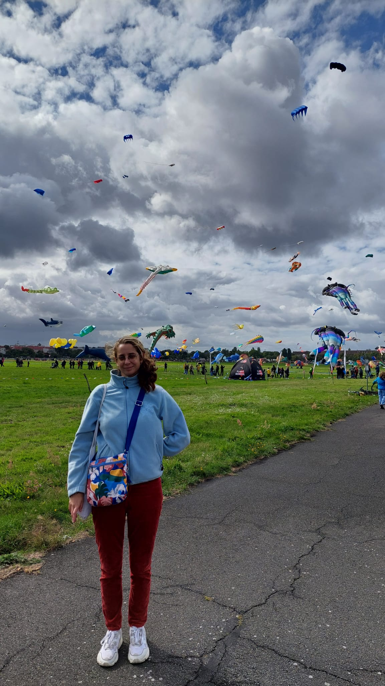

## Seeing Noise
### Task 05.01 - Collecting Inspiration
Submit at least three pictures of natural noise patterns. You can photograph them yourself (recommended) or find them on the internet.

 (kite exhibition, hi!)   

Submit one stylized / artistic image that uses noise as generating principle or design element. You can find it on the internet.
Submission: Link all files in your pgs_ss23_05_lastname.md file.

<a href="https://www.youtube.com/watch?v=O-QpfLV8dQw"> Paprike, Parade Scene (2006) </a>

## Unreal
### Task 05.02 - A Fancy Noise Material in Unreal
Complete the Tutorial 01 - Noise and Tutorial 02 - Rendering. Come up with a good looking and individual result!

Submission: At least one preview image and one animation, e.g. as gif, of your scene, linked in your pgs_ss23_05_lastname.md file.

Rendered image: 
 

Unreal image (it looks so much better): 
 

## Learnings
### Task 05.03
Please summarize your personal learnings (text or bullet points - whatever you prefer). What was challenging for you in this session? How did you challenge yourself?

- Thanks to working for a few times with materials, the first part with noise and animation were fairly simple. The tutorial was clear and fun.

- The Niagara part was interesting and gave a beautiful result, however very challenging. I tried to play around to get a deeper understanding but much as I tried to, I was not completely understanding what I was doing and it wil;l be hard to do it again. I need to work with it more, and will need to read more about the functions of Niagara system. Unreal has endless functions.

- Rendering was not simple. I have tried rendering my results before and that's for sure the farthest I got. I didn't manage to render the scene as I’ve seen it from the camera. I tried to repeat the proccess severak times but there was an object I was rendering (the ball), which I deleted from the scene, and it was still rendered every time. What a mystery.

- Other then the tutorial itself, another challenge was finding a noise CGI that I like. I've looked for more than an hour on Instagram and the net but I couldn't find anything, in the end I've chosen a classic animation example and not CGI, and was disappointed for not finding a more modern inspiration.
