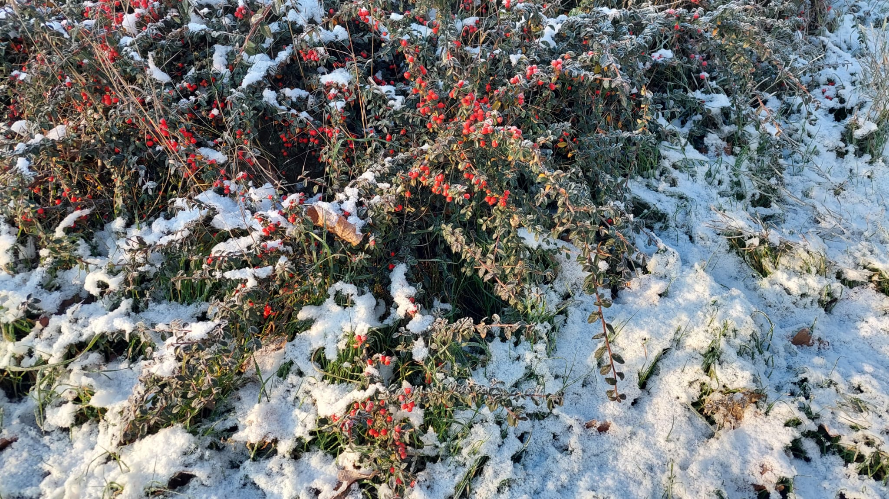

## Seeing Noise
### Task 05.01 - Collecting Inspiration
Submit at least three pictures of natural noise patterns. You can photograph them yourself (recommended) or find them on the internet.

Submit one stylized / artistic image that uses noise as generating principle or design element. You can find it on the internet.
Submission: Link all files in your pgs_ss23_05_lastname.md file.

<a href="https://www.youtube.com/watch?v=O-QpfLV8dQw"> Paprike, Parade Scene (2006) </a>

## Unreal
### Task 05.02 - A Fancy Noise Material in Unreal
Complete the Tutorial 01 - Noise and Tutorial 02 - Rendering. Come up with a good looking and individual result!

Submission: At least one preview image and one animation, e.g. as gif, of your scene, linked in your pgs_ss23_05_lastname.md file.

Rendered image ( Fail. This ball was deleted and still there ! ):

Unreal image (it looks so much better):

## Learnings
### Task 05.03
Please summarize your personal learnings (text or bullet points - whatever you prefer). What was challenging for you in this session? How did you challenge yourself?

- As much as I tried to I was not complelty underating the nodes I was changing and choosing. Unrel as endless functions.

- Rendering was not simple. In have tried rendering before and that's for sure the farthest I got. I didn't manage to render the scene as I\ve seen it from the camera. There was an object I was rendering (the ball), which I even deleted from the scene and it was still rendered.

- Finding a noise CGI that I liekd was impossible. I've looked for more then an hour in instgram and the net. I am sure it's out there but I couldn't reach it, in the end I've chosen a fairly classic Anima and was disappointed for not finding more modern insipration.

