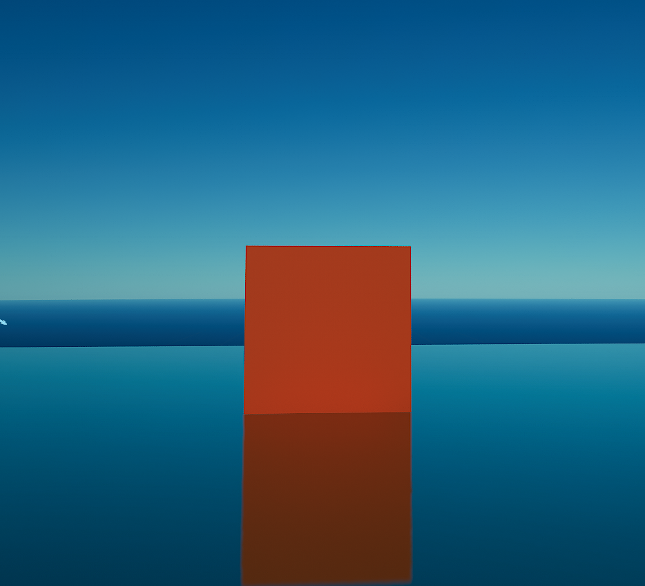

## Seeing Noise
### Task 06.01 - Not Very Fancy Cubes
Submit at least three pictures of natural noise patterns. You can photograph them yourself (recommended) or find them on the internet.

   
  

[boom.webm](https://github.com/ctechfilmuniversity/lecture_ss23_procedural_generation_and_simulation/assignments/aviram/06/img/boom.webm)

## Learnings
### Task 06.02

Please summarize your personal learnings (text or bullet points - whatever you prefer). What was challenging for you in this session? How did you challenge yourself?

- The tutorial, and the assigment were complex. there were so many parts to follow. It would take me a while to be able to repeat it and create a similiar animation

- I didn't manage to completly do the asssame animation, something went wrong. I tried to figure out what and where but couldn't find it.

- I wish I understood what was I doing, but I g=understand unreal is very complex, and its my first time dealing with nodes animation. I understood each node for itself, but the way things conect toghter, that was beyond my wisdom. 

- boom ¯\_(ツ)_/¯
