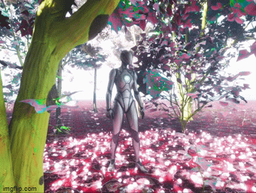

## Particles
### Task 07.02 - Introduction To Niagara
[Intro to Niagara Particles](https://www.youtube.com/watch?v=04k9JDx-KTM&list=PLUi8nuTUEtTshYxpmR7brPE3tV7JsO0VP)

   
   
   
   

[boom.webm](https://github.com/ctechfilmuniversity/lecture_ss23_procedural_generation_and_simulation/img/boom.webm)

### 07.03 - Particles
[Let's build this Unreal Niagara audio visualizer within 10 minutes](https://www.youtube.com/watch?v=UETAS5g-q4M&t=301s)

   
   

## Learnings
### Task 07.04

Please summarize your personal learnings (text or bullet points - whatever you prefer). What was challenging for you in this session? How did you challenge yourself?

- Particles are really pretty :sparkles:

- The first tutorial went pretty smoothly, by now it was not that hard to work with the node system of the Niagara.

- So I thought. Cause the second part was not that easy, It took me twice to do it right, but still had some issues. The "size mesh" for the particles did not work and I needed to resize it manually.

- I am glad I went for the short tutorial, cause it also took me a while to do, I watched it twice on slow-mo.

- I am still very interested to do the Boids :fish: tutorials. It looks super nice. Maybe will collaborate it on the final Project.