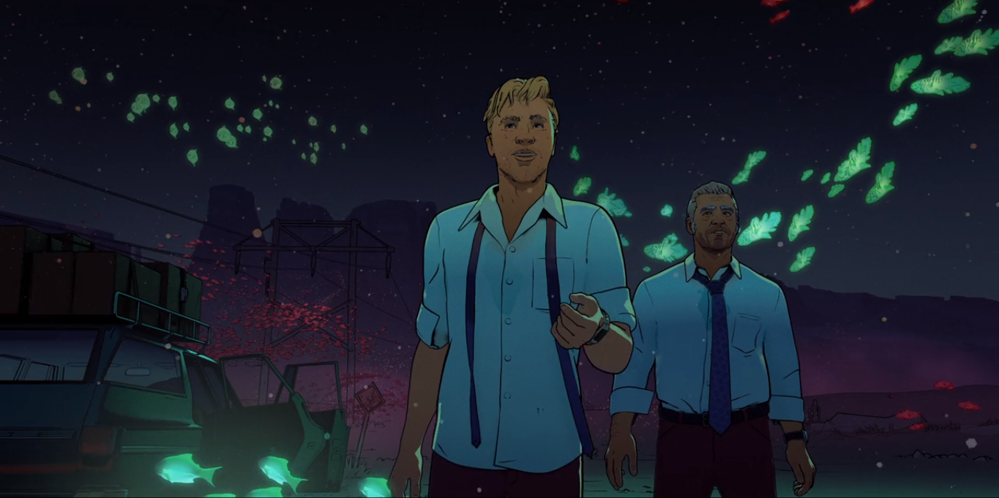
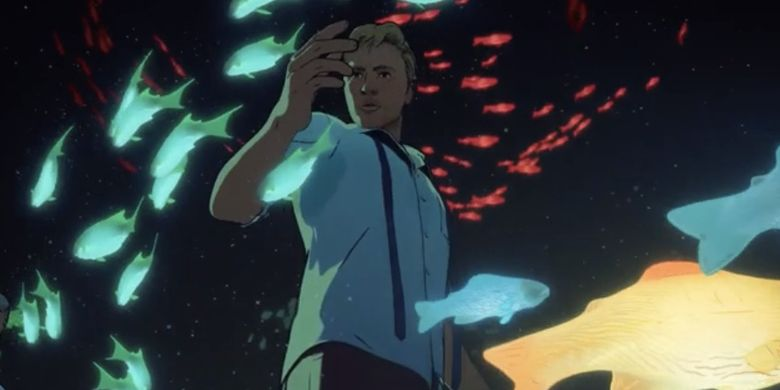
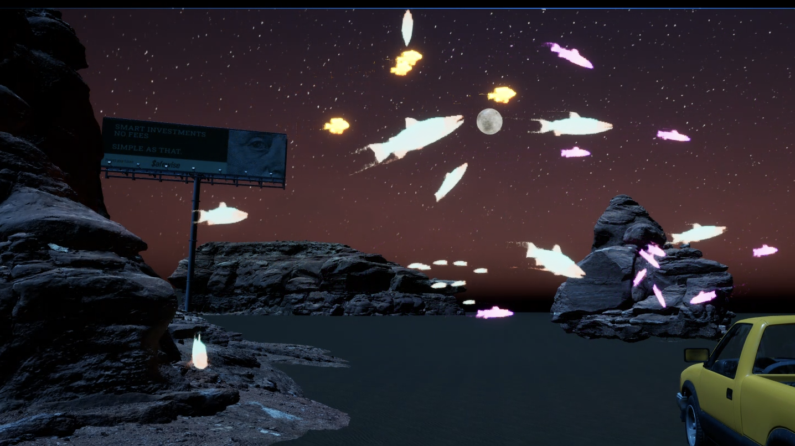
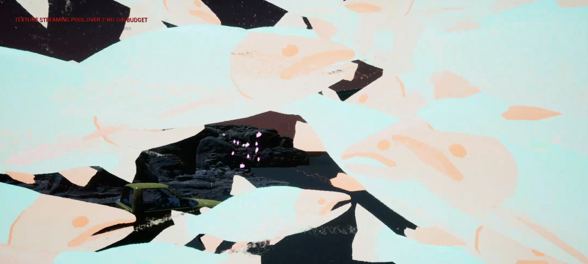
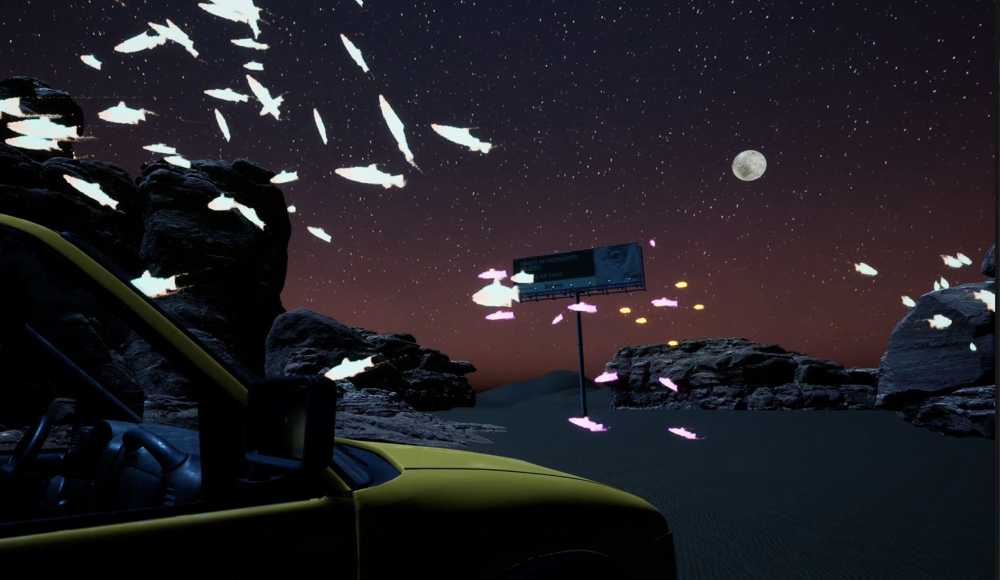
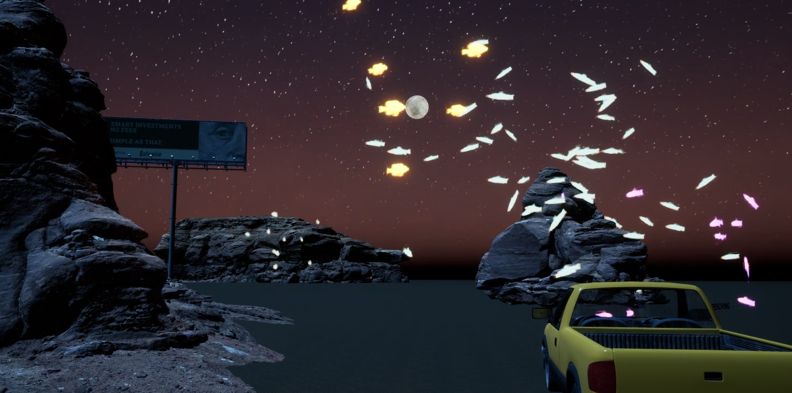
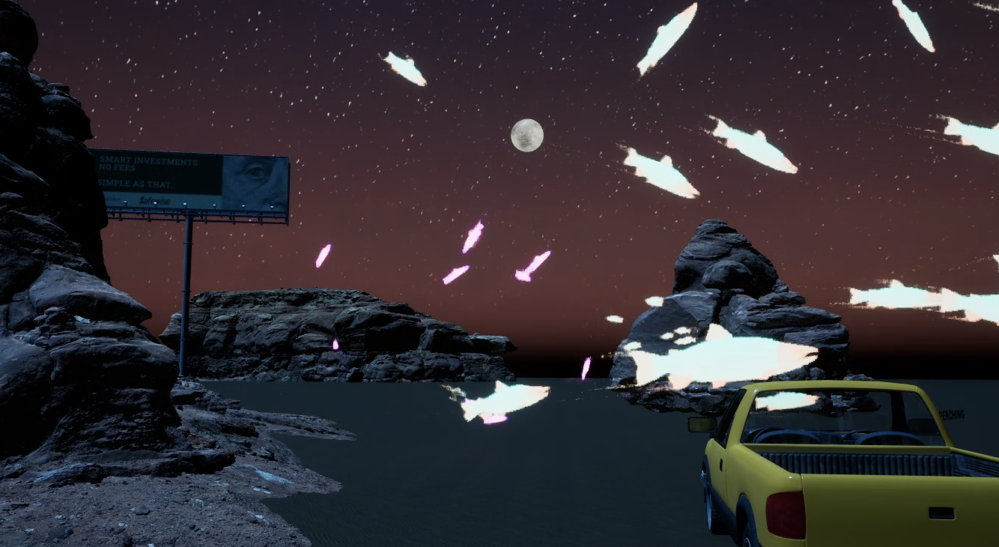
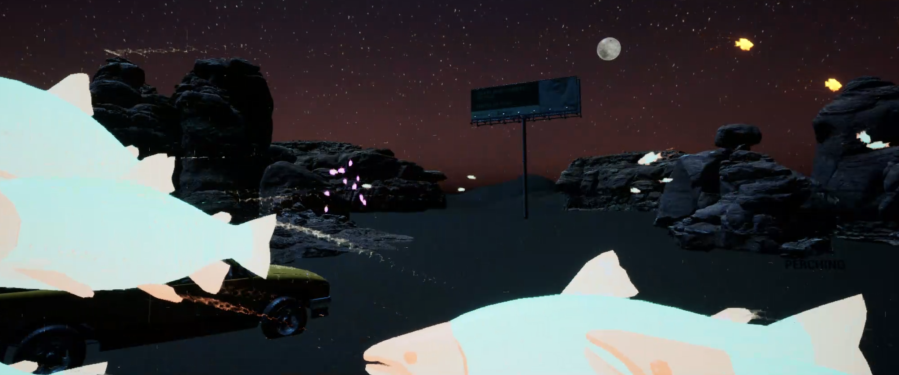

**Procedural Generation and Simulation**  
---

# Session 09 - Final Project

* Summary

Fish in the desert, a visual scene inspired by the short animation film
[Fish Night | Love Death & Robots](https://www.youtube.com/watch?v=83tpqZ4I3bk)

   
   

* Concept

I was very impressed from the visual of the ghost fish in the middle of the grand canyon on the "Fish Night" film, and decided to try to recreate the scene using the flock algorithm we learned in class.

**Implementation**

During the project in Unreal Engine, I followed several tutorials. One of them was from the tutorial from the PGS ["Chapter 2 Recommendations"](https://www.youtube.com/watch?v=9iDA6WMqEyQ), but I found it to be very unclear, so I do not recommend it. However, I came across a much more useful tutorial on creating a [bird flock](https://www.youtube.com/watch?v=10Rbtxsc3rU). Additionally, I used a fish animation package called "Beefy Fish," which included a suggested algorithm that I could investigate, dig into and understand better. Using these resources, I managed to created a few schools of fish.

To make the fish glow, I created a beautiful glowing material by following the very usuful [Emissive Material tutorial](https://www.youtube.com/watch?v=WCmq4e6vacc). This same technique was applied to create the moon.

Throughout the project, I had many challenges, including issues with setting up the static scene. Initially, I built an all-desert scene using the landscape building tool, but when I hit "play," the sun unexpectedly shone and ruined the nighttime lighting. As I couldn't resolve this and stop the "real life timing", I had to redo the scene, and this time, the issue didn't occur. It remains a mystery why it happened in the first place.

Creating the school of fish was a challenge but it was expected. 

The most significant challenge was handling the heavy scene. As I incorporated various packages like cars, signs, the Grand Canyon, and fish, I required a large amount of space to accommodate them.

At some point, I considered using Unity and downloaded it for a day. However, I quickly realized that I prefer Unreal Engine, as I am more familiar with it and find it more appealing. I re-downloaded Unreal Engine, but unfortunately, it didn't work anymore (some issue with Xcode). After ranting to my classmates about the issues, I discovered the possibility of remote working on the class computer, which was amazing and allowed me to bring my ideas to life. I wish I had known about this option ages ago.

* Results

Ta-da

Please visit the following link for the video:   
[video 1](https://drive.google.com/file/d/1YyZnl5Rt3SYsy1Zi4H2uxwCEQ-Zr2NPj/view?usp=sharing)   
[video 2](https://drive.google.com/file/d/1YT5DrZP9H4KJxilXl5M28WViFeCfjCKH/view?usp=sharing)   
[video 3](https://drive.google.com/file/d/1MuxtIT4AsZo4VMr3j3PA3yWibwzAkkO-/view?usp=sharing)

and some screen shots:

   
   
   
   
   
   

* Project Reflection & Discussion

I had the idea in mind for a while, and I'm happy I managed to somehow realize it. I intend to develop this scene further on my free time, as I am not happy with the quality of the landscape, and I want to learn it better. I am very happy with the fish and the aesthetic I created, and it gave me much satisfaction to look at it.

* Lessons Learned

- I feel like it took a lifetime; I worked on so many details, but in the end, they're not really shown.

- I need to plan ahead of the scene visually and not waste time on things that are not as important.

- I wasted a lot of time because I deleted Unreal and downloaded Unity, trying to work on it. I need to stick to what I've started instead of going back and forth. I am happy I discovered I could work on the class computer and wish I knew it was an option before.

- I also learned that it's okay to work the other way around; it was very difficult to create the flock algorithm, and I didn't have great resources. In the end, I've learned more from looking at an existing algorithm than trying to do everything myself. It's a great way to learn to use existing material and play with it.

- I learned a lot about lighting, landscaping in Unreal, and using animation. I want to keep learning how to create fantastic and surreal scenes in Unreal; it was pure fun!

With all the troubles, I loved working on Unreal and I'm happy we had this opportunity. I also love the results of the project I made for this class. It was a super fun and interesting class. Thank you!

[Link to source file](https://drive.google.com/drive/folders/1Mp0ULmgGGyD8GDfz2Kcvfko1ysAMeuTO?usp=sharing)

**Happy Finaling!**
