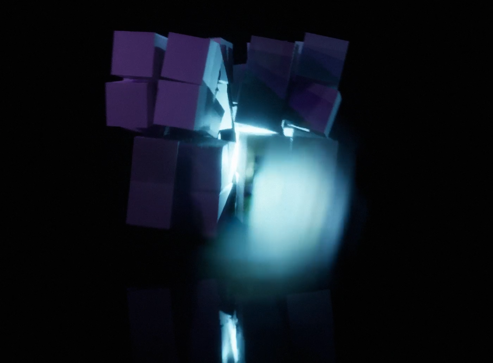
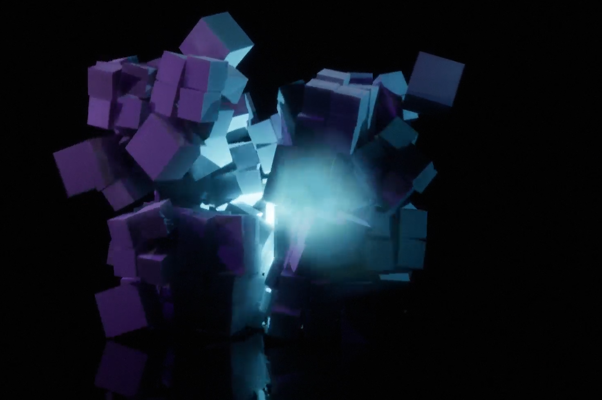
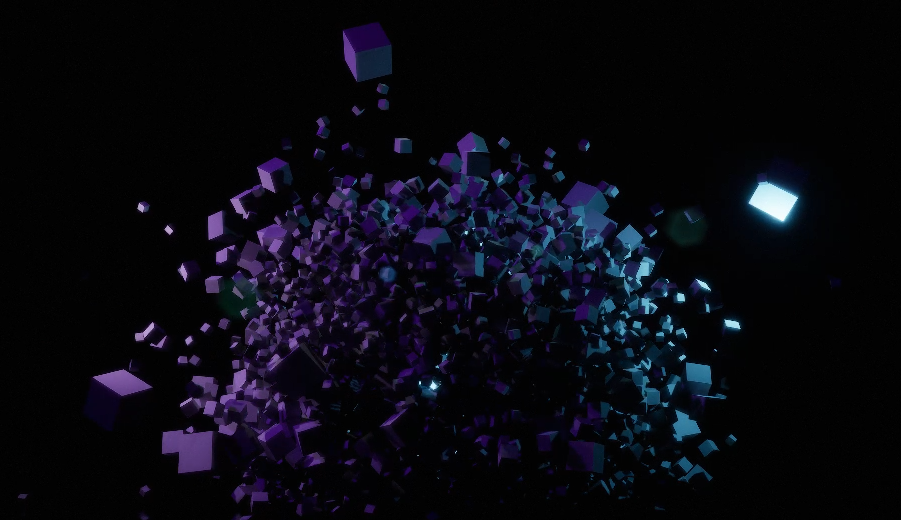

**Procedural Generation and Simulation**  

Prof. Dr. Lena Gieseke \| l.gieseke@filmuniversitaet.de  
Teaching Assistant: Sylvia Rybak \| sylvia.rybak@filmuniversitaet.de

---

# Session 06 - Dynamics (10 points)

This session is due on **Monday, June 12th**. This assignment should take <= 4h. If you need longer, please comment on that in your submission.

- [Session 06 - Dynamics (10 points)](#session-06---dynamics-10-points)
  - [Dynamics](#dynamics)
  - [Unreal](#unreal)
    - [Task 06.01 - Fancy Cubes](#task-0601---fancy-cubes)
  - [Learnings](#learnings)
    - [Task 06.02](#task-0602)

---

## Dynamics

* Re-cap [Chapter 07 - Dynamics](../../02_scripts/pgs_ss23_07_dynamics_script.md)

## Unreal

### Task 06.01 - Fancy Cubes

Complete the [Tutorial 03 - Fancy Cubes](pgs_tutorial_03_dynamics/pgs_tutorial_03_dynamics.md). In case the tutorial doesn't look appealing to you, you can complete any other tutorial that includes a rigid body simulation. 
  
 Come up with a good looking and individual result!

 *Submision:*

  is in the folder and I rendered it with sound.

 
 
 
  
*Submission:* At least one preview image and one animation, e.g. as gif, of your scene, linked in your `pgs_ss23_06_lastname.md` file.

## Learnings

### Task 06.02

Please summarize your personal learnings (text or bullet points - whatever you prefer). What was challenging for you in this session? How did you challenge yourself?

* It was a quite heavy followup to understand what's going on, but this was also the most fun task I had so far
* I was trying hard to get the result I wanted

*Submission:* Text in your `pgs_ss23_06_lastname.md` file.

---

**Happy Forcing!**
