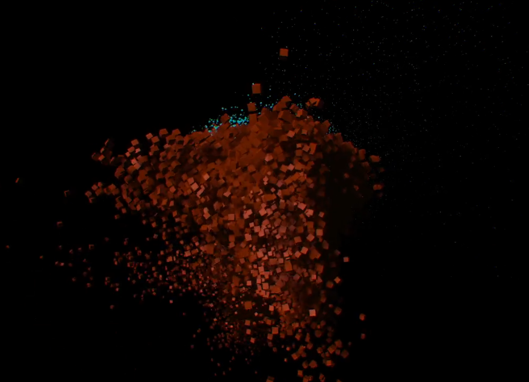
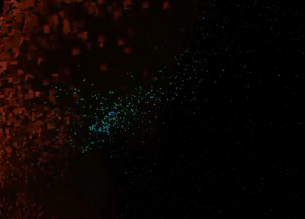

**Procedural Generation and Simulation**  

Prof. Dr. Lena Gieseke \| l.gieseke@filmuniversitaet.de  
Teaching Assistant: Sylvia Rybak \| sylvia.rybak@filmuniversitaet.de

---

# Session 07 - Particles (10 points)

Task 07.01 and 07.02 are due next class, meaning on Wednesday, June 14th. Task 07.03 and 04 are due on **Monday, June 19th**.

This assignment should take <= 4h. If you need longer, please comment on that in your submission.

- [Session 07 - Particles (10 points)](#session-07---particles-10-points)
  - [Particles](#particles)
    - [Task 07.01 - Lecture Topics](#task-0701---lecture-topics)
  - [Unreal](#unreal)
    - [Task 07.02 - Introduction To Niagara](#task-0702---introduction-to-niagara)
    - [Task 07.03 - Particles](#task-0703---particles)
  - [Learnings](#learnings)
    - [Task 07.04](#task-0704)

---

## Particles

### Task 07.01 - Lecture Topics

Read [Chapter 08 - Particles](../../02_scripts/pgs_ss23_08_particles_script.md). You can also have a look at the [slides](../../03_slides/pgs_ss23_07_slides.html), if that works better for you.

## Unreal

### Task 07.02 - Introduction To Niagara

Complete an introductory tutorial about Niagara. In [Chapter 02 - Unreal](../../02_scripts/pgs_ss23_02_unreal_script.md#tutorials-1) you find tutorial suggestions. At the very least, you have to understand the content of [UE5 Niagara in 300 Seconds](https://www.youtube.com/watch?v=Wxx_2ZLoKbI).

If you already know Niagara well, chose a more advanced topic within Niagara and investigate it further. Summarize your investigation briefly.

*Submission*

I actually did the following tutorial, and then worked on it in order to finish my Task 07.03 - which has evolved from the same tutorial

*Submission:* A link to the tutorial you completed and at least one preview image (this does not need to be a designed scene, nor a polished image), linked in your `pgs_ss23_07_lastname.md` file.

### Task 07.03 - Particles

Complete one more advanced Niagara tutorial regarding any topic up to your liking. In [Chapter 02 - Unreal](../../02_scripts/pgs_ss23_02_unreal_script.md#tutorials-1) you find tutorial suggestions. You could, e.g., [implement boids in Unreal](https://www.youtube.com/watch?v=9iDA6WMqEyQ). Also, next week we will talk about fluids, you could also chose a Niagara fluids tutorial. You need to adjust the final result to make it your own and come up with a well-designed animation and preview image.

Alternatively, you do not have to follow a tutorial but you can come up with your very own particle setup and scene.

This will be your last Unreal task before the final project! Make it special 😁.

*Submission:*

I did this tutorial:

* https://www.youtube.com/watch?v=UETAS5g-q4M

It is an audiovisualizer. What I did for myself was to create two different submixes of sound, so I could trigger particles based on different stems of the track.
Orange particles as a Kick and cyan ones as Snare.
 In order to acomplish that I used the following links:

* https://www.youtube.com/watch?v=73hRw7_BOsw
* https://docs.unrealengine.com/5.1/en-US/overview-of-submixes-in-unreal-engine/
* https://docs.unrealengine.com/4.27/en-US/RenderingAndGraphics/Niagara/HowTo/AudioEffects/

Making two different submices took me several hours, and when I finally made it, I had problems with triggering the Niagara particles within the Playtime  - it worked in the editor, but not in the play time.

I understand that Niagara was the point of this session but not the sound, but my approach was to control the system with sound mainly, and it is what I have achieved.

 - the mov file with sound is in the folder /img

Here are some screenshots:

*Submission:* A link to the tutorial you completed (if applicable) and at least one preview image and one animation, e.g. as gif, of your scene, linked in your `pgs_ss23_07_lastname.md` file.

## Learnings

### Task 07.04

Please summarize your personal learnings (text or bullet points - whatever you prefer). What was challenging for you in this session? How did you challenge yourself?

* I enjoyed learning about Niagara and particles and this definetly interested me to continue experimenting and learning Niagara in my freetime. I find it extremly powerful tool. I come from Cinema4D and a bit of Houdini, and the fact that this is happening RealTime in UE is like a *SciFi*.
  
* I spent a lot of time branching out of the Script and tried to understand the theory behind the particles. I have used particles since 2010 in various programs, such as: AfterEffects, Cinema4D, Houdini, Touchdesigner and I was never aware of the math stuff behind it, I was more intuitvely tweaking the parameters. I think that the Script helped start with understanding the principles and I hope I will be able to use that knowledge further on.

* Finishing the Unreal task was quite time consuming. It was only a 10min tutorial, which was easy to follow, but what took so much was implementing my idea into it, and I still haven't accomplished what I wanted. In the video I posted, there are really two different particle systems that follow two stems: Kick and Snare, but this was a workaround and not aesthetically pleasing output, but on the other hand - functionality is almost what I wanted.

*Submission:* Text in your `pgs_ss23_07_lastname.md` file.

---

**Happy Simulating!**
