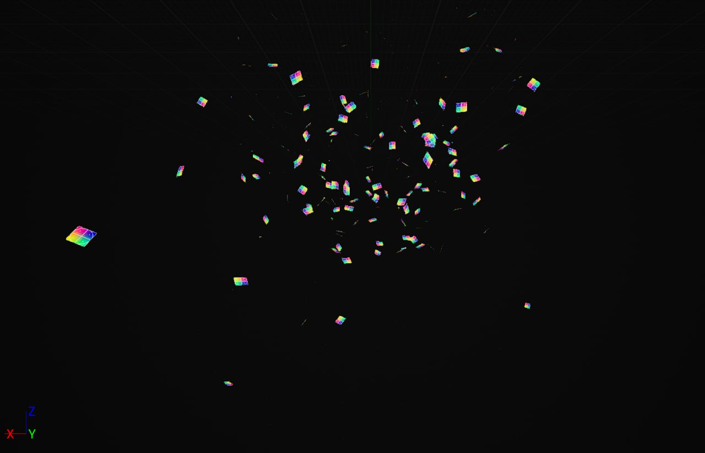
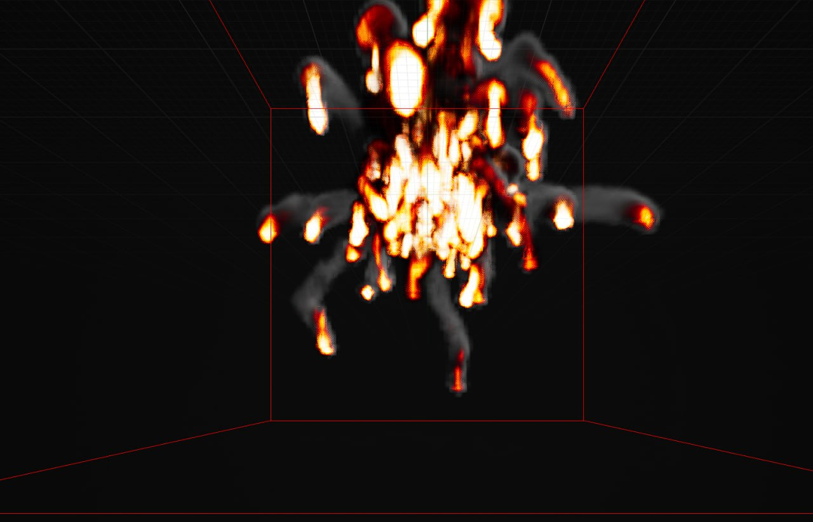
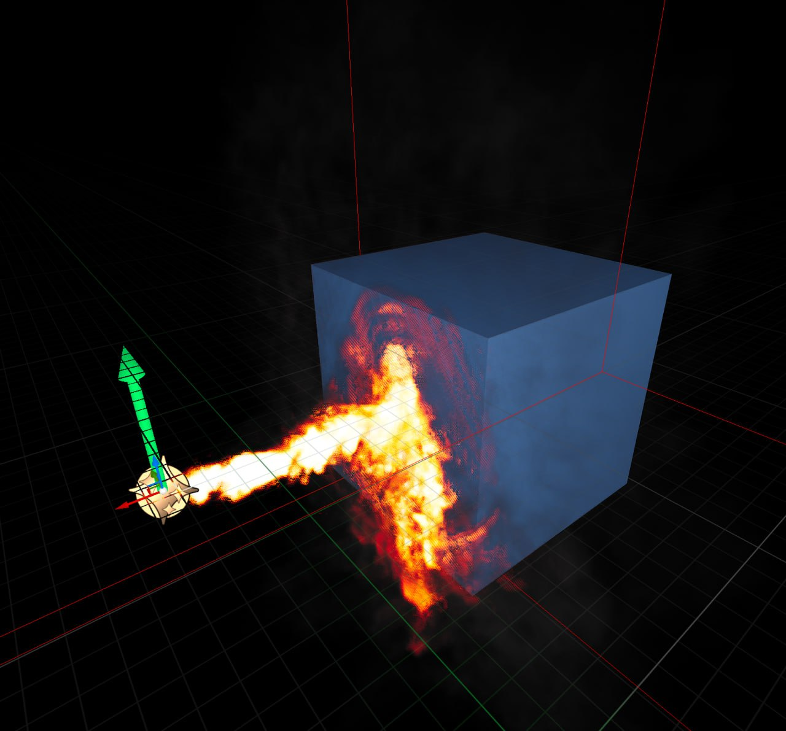

**Procedural Generation and Simulation**  

Prof. Dr. Lena Gieseke \| l.gieseke@filmuniversitaet.de  
Teaching Assistant: Sylvia Rybak \| sylvia.rybak@filmuniversitaet.de

---

# Final Project - Aljoša Dakić

## Summary

I decided to make a game-like experience, where the player would control the particle system which would fly through the map, triggering explosions, fluids and other particle systems.

## Concept, Implementation & Results

Before designing a map and populating it with systems, I first focused on individual elements: Explosion systems, Audio system and Player system.

**Creating an Explosion system**

I started off by watching the following tutorials:

* https://www.youtube.com/watch?v=q8avHL7syC4
* https://www.youtube.com/watch?v=FneynydIPeE
   
and reading Unreal Documentation.

I settled down on this tutorial and started to build the System:

* https://www.youtube.com/watch?v=d8q8jDUmCvE

This was an easy tutorial to follow and well explained when I watched it few times, however I started building up a system, and I couldn't render more than Basic sprites.

The desired Gas system (explosion) can't be rendered with particles as source, which was the basis of what I wanted to achieve. I spent few hours trying to set it up working. In the end I found a "simple" solution in this tutorial:

* https://www.youtube.com/watch?v=vMLfB_KIxIk 

My result was satisfing and I've finished with the basic explosion effect.

Now, since I wanted to interact with the Player-Particles, I searched for methods to make other objects affected with the fire.

I implemented this behaviour into a test scene:

The fire now "glues" to the surface and this will enable to set the particles on fire.

The next step is implementing my audioreactive particles system into a moving character (playable). This was very time consuming, but as is, it made me learn how Unreal Eninge works in terms of controling a character, which may be super basic knowledge but super useful.

Here is a link to the result of the movement:  

Now I am controling the particles with my keyboard :D

They also follow the motion changes very good and it has a smooth look to it. 

## Project Reflection & Discussion

After this moment on I am stuck with not being able to get two systems work with each other.
 Namely:
 * the Default spawned Pawn is created before Runtime and it overwrites my own Pawn

Because of this, I can't implement the trigger to start the explosion

 * Explosion system can't interact to particles when triggered manually

At this point, I decided to focus on having two systems interact manually and giving up blueprinting and character controls, but I couldn't make the particles system interact with explosion. As I think, there was a mention of the Forum that they can interact with static meshes as such and that I still can't apply "fire" to moving particles. I also tried to parent the explosion to the particles system, but it just "referenced" the position, nothing more.

My project idea failed at this moment and I've already put a lot of time into creating "basic" components, which I find succesful and I've decided to have the moving particle with explosion as a project submission.

## Lessons Learned

I've learned the basics of:

* Fluid systems
* Particle dynamics in space
* I also touched the topic of submixing in Unreal since I tried out different explosion sounds within the space
* Blueprinting and event triggering
* Character controlling - but this was basically possible in a Unreal Preset project, howeever, in a Blank project that I've originaly made, it is still unknown to me how to achieve this control.

The outcome of this project is definetly a big motivation and drive to continue learning how do things work (especially the ones that I couldn't implement) - and I will continue to work on this after the project submission for sure.

