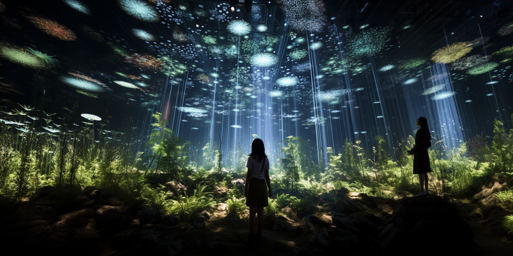

---
layout: default
title: Session
nav_exclude: true
---

**Procedural Generation and Simulation**  

Prof. Dr. Lena Gieseke \| l.gieseke@filmuniversitaet.de  
Teaching Assistant: Sylvia Rybak \| sylvia.rybak@filmuniversitaet.de

---

# Session 02 - Beauty in Maths (10 points)

This session is due on **Monday, May 8th** and we will discuss the results on Wednesday, May 10th.  

This assignment should take <= 4h. If you need longer, please comment on that in your submission.

* [Session 02 - Beauty in Maths (10 points)](#session-02---beauty-in-maths-10-points)
    * [The Theory](#the-theory)
    * [Task 02.01 - Creative Project Development Numbers and Curves](#task-0201---creative-project-development-numbers-and-curves)
    * [Unreal](#unreal)
        * [Task 02.02 - Procedural Generation Plugin](#task-0202---procedural-generation-plugin)
    * [Learnings](#learnings)
        * [Task 02.03](#task-0203)

## The Theory

* Re-cap [Chapter 03 - Beauty in Maths](../02_scripts/pgs_ss23_03_mathsbeauty_script.html)

*On a side note:* This script includes formulas and GitHub's markdown preview will not display them. To read the script with properly set formulas, you have the following options:

* Read the script [online](https://ctechfilmuniversity.github.io/lecture_ss23_procedural_generation_and_simulation/02_scripts/pgs_ss23_03_mathsbeauty_script.html) (this links to an online `.html` version of the script - in case you do not see the proper formulas, try refreshing the page, that usually helps, don't ask me why)
* Download the script folder and open [pgs_ss23_03_mathsbeauty_script.html](../../02_scripts/pgs_ss23_03_mathsbeauty_script.html) locally in your browser.
* Download the script folder and open [pgs_ss23_03_mathsbeauty_script.md](../../02_scripts/pgs_ss23_03_mathsbeauty_script.md) in Visual Studio Code with the [Markdown All in One](https://marketplace.visualstudio.com/items?itemName=yzhang.markdown-all-in-one) plugin installed. Then the preview of the `.md` within VSCode will render the formulas nicely.

## Task 02.01 - Creative Project Development Numbers and Curves

Develop a creative and / or visual and / or auditive concept in regard to one of the topics of Chapter 3, be it a number or numbers, spirals or specific curves, or all of them. The project doesn't need to be executable by you but you should be able to plan it thoroughly. Imagine it as if you are the creative and technical director but you don't have to do everything yourself. You can use any setup, framework, tool, etc. you like for this concept, it does not have to be with Unreal.

This concept should ideally include

- the idea and goal,
- references and inspiration (feel free to investigate your topic further),
- the specific concept,
- optional: concept sketches,
- execution and implementation details on how to do it.

_*reference image created with Midjourney*

## **The Exponential Garden: A Journey of Growth**

#### **Idea and Goal**

"The Exponential Garden: A Journey of Growth" is an immersive large-scale projection mapping installation that invites participants on a mesmerising journey through a virtual garden. The goal is to create a visually captivating and interactive experience where the audience can witness the beauty of exponential growth and its connection to natural patterns.

#### **References and Inspiration**:

- The organic beauty of botanical gardens, with their diverse flora and immersive environments.

- Projection mapping installations that transform large-scale surfaces into dynamic and interactive displays.

- Artworks that explore the interplay between nature and technology, creating captivating and immersive experiences.

##### **Artistic inspirations**: 
https://www.random-international.com/rain-room-2012 -  In this installation, a field of falling water that pauses wherever a human body is detected. The careful tracking of movement and interaction with elements can be an inspiration for this project.

https://www.nand.io/case-studies/botanicus-interacticus - This interactive plant technology turns any houseplant into a responsive, interactive object. Touching or moving the plant generates a real-time graphics and sound response, which could be an interesting technology to explore for the interaction part of this project.

https://rss.onlinelibrary.wiley.com/doi/full/10.1111/j.1740-9713.2013.00683.x - This project visualizes the invisible terrain of WiFi networks in urban spaces through light painting. Although it does not deal with nature per se, the methodology of visualizing something usually unseen (like exponential growth) could be applied to this project.

#### **Specific Concept**:

"The Exponential Garden" as a large-scale projection mapping installation includes the following elements:

##### **Projection Mapping on walls and various natural structures:**

Transforming the surfaces of physical structures, such as walls, trees, and sculptures, into dynamic canvases for projection mapping, utilizing the unique shapes and textures of these structures to enhance the visual storytelling and create an immersive garden environment.

##### **Exponential Growth Visuals:**

The visual representations of exponential growth should evoke the intricate patterns found in nature, such as fractals, spirals, and branching structures and have them animated to simulate the growth process, with plants and flowers blooming, spreading their branches, and evolving over time.

##### **Interactive Exploration:**

Allowing participants to actively engage with the installation by using motion-tracking technology or interactive touch surfaces and enable participants to control and influence the growth patterns through their gestures or touch interactions, triggering visual transformations and animations. 

Since we are talking of a large scale installation, participants would be encouraged to explore different areas of the garden, discovering hidden elements and unlocking new growth patterns as they interact.

##### **Spatial Audio and Ambient Soundscapes:**

Integrate a spatial audio system that immerses participants in an harmonious soundscape, evoking the ambiance of a vibrant garden: Incorporate soothing ambient sounds, gentle melodies, and natural environmental sounds to enhance the immersive atmosphere.

#### **Execution and Implementation Details:**

##### **Projection Mapping Technology:**

Utilize high-resolution projectors and projection mapping techniques to accurately map visuals onto the physical surfaces while synchronizing and controlling the projection mapping across multiple surfaces in real-time.

Resolum, Madmapper

4K Splitter for an easier control of the projectors

##### **Interactive Systems:**

Incorporate motion-tracking sensors or interactive touch surfaces to capture participants' gestures and interactions and using interactive frameworks to interpret participants' inputs and trigger corresponding visual transformations and animations.

MAX/MSP, vvvv?

##### **Sound Design and Integration:**

Working with an immersive soundscape in a spatial audio system.

Ableton live / MAX/MSP

#### **Venue and Setup:**

Selecting a suitable venue, such as a large indoor space or an outdoor garden, to accommodate the projection mapping installation + arranging physical structures strategically throughout the space to provide diverse projection surfaces and create an immersive environment.

## Unreal

### Task 02.02 - Procedural Generation Plugin

From the process:
  
  
  

Result:
  
  

## Learnings

### Task 02.03

---
  
Answer all questions directly in a copy of this file and **also link and display all of your images in that file**. Submit your copy as `pgs_ss23_XX_lastname.md` in your assignments folder (replace the XX with the number of the session). 
  

---

**Happy Proceduraling!**
