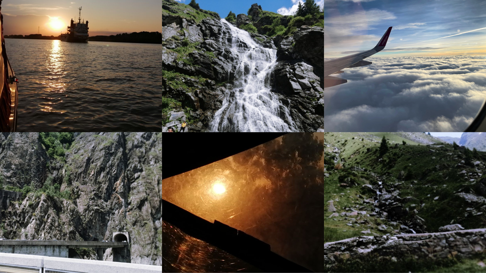
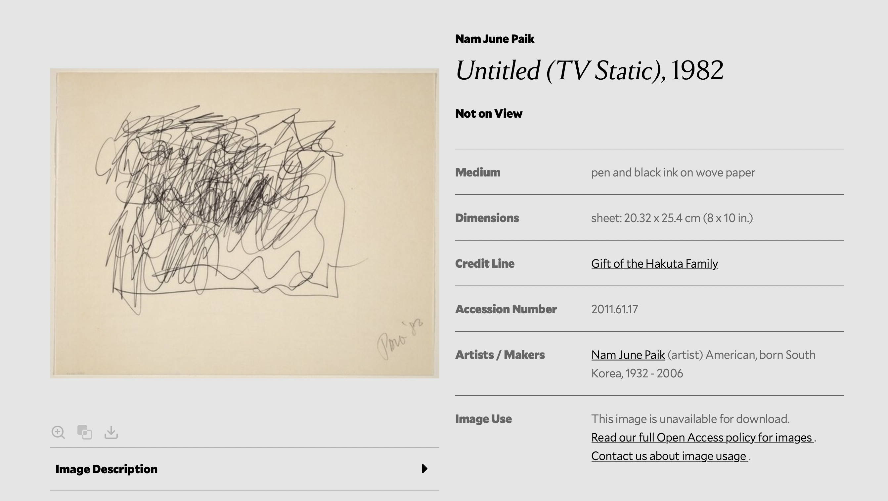
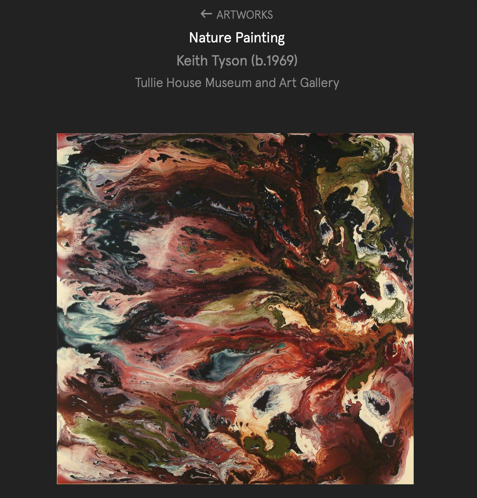
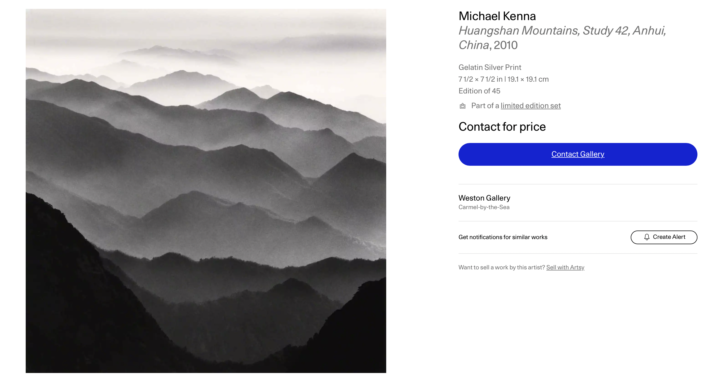
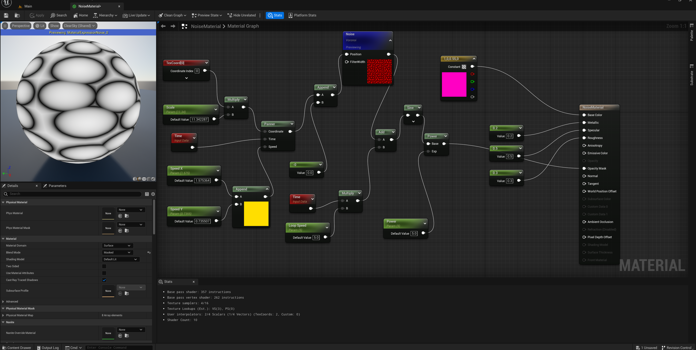
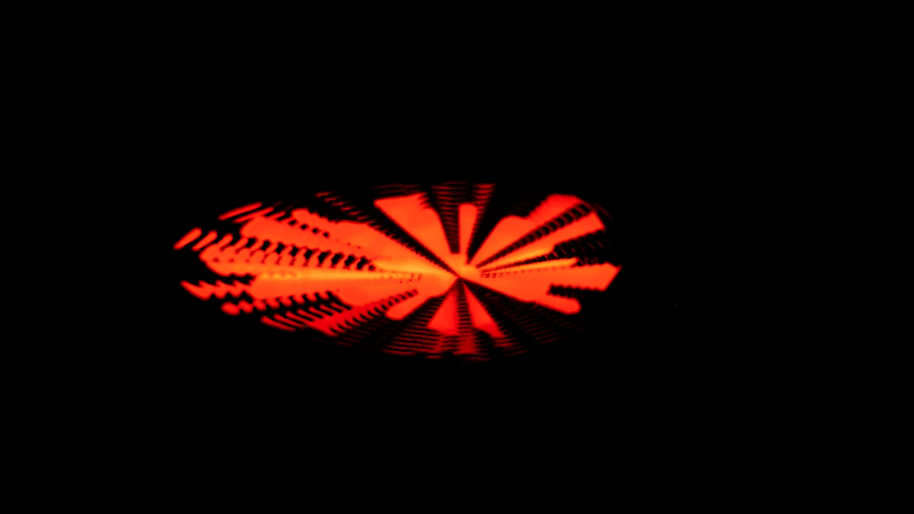
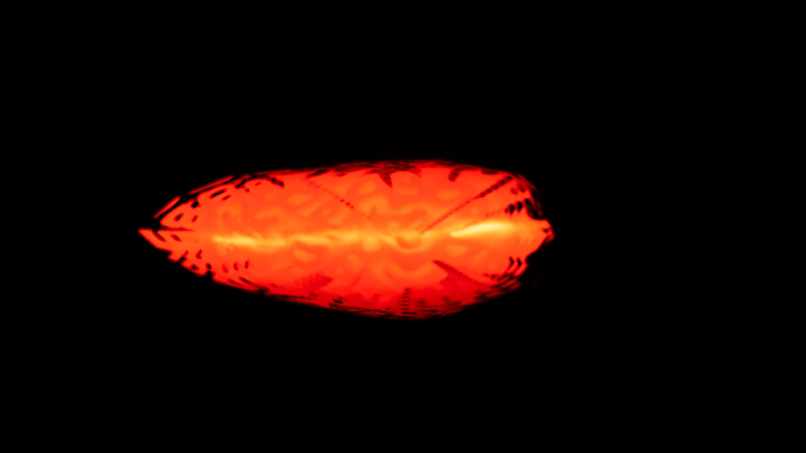
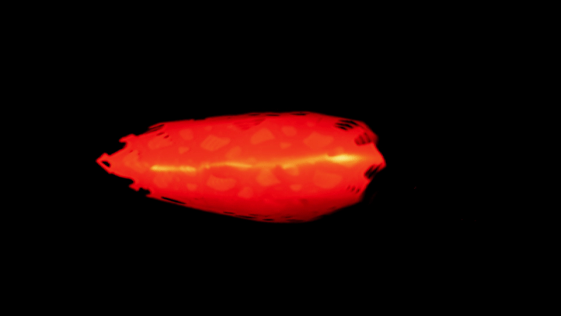

**Procedural Generation and Simulation**  

Prof. Dr. Lena Gieseke \| l.gieseke@filmuniversitaet.de  
Teaching Assistant: Sylvia Rybak \| sylvia.rybak@filmuniversitaet.de

---

# Session 05 - Noise (10 points)

This session is due on **Monday, May 29th**. This assignment should take <= 4h. If you need longer, please comment on that in your submission.

* [Session 05 - Noise (10 points)](#session-05---noise-10-points)
    * [Noise](#noise)
    * [Seeing Noise](#seeing-noise)
        * [Task 05.01 - Collecting Inspiration](#task-0501---collecting-inspiration)
    * [Unreal](#unreal)
        * [Task 05.02 - A Fancy Noise Material in Unreal](#task-0502---a-fancy-noise-material-in-unreal)
    * [Learnings](#learnings)
        * [Task 05.03](#task-0503)

---

## Noise

* Re-cap [Chapter 06 - Noise](../../02_scripts/pgs_ss23_06_noise_script.md)

## Seeing Noise 

### Task 05.01 - Collecting Inspiration

* Submit at least three pictures of natural noise patterns. You can photograph them yourself (recommended) or find them on the internet.
Pretty good motivation to scroll on my phone endlessly. :) 

  Natural Noise

* Submit one stylized / artistic image that uses noise as generating principle or design element. You can find it on the internet.

I find this interesting as it's a sketch by Nam June Paik which played a lot with "digital" noise: 

As a painting principle:

A photographer that plays with the principle of noise:

*Submission:* Link all files in your `pgs_ss23_05_lastname.md` file.

## Unreal

### Task 05.02 - A Fancy Noise Material in Unreal

Complete the [Tutorial 01 - Noise](pgs_tutorial_01_noise/pgs_tutorial_01_noise.md) and [Tutorial 02 - Rendering](pgs_tutorial_02_rendering/pgs_tutorial_02_rendering.md). Come up with a good looking and individual result!
  
*Submission:* At least one preview image and one animation, e.g. as gif, of your scene, linked in your `pgs_ss23_05_lastname.md` file.
Process:

Result:

## Learnings

### Task 05.03

Please summarize your personal learnings (text or bullet points - whatever you prefer). What was challenging for you in this session? How did you challenge yourself?

*Submission:* Text in your `pgs_ss23_05_lastname.md` file.

---

**Happy Randomizing!**

