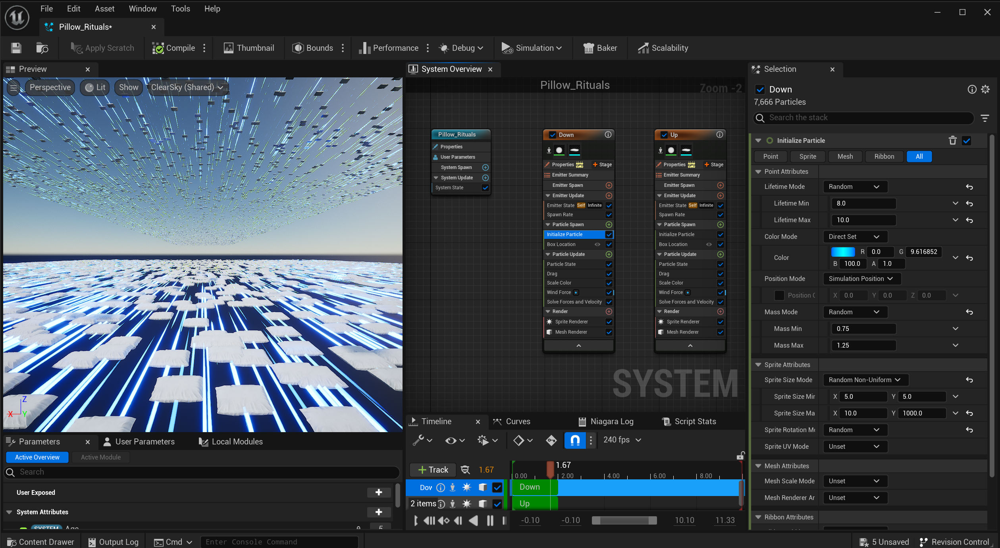
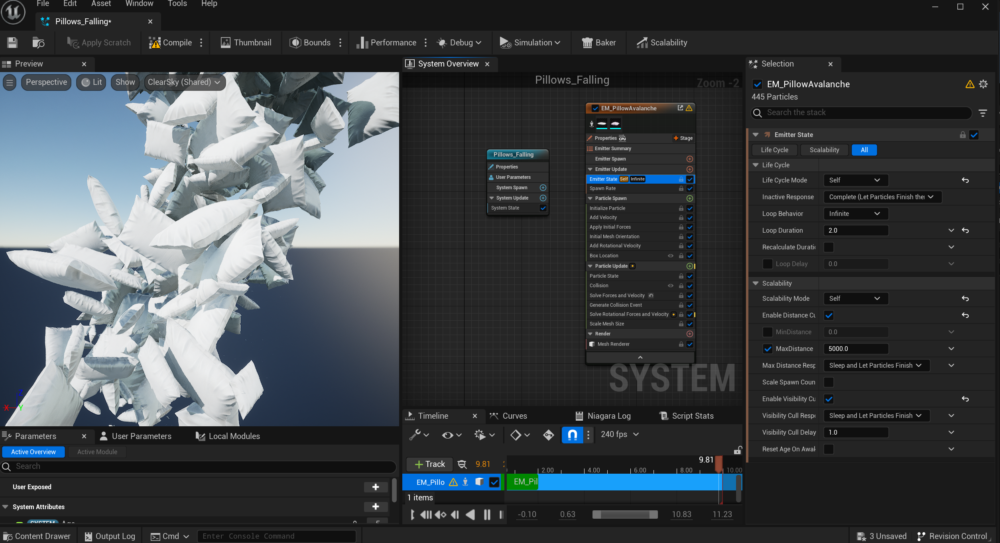
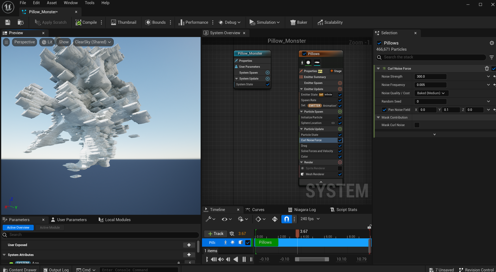
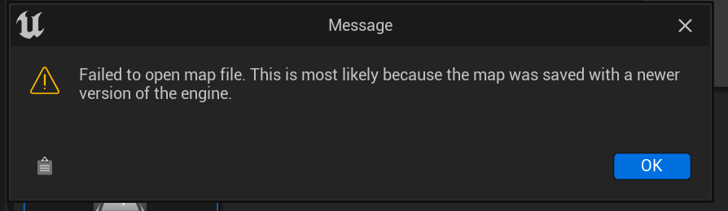
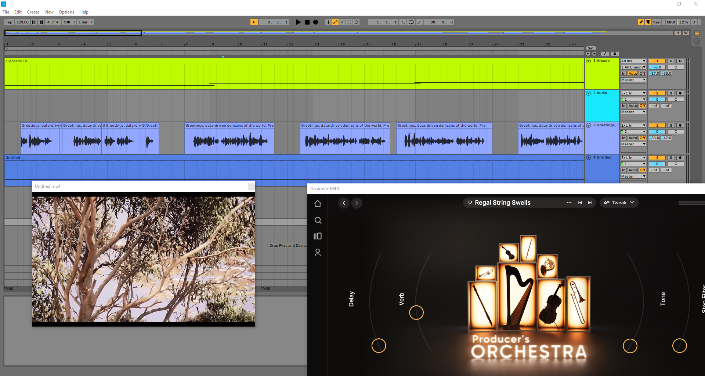

# The secret life of the Pillows - a short documentary about a day in the incredible life of the keeper of our dreams

## Summary
This project came to life as a continuation of Exercise 7, which revealed to me the surreal yet realistic capabilities of this powerful tool. The goal was to explore different functions within Unreal Engine, particularly in terms of camera work, the PCG plugin and Niagara visual effects
The playful and humorous concept of a pillow mockumentary was purposefully chosen to prevent the project from becoming overwhelming given the vast possibilities of Unreal Engine (and my working style). This project allowed me a creative exploration of Unreal Engine's capabilities in a manageable way, while also gratifying me with a “start to finish” holistic workflow. 

## Concept
"The secret life of the Pillows" is a visual exploration of an universe where ordinary pillows come alive and take flight, dancing in the sky creating surreal settings. This short film is a journey that aims merging the familiar and the extraordinary through playfulness, exploring the digital sweet absurd environment.
[SHORT FILM: A digital day in the incredible life of the Pillows](https://youtu.be/OrHru5TTsBY)

## Implementation

### Workflow: 

The first thing I did (and I think it was a great decision!) was to follow this tutorial: 
[Learn Unreal Engine 5 by Making a Short Film in Under 60 minutes! No experience needed. #UE5](https://www.youtube.com/watch?v=eTWnzHQJvBE)

It was extremely useful because after this tutorial I was able to move around Unreal better and also use the Camera in various ways in order to achieve more interesting results.

Then, I actually started with the last scene - with the PCG plugin, pillows everywhere, 3 actors and multiplied around the landscape. 
I watched this again:
- [UE5.2 Procedural Generation Plugin - Ep1 - Introduction](https://www.youtube.com/watch?v=hjk9308SCeE&t=61s)

I really liked the look but I couldn't fix the meshes from colliding weirdly to each other even if I tried several tutorials on the topic. 

That's where google-ing took me to the Procedural Foliage Tool from Unreal, which is was very interesting to explore. With this I created an environment that has several trees and pillows from different sizes, some tree barks "dressed" in pillow cloth on a landscape. 
[Procedural Foliage in Unity](https://www.youtube.com/watch?v=y_z4OLo-cls) - watched this but I also looked at several Levels from my asset packs, in order to understand how they are created with this tool. 
It was a very nice flow, but, I don't feel you can have too much control on the way things are displayed. However, for my landscape and pillow world, was good enough, as I could play with density and sizes:

some small pillows around trees:

some huge pillows between trees:

a more deserted area: 

random pillow sizes:

and to be honest, I quite enjoyed the look:

Then, I explored A LOT Niagara:

- The crazy trails

- The flying pillow flocks

- The Pillow Fountains:

- The Pillow Monster :) 

-and another one that unfortunately crashed Unreal and I never managed to get back as this error appeared and I couldn't open the Level anymore:

I call it the Pillow Bees *maybe a bit radioactive too because of the laser trials) and I am very proud of the way I used the camera in this scene even if I unfortunately didn't get to use it:

please WATCH HERE as I really love it: [the pillow bees](https://youtu.be/2ny54ndGSdY) 

Tutorials I used:

- [Unreal Engine 5 Niagara Particles: A Beginner Tutorial for Motion Designers](https://www.youtube.com/watch?v=pzIORuULNfo)
- [Learn This UNREAL 5 NIAGARA Particle Sim! UPDATED](https://www.youtube.com/watch?v=hcGDnIqXlXw)
- [Unreal Engine Rain Particle with Splashes using Niagara FX System 🌧](https://www.youtube.com/watch?v=qmZCW7eQ6rc&list=PLNTm9yU0zou6u9sbmY1xyVMx-g2vj_SUG&index=3) - until a point
and some other pieces of other tutorials. But I can say that I also explored childishly the possibilities, playing around parameters trying to understand them.

Last but not least to mention is the camera!!!!!!! Through the first tutorial I mentioned, I learned how to track specific actors and how to animate the camera movements in order to create a story. I am very happy for this:
maybe not the most representative screenshot but I am so happy I finally understood keypoints. I know it's basic but i never understood how they work. 

here is another scene I didn't use but I'm VERY happy with the camera movement: [The floating pillows (scene 1)](https://youtu.be/1wUm_hkxFeU) 

#### Look explorations:
The assets I used come from the package Rural Australia -natural elements, Edith Finch (Twins Room) - the pillows.

Firstly, I tried exploring the landscape and playing with it as an exploratory place:

And then I explored some "crazy" materials for my surreal world, which, tbh, now feels like way too much.
I tried using water / reflective materials and "fluffify" the trees as well and it got to this chaos:

HOWEVER, the renderings looked so bad and random. And after a crash where nothing was saved, I went back to the initial look - which I actually discovered I loved! It's making much more sense, the surreal atmosphere:

+ I tried working with volumetric clouds but i didn't catch that too well, so it's on the list for next time. 

### Storyline development:
At the beginning I wanted to create like an audioreactive music scene but I failed miserably as I could not finish any tutorial I tried ( 3 different ones) due to random reasons. 
So then I just started to play along and I started to really like the visuals I was seeing. The way the trees get in front of the pillows reminded me of Animal Planet or National Geographic sneaky footage that tries to capture wildlife.
That is why I decided then to create this narrative of a flock of pillows followed in their actions: seeing them on the bringht sky, them spreading everywhere, taking over nature, a surreal alien-like experience, and a peaceful ending.
The voiceover had to be an AI as my accent is not empowering the immersion feeling and after I found a voice I liked, I sketched the text based on the structure I had created and then asked ChatGPT to help me blend "technical digital poetics" with it so that it fits the PGS class vibe: algorithmic fluff.

The result of the script is here:
[THE VOICEOVER SCRIPT](/pillowland_voiceover_script.md)

### Audio development:

I used the Arcade Plugin in Ableton Live 10 which I never have the chance to use even if I pay the subscription :)) because it's with samples and not too free for actual musical projects. However, as this project didn't have a sound-focus, I could create a simple soundscape with this plugin.
Also - I love using Ableton with video! I had no idea that is possible lol. 
As a goal, I just wanted to recreate the vibe of the wild-life documentaries, chill music and the voice on top.

## Results

The final result is a short film that can be seen here:
[SHORT FILM: A digital day in the incredible life of the Pillows](https://youtu.be/OrHru5TTsBY)

The film has 5 scenes and here are details from the scenes and a print screen from the 2x print screens from the movie:

1. The flying pillows - day/night
- from the movie:

- detail from the world: 

2. The pillow field
looks bad like this but yeah
- from the movie:

3. The Great Tree Takeover

- from the movie:

- detail from the world: 

4. The Fluffy Monster

- from the movie:

- detail from the world: 

5. Last scene: the colourful field

- from the movie:

- detail from the world: 

## Project Reflection & Discussion
I REALLY LOVED WORKING AT THIS PROJECT. And got super invested in it. I think I REALLY, REALLY like Unreal.

One of the first things I did was follow the 60-minute short film tutorial. While it didn't have a direct connection with the class, it was crucial in giving me a comfort level in producing something within the Unreal environment.
Before this, my exposure to Unreal Engine was limited to the short, specific exercises from each session. These were helpful, but they didn't offer a holistic understanding of how to manage a complete project. The tutorial film filled that gap, providing a workflow perspective that tied all the individual elements together.
From there, I was able to launch into the specific focus of my project – a surreal, playful world of pillows. The comfort and familiarity I'd gained from the tutorial allowed me to dive more confident into the software's capabilities, like the Niagara system, PC foliage, and PCG plugin. It was a foundational step that set the stage for everything that came after.

Initially, I planned an audio-reactive pillow world. As challenges came up, I had to quit that quickly and went for world of flying pillows which surprisingly worked well. My original idea morphed into a funny (at least for me) short film & while different from my first vision, I am proud of what I created. It served as a reminder that creativity isn't linear and can lead to unexpected places. :)

Future Applications: I really want to continue something related to this. I was thinking doing some little surreal videos for social media or something that would motivate me to continue to explore Unreal. 

Improvements for Future Projects: I realized the importance of flexibility in creative projects. A better understanding of Unreal Engine's capabilities from the start could've helped. However, these are valuable lessons for future projects.
I experienced some ups and downs, including losing work due to computer issues and using the university computer at Filmuni was not the most flexible. However, I really enjoyed the time spent in the 6119 room with my pillows. Actually, on the big bean-bags :D That is why, instead of dwelling on the loss, I rebuilt the scenes. This mindset led to exploring the loss of the bees into creating the fluff monster scene instead of being frustrated.
Also, the aspect of community was really cool while working with Unreal. I connected with various groups on Facebook and found that they offered a supportive and engaging space to discuss ideas and challenges. Although the help I received on the audio-reactive issue was pretty basic, I think it's valueble to know that there is a community ready to support and share knowledge.

And of course: it's the first project I did on an actual good computer (from our classroom). It's amazing to render fast, not have extremely laggy moments.

## Lessons Learned

#### Technical:
- Unreal Engine: I got to dive deeper into the Unreal Engine environment and its real-time rendering capabilities, flexible camera control. I really love it.
- Niagara Visual Effects System: I extensively used the Niagara system in Unreal Engine for creating the flock of pillows, their flight paths, and the magical merging scene with blue laser light trails. This advanced VFX system allowed me to create visually complex, interactive, and high-performing scenes.
- PCG Foliage: I utilized the PC Foliage to create fields full of white pillows. It allowed me to scatter hundreds of pillows across the scene, creating a surreal landscape of soft fluffiness. Understanding how to manipulate and optimize foliage systems is so cool for creating somewhat believable environments
- PCG Plugin: For the colorful final scene, I used the PCG plugin to show diverse colored pillows across the hill. However, I need to understand it better when it comes to meshes.
- Camera Work: This project offered me the chance to experiment and understand the depth of camera movements, tracking, and framing within Unreal Engine. I used dynamic camera movements to provide a lifelike and immersive viewing experience, making the pillows feel alive and full of personality. For me this was an amazing learning experience and personal progress. I can compare it with last year, when I did a simple camera movement in Blender and it took me a day to understand how it's made because of my lack of experience with 3D softwares.
- Troubleshooting and Optimization: As with any project, there were challenges. From unsuccessfully trying to implement water materials and audio reactivity to managing the performance and visual quality of scenes, I had to troubleshoot various issues. Also, some I just had to let go. 
- Sound Design and Mixing: I neved did something like this! Even though the original idea of audio-reactivity didn't pan out, I still got to work with Ableton Live and Arcade Plugin for soundtrack creation and mixing. This contributed to the overall atmosphere and feel of the mockumentary, elevating the visual experience. And the AI voice - I never tried it before :)

#### Personal:
- I love stories and I definetely learn better if I create a scenario in my head, else I tend to get overwhelmed and have lack of direction.
- I am very happy with the result. I know it's not a very complex project but for me is a big accomplishment.
- I loved this course and I love Unreal. Thank you for this class and these exercises.
- I want to continue with this as it brings me a lot of joy.
