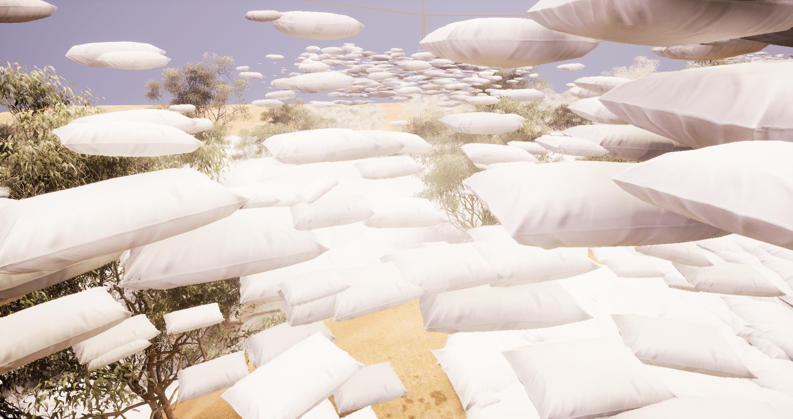

# The life of the Pillows - a short documentary about a day in the incredible life of the keeper of our dreams

## Summary
This project came to life as a continuation of Exercise 7, which revealed to me the surreal yet realistic capabilities of this powerful tool. The goal was to explore different functions within Unreal Engine, particularly in terms of camera work, the PCG plugin and Niagara visual effects
The playful and humorous concept of a pillow mockumentary was purposefully chosen to prevent the project from becoming overwhelming given the vast possibilities of Unreal Engine. This project allowed for a creative exploration of Unreal Engine's capabilities in a manageable way, while also allowing me to create a “start to finish” workflow. 

## Concept

## Implementation

I started with the last scene - PCG plugin, pillows everywhere, 3 actors and multiplied around the landscape.
Then I created a new environment and went on exploring the PG foliage for the environment + pillows laying on the floor and around. 
Niagara systems explorations
I watched the 60 min short film 

## Results

<figure class="video_container">
  <iframe src="https://www.youtube.com/embed/OrHru5TTsBY" title="YouTube video player" frameborder="0" allow="accelerometer; autoplay; clipboard-write; encrypted-media; gyroscope; picture-in-picture; web-share" allowfullscreen></iframe>
</figure>

## Project Reflection & Discussion

## Lessons Learned

