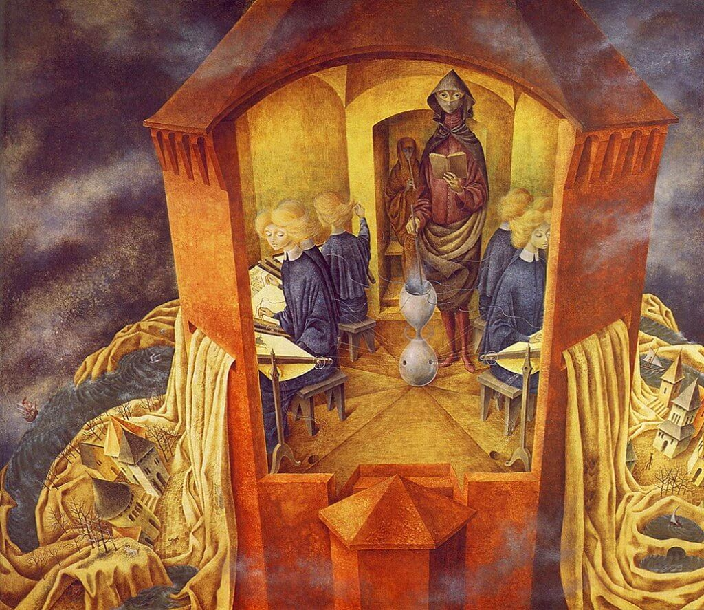
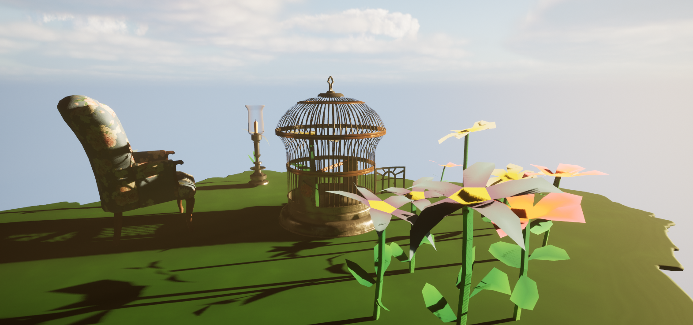

**Procedural Generation and Simulation**  


Prof. Dr. Lena Gieseke \| l.gieseke@filmuniversitaet.de  
Teaching Assistant: Sylvia Rybak \| sylvia.rybak@filmuniversitaet.de

---
# Session 01 - Introduction (20 points)

### Task 01.01

* Which of the chapter topics given in the syllabus are of most interest to you? Why?

    - Noise and agency
      - The power of noise and particles is huge. I play a lot these two in Touchdesigner (TD). Just by using one of them or combining two can create interesting visuals. Even I am familiar with these two but I never systematically learn .I am curious how these two topics in PGS differ from TD.  

* Are there any further topics in regard to procedural generation and simulation that would interest you?
    - Audio reactive related(real-time)? (not quite sure)
      - Since I am still fully understand the course. It coula be interesting to see how we can combine PGS with audio. Otherwise the course covers already most of the important topics.
* Which tool would you personally prefer to use for the practical tasks (e.g. Houdini, Unreal, Unity, Maya, Blender, JavaScript, p5, GLSL, ...)?
    - Unreal or Houdini
      - Both of them are widely used in the industry. Learning either one can be benefical. But considering the learning curve and real-time reandering, Unreal will be my first choice. 
* How would you rate your level of experience with Unreal Engine?
    *  Novice
   

## Introduction

* Recap [Chapter 01 - Introduction](../../02_scripts/pgs_ss22_01_intro_script.md)

###  Task 01.02 - Procedural Generation

Briefly in your own words: how would you explain your nanny what *procedural generation* means? 
  - Procedural generation is like having a magical machine that can create things automatically based on a set of rules or instructions. Imagine creating paintings, instead of drawing with hands, you first define the rules and tell the machine to create it with that rules.

## Patterns

### Task 01.03 - Seeing Patterns

Take at least three pictures of natural patterns and at least three pictures of man-made ones (patterns can be two or three dimensional). Try to include at least one pattern with self-similarity. Taking the pictures with your smart phone is just fine. Link all images in this markdown file.

- man-made pattern
  
  
  
  

- nature
  
  
  
  


### Task 01.04 - Understanding and Implementing Patterns

Write for one of your pattern images a generating algorithm in pseudo-code or code. Submit the code below.
````
function generationBubblePattern();
  patternSize = the size of the pattern
  bubblePattern = pattern

  numBubble = number of the bubbles
  minBubbleSize = minimum size of a bubble
  maxBubbleSize = maxium size of a bubble

  for i = 1 to numBubble;
  //position 
  bubbleX = random number between 0 and BubbleSize
  bubbleY = random number between 0 and BubbleSize

  bubbleSize = random number between minBubbleSize and maxBubbleSize

  drawBubble(bubbleX, bubbleY, bubbleSize, bubblePattern)

  return bubblePattern
````

### Task 01.05 - Seeing Faces

As an exercise to see and understand the environment around you (and to have some fun 😊), try to find at least two faces. Link all images in this file.


## Abstraction

### Task 01.06 - Abstraction in Art

Chose one "traditional" painting, which is inspirational to you. The image can come from the script or you can refer to any artists or image you like.  

Explain briefly what you like about the painting and how it might inspire you for your own work.




- These are the paintings from Remedios Varo. I am fascinated by surrealism. I would love to go for this kind of direction when I create visuals in unreal, for example combining two completely different textures or elememts which doesn't exist in real life. 


### Task 01.07 - Abstracted Artistic Expression in CGI

Chose one CG image, which you like and of which you think that it has an artistic quality to it. The image doesn't need to be from the script, again you can chose any CGI image you like (it should use 3D graphics). You can find more examples in the [Summary of Artists](../../02_scripts/pgs_ss23_01_intro_script.md#summary-of-artists) section.  

Explain briefly what you like about the image and why you consider it to be somewhat a pice of art. 


https://www.instagram.com/p/CHWbmpIn0jD/

  - As mentioned, surrealism is my favourite and catches my eyes right away. It is aesthetically pleasing. The combination of the colors is a thoughtful decision which makes the contrast pop. It also challenges the viewer's perception of reality.

## Unreal Engine

### Task 01.07 - First Steps

This task is about installing and getting to know Unreal Engine. The goal of this task is that you get to know Unreal and are somewhat knowledgeable about the basic functionalities. If you already know Unreal, learn something new about it and summarize it briefly.
  
You have to submit at least one preview image of the scene that you worked on. This can be a really simple scene, e.g. just a couple elements. Even though the scene can be simple, also try to design the scene a bit in which ever visual direction you want.



  

  <!-- Note for next year: this is not the best starter tutorial -->

For archiving this goal, you could for example start with the official Unreal tutorial [Your First Hour in Unreal Engine 5.0: Introduction](https://dev.epicgames.com/community/learning/courses/ZpX/your-first-hour-in-unreal-engine-5-0/E7L/your-first-hour-in-unreal-engine-5-0-introduction) (which also guides you through the installation steps). Ultimately, it is up to you how, e.g. with which tutorial, you want to get into Unreal. 

On a Side Note: The sample project that the tutorial is referring to, is now called [Unreal Learning Kit](https://www.unrealengine.com/marketplace/en-US/product/unreal-learning-kit?sessionInvalidated=true).

We started a collection of tutorials and resources for you in the [Unreal script](../../02_scripts/pgs_ss23_02_unreal_script.md).

*Hint:* Make sure to plan in a bit of time for the installation of Unreal as it takes a while.

## Learnings

### Task 01.08

Please summarize your personal learnings (text or bullet points - whatever you prefer). What was challenging for you in this session? How did you challenge yourself?

- Navigating in Unreal is not intuitive for me. It is still a hustle to nove around in the 3D and world and place the elements in the precise position.
- There a lot of new functions and options which excite me to explore them, at some point I would love to create something with more realistic look. 
- I tried to make a somehow werid or surreal scene for the first assignment by placing random objects from the learning kit. This helped to get used to the 3D world and the Navigation system.


---
  
Answer all questions directly in a copy of this file and **also link and display all of your images in that file**. Submit your copy as `pgs_ss23_XX_lastname.md` in your assignments folder (replace the XX with the number of the session). 
  
For example: `assignments/gieseke/01/pgs_ss23_01_gieseke.md`


---

**Happy Abstracing!**

