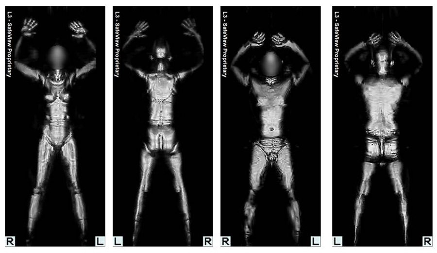
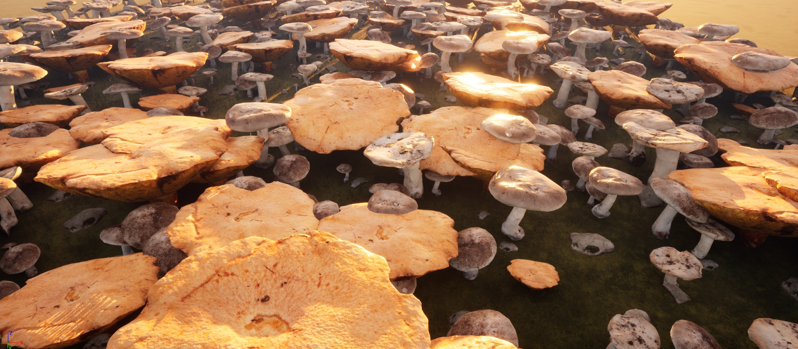

**Procedural Generation and Simulation**  

Prof. Dr. Lena Gieseke \| l.gieseke@filmuniversitaet.de  
Teaching Assistant: Sylvia Rybak \| sylvia.rybak@filmuniversitaet.de

---

# Session 02 - Beauty in Maths (10 points)

## Task 02.01 - Creative Project Development Numbers and Curves

Develop a creative and / or visual and / or auditive concept in regard to one of the topics of Chapter 3, be it a number or numbers, spirals or specific curves, or all of them. The project doesn't need to be executable by you but you should be able to plan it thoroughly. Imagine it as if you are the creative and technical director but you don't have to do everything yourself. You can use any setup, framework, tool, etc. you like for this concept, it does not have to be with Unreal.

This concept should ideally include

- the idea and goal:
- references and inspiration (feel free to investigate your topic further),
- the specific concept,
- optional: concept sketches,
- execution and implementation details on how to do it.

- Idea: An interactive installation with projector and kinect in a science museum / a body exhibition. When a visitor enters "scannig area", the body of the visitor will become transparent and shows the inside neuron system. So the body will reveal its real ''face''.

- Goal: To let people experience and undertasnd neuron system in the body work, at the same time have a liitle fun. Alternativly it can be also an AR project which people use their fun to scan models of body and it reveals the nueron system inside the body.
   
- References and inspiration:

https://www.instagram.com/p/CNigQBeof5f/

- Execution and implementation:

Use GLSL to create neuron-like visuals in Touchdeisgner and feed it into AI tool to 
generate everytime different images when the visitor enters the area. 
Kinect can be used to scan and detect if someone enters, then use the threhold function to seperate the the body from the background.  The GLSL visuals can be project in the body part via projector.  

## Unreal

### Task 02.02 - Procedural Generation Plugin

Unreal released with version 5.2 a brand new plugin for procedural generation - which is of course quite exciting for a course called "Procedural Generation & Simulation" 😁. The plugin will allow us to work with a node graph and is with that similar to Houdini.

The bad news are that we must have Unreal version 5.2 for using the plugin. So go ahead and add Unreal version 5.2 in your Library. 5.2. is still in Preview, meaning it is not officially published yet, but so far I didn't have any issues with this release.

The goal of this task is to build a forest-like environment through which a player can run, with a procedural approach with a PCGVolume.

To get there, I recommend to follow these tutorials:
* [Adrien Logut: UE5.2 Procedural Generation Plugin - Ep1 - Introduction](https://www.youtube.com/watch?v=hjk9308SCeE&t=61s)
* [Adrien Logut: UE5.2 Procedural Generation Plugin - Ep 2 - Bounds and exclusions](https://www.youtube.com/watch?v=LyPK7MZT1pM&t=0s)
* [Adrien Logut: UE5.2 Procedural Generation Plugin - Ep 3 - Mesh sampler, Density filtering and Subgraphs](https://www.youtube.com/watch?v=ZXh6oesGTGg)

For this task, only the content of episode 1 is a hard requirement. It is up to you how much from episodes 2 and 3 you want to add. 

Try to design the scene a bit in which ever visual direction you want. Your final images should look somewhat interesting.

Hints
* You do not need to build Unreal, as said in the video. Unreal 5.2 is now available in the Library.
    * Test early if 5.2 and the PCG plugin is running on your computer. If not get in touch with me asap!
* There is an [un-official text-based summary of episode 1](https://www.quodsoler.com/blog/intro-to-unreal-procedural-content-generation-framework) of the video tutorials.
* I recommend to start with a "Third Person" template for your scene.
* If you get an  “Lighting Needs to be Rebuilt” error, go to the menu "Build" in the menu bar and select "Rebuild lighting".
* Make the PCG Volume small and set the "Points Per Square Meter" (in the Surface Sampler node in the PCG graph) to a low number in case your computer slows down. Your final scene does not to have a high density of meshes.
* You can use any assets you want and the result does not need to look like a forest at all. Just distribute other objects in a forest-like manner.
* For adding assets (in the tutorial the "temperate Vegetation: Spruce Forest" is used and works well in 5.2) from to market place that are officially not compatible with 5.2 you can use [the following approach](https://dev.epicgames.com/community/learning/tutorials/6G1D/unreal-engine-5-how-to-use-assets-that-are-not-compatible-with-ue5-in-ue5):

*Submission*: At least one preview image (linked here).  

Eventually, we also want to render videos and if you are interested, have a look into the topic yourself. But for this submission a video is not a requirement.

## Learnings

### Task 02.03

Please summarize your personal learnings (text or bullet points - whatever you prefer). What was challenging for you in this session? How did you challenge yourself?

- In this semester I missed quite some lessons. I gave myself more time to understand the topic before dive into the pratical part as well as finish the task on my own pace instead of rushing through it. 

- The challening/frustrating part is the dowloading time of the assets mentioned in the tutorial. It took a long time to just wait before I could continuous.

- Following along the videos is strightforward and easy. After all three videos I am happy to see the result and be able to do a minor adjustment to create my fantasy "mushroom world" .

---
  
Answer all questions directly in a copy of this file and **also link and display all of your images in that file**. Submit your copy as `pgs_ss23_XX_lastname.md` in your assignments folder (replace the XX with the number of the session). 
  

---

**Happy Proceduraling!**

