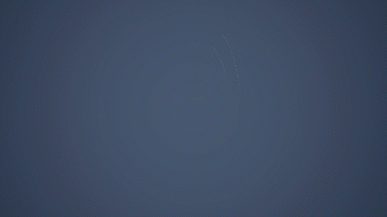
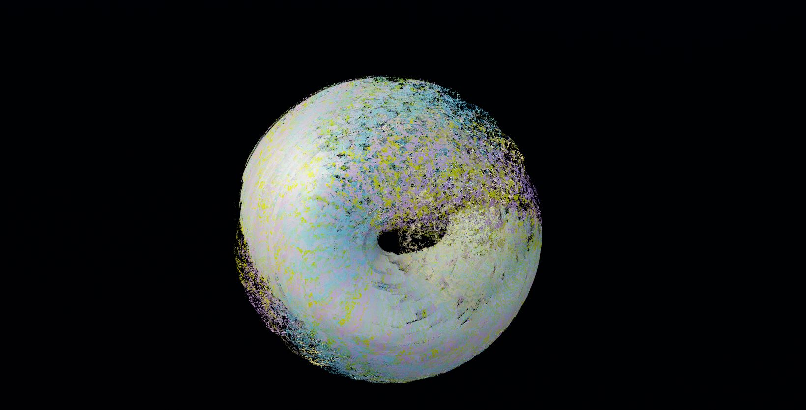
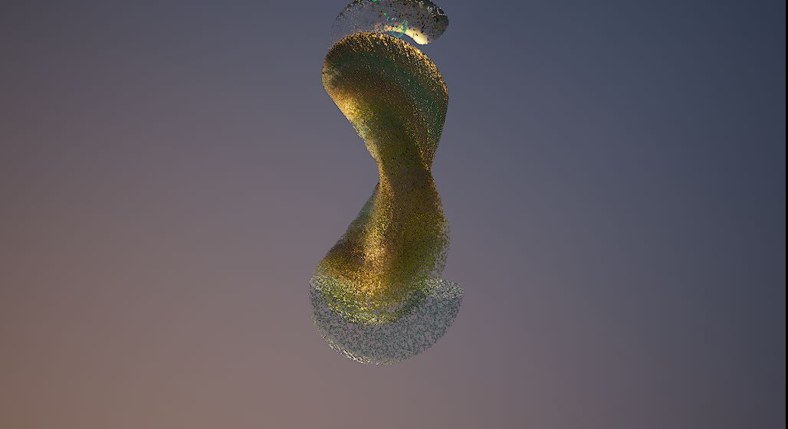
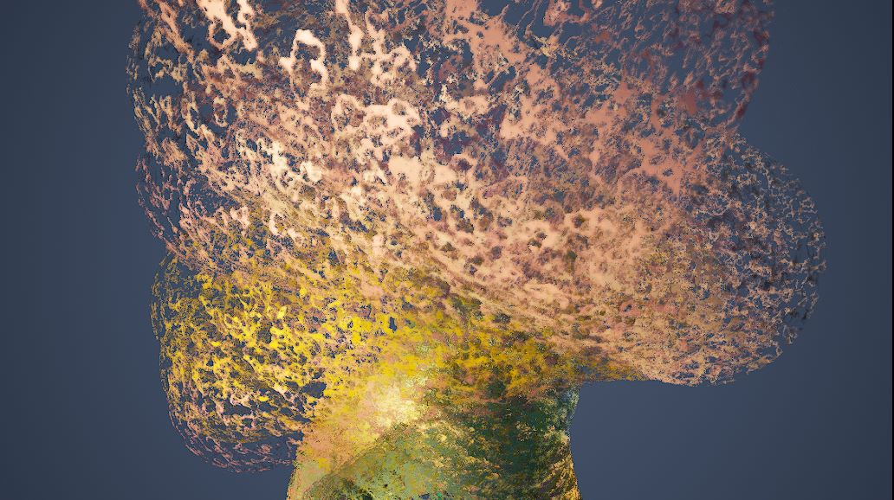

**Procedural Generation and Simulation**  

Prof. Dr. Lena Gieseke \| l.gieseke@filmuniversitaet.de  
Teaching Assistant: Sylvia Rybak \| sylvia.rybak@filmuniversitaet.de

---

# Session 05 - Noise (10 points)

This session is due on **Monday, May 29th**. This assignment should take <= 4h. If you need longer, please comment on that in your submission.

- [Session 05 - Noise (10 points)](#session-05---noise-10-points)
  - [Noise](#noise)
  - [Seeing Noise](#seeing-noise)
    - [Task 05.01 - Collecting Inspiration](#task-0501---collecting-inspiration)
  - [Unreal](#unreal)
    - [Task 05.02 - A Fancy Noise Material in Unreal](#task-0502---a-fancy-noise-material-in-unreal)
  - [Learnings](#learnings)
    - [Task 05.03](#task-0503)

---

## Noise

* Re-cap [Chapter 06 - Noise](../../02_scripts/pgs_ss23_06_noise_script.md)

## Seeing Noise 

### Task 05.01 - Collecting Inspiration

* Submit at least three pictures of natural noise patterns. You can photograph them yourself (recommended) or find them on the internet.
* Submit one stylized / artistic image that uses noise as generating principle or design element. You can find it on the internet.

Natural Noise:

Artwork made with noise by Dirk Rauscher:

## Unreal

### Task 05.02 - A Fancy Noise Material in Unreal

Complete the [Tutorial 01 - Noise](pgs_tutorial_01_noise/pgs_tutorial_01_noise.md) and [Tutorial 02 - Rendering](pgs_tutorial_02_rendering/pgs_tutorial_02_rendering.md). Come up with a good looking and individual result!
  
*Submission:* At least one preview image and one animation, e.g. as gif, of your scene, linked in your `pgs_ss23_05_lastname.md` file.

## Learnings

### Task 05.03

Please summarize your personal learnings (text or bullet points - whatever you prefer). What was challenging for you in this session? How did you challenge yourself?

- Compared to the last assignment following video tutorials, I found myself struggling much more than the written one. The instruction is clear but it is not intuitive to learn for me especially when there plenty of parameters to choose from. A lot of time spent on finding the paramters on the UI. Some of the pics are too small that I am not able to see the adjusted parameter even, always have to zoom in and out. 

- There are some steps in the rendering tutorial which I can't follow along I guess the UI design changed. For example, Camera Setup Step 1 - "If you find this tricky, you can also right click the CineCameraAct in the Outliner and select Pilot ‘CineCameraActor’." The Pilot ‘CineCameraActor’ can not be found in the Outliner, instead in another side of the viewport. In the Sequencer Step 1 - "Now that out Camera is set up, we can proceed to create a Sequence that we want to export. Open the Sequencer - it will either be docked as a tab next to your Content Browser or you can open it by following Window -> Cinematics -> Sequencer." The Sequencer appeared blank, a Level Sequenver must be added to see the timeline.

- All in all, I was unmotivated to follow along the written tutorials, I felt like I could have spent half of the time less on that. I wish there will be an alternative in the future for not just written ones but also video ones.

---

**Happy Randomizing!**

