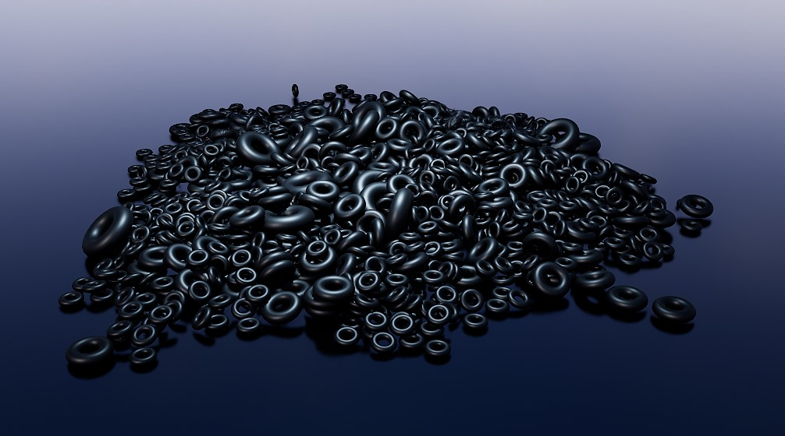
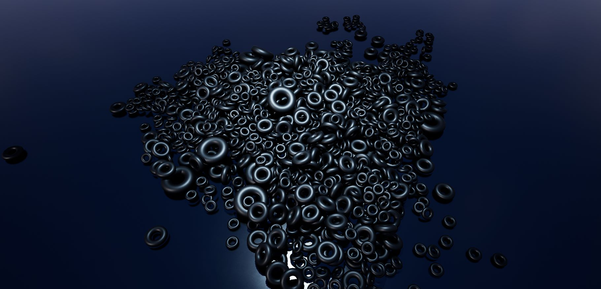

**Procedural Generation and Simulation**  

Prof. Dr. Lena Gieseke \| l.gieseke@filmuniversitaet.de  
Teaching Assistant: Sylvia Rybak \| sylvia.rybak@filmuniversitaet.de

---

# Session 06 - Dynamics (10 points)

## Unreal

### Task 06.01 - Fancy Cubes

Complete the [Tutorial 03 - Fancy Cubes](pgs_tutorial_03_dynamics/pgs_tutorial_03_dynamics.md). In case the tutorial doesn't look appealing to you, you can complete any other tutorial that includes a rigid body simulation. 
  
 Come up with a good looking and individual result!
  
*Submission:* At least one preview image and one animation, e.g. as gif, of your scene, linked in your `pgs_ss23_06_lastname.md` file.

## Learnings

### Task 06.02

Please summarize your personal learnings (text or bullet points - whatever you prefer). What was challenging for you in this session? How did you challenge yourself?

- I wanted to switch to video tutorial at the beginning and looked for rigidly related tutorials. Unfortunately there are not many free content. The one on the script looks more interesting compared to others. I decided to give another go. Surprisingly this time the steps are well writtena and everything went well. I had a good time following along

- During the tutorial, I can see lots of knowledge I learned from coding, which is a nice realization that I can apply what I learned in the past to the tool I use
  
- I didnt go too far to create an amazing individual scene, as I spent more time undestanding what each node does in the network. This is the challanging part. At the end I just tried out different mesh to see interesting results and adjust the lighting and material to fit my own taste

---

**Happy Forcing!**
