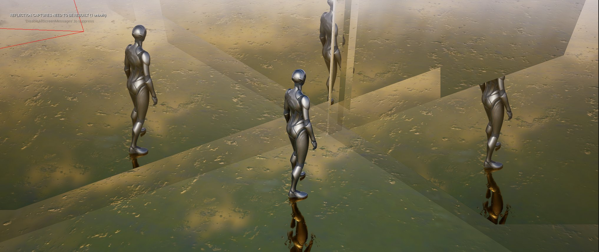

**Procedural Generation and Simulation**  

Prof. Dr. Lena Gieseke \| l.gieseke@filmuniversitaet.de  
Teaching Assistant: Sylvia Rybak \| sylvia.rybak@filmuniversitaet.de

---

# Session 09 - Final Project (40 points)

The final project of this lecture is due July 31st. The minimum of time invested for the project is **16h**, meaning in roughly two days of work. The project must refer to one of the lecture topics. It doesn't need to be done in Unreal. Do what you want. You can also base your project on a tutorial from the internet. The result of the tutorial will not be enough however, you have to develop the project somehow further and make it your own. Googling a specific term and looking for youtube videos usually gives already many results. Also, have a look into [Chapter 02 - Unreal](../../02_scripts/pgs_ss23_02_unreal_script.md) for tutorial suggestions. Also, you do not need to end with polished results, you can also document your learning path, have experimental output etc. as submission.  

*Hints:*

* Do not underestimate the time it takes to find a good tutorial.
* Before you commit to a tutorial check the comments to see what kind of feedback the tutorial received.
* Double-check what the tutorial results in (e.g. by watching the last minute first). Oftentimes the preview image of a tutorial will be super nice but the tutorial itself usually does not cover the shading and rendering setup - which is fine but be aware of it in advance.

Submit all source files, at least one representative image, a movie (if applicable) and a short project description as `.md` **briefly** covering the following aspects:

* Summary & Concept
  
    -  Rather than aiming for a perfect final result, my focus was on learning the system and experimentation. Inspired by a tutorial showcasing the Niagara gallery, I wanted to create my own version of the gallery, a surreal temple, showing as many simulations as I learned during these 16h using Niagara. The goal was not to achieve a visually stunning result but rather to dive a little deeper into the engine, its UI, and the capabilities of the Niagara system. By experimenting with various simulations and effects, I aimed to gain a better understanding of Unreal Engine.

[Inspirations]

* Implementation & Results
    - Throughout the project, I followed the few tutorials as references, but instead of replicating it exactly, I applied my own creativity to design the surreal temple gallery. Liquid Simulation, Gas Simulation and the particle effects were used. During the implementation process, I encountered numerous issues, which was a valuable learning experience even the issues could not be sovled at the end.

    

* Project Reflection & Discussion & Lessons Learned
    - While I faced many challenges throughout the project, I am happy with what I have learned, although I am not satisfied with the result. 16h seems quite enough for building a nice scene. As a beginning, it is not enough for troubleshooting and achieve a great result. Unreal Engine's settings and tools are in general overwhelming, and debugging issues can be time-consuming. However, this experience has taught me the importance of getting around it with other solutions.  It is also worth to mention the fact that tutorials may not always provide straightforward solutions, but they serve as starting points for one's exploration and experimentation.

* Issues
    - The biggest issue is the FXS I created in Niagara system look different when I put them into the world. I did a lot research on it and tried all the solutions, it didn not sovle the issue. 

[The FXS in Niagara system]

    - The bounding box around the explosion effect was not able to remove. I tried all the solutions I found online. None helped. 

  

* Experimental results:
    
    
     
    

* Final result:

---

**Happy Finaling!**
