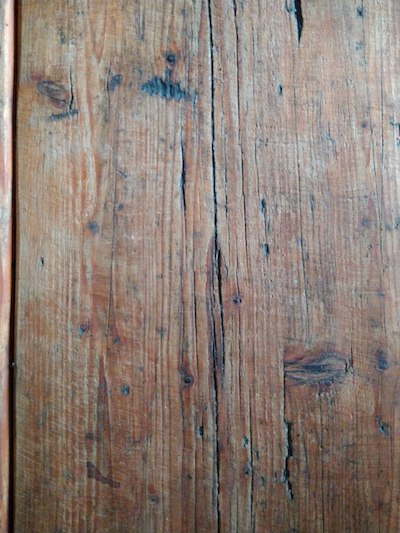
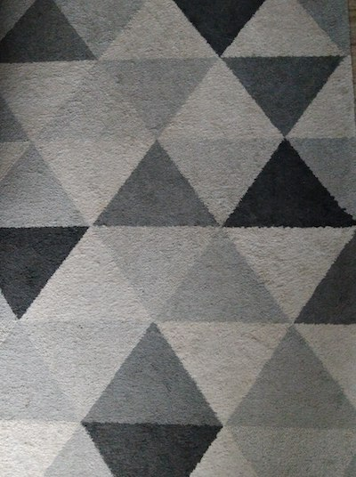
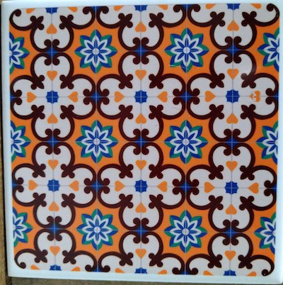
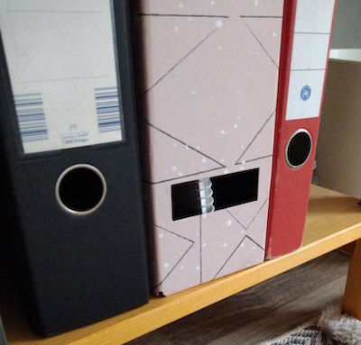

**Procedural Generation and Simulation**


Prof. Dr. Lena Gieseke \| l.gieseke@filmuniversitaet.de
Teaching Assistant: Sylvia Rybak \| sylvia.rybak@filmuniversitaet.de

---
# Session 01 - Introduction (20 points)

This session is due on **Monday, April 24** and we will discuss the results on Wednesday, April 26.

This assignment should take < 6h (probably much less). If you need longer, please comment on that in your submission.

* [Session 01 - Introduction (20 points)](#session-01---introduction-20-points)
    * [Syllabus](#syllabus)
        * [Task 01.01](#task-0101)
    * [Introduction](#introduction)
        * [Task 01.02 - Procedural Generation](#task-0102---procedural-generation)
    * [Patterns](#patterns)
        * [Task 01.03 - Seeing Patterns](#task-0103---seeing-patterns)
        * [Task 01.04 - Understanding and Implementing Patterns](#task-0104---understanding-and-implementing-patterns)
        * [Task 01.05 - Seeing Faces](#task-0105---seeing-faces)
    * [Abstraction](#abstraction)
        * [Task 01.06 - Abstraction in Art](#task-0106---abstraction-in-art)
        * [Task 01.07 - Abstracted Artistic Expression in CGI](#task-0107---abstracted-artistic-expression-in-cgi)
    * [Unreal Engine](#unreal-engine)
        * [Task 01.07 - First Steps](#task-0107---first-steps)
    * [Learnings](#learnings)
        * [Task 01.08](#task-0108)


## Syllabus

* Read the [Syllabus](../../index.md).

### Task 01.01

* Which of the chapter topics given in the syllabus are of most interest to you? Why?

Is saying *all of them* cheating? I just really like the overall topic. If I had to pick one though then I'd say "Agency". I think creating agents that decide and move and interact with each other and their world super fascinating. It's what the term AI was about for me before machine learning came and squatted it.

* Are there any further topics in regard to procedural generation and simulation that would interest you?

Some years ago I was browsing the [zines published by the proc jam community](https://www.procjam.com/seeds/) and stumbled upon the Wave Function Collapse algorithm and I'm still mind-blown by it. Especially when people adept it to 3D scenes.

* Which tool would you personally prefer to use for the practical tasks (e.g. Houdini, Unreal, Unity, Maya, Blender, JavaScript, p5, GLSL, ...)?

I'd be fine with anything JavaScript related, but I also wouldn't mind learning Unity, Unreal, Blender (or Godot, just putting it out there) or plain GLSL.

* How would you rate your level of experience with Unreal Engine?
    * [x] Novice
    * [ ] Intermediate
    * [ ] Advanced
    * [ ] God-like


## Introduction

* Recap [Chapter 01 - Introduction](../../02_scripts/pgs_ss22_01_intro_script.md)

###  Task 01.02 - Procedural Generation

Briefly in your own words: how would you explain your nanny what *procedural generation* means?

PG is an approach to creating new things (that could be patterns, levels, anything) by defining a process with constraints. Executing that process will yield different results but will stay within the wanted constraints.


## Patterns

### Task 01.03 - Seeing Patterns

Take at least three pictures of natural patterns and at least three pictures of man-made ones (patterns can be two or three dimensional). Try to include at least one pattern with self-similarity. Taking the pictures with your smart phone is just fine. Link all images in this markdown file.

#### natural

   

#### human-made

  


### Task 01.04 - Understanding and Implementing Patterns

Write for one of your pattern images a generating algorithm in pseudo-code or code. Submit the code below.

I drew fern (live in p5 editor https://editor.p5js.org/1is1is/full/2e2oErzma)


``` js
function setup() {
  createCanvas(400, 400, WEBGL);
  frameRate(1);
}

function draw() {
  background(220);
  translate(-width/2, -height/2);

  for (let i = 0; i < 5; i++) {
    let rX = random(0, width);
    let rW = random(40, 60);
    drawFern(rX, rW);
  }
}


function drawFern(x, maxWidth) {
  fill("rgba(20, 200, 30, 0.5)");
  stroke("rgba(20, 120, 10, 0.5)");
  strokeWeight(2);
  line(x, 0, x, height - 12);
  noStroke();

  for(let i = 0; i < 38; i++) {
    push();
    let tX = x;
    let mW = maxWidth - i;

    beginShape();
    translate(x, i * 10);
    if (i % 2 == 0) {
      scale(-1);
      tX = 10;
    }

    curveVertex(0, 0);
    curveVertex(0, 0);
    curveVertex(mW, 8);
    curveVertex(0, 18);
    curveVertex(0, 12);
    endShape();
    pop();
  }
}
```


### Task 01.05 - Seeing Faces

As an exercise to see and understand the environment around you (and to have some fun 😊), try to find at least two faces. Link all images in this file.


[Image sources left to right, top to bottom: [1](https://www.google.com/imgres?imgurl=https%3A%2F%2Fpbs.twimg.com%2Fprofile_images%2F378800000719377900%2F45f6f5459fe0d5678de052e8741700d0_400x400.jpeg&imgrefurl=https%3A%2F%2Ftwitter.com%2Ffacespics&docid=JoT1wUHfRfTWbM&tbnid=x30M4EKn_ft1wM%3A&vet=10ahUKEwisyqXc27_hAhXGJlAKHXNpArEQMwg_KAAwAA..i&w=400&h=400&bih=915&biw=1680&q=faces%20in%20things&ved=0ahUKEwisyqXc27_hAhXGJlAKHXNpArEQMwg_KAAwAA&iact=mrc&uact=8#h=400&imgdii=PorYURvb5HYYdM:&vet=10ahUKEwisyqXc27_hAhXGJlAKHXNpArEQMwg_KAAwAA..i&w=400), [2](https://www.themarysue.com/things-that-look-like-faces-pareidolia/), [3](https://www.themarysue.com/things-that-look-like-faces-pareidolia/), [4](http://www.abovetopsecret.com/forum/thread1159632/pg1), [5](https://lockerdome.com/buzzfeed.com/6814745186674964), [6](https://twitter.com/FacesPics/status/1086717380837953536), [7](https://laughingsquid.com/faces-in-things-funny-photos-of-objects-that-appear-to-have-faces/), [8](https://twitter.com/facespixx)]





## Abstraction

### Task 01.06 - Abstraction in Art

Chose one "traditional" painting, which is inspirational to you. The image can come from the script or you can refer to any artists or image you like.

Explain briefly what you like about the painting and how it might inspire you for your own work.


I picked *The Great Wave off Kanagawa by Hokusai*, a painting that is not of euro-western origin. In general I really like the Ukiyo-e style as it's just so different from what western artists painted (or rather printed!) in the 17th to 19th century.

The almost cartoonish style while also maintaining a lot of detail catches the perfect sweet spot between realism and abstraction for me. Like the seafoam bubbles everywhere and the creases in the wave with the simple flat color pallette captures the danger and beauty of the ocean compared to the boats and people. It just really works for me.

I also like how it became very famous in the western world without much context. Like, the Wave is just one piece in a bigger series of 36 works or how the artist also drew a lot of erotic art. So, experiment with genres and see what sticks!


### Task 01.07 - Abstracted Artistic Expression in CGI

Chose one CG image, which you like and of which you think that it has an artistic quality to it. The image doesn't need to be from the script, again you can chose any CGI image you like (it should use 3D graphics). You can find more examples in the [Summary of Artists](../../02_scripts/pgs_ss23_01_intro_script.md#summary-of-artists) section.

Explain briefly what you like about the image and why you consider it to be somewhat a pice of art.


I picked a rendering of [Morphogen by Karsten Schmidt](https://github.com/thi-ng/morphogen/). It's kinda old at this point but I attended a conference once where he keynoted and talked about his approach of functional geometry and I was young and very easily impressed. Lol. It stuck with me since. It combines what I like about computer art: intricate, mathmatical concepts that are hard for a human to archieve but easy for a computer to calculate, but with the color and presentation choices of the artist to give it this industrial, almost toy-like appearance.

## Unreal Engine

### Task 01.07 - First Steps

This task is about installing and getting to know Unreal Engine. The goal of this task is that you get to know Unreal and are somewhat knowledgeable about the basic functionalities. If you already know Unreal, learn something new about it and summarize it briefly.

You have to submit at least one preview image of the scene that you worked on. This can be a really simple scene, e.g. just a couple elements. Even though the scene can be simple, also try to design the scene a bit in which ever visual direction you want.


I played a bit with the directional light and sky atmosphere. Cool stuff!

  <!-- Note for next year: this is not the best starter tutorial -->

For archiving this goal, you could for example start with the official Unreal tutorial [Your First Hour in Unreal Engine 5.0: Introduction](https://dev.epicgames.com/community/learning/courses/ZpX/your-first-hour-in-unreal-engine-5-0/E7L/your-first-hour-in-unreal-engine-5-0-introduction) (which also guides you through the installation steps). Ultimately, it is up to you how, e.g. with which tutorial, you want to get into Unreal.

On a Side Note: The sample project that the tutorial is referring to, is now called [Unreal Learning Kit](https://www.unrealengine.com/marketplace/en-US/product/unreal-learning-kit?sessionInvalidated=true).


<!-- We started a collection of tutorials and resources for you in the script. -->

*Hint:* Make sure to plan in a bit of time for the installation of Unreal as it takes a while.

## Learnings

### Task 01.08

Please summarize your personal learnings (text or bullet points - whatever you prefer). What was challenging for you in this session? How did you challenge yourself?

This is the first time I touched Unreal, so that part was very new. I have tiny bits of experience with Unity and Godot, so in the end most things were somewhat similar, just different. Though I am surprised how much Unreal give you out of the box for a 3rd person game etc, pretty impressive! I'm not sure about blueprint as a coding environment, probably simply because I'm not used to node-based programming. Let's see how that goes!

---

Answer all questions directly in a copy of this file and **also link and display all of your images in that file**. Submit your copy as `pgs_ss23_XX_lastname.md` in your assignments folder (replace the XX with the number of the session).

For example: `assignments/gieseke/01/pgs_ss23_01_gieseke.md`


---

**Happy Abstracing!**
