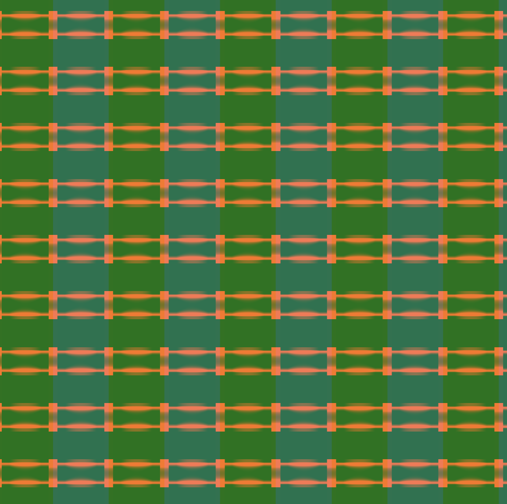
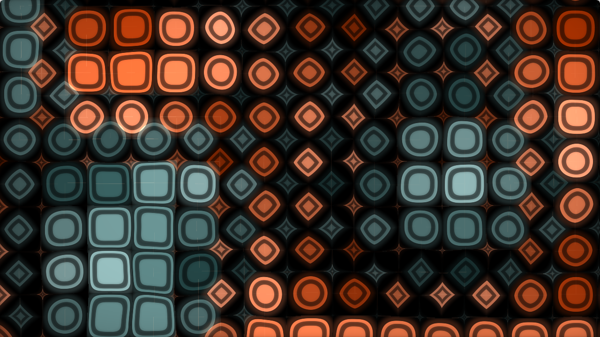

# Task 03.03 Experiments

[Look at the code](experiments_passing.frag)

# Task 03.04 - Inspiration 

[Circle pattern by Inigo Quilez](https://www.shadertoy.com/view/)

# Task 03.05 - Learnings 

This is a lot to take it and it's exactly how you said in the beginning: hearing the explanation of how the shaping and transition functions work is one thing - actually using them is something else entirely! I clicked and scrolled through the session slides and then the Book of Shaders to then just simply start with something grid like and go from there.