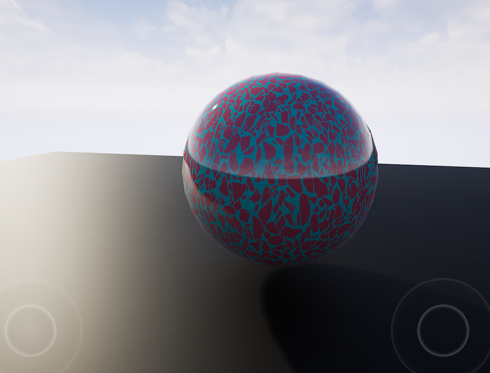
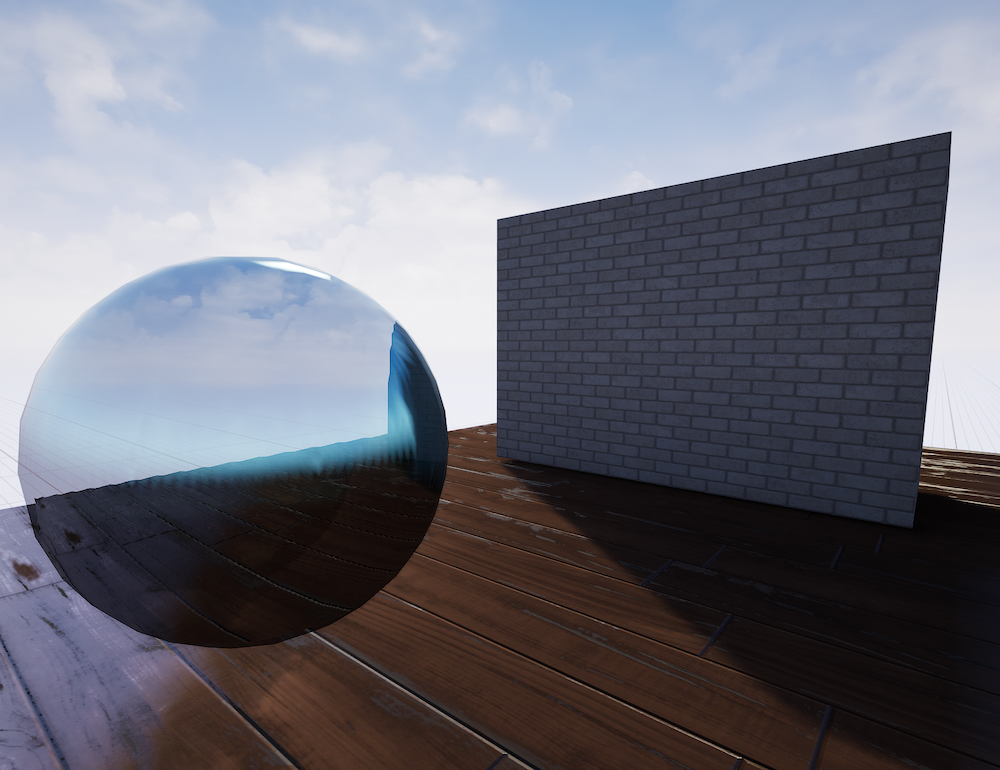

# Task 04.01 - Materials in Unreal

# Task 04.03 - Learnings

I learned a lot about materials! The linked tutorial was very good and also the material graph kinda helped my understanding of what I only knew as text fields in Unity or Godot. 