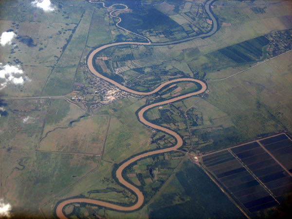
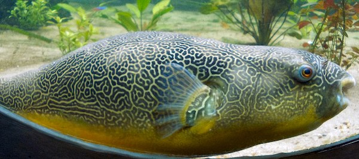
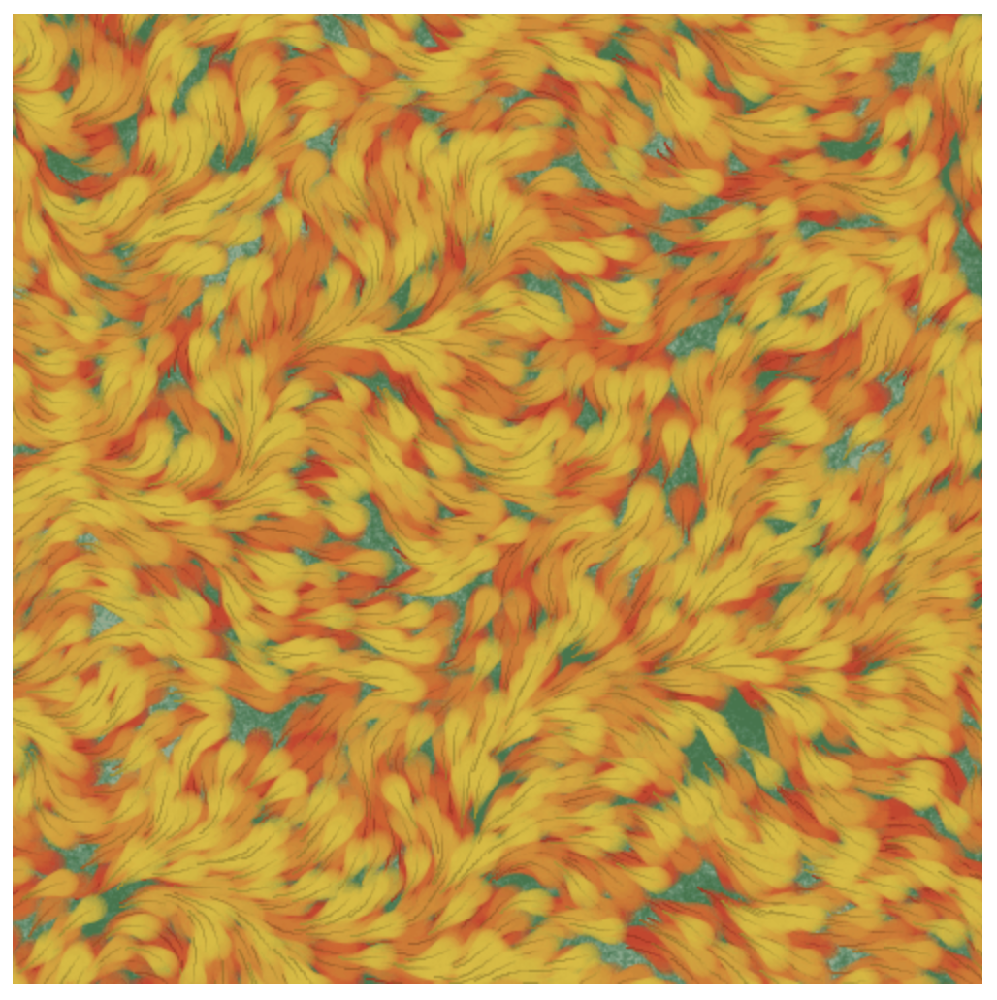
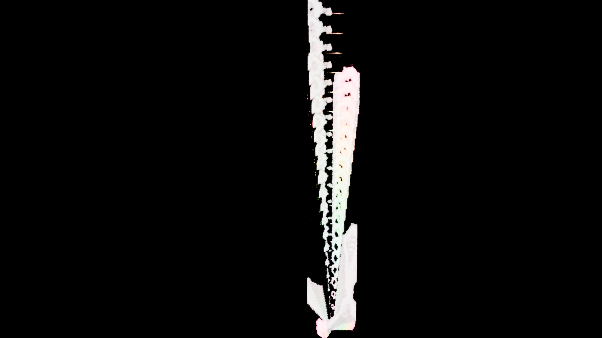
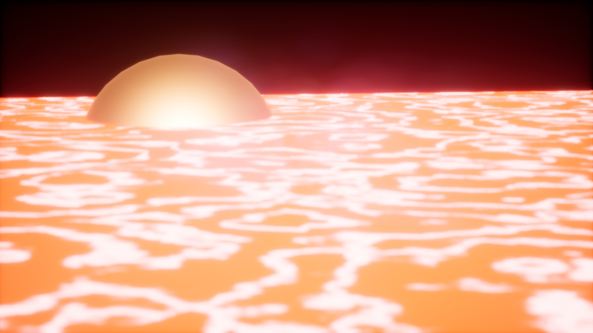

# Task 05.01 - Collecting Inspiration

## Noise in nature

## Noise in Art

I found this article that has a lot of examples how visually different the same noise can look: https://sighack.com/post/getting-creative-with-perlin-noise-fields

I particularly like Iteration 19:

# Task 05.02 - A Fancy Noise Material in Unreal

Outcome tutorial:

<video src="vid/render1.webm"></video>

Outcome playing with animated material and post processing

<video src="vid/render2.webm"></video>

# Task 05.03 - Learnings

This was not the easiest or most fun for me but I think I don't really have an eye for "abstract" generative design. But oh well. I loved playing with the animated material on regular geometry more than with the niagara system, for example.

There are some questions/ confusions that popped up:

- At the end of "Animating the Material" sections we add a Particle Color node and plug it into Base Color of the material. I'm wondering why? Particle Color does not show up later with other variables in the Material Instance Inspector. Also the Animated Material is set to Blend Mode "Masked", so it wouldn't show a color anyway, or am I understanding that wrongly? I think this is why I was struggling with using proper colors in the end result? The way the tutorial works with the pink color did not really work for me.

- I also ran into this issue https://forums.unrealengine.com/t/sequencer-window-blank/352452/3 First you have to add a Level sequence through the Content Browser before the Sequence Window is populated https://docs.unrealengine.com/5.2/en-US/sequences-shots-and-takes-in-unreal-engine/ and then you can drag the Cine Camera Actor into the sequencer
