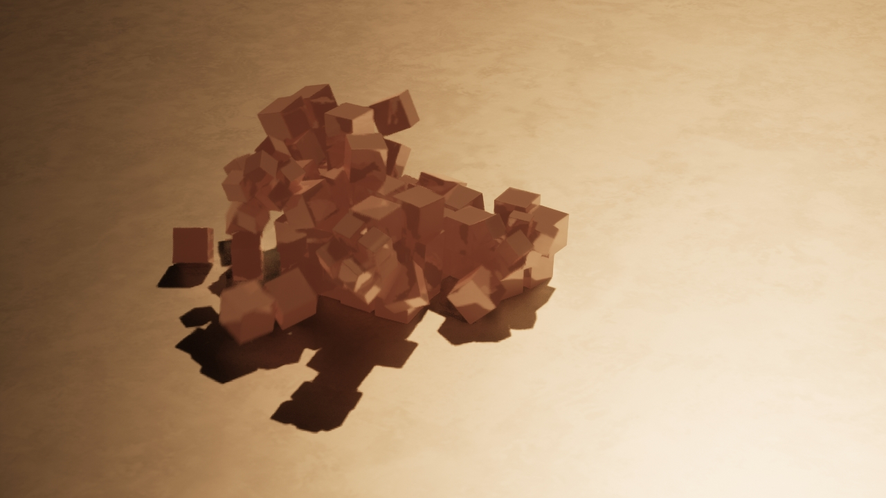

# Dynamics

## 06.01 Fancy cubes

I have a hard time to come up with ideas that "look good". So this time I tried to base it on the image of the [New York skyline engulfed by the forest fire smoke](https://people.com/time-lapse-shows-nyc-skyline-cosumed-wildfire-smoke-watch-7509843). That got me started pretty well and then I could go from there.

## 06.02 Learnings

I really liked the cube tutorial but I think more in the sense that introduced some basic programming within a blueprints (like define your own function and have it triggered etc). I don't think I learned a lot about the physics aspect but then again, it's also mostly taken care of by the engine. I continue to enjoy trying out post-processing and material features, it's all still new to me but it's a lot of fun.
