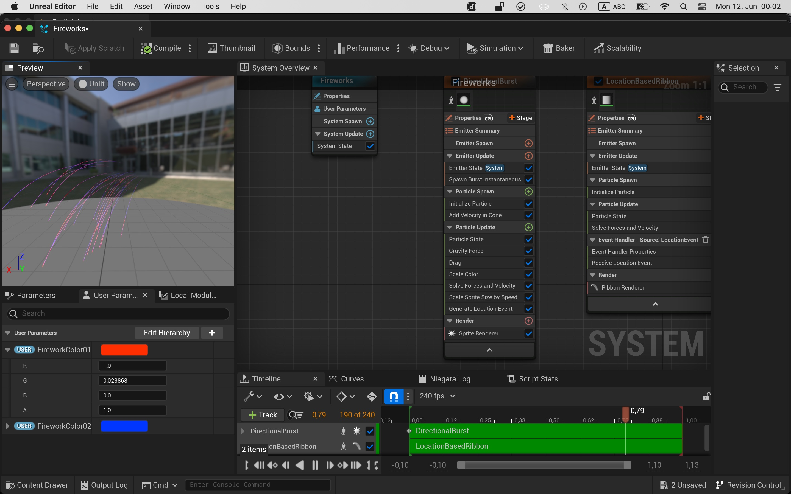
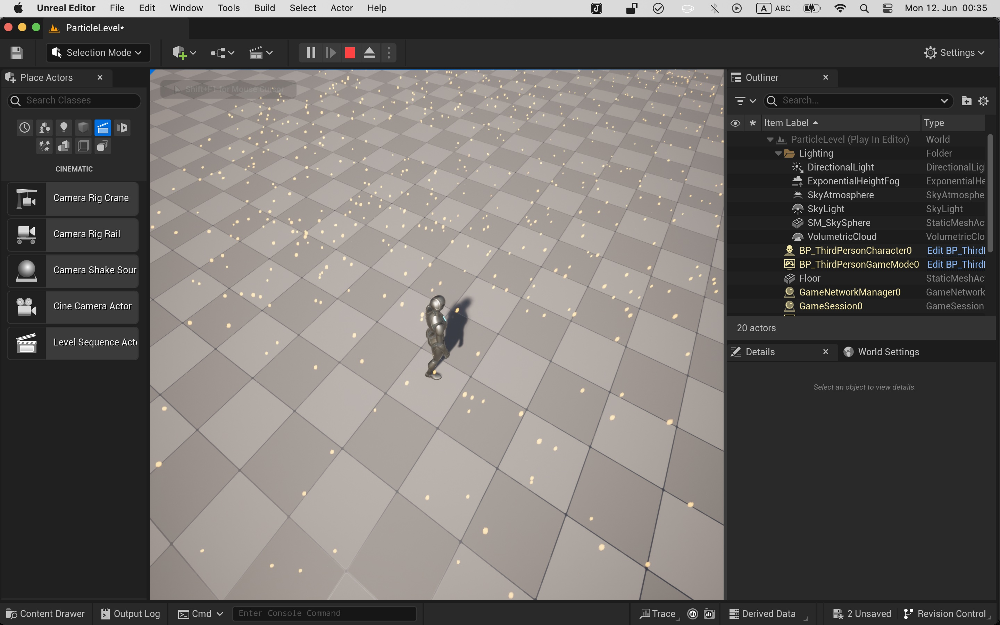
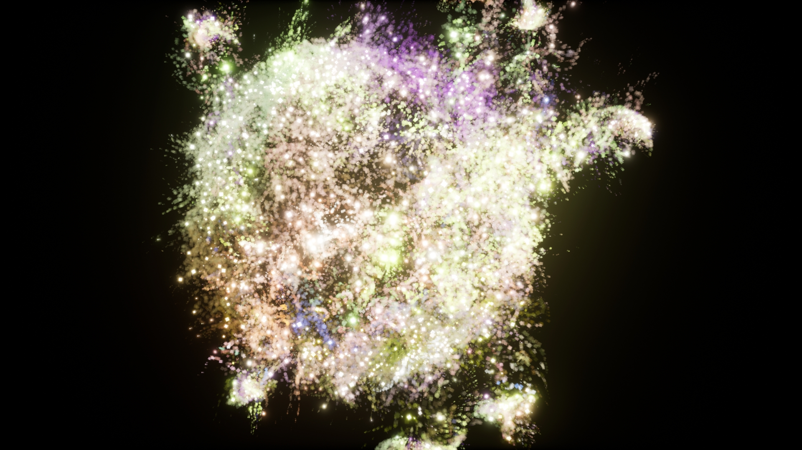
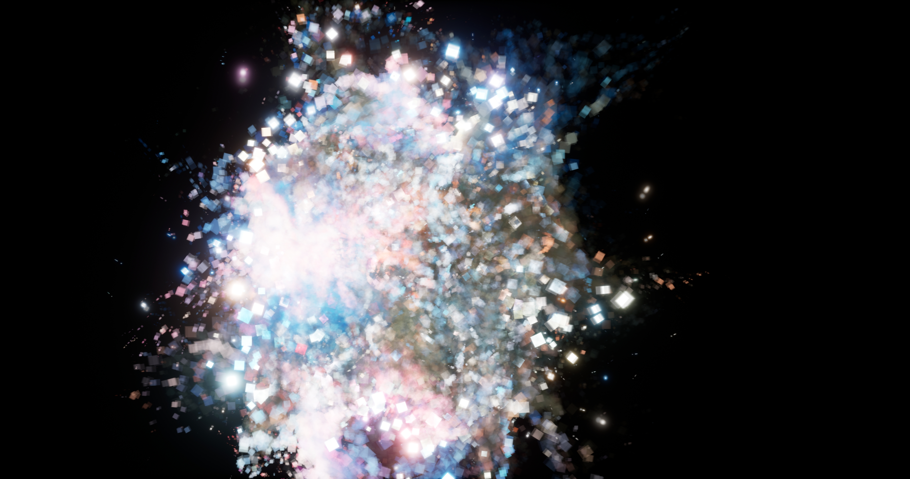
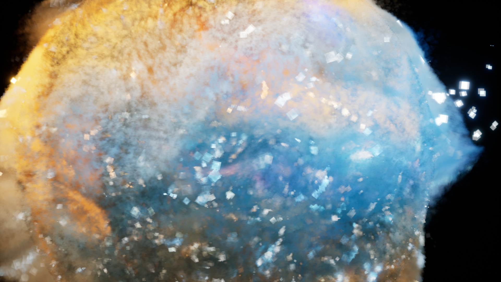

# Particles

## 07.02 Intro to Niagara

[Niagara in 300 seconds](https://www.youtube.com/watch?v=Wxx_2ZLoKbI)

[Intro to Niagra Particles](https://www.youtube.com/watch?v=04k9JDx-KTM) (next in youtube recommendations)

## 07.03 - Particles

I chose the [UE5 Nebula tutorial](https://www.youtube.com/watch?v=4DoiE8Amxro) by CGHOW. It's not the best but it combines a few things we did and it leaves out so much that you have to tweak it yourself anyway.

[video](video/nebula3.webm)

[video](video/nebula4.webm)

[video](video/nebula5.webm)

## 07.04 Learnings

- I think I have an okay grasp on particles in/with Niagra on a beginner level. I started watching the [boids tutorial in UE5](https://www.youtube.com/watch?v=9iDA6WMqEyQ) but once the C++ code components showed up I decided to do something easier. I mean it's cool, but I think it required several more steps of getting into C++ in UE5 and then do Niagara with it.

- I watched a tutorial about the movie render queue in unreal and some export settings, but I still find the camera actor, level sequence, movie cut concepts very confusing

- You can make a successful YouTube channel/ Patreon by just tying random things with Niagara and then giving them a name
