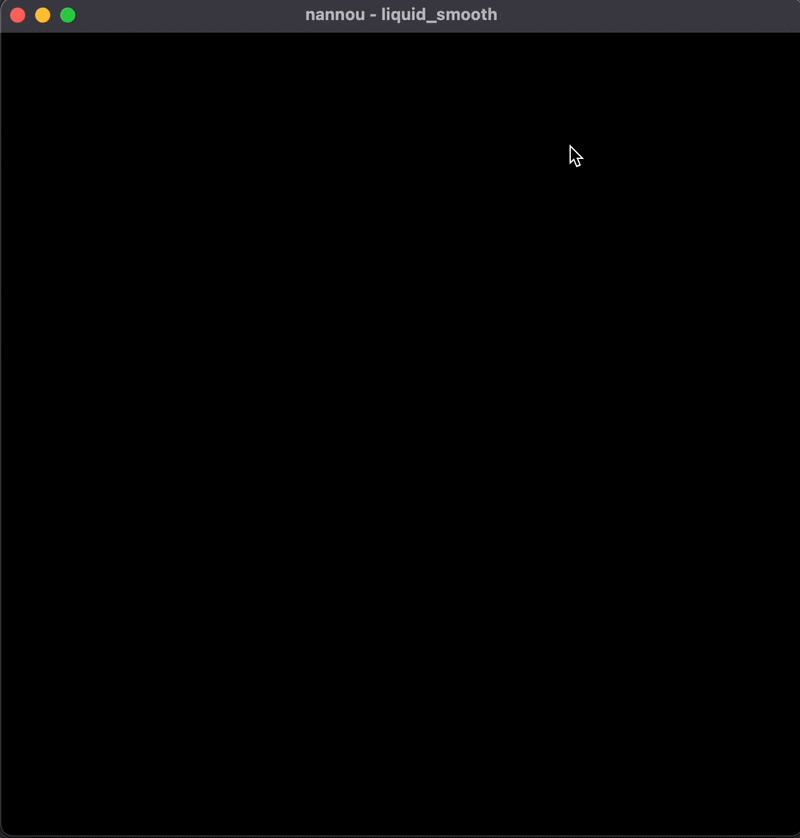

# Fluid simulation in Rust w/ Nannou

## Summary/ concept

I really liked the session on fluids and I wanted to try and implement the algorithm myself in Rust. On top of the foundational algorithm I wanted to experiment with interacting with densities and velocities in several sketeches.

## Implementation

I wanted to port the simulation code from written by [Mike Ash](https://mikeash.com/pyblog/fluid-simulation-for-dummies.html) (in return a 3D implementation of [Jos Stam's paper](https://damassets.autodesk.net/content/dam/autodesk/www/autodesk-reasearch/Publications/pdf/realtime-fluid-dynamics-for.pdf)) to Rust and use the [Nannou](https://nannou.cc/) framework to visualize it. 
In addition to the paper I also watched [Dan Shiffman's video](https://www.youtube.com/watch?v=alhpH6ECFvQ) on the same paper, because I also wanted to work in 2D hoping it would simplify some of the code.

Porting the code seemed easy enough in the beginning, but on several occasions I made mistakes with type conversions and also plain typos while copying and editing Ash's code. While I think I kind of know what's going on, debugging was still a nightmare. At one point I was so sure I made a mistake in the `advect` function (because I understand it the least) and spend a lot of time looking for mistakes, when in the end it was a stray `&` in the `diffuse` function when calling `lin_solve` that the compiler didn't catch...

There is still something not quite right with the calculation, you can see it in the gif/movie when adding more density and you get some kind of pixelated burst with dark spots instead of a homogenous light one. At 
this point I can't tell if it's a mistake in the simulation code or in the app code where I do coloring etc.

Another thing I noticed is that when I try to scale up my grid is that my program segfaults, which is super weird and I also want to investigate that.

## Results

Clicking anywhere on the canvas will add density to the center of the canvas. Velocity is constantly added depending on the position of the mouse and the distance to the center of the canvas.

There are some weird rendering artefacts when adding density that I can't explain, but they even out over time, so I ignored it for now.

I made a [repository for the project](https://github.com/lislis/nanu-sketches) because I would like to experiment further with the liquids and maybe turn it into an article for the [community tutorials section](https://guide.nannou.cc/community_tutorials.html) in the Nannou guide.

## Reflection and Discussion

I'm happy I went for the fluid simulation. I definitely wanted to do a more code-heavy project and an alternative could have been boids but I feel like I have already seen that a lot and fluids feels 'fresher'. I also don't usually work with that much 'foreign' code, so that was interesting but also challenging. 

I'm still not done with the fluid simulation overall. I had a couple of sketch ideas in mind, like to visualize microphone input with fluids somehow, so I at least want to try that. 

## Learnings

I learned a lot! From how Mike Ash gets code working without knowing how everything works, to Dan Shiffman getting it working with knowing even less, to me getting it somewhat working.

Once again I overestimated how long it would take me to get the basis going to then work on different sketches, but I feel like I have this problem with every project. 