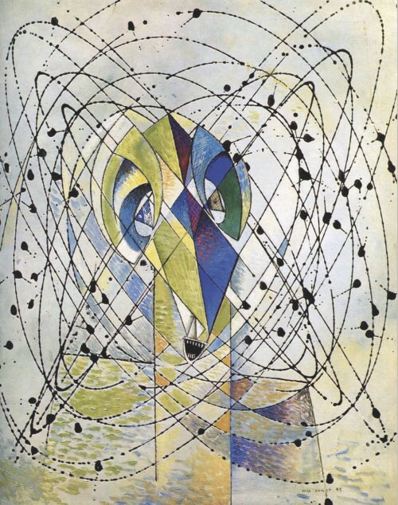

**Procedural Generation and Simulation**  


Prof. Dr. Lena Gieseke \| l.gieseke@filmuniversitaet.de  
Teaching Assistant: Sylvia Rybak \| sylvia.rybak@filmuniversitaet.de

---
# Session 01 - Introduction (20 points)

This session is due on **Monday, April 24** and we will discuss the results on Wednesday, April 26.  

This assignment should take < 6h (probably much less). If you need longer, please comment on that in your submission.

* [Session 01 - Introduction (20 points)](#session-01---introduction-20-points)
    * [Syllabus](#syllabus)
        * [Task 01.01](#task-0101)
    * [Introduction](#introduction)
        * [Task 01.02 - Procedural Generation](#task-0102---procedural-generation)
    * [Patterns](#patterns)
        * [Task 01.03 - Seeing Patterns](#task-0103---seeing-patterns)
        * [Task 01.04 - Understanding and Implementing Patterns](#task-0104---understanding-and-implementing-patterns)
        * [Task 01.05 - Seeing Faces](#task-0105---seeing-faces)
    * [Abstraction](#abstraction)
        * [Task 01.06 - Abstraction in Art](#task-0106---abstraction-in-art)
        * [Task 01.07 - Abstracted Artistic Expression in CGI](#task-0107---abstracted-artistic-expression-in-cgi)
    * [Unreal Engine](#unreal-engine)
        * [Task 01.07 - First Steps](#task-0107---first-steps)
    * [Learnings](#learnings)
        * [Task 01.08](#task-0108)


## Syllabus

* Read the [Syllabus](PGS/lecture_ss23_procedural_generation_and_simulation/docs/index.md).

### Task 01.01

* Which of the chapter topics given in the syllabus are of most interest to you? Why?
	* Agency - Particles II
	* since individual particles as agents have more complex behaviour the resulting emergent particle system can have much more interesting emergent outcomes. As a kid I used to stare at ant trails, so I guess that fascination with agent-based systems remained.
* Are there any further topics in regard to procedural generation and simulation that would interest you?
	* generating towns or just structures in general
	* procedural animation
* Which tool would you personally prefer to use for the practical tasks (e.g. Houdini, Unreal, Unity, Maya, Blender, JavaScript, p5, GLSL, ...)?
	* Blender because I have it installed
	* Houdini for my CV
	* GLSL to avoid spagetthi nodes
* How would you rate your level of experience with Unreal Engine?
    * [ ] Novice
    * [x] Intermediate
    * [ ] Advanced
    * [ ] God-like


## Introduction

* Recap [Chapter 01 - Introduction](../../02_scripts/pgs_ss22_01_intro_script.md)

###  Task 01.02 - Procedural Generation

Briefly in your own words: how would you explain your nanny what *procedural generation* means? 

Creating something by procedure, by a generalized logic. Think of semi-regular patterns in nature like flower petals.
Procedural generation is in contrast to things that are designed in a bespoke way.
## Patterns

### Task 01.03 - Seeing Patterns

Take at least three pictures of natural patterns and at least three pictures of man-made ones (patterns can be two or three dimensional). Try to include at least one pattern with self-similarity. Taking the pictures with your smart phone is just fine. Link all images in this markdown file.


### Task 01.04 - Understanding and Implementing Patterns

Write for one of your pattern images a generating algorithm in pseudo-code or code. Submit the code below.

The rectangle facade of the socialist building:

```js
const maxWidth = 4;
const maxHeight = 4;

rectangles = [];

while(generating)
{
	rectangle = {}
	rectangle.x = snapToIncrement(random() * width, gridIncrement);
	rectangle.y = snapToIncrement(random() * height, gridIncrement);
	rectangle.w = snapToIncrement(round(random() * maxWidth), 1);
	rectangle.h = snapToIncrement(round(random() * maxHeight), 1);

	if (isOverlappingAny(rectangles, rectangle))
	{
		continue;
	}
	
	rect(rectangle.x, rectangle.y, rectangle.w, rectangle.h);
	rectangles.push(rectangle);
}


```

### Task 01.05 - Seeing Faces

As an exercise to see and understand the environment around you (and to have some fun 😊), try to find at least two faces. Link all images in this file.


## Abstraction

### Task 01.06 - Abstraction in Art

Chose one "traditional" painting, which is inspirational to you. The image can come from the script or you can refer to any artists or image you like.  




"Junger Mann, beunruhigt durch den Flug einer nicht-euklidischen Fliege" - Max Ernst (1947)

I find this painting immensely funny. The humour stems from the combination of the trivial - being annoyed by a fly - with the profound - the mathematical concept of non-euclidean space. The joke isn't just in the title of course, the multiperspective nature of non-euclidean space is apparent in the image.
It also shows that abstract art can be fun and doesn't have to be dry or overly intellectual.

### Task 01.07 - Abstracted Artistic Expression in CGI

Chose one CG image, which you like and of which you think that it has an artistic quality to it. The image doesn't need to be from the script, again you can chose any CGI image you like (it should use 3D graphics). You can find more examples in the [Summary of Artists](pgs_ss23_01_intro_script.md#summary-of-artists) section.  


https://www.artstation.com/artwork/lR6PQV

Honestly I couldn't find something that isn't just "wallpaper-pretty". Something beyond "that looks nice".
Well I think this image "just looks nice" because the artist has a good sense of distributing big, rough shapes and hyperdetails. You can "zoom" in and out of the picture and it's never too overwhelming nor is there too little visual interest. Also low key lighting is gorgeous.

## Unreal Engine

### Task 01.07 - First Steps

Since I had some experience with Unreal I did a VERY BASIC thing in MetaSounds. The realtime audio synthesis system in UE. It's a little theremin.


## Learnings

### Task 01.08

+ the vast majority of digital art lacks a profoundness found frequently in "traditional" analogue art
