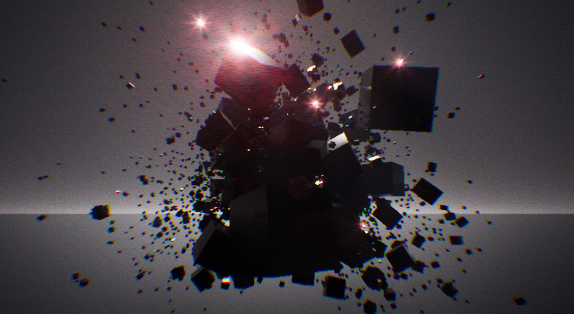

**Procedural Generation and Simulation**  

Prof. Dr. Lena Gieseke \| l.gieseke@filmuniversitaet.de  
Teaching Assistant: Sylvia Rybak \| sylvia.rybak@filmuniversitaet.de

---

# Session 06 - Dynamics (10 points)

This session is due on **Monday, June 12th**. This assignment should take <= 4h. If you need longer, please comment on that in your submission.

* [Session 06 - Dynamics (10 points)](#session-06---dynamics-10-points)
    * [Dynamics](#dynamics)
    * [Unreal](#unreal)
        * [Task 06.01 - Fancy Cubes](#task-0601---fancy-cubes)
    * [Learnings](#learnings)
        * [Task 06.02](#task-0602)

---

## Dynamics

* Re-cap [Chapter 07 - Dynamics](pgs_ss23_07_dynamics_script.md)

## Unreal

### Task 06.01 - Fancy Cubes

## Learnings

### Task 06.02

Please summarize your personal learnings (text or bullet points - whatever you prefer). What was challenging for you in this session? How did you challenge yourself?

---

I challenged myself by only roughly following the tutorial and implementing my own approach for splitting the cube.
