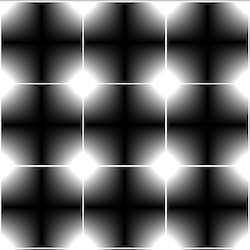

**Procedural Generation and Simulation**  

Prof. Dr. Lena Gieseke \| l.gieseke@filmuniversitaet.de  
Teaching Assistant: Sylvia Rybak \| sylvia.rybak@filmuniversitaet.de

---

# Session 03 - Function Design (10 points)

This session is due on **Monday, May 15th** and we will discuss the results on Wednesday, May 17th. You can already keep in mind that I will add the other half of this exercise next week and that it will also be due on May 15!

This assignment should take <= 4h. If you need longer, please comment on that in your submission.

* [Session 03 - Function Design (10 points)](#session-03---function-design-10-points)
    * [A New Environment](#a-new-environment)
        * [Task 03.01 - Setup Fragment Shader](#task-0301---setup-fragment-shader)
    * [Function Design](#function-design)
        * [Task 03.02 - Brick Pattern](#task-0302---brick-pattern)
        * [Task 03.03 - Experiments](#task-0303---experiments)
        * [Task 03.04 - Inspiration](#task-0304---inspiration)
    * [Unreal](#unreal)
    * [Learnings](#learnings)
        * [Task 03.05](#task-0305)

---

## A New Environment

### Task 03.01 - Setup Fragment Shader

For this chapter we will also have a quick look into just filling a 2D canvas. The easiest environment for this are fragment shaders. 

<!-- You should be roughly familiar with working with a fragment shader from last term's lecture *Theoretical Backgrounds in Audio and Graphics*.  -->

If you want to get into it right now, I recommend - especially for the topics of this lecture - [The Book of Shaders](https://thebookofshaders.com/). This is a truly excellent very first introduction to shaders. However, we will come back to this topic in the Shader Programming workshop. For this exercise you do not need to get any deep with shaders than running the code and seeing a result.

You are free to work in any environment you want to run your shader. Options are:

* My recommendation for now: The Visual Studio Code plugin [glsl-canvas](https://marketplace.visualstudio.com/items?itemName=circledev.glsl-canvas)
    * With this plugin, you can display a `.frag` fragment shader file directly in VSCode. Also, the plugin gives you access to the most commonly needed uniforms `u_resolution`, `u_time`, `u_mouse`, `u_camera` and `u_trails[10]`.
* [Shadertoy](https://www.shadertoy.com/)
* The [online editor](http://editor.thebookofshaders.com/) of the Book of shaders.
* OpenFrameworks
    * For this follow the setup steps in [Introducing Shaders](https://openframeworks.cc/ofBook/chapters/shaders.html)
* p5
    * For this follow the setup steps in [Setting up shaders in p5.js](https://itp-xstory.github.io/p5js-shaders/#/./docs/setting-up-shaders-in-p5)  

Keep in mind that input uniforms might be named differently in different contexts. Make sure that you know the names of the uniform variable for your environment.  

As of now, we only work with the fragment shader, no vertex shader, etc. needed! Please do not hesitate to get in touch with me if you have any issues running a fragment shader.

*Submission:* -

## Function Design

Read [Chapter 04 - Function Design](../../02_scripts/pgs_ss23_03_functions_script.md)

*Optional*: In case the chapter wasn't clear, you can also refer to the Book of Shader's chaper [Shaping functions](https://thebookofshaders.com/05/). My script is in parts based on that chapter.

### Task 03.02 - Brick Pattern

Understand the given brick pattern code in the [`brick.frag`](brick.frag) file and insert comments explaining for each code line of the brick pattern what it does and submit your copy as `brick_lastname.frag` in your assignments folder.

*Submission:* Your `brick_lastname.frag` file.

### Task 03.03 - Experiments

Come up with your own experimental pattern. You do not need to follow a design goal with this task and the result does not need to look good. The goal of this task is that you experiment with the different functions components. Submit your fragment shader as `experiments_lastname.frag`

You can also start with the given brick pattern and change that. For example:

*Submission:* Your `experiments_lastname.frag` file and an image of your shader, linked in your `pgs_ss23_03_lastname.md` file.

### Task 03.04 - Inspiration

Go to the [shadertoy](https://www.shadertoy.com/) site and browse the examples a bit. Submit the link to one example you like (you don't have to understand the code). Add that link to a file `pgs_ss23_03_lastname.md` and submit it in your folder.

*Submission:* Links in your `pgs_ss23_03_lastname.md` file.

## Unreal

*I will add this task soon (by the latest next week).*

## Learnings

### Task 03.05

Please summarize your personal learnings (text or bullet points - whatever you prefer). What was challenging for you in this session? How did you challenge yourself?

*Submission:* Text in your `pgs_ss23_03_lastname.md` file.

---

**Happy Functioning!**

