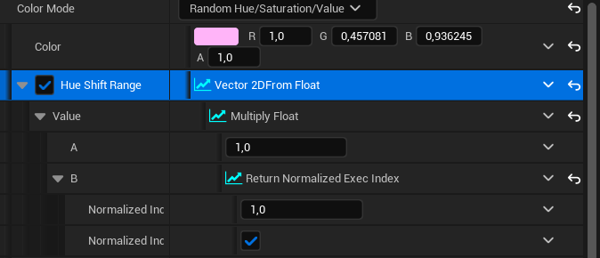

**Procedural Generation and Simulation**  

Prof. Dr. Lena Gieseke \| l.gieseke@filmuniversitaet.de  
Teaching Assistant: Sylvia Rybak \| sylvia.rybak@filmuniversitaet.de

## Tutorial 01 - Noise Tutorial

This tutorial shows how to create a animated material, which can later be applied to any mesh. We will also create a Niagara system and additionally use some post-processing to make the effect even more interesting.

This tutorial is by Sylvia Rybak, with some modification by Lena. The tutorial is based off of [CGHow's Layered Noise Tutorial](https://www.youtube.com/watch?v=Hb9Fl1WU5K8&t=72s).

### Creating A Noise Based Material 

1. Create a new material in the scene.

2. Double click the material to open the material graph. 
3. Add a **Noise node** to the graph (press the tab key or right-click in the graph, e.g., start to type "noise", select node). Do not plug it in anywhere yet, but right click on the node and press *'Start Previewing Node'*. 

4. As you can see the scale of the noise is too high and you can barely see the details. When the noise node is selected you will see some modifiable parameters on the left. 

5. For example, set the noise scale to 0.01. The noise texture should have a more distinct visual appearance now. 

6. You can play around with the settings of the noise further - for example with the *Levels* and *Turbulence*, to get a better feeling for how they effect the noises appearance. 

7. The here shown result uses a **Voronoi Noise** instead of the **Simplex Noise** that is set by default. 

Go ahead and create a noise texture you find interesting. The one shown here uses as *Function* Voronoi with the following settings:

8. Next create a **Power Node**, plugging the Noise into its *Base* parameter and a new **Scalar Parameter** node into the *Exponent* of the Power Node. Rename the parameter to "Power". This exponent to the noise function will give us further control over its visual output. Specifically, the power node applies the power of the *Exponent* to the *Base* value, which in this case is our noise. As you change the exponent value, you can see that it affects the *"contrast"* of the noise texture. 

Your nodes should look like this:

9. Right click the **Noise Node** again and turn off the preview as we want to preview the material and the upcoming changes made to it. Plug the **Power Node** into the 'Emmisive Color' of your material. 

10. Change the default value of the **Parameter** attached to the power node to a value up to your liking - for example 5. A suitable values depends also on the noise function you selected in your Noise Node.

Chose a value you think looks good, but you will also be able to modify it at a later point in the material instances. 

### Animating The Material

Now we will proceed to animate the material. For this we will use the **Panner Material Expression**. If you want to get a better understanding of this node, have a look in the Unreal documentation [about animating UV coordinates](https://docs.unrealengine.com/5.1/en-US/animating-uv-coordinates-in-unreal-engine/). 

1. Add a **Panner Node** and plug into its *Coordinate* parameter a **Multiply Node**. Use the node, to multiply the value of a added **Texture Coordinate** node with an added Scalar Parameter node, which might make sense to rename to "Scale". 
2. Plug a **Time Node** into 'Time'. 
3. Finally plug an **AppendVector** node into *Speed* with two scalar parameters name "Speed X" and "Speed Y". 

This is the node set up you should have after these steps: 

4. You will notice that when you try to plug this into the noise *Position*, it will produce an error message. This is because the Panner node returns a 2d Vector but we need a 3d Vector for the noise position. In order to fix this, we can simply append a Constant value to the output of the Panner node to create a 3d Vector:

5. Now, return to the noise node and change it's scale back to a value of 1.0. You will now be able to control the scale from the "Scale" Parameter you just created. You can change the default value within the parameter and it will also be modifiable from the material instance later on. 

6. Finally we will add together (with the Add node) the **Noise Node** and a **Time Node** and run it through sine, right before the **Power Node** to get a looping animation effect. 

The nodes should look like the gif below and you should see the material moving and animated by now. 

7.  You can also control the speed of this by multiplying the **Time Node** by a scalar parameter, which I named "Loop Speed". 

. 

8. The final step is to change the material itself. Connect the output of the power node to the **Opacity** of the material. Click on the **Material Node** and in the parameters on the left change the *Blend Mode* to "Masked" and check "Two Sided". I also plugged a **Particle Color** node into the base color, as I want to control the color from my Niagara system. 

9. Customize the material however you want by modifying values such as *Metallic* or *Roughness*. 

This was my final node set up:

### Creating a Niagara System 

1. Exit the Material Graph, right click your material and select *Create Material Instance*. 

2. Double click on the instance to open the editor. You can see all the previously created parameters on the right side. Here you can apply even more tweaks to your noise texture, whilst having the opportunity to always return to your base texture. 

3. Now left click in an empty space in the content browser and create a New Niagara System. 

4. Select *New System From Selected Emitters* and select *Fountain*. 

5. Add it with the green "+" on the bottom and press *Finish*.

6. Open the Niagara System and you will see a simple fountain particel system set up. 

7. First lets remove the **Sprite Renderer** in the Fountain node and replace it with a **Mesh Renderer** with the small red "+" on the render section. This will render meshes as particles instead. 

8. Expand the *Meshes* section and the default setting will be S_Gnomon. Click on the mesh name and select any mesh you want - either from your level or Unreal developer content. 

9. There is a gear icon on the right of the search bar, which if clicked, shows directories from which you can get content. 

10. Tick *Enable Material Override*, which is directly underneath the material selector and expand the Override Materials section underneath. Here you can select the noise material we have previously created. 

11. After this you can uncheck part of the functionalities of the fountain emitter like the image below. We don't need things like *Velocity*. *Gravity* or *Drag*, since we want the meshes to stay in place. (You can also delete them instead, but I would recommed to play with them once the system is set up to see what they do)

12. Add a **Spawn Burst Instantaneous** under the *Emitter Update* and set the *Spawn Count* to a number around 20. **Spawn Burst Instantaneous** causes emitters to spawn a burst of particles spontaneously.

13. Change the **Emmiter State** loop behaviour from *Infinite* to *Once*.

14. Under **Particle State** uncheck *Kill Particles When Lifetime Ends*. 

15. Under **Initialize Particle** scroll down to Mesh Attributes and change the *Mesh Scale Mode* to Uniform. 

16. Finally, we want to modify the scales of the emitted particles and and have them become incrementally smaller. Add **Scale Mesh Size** to our *Particle Update* section (with the green "+") and click the small downward facing arrow on the side of the *Scale Factor* values. 

17. Type in *Vector from Float*. We have to pack the X, Y, Z values into a a single vector so that we can conduct some mathematical operations on it. 

18. Select the downwards facing arrow next to *Value* and type *Multiply Float*. We are now multiplying the vector by a value. 

19. Once again select the downwards facing arrow by Value B and type *Return Normalized Execution Index*. This means that the vector will now be multiplied by the index number of the particle (which each particle is assigned when they are created). This value is normalized to the range 0-1, which means the particle scale will be progressively shrunken as the values are smaller than 1. 

20. You can do the exact same thing with the color! You can set the particle color under the **Initialize Particle** settings and do the same procedure. 

21. (EXTRA: If you also want to add some additional effects to your creation, you can try apply some post-processing directly in the *Scene Preview*. Click **Window** at the top of your screen and select *Preview Scene Settings*. You can set the parameters to your liking and have a preview of the effects without having to set up a whole scene in Unreal.) 

That is it! Now you can tweak the settings even more and play around with different meshes, noises or particle settings to achieve something that you like. 

This is for example another variation I made, using a different type of noise and particle rotation. 

