**Procedural Generation and Simulation**  

Prof. Dr. Lena Gieseke \| l.gieseke@filmuniversitaet.de  
Teaching Assistant: Sylvia Rybak \| sylvia.rybak@filmuniversitaet.de

## Tutorial 02 - How To Render In Unreal

This tutorial shows how to use post-processing, set up a camera and render out an image sequence or video out of Unreal.  
  
This tutorial is by Sylvia Rybak.

### Post Processing

Post Process Effects allow us to tweak the overall look and feel of the scene. We can use that to add some additional styling to our final result.

1. Drag your Niagara System from the **Content Browser** into the **Level Viewport**. I set the location to 0,0,0 and removed everything except a single *Light Source* and *SkyLight* to illuminate my object. Feel free to set up your scene however you like.

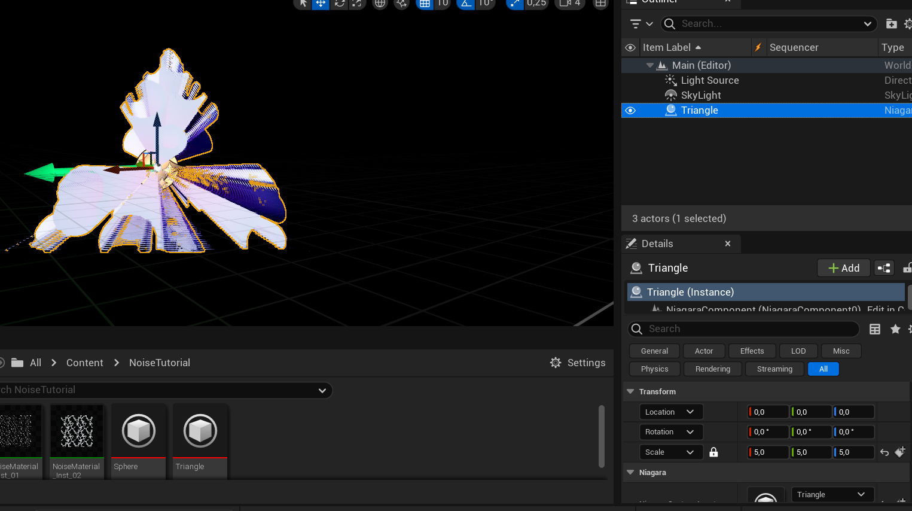

2. Click the cube with the plus icon on the top left of your screen and add a *PostProcessVolume*. 

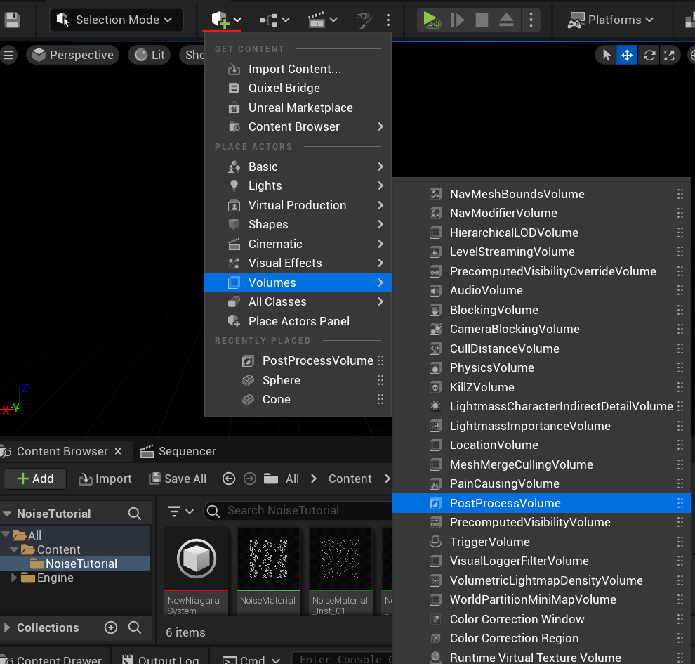

3. You will now see an empty box in your scene. Make sure it fully surrounds your object and make it a bit larger. This is basically the area to which your post-process effects will be applied to. 

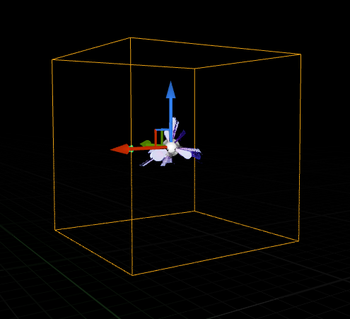

4. In the settings of the post process volume, you can add settings ranging from Bloom, to Lense Flares, Depth of Field or any Color Grading and Exposure adjustments. You can find descriptions of all of these effects in the [Unreal documentation](https://docs.unrealengine.com/4.27/en-US/RenderingAndGraphics/PostProcessEffects/). 

For example, I added some Bloom to achieve the 'glowing' effect you see in the final result. 

5. After you have set up your PostProcessVolume, we will continue to rendering our animation out as a video. 

### Camera Setup

6. In order to render, we need to add a camera to our scene. Click the cube icon again, and select *Place Actor Panel*. 

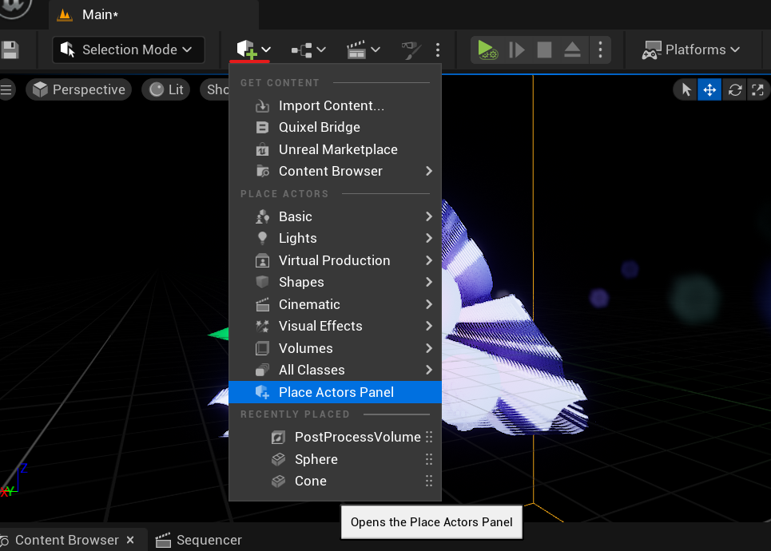

7. Add a camera by clicking the small Film icon on the top and then dragging *Cine Camera Actor* into your scene. 

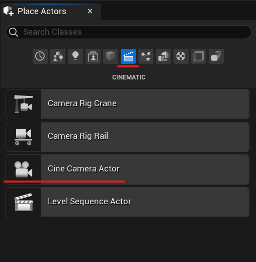

8. Now we have a camera in our scene, however it's location is random and most probably not covering our object. You can fix this by simply selecting the camera object in your scene and moving it to a location where the lense is facing the object. You can see the view from your camera on the right side of your scene. 

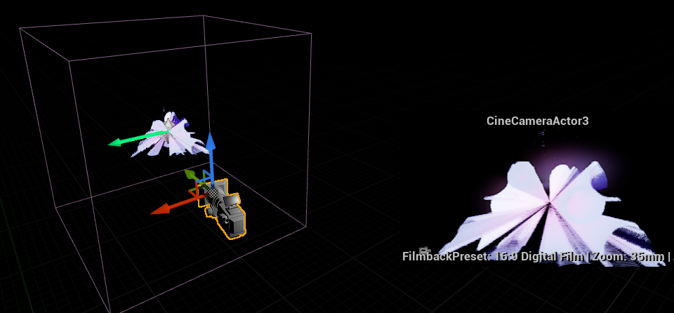

9. If you find this tricky, you can also right click the *CineCameraAct* in the **Outliner** and select *Pilot 'CineCameraActor'*. 

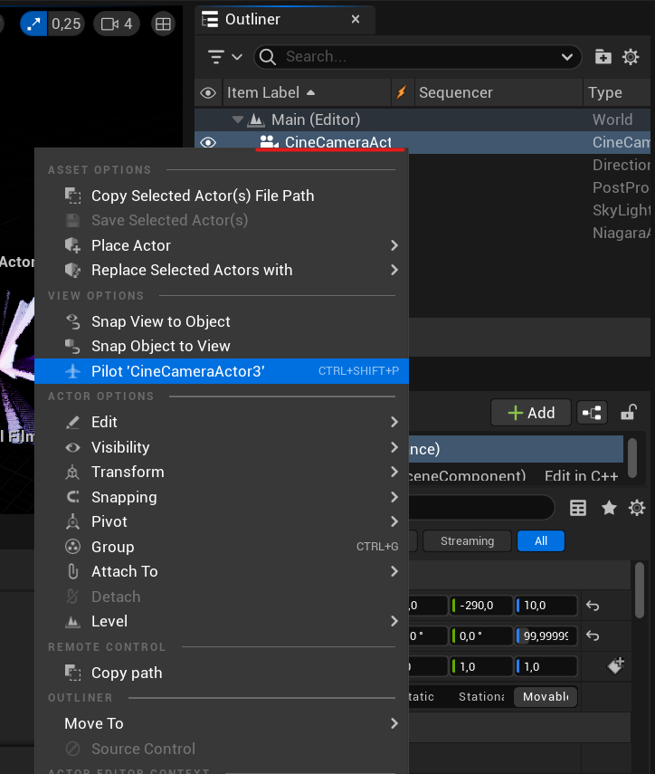

10. Now what you see in your Level Viewport, is what the camera sees as well. This means, you can set up the camera view by simply moving around the viewport with the navigation tools you normally use. Once you have found a view of your object that you like, you can stop piloting by pressing the Stop buttton in the top left of your viewport. 

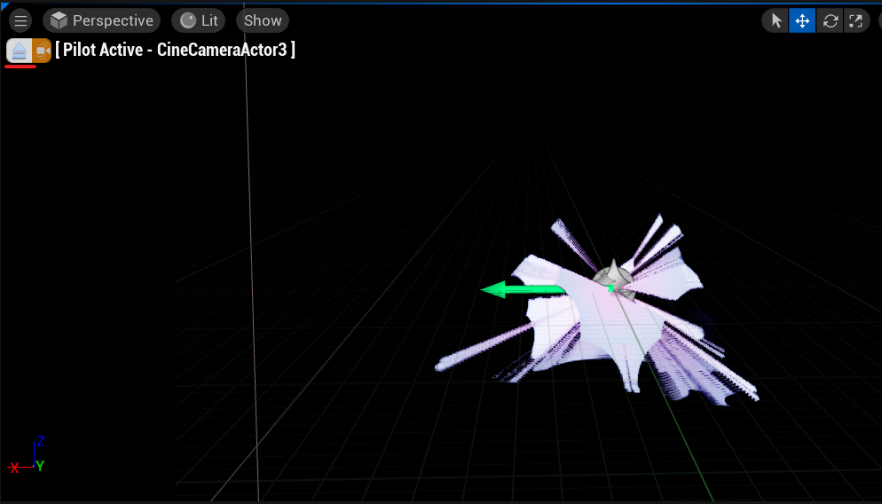

### Sequencer

11. Now that out Camera is set up, we can proceed to create a *Sequence* that we want to export. Open the **Sequencer** - it will either be docked as a tab next to your **Content Browser** or you can open it by following *Window -> Cinematics -> Sequencer*. 

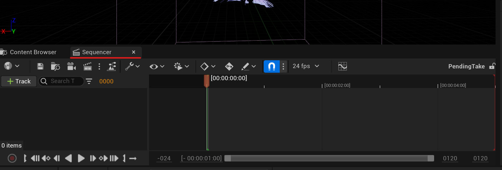

12. Now drag you *CineCameraAct* from the Outliner into the empty space on the left of the Sequencer (this is the Sequencer Outliner, which lists all tracks added to your sequence). 

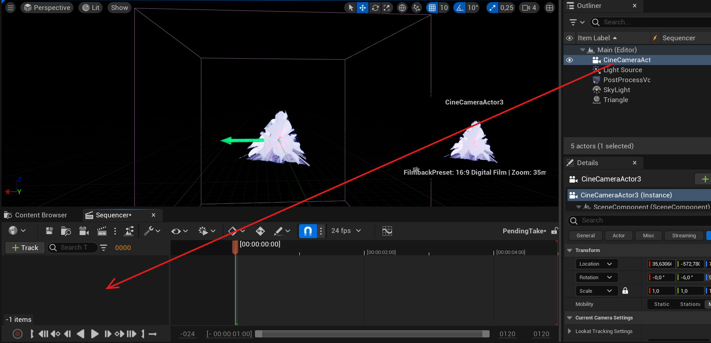

13. For those who are familiar with film editing, the timeline of the sequencer basically looks and  functions in a similar way as a timeline in a film editing software. 

You can find a detailed explanation of how to use it in this [documentation page](https://docs.unrealengine.com/5.1/en-US/sequencer-cinematic-editor-unreal-engine/) under *Timeline Navigation*. 

Adjust the start and end of the clip you want to render out by moving the green and red bracket to the start and end positions of your desired sequence. As you can see in the image, the duration of my sequence is set to a bit above 3 second. 

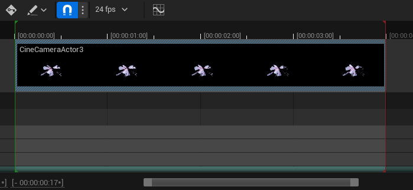

### Rendering

14. Click the film icon on the top left of the sequencer, which will open up a window. 

 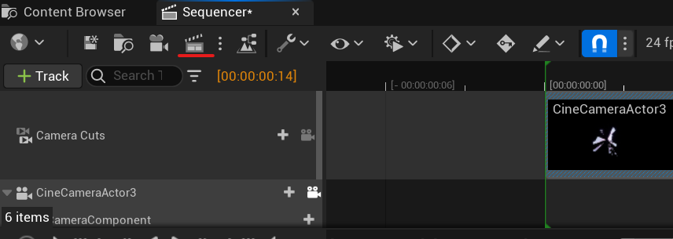

 15. The window which has just opened is the Movie Render Queue. It shows the Sequences, which are waiting to be render. If you were to render out multiple time-frames or scenes they would all be listed here. 

 Click on *Untitled Config* under settings.

  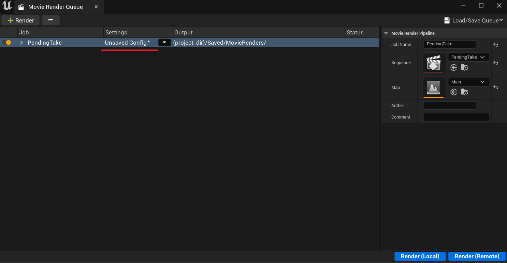

16. Another window will pop up with the Render settings for your export. Here you can set the resolution for your output footage and also the the directory to which it is exported. 

  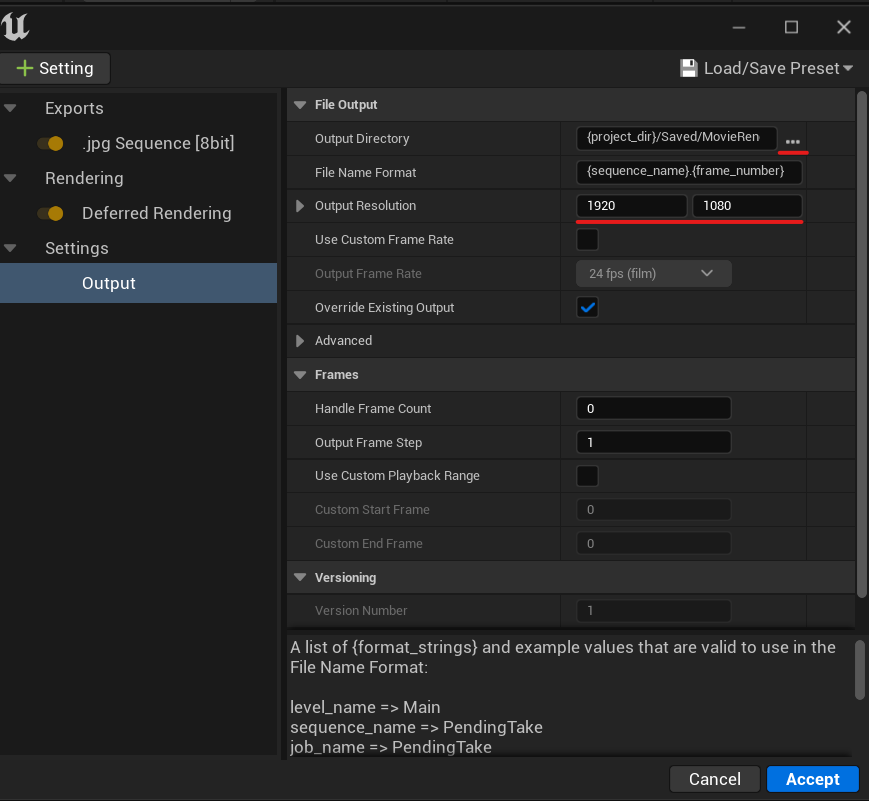

17. The default output is a .jpg sequence, which you can see under **Exports** on the left. You can also choose a different format to export or export multiple formats at once. To access this, click on the *Settings* button on the top right and choose any of the options under **Exports**. 

  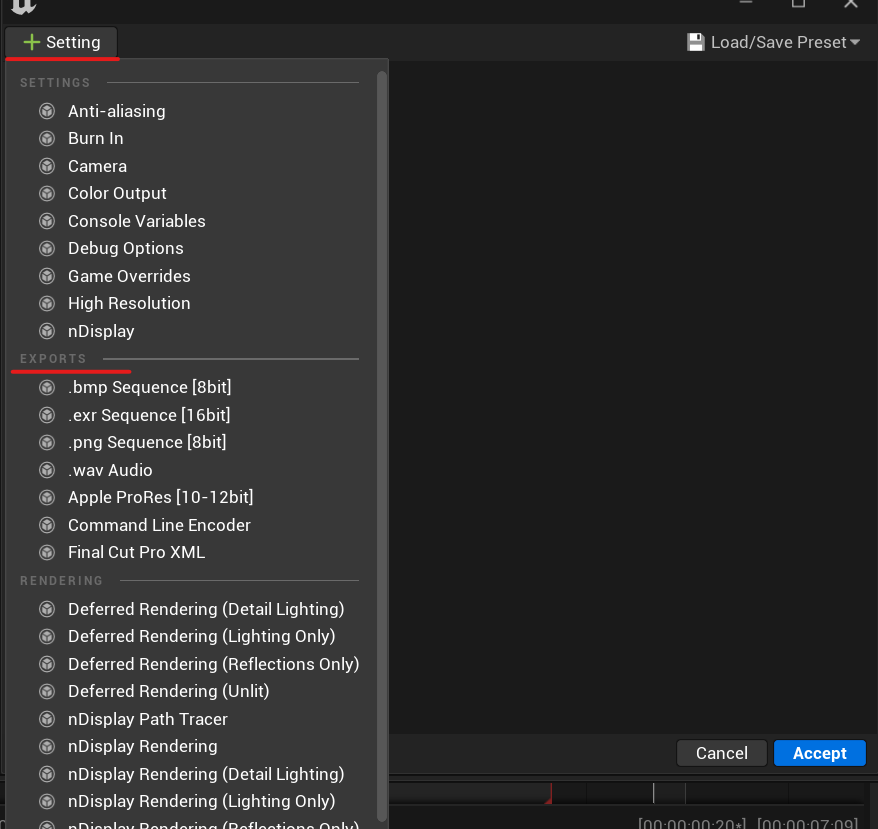

  18. I chose to keep the default *.jpg Sequence*, so that I can combine the frames later. 
  
In the case of an image sequence export, it is important that you keep the '{framenumber}' in the *File Name Format* as it is necessary for it to be in the file name for programs to later combine the frames in the correct order. 

 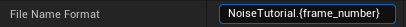

  19. After you are done configuring, you can finally render! Close the Settings window and on the right side of the *Movie Render Queue* window you can also change the *Job Name* to whatever you like and then click **Render (Local)** on the bottom right. 

   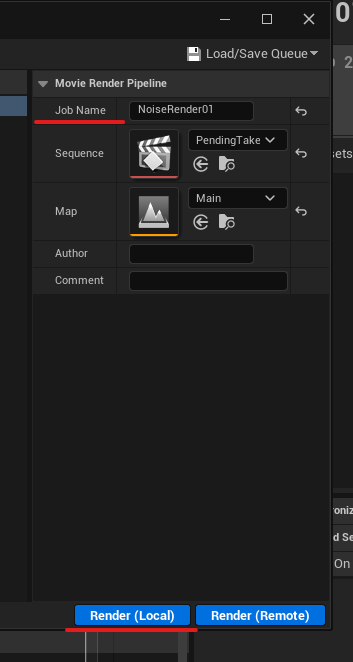
  
  Note: We can ignore **Render(Remote)** as this is for more advanced rendering setups such as render farms - we just want to render locally on our computer.

20. Your Sequence should now start rendering.

 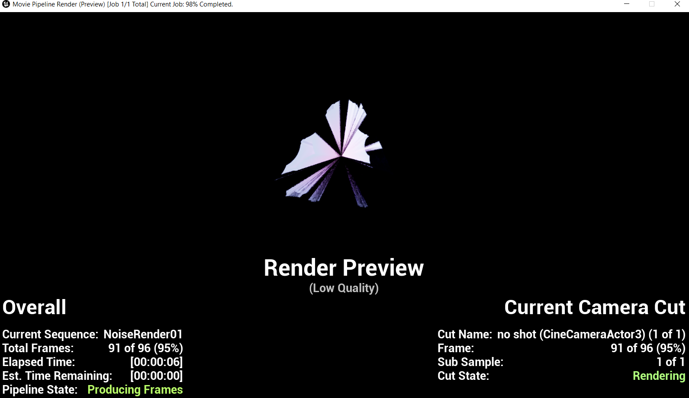

21. As soon as your Rendering is done, you can now navigate to the directory, where your images or video have been exported to. If you chose the *.jpg Sequence* export, you should see a large amount of images within your folder.

 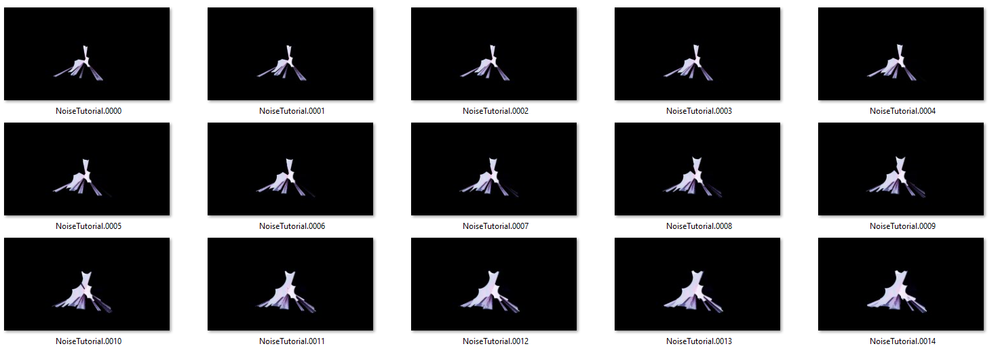

22. Finally, we can combine these images into a video or a gif. There are multiple ways to do this. 

If you have the Adobe Suite, you can use Adobe Premiere or Photoshop to import the images as an [image sequence](https://youtu.be/YTSQVWqII2I). 

You can also use command line tools such as [FFMPEG](https://ffmpeg.org/). Here is a [detailed guide](https://en.wikibooks.org/wiki/FFMPEG_An_Intermediate_Guide/image_sequence) on how to use it and a video tutorial for [Windows](https://www.youtube.com/watch?v=thDma0lO0U8) and [Mac](https://www.youtube.com/watch?v=VP_XBeVqJiE).

Note: In WikiBooks the example image sequence is 3 padded and the default Unreal export is 4 padded, so make sure to change %03d to %04d. 
4 Padded means that the number sequence in your file consists of 4 digits.