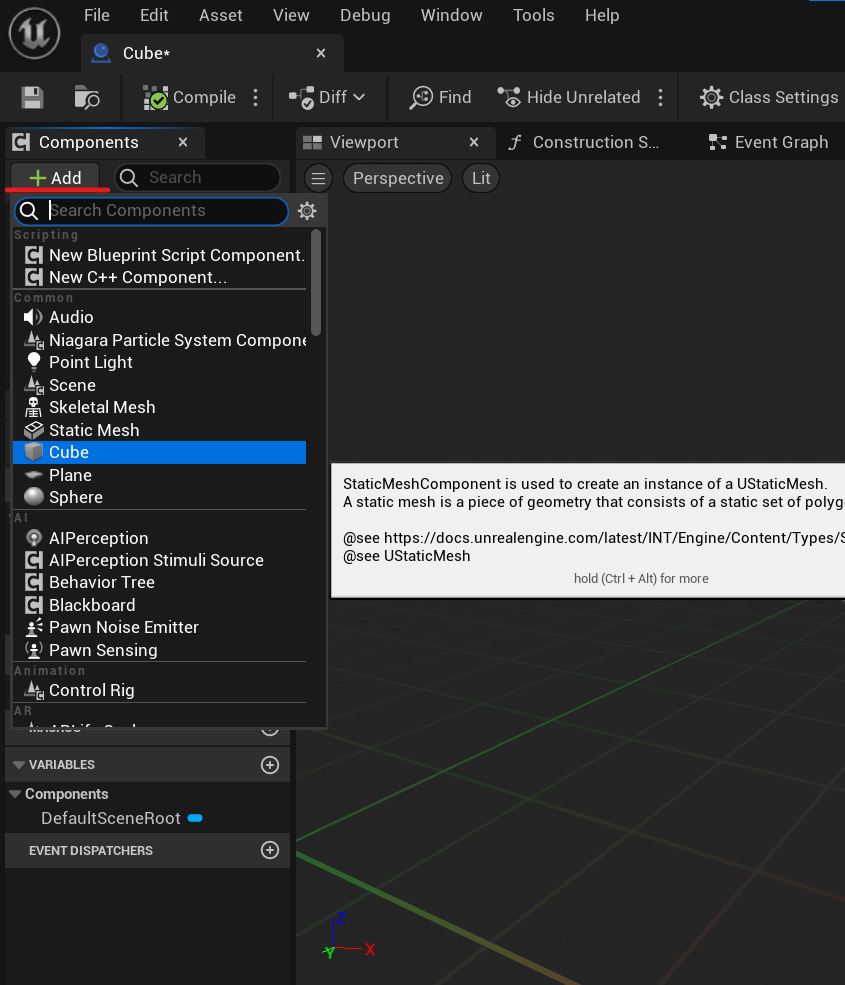
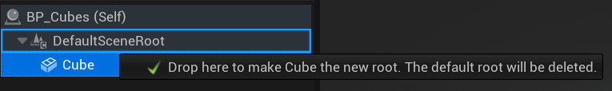
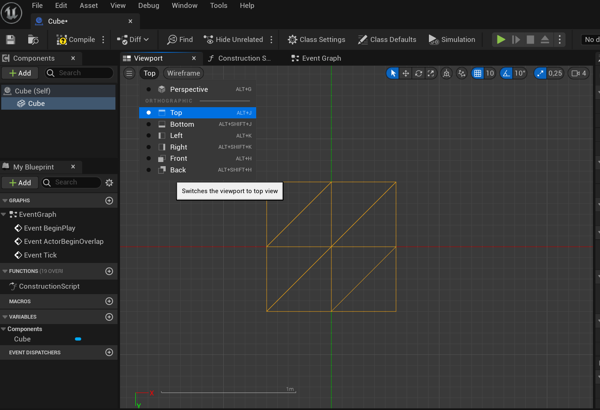

**Procedural Generation and Simulation**  

Prof. Dr. Lena Gieseke \| l.gieseke@filmuniversitaet.de  
Teaching Assistant: Sylvia Rybak \| sylvia.rybak@filmuniversitaet.de

## Tutorial 03 - Fancy Cubes

You can find the Blueprint file in the tutorial folder with the full node set up. (Just drag it into Contents in your Unreal folder)

The tutorial is based off of the [Unreal Engine 5 | Generative Motion Graphics / VFX](https://www.udemy.com/course/ue5-procedural-vfx-motion-graphics/) tutorial by Yu Fujishiro.

All the explanations are based off of the official Unreal Documentation. 

## Scene Set Up:

There is no specific set up for the scene except for the fact that there needs to be a floor. You can choose a scene that already has one set up or create one from a cube. 

## PART I: COMPONENT SET UP

First we will create a Blueprint, which will be where we will be build up the system that produces our simulation. Blueprints are used to define object-oriented (OO) classes or objects in the engine. Blueprint Classes are basically assets that allow us to easily add functionality on top of existing gameplay classes. 

1. Right click in the **Content Browser** and select *Blueprint Class*. Select *Actor* as the parent class. An Actor is simply an object that can be placed or spawned in the world. The object we have created is currently empty and we will fill it up with meshes as interactions in the next steps.

2. Open the Blueprint and add a Cube. This add a cube mesh, which is now contained within our Actor.

3. You’ll see that the cube is automatically parented (or attached) to the **Default Scene Root** Component, making it what we refer to as a “child” component. Actors have a designated a single Scene Component as "root", meaning that the Actor's world location, rotation, and scale are drawn from that Component. The components, which are the children of the Scene Root inherit basic parameters of the parent.

Drag the Cube component over the Default Scene Root. 

This changes the Cube into the Scene Root like in the image below. This means that the cube is now the the Scene Root and the central component of the actor. 

4. Let's make the cube a bit bigger. Within the Cube component (Brick icon), set the scale of the cube to 1.2 on every axis. 

5. Change the view to Top Perspective. 

6. Now we will create anchors points from which the smaller cubes will spawn. We will place them in the middle of each cube subdivision like in the image below. 

To do this add a [Scene Component](https://docs.unrealengine.com/4.27/en-US/ProgrammingAndScripting/ProgrammingWithCPP/UnrealArchitecture/Actors/Components/) to your blueprint. (with the Add button like the Cube before). Name it 'P1'.

A Scene Component supports location-based behaviors that do not require a geometric representation. Their position is defined by a transform class, which contains the location, rotation, and scale of the Component. It currently just an empty vessel, which which we will use to anchor the position from which the smaller cubes will spawn. 

[From the [Unreal Documentation](https://docs.unrealengine.com/4.27/en-US/ProgrammingAndScripting/ProgrammingWithCPP/UnrealArchitecture/Actors/Components/#:~:text=A%20Scene%20Component%20is%20an,and%20scale%20of%20the%20Component.)]

7. Grab and move the **Scene** component to the position of one of the points from the drawing above. We have to make sure that its location is **exactly** in the middle, so make sure the location values are precise and the number are rounded. 

The scale should be set to 0,5 on all axes, this means that the cubes that spawn in this position will inherit the scale of the Scene component and be half the size of the original cube.

8. Following the previous step, create 3 more Scene components (P2, P3, P4) and place them in the remaining 3 positions on the cube, following the sketch in Step Make sure their scale is also set to 0,5. 

9. Next, copy these 4 components (Cmd/Ctrl+C) and paste them (Cmd/Ctrl+V) underneath. 

10. While you still have ALL the 4 new components selected, change their Z value to -25. This will move the 4 anchor points down on the Z axis, so that the cube is divided 3-dimensionally and not just from the top. 

11. Compile the Blueprint. 

## PART II: EVENT BEGIN PLAY

1. Next, open the **Event Graph** tab in this Blueprint and delete all other nodes except for the *Event BeginPlay*. This node triggers events within the actor as soon as one starts playing the game. Next, drag and drop all of the newly created Scene Components (P1-P8) into the node area. 

2. Add a *Make Array* node and plug in all the components. You can add pins by pressing the *Add pin* button on the right side of the node. Now all the components are all stored together in a single array.

3. Blueprints also use [Variables](https://docs.unrealengine.com/5.1/en-US/blueprint-variables-in-unreal-engine/) to hold a value or reference an Object or Actor in the world. On the bottom left, you can see the **Variables** section, where variables which reference the components (P1-8) have been automatically created. Duplicate one of the component variables and rename it to 'Spawn Location'. Next, change the variables Container Type to *Array*, by pressing the downwards facing arrow on the right side of *Variable Type* in the **Details** browser on the right. 

4. Drag and drop your new variable into the graph and select *Set Spawn Location*. Get is used for retrieving a value and Set is used for assigning a value to variables. We want to assign the values from our newly created array to our new variable. 
As we plug in the Array node, the variable now holds all the values of the array we have just created. 
Connect the *Event BeginPlay* to this node as well.

5. Next, we need to define a value of the a maximum amount of times the new cubes can spawn, so that the spawning does not happen infinitely and crash the engine.

Create a new variable, name it 'MaxDivisions' and set it's type to *integer*. This integer will be the maximum of times the new cubes will spawn from a larger cube. 

 Make sure its Container type is *Single*, as we just need a single numerical value for this.

 
 
Drag the variable into the Event Graph and select *Set MaxDivisions*. Connect it to the Spawn Locations node. Set the value to 3 for the time being. This means the cubes will not spawn more than three times in a row.

6. Add a [*Branch*](https://docs.unrealengine.com/5.1/en-US/BlueprintAPI/Utilities/FlowControl/Branch/) node and attach it to the Max Divisions node. This allows us to trigger events based on whether the result of a boolean is true or false. Promote the *Condition* (this will be the true or false statement that triggers the event) of the branch to a variable by right clicking the *Condition* pin and selecting *Promote to Variable*. 

7. Select the newly created variable and rename it to IsThisFirstCube. Here we will be asking the question: 'Is this the first cube?'. Based on whether this is true or not, we will trigger a different event. 

Change the Default Value of the boolean to false. (Untick the checkbox under **Default Value** in the details of the variable). It will be explained later why we have done this.

 
8. Now, we will make the variable externally editable by clicking the closed eye icon next to it's name in the Variable browser. 

 

9. Compile the blueprint and close the window to return to your scene. Drag the blueprint into the scene. Make sure the cube is laying on top of the floor.

10. If it is not selected, click on the cube in your scene. In the details on the right, you should be able to see the promoted variable. Tick the box next to it's name. 

This means, that the original cube that is placed in the scene is now marked as the first cube. However, we set the default value of the IsThisFirstCube variable in our event graph to false, which means all the newly spawned cubes after this one will have a false value.
This means, when the question "Is the first cube?" is asked, the answer after the first run, will always be "no". 
This allows us to differentiate between the first cubes and all the new ones that are created.

## PART III: START SPLIT EVENT

1. Return back to the Cube blueprint's Event Graph.

2. Create an **Custom Event Node** in any place in the Event Graph by typing 'Add Custom Event' into the search bar and hitting Enter. Rename it to 'Start Split'.
[Custom Events](https://docs.unrealengine.com/5.1/en-US/custom-events-in-unreal-engine/) define an entry point for the execution of an individual network, but are not executed based on being called from code. Instead, they rely on some other part of the EventGraph to explicitly execute them using a Custom Event call. We will call this event from out initial node set up, which stems from Event Begin Play. Our 'Start Split' event, will be used to trigger another series of nodes, which we will create in the next steps. 

3. For now, let's return to the previous node set up we started and create a node layout like below. Try to recreate the image and follow this condensed list of steps:

- Right click and start typing 'Start Split'. This will create a call of the Start Split event, which is currently still empty. Connect it to the *True* pin in the *Branch* node. 
- Add an [**Add Impulse**(Cube)](https://docs.unrealengine.com/5.1/en-US/BlueprintAPI/Pawn/Components/CharacterMovement/AddImpulse/) node and check *Vel Change* (red pin). Impulses need to be fired from a Blueprint, and apply their entire force in only one frame. It is a physics force, that will make our cubes make a little 'jump' as they spawn. 
- Create a **Random Unit Vector** node.
- Create a New Variable, change it's type to a *float*, rename it to 'Impulse Scalar'. 
- Drag and drop it into the graph and select *Get Impulse Scalar*. Select the node and set it's Default value to 100. (This influences how much the cubes will 'jump' as they spawn)
- Create a **Multiply** node and multiply the Random Unit Vector by the *Impulse Scalar* variable. 
- Add another **Start Split** node and connect it to the Add Impulse node. 

With this node set-up, every cube subdivision after the first one, will have a little 'jump', which will make the new cubes fall in a more interesting way.

4. Now, starting from our Start Split event node, recreate the node set up from the image below, here are the nodes you have to add:

-  A new integer variable called 'Generation'.
This will indicate the generation of the spawned cubes (The first cube would be the 1st Generation, the next 4 cubes would be 2nd Generation and so on). Drag it into the graph and select *Get*.

-  Add an **Increment Int** node and a **Less Equal** node. 

- Another reference to the Max Divisions (Drag in MaxDivisions from the **Variables** section on the left and select *Get MaxDivisions*)

- Another **Branch Node**

What this node setup does is that it that it increments the value of the 'Generation' variable by 1 (hence the Int) every time the *Start Split* event is called. Then, it checks whether the generation number is equal to or smaller than the Maximum division number we set before. Based on whether the Max Division number has been reached, the branch node will trigger another series of nodes.  

5. Add a new function by clicking the small + next to the **Functions** section name on the left.  

6. This should open a new tab. Rename the function to 'DisableParent'.

7. Set up the nodes within the function like in the image below. The purpose of this function is to disable all collision settings, so that all the smaller cubes can respawn as if the previous cube did not exist. 

All nodes have the original Cube component set as the target. (It will also become automatically appended when you create the nodes, I just use one for all the nodes for a cleaner)

Make sure to compile after the nodes have been set up. 

8. Now, return to your Event Graph and drag the function into the graph (from the **Functions** section on the left side of the screen).

9. Now, we will add another **Custom Events** nodes and name it 'SpawnCubes'. We will set up our nodes to trigger this event.   

10. Continue adding and arranging nodes like in the image below. The *Disable Parent* function we created earlier should be plugged into the Delay node now. Also, we will add a call to the Spawn Cubes event we have just created. (Right click and type 'Spawn Cubes')

We have now set up the nodes, so that if the generation number is below the limit, this sequence will make the cubes spawn (Spawn Event) with a delay of between 1 to 4 seconds (Values in the Random Float in Range Node). This will make the spawning times randomized to make the simulation more interesting. 

11. Compile and save!

## PART II: SPAWNING EVENT

Now we will set up the Spawn Event that makes the new, smaller cubes spawn. 

1.  In order to spawn the cubes, we have to use the array we in the very first steps. Once again drag the *SpawnLocations* variable into the Event Graph and select *Get SpawnLocations*. 

2. We are goint to use a For-each loop to spawn the the new cubes, so attach a **For Each Loop** node to the array variable. Plug *SpawnCubes* into the Exec pin like in the image below. 

8. Now add a **Spawn Actor from Class** node. This node will spawn new Actors with settings that we will apply in the next steps. Select the name of your blueprint as the class, since it will be spawning itself. 

9. Grab the *Array Element* pin in your **For Each Loop** node. Start dragging and you will see a line extending from it. Release and when a search window pops up, search for Relative Scale 3D. Select *Get Relative Scale 3D*. 

10. Now, we are going to Multiply the Relative Scale of the Cube components we have created by the scale of the larger cube. Add a *Get Actor Scale 3D* node (which returns us the scale of the cube which is currently in the scene). 

11. Finally, we have to apply this to the spawned cubes. For this we will use a **Make Transform** node. We also have to plug in the location and rotation of the array elements into the transform, so that the values are not defaulted back to zero. To do this, set up the nodes like in the image below:

When you select Get World Location and Rotation, you can select any Component name. Next, delete it and plug in Array Element from your For Each Loop node. 

12. Click on the *Generation* variable we have created in the beginning (in the **Variables** section on the left) and in its detail section check *Expose on Spawn*. Expose on Spawn is very useful when you want to initialize an internal variable before BeginPlay is called. 

Enable *Instance Editable* as well - this option allows the variable to be editable on any instance of the blueprint

13. To apply these changes, compile the Blueprint.

14. Right click the **Spawn Actor** node and select *Refresh Node*. You should have a new position called *Generation* appear on your node, since we enabled for it to be editable in the blueprint. Plug in the Generation variable reference node here. 

We set it up this way so that the new cubes that have spawned, receive the updated Generation value, so that they are not labelled as the first generation every time they spawn. 

15. In the SpawnActor node, also change the *Collision Handling Override* to *Always Spawn, Ignore Collisions*. This means we will spawn the cubes no matter if they are intersecting or not, which will prevent the cubes from not forming.

16. We also have to make sure the initial cube dissapears, once the new cubes have spawned. Add a **Destroy Actor** node to the *Completed* position in the **For Each Loop** as in the image below. 

17. We are almost done! This is our full Event Graph now:

18. We also have to enable physics in our cube system. 

Select the Cube Scene Root, in the components on the right, enable *Simulate Physics* and set *Linear and Angular Damping* to 1. 

[Linear Damping](https://docs.unrealengine.com/4.27/en-US/InteractiveExperiences/Physics/FrictionRestitutionAndDamping/) controls how much the Physics Body or Constraint resists translation, and Angular Damping controls how much they resist rotating. 

19. As an additional step for improving performance, click **Class Defaults** on the top of the blueprint window.

In the details section on the right, under **Actor Tick** untick the first box *Start with Tick Enabled*. Since our blueprint does not require ticks to function, it is ideal to disable it altogether. If you want to know what ticking is, you can read about it in the [Documentation](https://docs.unrealengine.com/5.1/en-US/actor-ticking-in-unreal-engine/).

20. Compile and exit your blueprint. 

21. Press play in the scene and hopefully the cubes are now subdividing. 

22. To make the cubes a bit more varied, we can also randomize the amount of times the cubes break down. To do this, we would randomize the number of generations each cube would produce. Within your Cube Blueprint simply attach node Random Integer in Range to the MaxGeneration value and set the values between 2 and 4. Compile again.

23. After adding some materials and modifying the scene, here is my final result: 

## Additional Optimization:

Here are some additional settings you can apply in your physics settings within the Blueprint, to optimize your simulation:

1. Sleep Settings

2. Collision Settings

