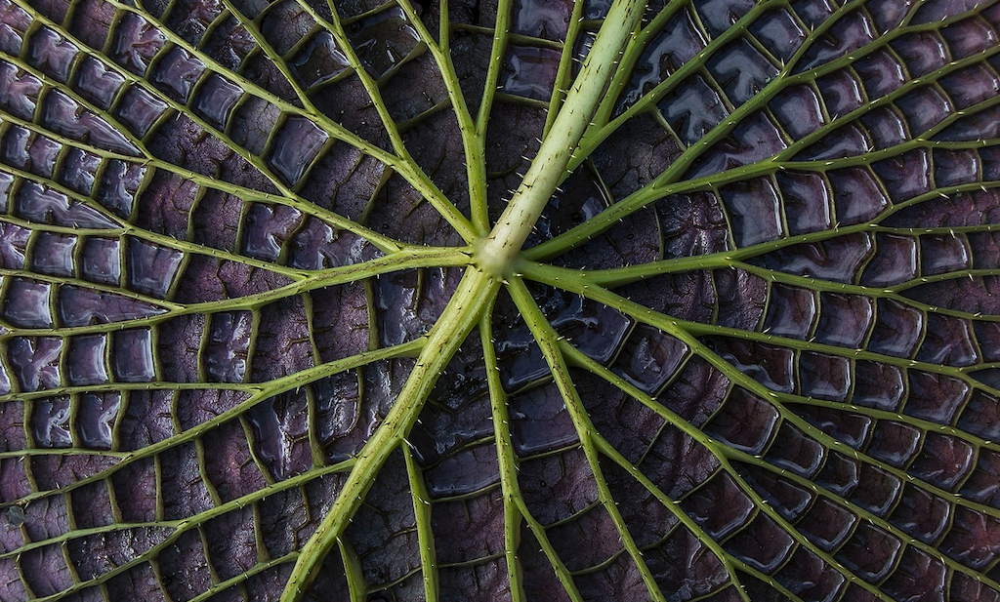
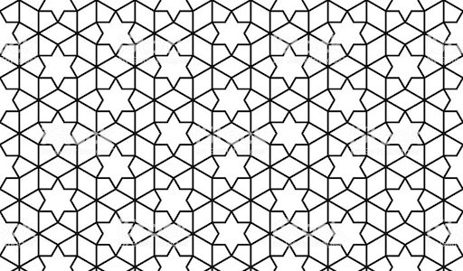
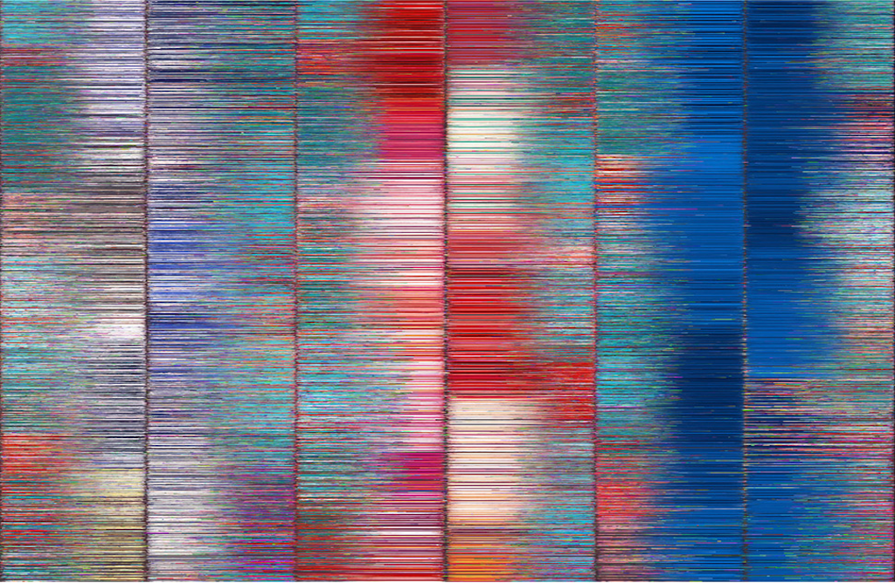
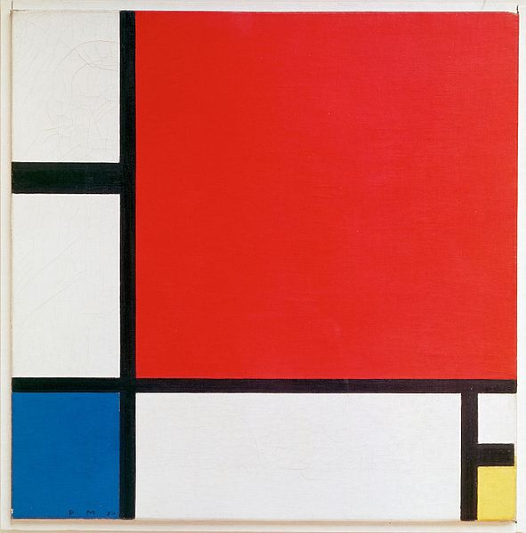
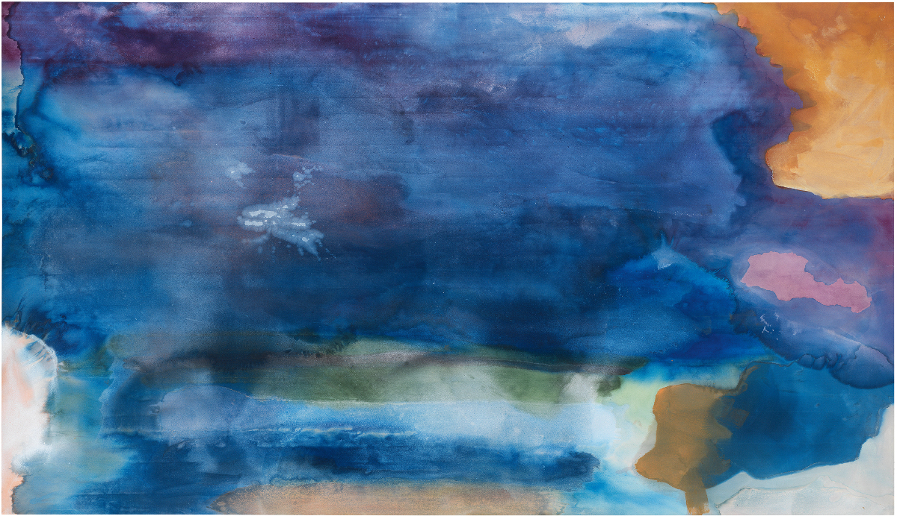
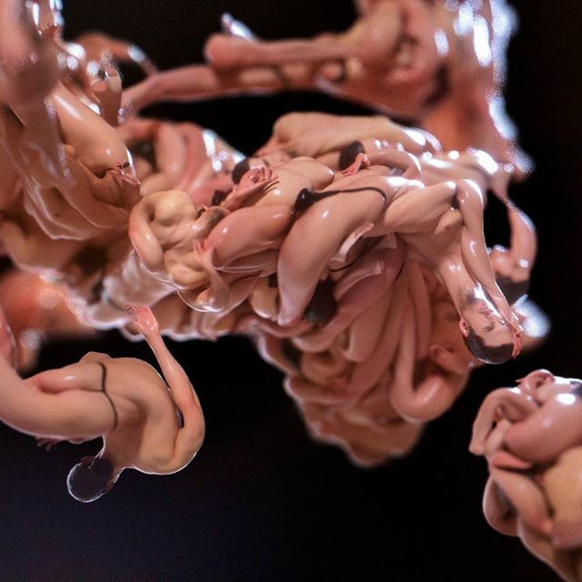
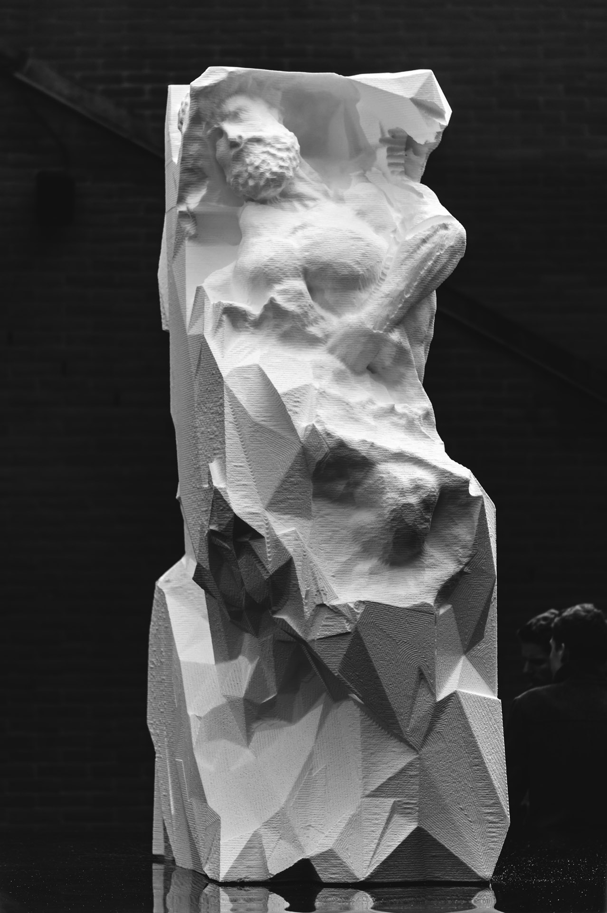
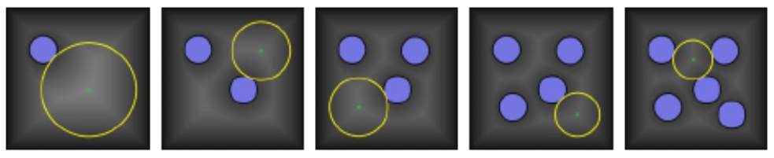
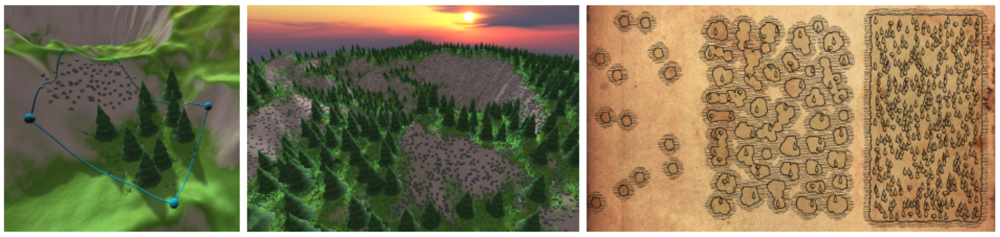

# Procedural Generation and Simulation

Prof. Dr. Lena Gieseke \| l.gieseke@filmuniversitaet.de \| Film University Babelsberg KONRAD WOLF


# Chapter 01 - Introduction


* [Procedural Generation and Simulation](#procedural-generation-and-simulation)
* [Chapter 01 - Introduction](#chapter-01---introduction)
    * [Topics](#topics)
    * [Learning Objectives](#learning-objectives)
    * [Pattern](#pattern)
        * [Repetitive Structures](#repetitive-structures)
        * [Ubiquitous](#ubiquitous)
        * [From Natural to Man-Made](#from-natural-to-man-made)
        * [Self-similarity](#self-similarity)
        * [Fractals](#fractals)
        * [Abstracted Pattern](#abstracted-pattern)
    * [Abstraction](#abstraction)
        * [Abstraction in Art](#abstraction-in-art)
            * [Timeline of Abstraction](#timeline-of-abstraction)
            * [Abstract Expression](#abstract-expression)
            * [Mixed](#mixed)
        * [Abstracted Artistic Expression in CGI](#abstracted-artistic-expression-in-cgi)
            * [Reinterpreting Human Forms](#reinterpreting-human-forms)
            * [Forms and Textures](#forms-and-textures)
            * [Geometric Forms](#geometric-forms)
            * [Summary of Artists](#summary-of-artists)
    * [Pattern Generation](#pattern-generation)
        * [Example](#example)
        * [History](#history)
            * [Academia](#academia)
            * [Demoscene](#demoscene)
        * [Advantages](#advantages)
        * [Disadvantages](#disadvantages)
        * [Generation Models](#generation-models)
            * [Stochastic](#stochastic)
            * [Function-based](#function-based)
            * [Rule-based](#rule-based)
            * [Grammar-based](#grammar-based)
            * [Additional Models](#additional-models)
            * [Summary](#summary)
        * [Procedural Generation in Praxis](#procedural-generation-in-praxis)
            * [Examples](#examples)
    * [Simulation](#simulation-1)
        * [Particle Systems](#particle-systems)
        * [Agents](#agents)
        * [VFX](#vfx)
        * [Artistic Application](#artistic-application)
    * [Next](#next)
    * [References](#references)


## Topics

* Pattern in nature and abstracted
* Procedural generation
    * What is it
    * Advantages and disadvantages
    * Different techniques
* Simulation
* Houdini

## Learning Objectives

* The recognition of suitable design goals
* An understanding of what a procedural technique is and what it is capable of
* An broad overview of approaches

## Pattern

In this lecture we will focus on patterns in all shape and forms. Patterns can not only be found in designs such as the famous islamic patterns but also in nature - be it visually or on a structural level. So, let's start with thinking about pattern some more.

Question: *What is a pattern?*

### Repetitive Structures

Repetitive structures that follow some sort of creation principles.

Benoît Mandelbrot (we will come back to him in a second) said for example:

> Bottomless wonders spring from simple rules, which are repeated without end.

### Ubiquitous

Patterns are ubiquitous in our world, from galaxies to molecular micro-patterns.

  
[[room.eu.com]](https://room.eu.com/news/astronomers-detect-a-trio-of-unusual-dwarf-galaxies-in-the-voids-of-the-cosmic-web)

Above an image of the 'cosmic web', the large scale structure of the universe. Each bright knot is an entire galaxy, while the purple filaments show where material exists between the galaxies.

  
[[beyondthehumaneye]](https://beyondthehumaneye.blogspot.com/2010/12/sticky-jack.html)

The above image shows a cross section of the stem of the plant commonly known as goosegrass or sticky Jack and more scientifically as Galium aparine. This image was produced using fluorescence microscopy, staining the cells with compounds that bind to the cell walls and fluoresce.

Or, due to recent events:

[[How C.D.C. medical illustrators created the coronavirus pandemic’s most iconic image - NYTimes]](https://www.nytimes.com/2020/04/01/health/coronavirus-illustration-cdc.html)

*On a side note*: If you are interested in scientific micro-scale visualization this [Nerd Chat: Dr. Jeroen Claus - Covid, Proteins, Visualisation](https://www.youtube.com/watch?v=qxIbzABH4PU&t=506s) is interesting. And if you want to go straight to Houdini, you can complete the [Guest Tutorial: Dr. Jeroen Claus - Rendering The Corona Virus' Spike Protein](https://www.youtube.com/watch?v=M3ldQBVb-ZA&t=3s).


### From Natural to Man-Made

Patterns can be natural as well man-made.


  
[[boredpanda]](https://www.boredpanda.com/geometry-symmetry-plants-nature/?utm_source=google&utm_medium=organic&utm_campaign=organic)

  
[[reddit]](https://www.reddit.com/r/pics/comments/4c9zey/ceiling_of_the_abencerrajes_room_la_alhambra_spain/)


  
[[boredpanda]](https://www.boredpanda.com/geometry-symmetry-plants-nature/?utm_source=google&utm_medium=organic&utm_campaign=organic)


Repetitive structures in nature come in countless forms. 

  
[[robin-noorda]](https://www.robin-noorda.com/structure-in-nature.html)  
  
[[robin-noorda]](https://www.robin-noorda.com/structure-in-nature.html)  
  
[[robin-noorda]](https://www.robin-noorda.com/structure-in-nature.html)  
  
[[robin-noorda]](https://www.robin-noorda.com/structure-in-nature.html)  
  
[[robin-noorda]](https://www.robin-noorda.com/structure-in-nature.html)  
  
[[robin-noorda]](https://www.robin-noorda.com/structure-in-nature.html)  
  
[[wired / getty images]](https://www.wired.com/2015/09/absurd-creature-of-the-week-crusty-nautilus/)  
  
[[tcpermaculture]](https://tcpermaculture.blogspot.com/2012/04/permaculture-plants-wild-angelica.html)  


### Self-similarity

One of the most prominent pattern principles is self-similarity:

  
[Turbosquid, Ales Rajar](https://www.turbosquid.com/3d-models/rocky-mountain-ready-3d-model/654659)
  
[[robin-noorda]](https://www.robin-noorda.com/structure-in-nature.html)  
  
[[robin-noorda]](https://www.robin-noorda.com/structure-in-nature.html)  

Question: *Based on these images, how would you describe self-similarity?*

Question: *What is the creation rule of the following example?*

  
[[wiki]](https://en.wikipedia.org/wiki/Koch_snowflake)  
  
[[stackexchange]](https://tex.stackexchange.com/questions/404925/animated-koch-snowflake)  

In mathematics, a self-similar object is exactly or approximately similar to a part of itself (i.e., the whole has the same shape as one or more of the parts). Many objects in the real world, such as coastlines, are statistically self-similar: parts of them show the same statistical properties at many scales.

### Fractals

In maths, probably the most famous self-similar structure are fractals, e.g. the Mandelbrot set.


  
[[Wiki]](https://en.wikipedia.org/wiki/Mandelbrot_set)  

If you are interested in how these patterns are created, I recommend this [The Mandelbrot Set - Numberphile](https://www.youtube.com/watch?v=NGMRB4O922I) video.

By the way, this is Benoît B. Mandelbrot, the French and American mathematician, who is considered to be the father of fractal geometry:

  
[[thepassengertimes]](https://thepassengertimes.com/2010/06/27/benoit-mandelbrot/)

I also recommend Mandelbrot's [TED Talk - Fractals and the art of roughness](https://www.ted.com/talks/benoit_mandelbrot_fractals_and_the_art_of_roughness).

Even though mathematical sets such as the Mandelbrot set are stunningly beautiful, they are very limited in their designs, meaning, you can't really adjust them flexibly. They look how they look and that is that. This is the reason why we are not spending more time on these beautiful but limited structures.


### Abstracted Pattern

  
[[istockphoto]](https://www.istockphoto.com/de/vektor/arabic-background-repetitive-background-islamic-vector-grid-texture-islam-seamless-gm618530772-107646989)  
  
[[123rf]](https://www.123rf.com/photo_30452572_stock-vector-curvy-waves-repetitive-pattern-vector-texture-background.html)  
   
[[colourbox]](https://www.colourbox.com/vector/repetitive-violet-pattern-vector-4908641) 
[[colourbox]](https://www.colourbox.com/vector/floral-victorian-seamless-pattern-abstract-texture-repetitive-vector-art-illustration-vector-1941617)  
  
[[gulenmovement]](http://www.gulenmovement.com/gulens-rethinking-of-islamic-pattern-and-its-socio-political-effects-2.html)  
  
[[artlebedev]](https://www.artlebedev.com/pattern/monkeys-and-peaches/)  

   
[[artlebedev]](https://www.artlebedev.com/pattern/tansy/) [[artlebedev]](https://www.artlebedev.com/pattern/rustle/)

You can also pursue pattern generation with a more artistic motivation, as the artist [Holger Lippmann](http://e-art.co/) does:

  
  
  
  
  

Or the famous Keith Haring art / pattern:

  
[[artsper]](https://www.artsper.com/en/contemporary-artworks/print/183841/sans-titre)  

  
[[ebay]](https://www.ebay.de/itm/264460580065)


Last but not least, if you still need a motivation for learning about pattern designs, watch the music video [Major Lazer – Light it Up (feat. Nyla & Fuse ODG)](https://www.youtube.com/watch?v=r2LpOUwca94):

[](https://www.youtube.com/watch?v=r2LpOUwca94)

## Abstraction

### Abstraction in Art

Ideally, we want to use patterns as elements for an overall artistic or *design goal*. I personally love patterns visually so much that creating an interesting pattern is often enough already full-filling to me.  

However, I would like to encourage you to think about a bigger context - maybe even *meaning* - for your work. Ideally, patterns and the design elements we are going to learn in this class, will be elements for a larger creative design goal, which you set with *intention* and *reflection*.

Please don't be worried about being *artistic*. I do not expect from you to be artistic - but *creative*. What is the difference? Well, you need to be creative to be artistic but you can be creative without being artistic - now, it is clear right 😁? For this lecture, I think it will become clear in regard to the results of our work. 

*On a side note:* If you are more interested in creating tools for others to be creative and artistic, and you do not necessarily want to be the artist yourself, I believe our upcoming creative tasks will also be beneficial to you as they make you understand your "clients" better.

To me, an artistic piece conveys meaning and / or emotion beyond an immediate practicability or aesthetic. I do want to encourage you to think about these aspects. However in this class it is completely fine to come up with results that simply look good / interesting / the way you want. Hence, we focus on the *aesthetics*. But to come up with these, I expect intention and reflection from you.

Also, what I am trying to say is that we are now going to have a brief look into abstractions in art because it can be a great inspiration (and because we strive to be *academics*, right?). But I don't expect from you this level of work.


#### Timeline of Abstraction

In art, abstraction came to live when artists moved away from visually representing reality in a literal fashion. All through history, art has been complex with different levels meaning. However, up until a certain time, artists transported meaning with visuals that did aim to replicate reality.

With the start of the last century, artists broke with visuals from reality and became more and more *non-representational*. Also, in terms of meaning artist broke free and did not aim to convey a certain, specific *subject matter* anymore. Instead, artist rely on form, color, or technique to engage the viewer on a more *intuitive* level.

*On a side note I:* I am always looking for interesting female artists. However, they are hardly represented in art history. If you know of any female artist whom I could include, please let me know!

*On a side note II*: The following exploration is from a purely European-centric perspective! The is also much to explore regarding abstraction within other cultures!

*On a side note III*: Most of the texts about art styles come straight out of Wikipedia (I forgot to put links, mea culpa).

##### Early Abstract Art

###### Fauvism

Fauvism as a style began around 1904 and continued beyond 1910, lating only a few years. The name comes from *fauves* meaning *wild beasts*. It was still representational but more and more emphasized painterly qualities, such as bold colors, coming straight from the tube or exposing the canvas. Artist rendered their subjects to portray emotion, rather than representation. Key artists are Henri Matisse, André Derain and  Maurice De Vlaminck.

  
[[Luxe, Calme et Volupté, Henri Matisse, 1904]](https://en.wikipedia.org/wiki/File:Matisse-Luxe.jpg)

  
[[La jetée à L'Estaque, André Derain, 1906]](https://en.wikipedia.org/wiki/File:Andr%C3%A9_Derain,_1906,_La_jet%C3%A9e_%C3%A0_L%27Estaque,_oil_on_canvas,_38_x_46_cm.jpg)  

  
[[Paysage au disque, Robert Delaunay, 1906–07]](https://en.wikipedia.org/wiki/Robert_Delaunay)  

  
[[The Seine at Chatou, Maurice de Vlaminck, 1906]](https://en.wikipedia.org/wiki/Robert_Delaunay)

###### Cubism

Cubism revolutionized during the 1910s and throughout the 1920s European painting and sculpture, and inspired related movements in music, literature and architecture. It remains representational but forms appear fragmented. Artists attempt to show multiple sides of an object and reject the recreation of perspective, and realistic shading. Key artists are Pablo Picasso and Georges Braque.

  
[[Girl with a Mandolin, Pablo Picasso, 1910]](https://en.wikipedia.org/wiki/File:Pablo_Picasso,_1910,_Girl_with_a_Mandolin_(Fanny_Tellier),_oil_on_canvas,_100.3_x_73.6_cm,_Museum_of_Modern_Art_New_York..jpg)  

  
[[La Source, Francis Picabia, 1912]](https://en.wikipedia.org/wiki/File:Francis_Picabia,_1912,_La_Source,_The_Spring,_oil_on_canvas,_249.6_x_249.3_cm,_Museum_of_Modern_Art,_New_York._Exhibited,_1912_Salon_d%27Automne,_Paris.jpg)

  
[[Rhum et guitare, Georges Braque, 1918]](https://en.wikipedia.org/wiki/File:Georges_Braque,_1918,_Rhum_et_guitare,_oil_on_canvas,_60_x_73_cm,_Abell%C3%B3_Collection,_Madrid.jpg)  

  
[[Portrait of Josette, Juan Gris, 1916]](https://en.wikipedia.org/wiki/File:Portrait_of_Josette_1916_Juan_Gris.jpg)


###### Futurism

Cubism contributed to the formation of the Italian artistic style of *Futurism*, an artistic and social movement that sought to break every known rule of art. While still representational, the style emphasizes speed and visualizing movement. You can go as far as saying futurists fetishized speed, technology, violence and industrialization and many of them are said to be fascists. Key artist are Joseph Stella, Umberto Boccioni and Giacomo Balla.


  
[[Giacomo Balla, Dynamism of a Dog on a Leash, 1912]](https://en.wikipedia.org/wiki/File:Giacomo_Balla,_1912,_Dynamism_of_a_Dog_on_a_Leash,_oil_on_canvas,_89.8_x_109.8_cm,_Albright-Knox_Art_Gallery.jpg)  

  
[[Joseph Stella, Brooklyn Bridge, 1919-20](https://en.wikipedia.org/wiki/File:Joseph_Stella,_1919-20,_Brooklyn_Bridge,_oil_on_canvas,_215.3_x_194.6_cm,_Yale_University_Art_Gallery.jpg)

  
[[The City Rises, Umberto Boccioni, 1910]](https://en.wikipedia.org/wiki/File:Georges_Braque,_1918,_Rhum_et_guitare,_oil_on_canvas,_60_x_73_cm,_Abell%C3%B3_Collection,_Madrid.jpg)  

##### Pure Abstraction

###### Hilma af Klint

Even though Kandinsky is commonly considered to be the first artist of the modern era to abandon representational imagery, Hilma af Klint's abstract work predates the first purely abstract compositions by Kandinsky. Her paintings, which sometimes resemble diagrams, were a visual representation of complex spiritual ideas.

  
[[Primordial Chaos, No. 16, 1906-07]](https://medium.com/as-mag/modern-mystic-hilma-af-klint-c4ef6c27467c)  

  
[[Group V, The Seven-Pointed Star, 1908]](https://medium.com/as-mag/modern-mystic-hilma-af-klint-c4ef6c27467c)  


  
[[Group IV, The Ten Largest, 1907]](https://medium.com/as-mag/modern-mystic-hilma-af-klint-c4ef6c27467c)

###### Wassily Kandinsky

Next to his paintings, Kandinsky put his thoughts and reflections in theoretical writings on art. Kandinsky saw the communication between artist and viewer as being available to both the senses and the mind. Also, Kandinsky had synesthesia and heard tones and chords as he painted and music served as a big inspiration to his visual forms.

  
[[Composition, Wassily Kandinsky, 1913]](https://en.wikipedia.org/wiki/File:Vassily_Kandinsky,_1913_-_Composition_7.jpg)

  
[[On White II, Wassily Kandinsky, 1923]](https://en.wikipedia.org/wiki/File:Vassily_Kandinsky,_1923_-_On_White_II.jpg)  

  
[[Several Circles, Wassily Kandinsky, 1926](https://en.wikipedia.org/wiki/File:Vassily_Kandinsky,_1926_-_Several_Circles,_Gugg_0910_25.jpg)

  
[[Inner Alliance, Wassily Kandinsky, 1929]](https://en.wikipedia.org/wiki/File:Wassily_Kandinsky_-_Inner_Alliance_-_1929.jpg)  


###### De Stijl

De Stijl was a Dutch art movement founded in 1917, aiming to abstract through the reduction to the essentials of form and colour. The style is famous for its flat colors with no shading or modeling and geometric shapes. Key Artists are Theo van Doesburg and Pier Mondrian.

  
[[Counter composition XIII, Theo van Doesburg , 1925-1926]](https://en.wikipedia.org/wiki/File:Vassily_Kandinsky,_1923_-_On_White_II.jpg)  

  
[[Composition II in Red, Blue, and Yellow, Piet Mondriaan, 1930]](https://en.wikipedia.org/wiki/File:Piet_Mondriaan,_1930_-_Mondrian_Composition_II_in_Red,_Blue,_and_Yellow.jpg)

  
[[Composition 10, Piet Mondriaan, 1939-1942]](https://en.wikipedia.org/wiki/File:Piet_Mondriaan,_1939-1942_-_Composition_10.jpg)  

###### Suprematism

Suprematism is an art movement focused on basic geometric forms, such as circles, squares, lines, and rectangles, painted in a limited range of colors. Emphasis is put on the relationships between shapes and bordes of canvas. The key artist is Kazimir Malevich.

  
[[Suprematist Composition- White on White, Kazimir Malevich, 1918]](https://en.wikipedia.org/wiki/File:Pablo_Picasso,_1910,_Girl_with_a_Mandolin_(Fanny_Tellier),_oil_on_canvas,_100.3_x_73.6_cm,_Museum_of_Modern_Art_New_York..jpg)  

  
[Quadrato rosso, Kazimir Malevich, 1915](https://en.wikipedia.org/wiki/File:Francis_Picabia,_1912,_La_Source,_The_Spring,_oil_on_canvas,_249.6_x_249.3_cm,_Museum_of_Modern_Art,_New_York._Exhibited,_1912_Salon_d%27Automne,_Paris.jpg)

  
[[Eight Red Rectangles, Kazimir Malevich, 1915]](https://en.wikipedia.org/wiki/File:Georges_Braque,_1918,_Rhum_et_guitare,_oil_on_canvas,_60_x_73_cm,_Abell%C3%B3_Collection,_Madrid.jpg)  

  
[[Suprematist Composition, Kazimir Malevich, 1915]](https://en.wikipedia.org/wiki/File:Portrait_of_Josette_1916_Juan_Gris.jpg)

#### Abstract Expression

##### Action Painters

Action painting is a style of painting in which paint is spontaneously dribbled, splashed or smeared onto the canvas, rather than being carefully applied. The resulting work often emphasizes the physical act of painting itself as an essential aspect of the finished work or concern of its artist. Key artist are  Jackson Pollock, Franz Kline, Lee Krasner and Willem de Kooning.

  
[[Vawdavitch, Franz Kline, 1955]](https://www.artsy.net/artwork/franz-kline-vawdavitch)  

  
[[Untitled XXII, Willem de Kooning, 1977](https://www.artnews.com/art-news/market/sothebys-de-kooning-contemporary-auction-13582/)

  
[[Combat, Lee Krasner, 1965]](https://artinwords.de/frankfurt-schirn-kunsthalle-lee-krasner/)  

  
[[Annäherung, Jackson Pollock]](https://de.wahooart.com/@@/8EWJWJ-Jackson-Pollock-Ann%C3%A4herung)

##### Color Field Artists

Color field is characterized primarily by large fields of flat, solid color spread across or stained into the canvas creating areas of unbroken surface and a flat picture plane. The movement places less emphasis on gesture, brushstrokes and action in favour of an overall consistency of form and process. In color field painting "color is freed from objective context and becomes the subject in itself." Key artist are Mark Rothko, Helen Frankenthaler, Barnett Newman, Ellsworth Kelly.

  
[[Riverhead, Helen Frankenthaler, 1963]](https://awarewomenartists.com/en/magazine/helen-frankenthaler-le-triomphe-de-la-couleur/)  

  
[[Canto VII', Barnett Newman, 1963-4]](https://www.tate.org.uk/art/artworks/newman-canto-vii-p01033)

  
[[Yellow (II.2 Yellow; Jaune Série II No.2), Ellsworth Kelly, 1964–5]](https://www.tate.org.uk/art/artworks/kelly-yellow-ii-2-yellow-jaune-serie-ii-no-2-p01792)  

  
[[Violet Green & Red, Mark Rothko, 1951]](https://en.wikipedia.org/wiki/No._6_(Violet,_Green_and_Red))

A contemporary artist working with colors is [Heather Day](https://heatherday.com/):  
  
[[Seven Thirty-Two, 2017]](https://heatherday.com/paintings2017/seventhirtytwo)

#### Mixed 

The following artists I would like to mention but they don't categorize well by the movements so far discussed.

##### Dorothea Tanning

  
[[Tamerlan, 1959]](https://www.sothebys.com/en/auctions/ecatalogue/lot.90.html/2015/cherchez-la-femme-n09398)  

  
[[Tempest in Yellow, 1956]](https://www.dorotheatanning.org/life-and-work/view/80)

---

##### Yayoi Kusama

As at least one asian artist who puts abstract pattern into analog space to create magnificient art installations (but she also does paintings).

  
[[The Moving Moment When I Went To The Universe, Victoria Miro, Wharf Road, London 2018. Courtesy Victoria Miro.]](https://ocula.com/art-galleries/victoria-miro-gallery/exhibitions/yayoi-kusama/)  

  
[[PikiWiki Israel]](https://en.wikipedia.org/wiki/Yayoi_Kusama#/media/File:PikiWiki_Israel_84662_yayoi_kusama_exhibition.jpg)  

  
[[nfinity Room]](https://en.wikipedia.org/wiki/Yayoi_Kusama#/media/File:Yayoi_Kusama_(17014818385).jpg)  

> A polka-dot has the form of the sun, which is a symbol of the energy of the whole world and our living life, and also the form of the moon, which is calm. Round, soft, colorful, senseless and unknowing. Polka-dots become movement ... Polka dots are a way to infinity.

—Yayoi Kusama, in Manhattan Suicide Addict

### Abstracted Artistic Expression in CGI

Of course, also the medium of computer generated imagery (CGI) has been explored for abstracted artistic expressions.  

How artistic and how abstracted the following examples are in contrast to being purely design, I leave it up to you to judge.  

Question: *How do these CGI images relate to the traditional art styles, we just discussed?*  

In the fairly new field CGI art, there are no generally established movements of style - yet. Nonetheless, you can summarize certain approaches, such as attempted in the following.  

Please note, that these images are not necessarily done with Houdini. Here, it is about the imagery, not the tool.

#### Reinterpreting Human Forms

  
[[Albert Omoss]](https://www.instagram.com/p/BB6LoHcEQog/)  

  
[[Lee Griggs]](https://www.instagram.com/p/B7RAv9CI7kM/)  

  
[[Quayola]](https://quayola.com/work/sculpture/captives-b04.php)  

  
[[Lee Griggs]](https://leegriggs.com/volume-mesh)  

  
[[Christoph Bader]](https://leegriggs.com/volume-mesh)  

[[Blowing up of a hand]](https://www.instagram.com/p/Bzp3d1rh5xX/) by Esteban Diacono

#### Forms and Textures

  
[[Lukas Vojir]](https://www.instagram.com/lukasvojir/)  

  
[[Lukas Vojir]](https://www.instagram.com/lukasvojir/)  

  
[[Lukas Vojir]](https://www.instagram.com/lukasvojir/)  

  
[[Peter Tarka]](https://www.instagram.com/petertarka/?hl=en)  

  
[[Peter Tarka]](https://www.instagram.com/petertarka/?hl=en)  

  
[[Albert Omoss]](https://omoss.io/)  

  
[[Albert Omoss]](https://omoss.io/)  

  
[[Albert Omoss]](https://omoss.io/)  

[[Arashi Nectar]](https://www.instagram.com/p/Bs_xQZfBJCA/) by Albert Omoss

  
  
[[Lukas Vojir]](http://lukasvojir.com/flower)  


  
[[Sage Jenson]](https://cargocollective.com/sagejenson/physarum)  

  
[[Sage Jenson]](https://cargocollective.com/sagejenson/the-dissolve)  


#### Geometric Forms

  
[[Chris Bjerne]](https://www.instagram.com/chris_bjerre/?hl=de)  

  
[[Chris Bjerne]](https://www.instagram.com/chris_bjerre/?hl=de)  

  
[[Lee Griggs]](https://leegriggs.com)

  
[[Nervous System]](https://n-e-r-v-o-u-s.com/projects/albums/floraform-sculptures/content/florescence-ornata-3/)

  
[[Lukas Vojir]](http://lukasvojir.com/flower)  

  
[[Lukas Vojir]](http://lukasvojir.com/flower)  


  
[[Versatile]](https://fabianaerts.com/project/versatile)(this image is a still from a video, follow the link, it is worth seeing!)

#### Summary of Artists

* [Christoph Bader](https://derbader.co/)
* [Chris Bjerne](https://chrisb.tv/)
* [Tim Borgman](http://www.bt-3d.de/)
* [Esteban Diacono](https://www.estebandiacono.com/)
* [Future Deluxe](https://futuredeluxe.com/)
* [Lee Griggs](https://leegriggs.com)
* [Simon Holmedal](http://www.simonholmedal.com/)
* [Quayola](https://quayola.com)
* [Albert Omoss](https://omoss.io/)
* [Niels Prayer](http://www.nielsprayer.com/)
* [Peter Tarka](https://www.petertarka.com/)
* [Universal everything](https://universaleverything.com/latest/)
* [Lukas Vojir](https://xk.studio/)
* [Mike Winkelmann](https://www.beeple-crap.com/)
* [Maxim Zhestkov](https://zhestkov.studio/)
* [Saint Zoraidez](https://www.instagram.com/szoraidez/?hl=pt)
* [Frederic Duquette](https://www.instagram.com/fvckrender/)
* [Fabian Aerts](https://fabianaerts.com)
* [Sage Jenson](https://cargocollective.com)  

*On a side note I:* I really would have liked to include more female artists into the collection above! If you know of any female CG artist whom I could include, please let me know.


Question: *What means procedural generation?*

We understand procedural generation as the approach of applying algorithms and mathematical functions to synthesize a model or an effect. You can imagine it as finding a recipe to describe and synthesize content.

A procedural approach stands in contrast to manual data creation, e.g. painting pixels, and using existing data, e.g. photographs.

Hence, you usually differentiate between *procedural* and *data-driven* approaches. Modern approaches are often hybrids of both.

## Pattern Generation

Question: *Why does it make sense to use procedural generation for pattern creation?*

To create pattern, be it natural or abstracted ones, procedural generation is a ideal approach. Pattern follow underlying rules and these rules can be formally described and iteratively executed (which is something a computer does quite well...).

An important but notoriously difficult aspect of using procedural generation for content creation is the *parametrization* of an algorithm. Ideally, a procedural representation should have intuitively understandable and expressive parameter with which a user can design the final result.

### Example

Remember?


```BASIC
10 PRINT CHR$(205.5+RND(1)); : GOTO 10
```

This grid-based pattern is created with an algorithm, hence procedurally. As parameter we could use the spacing of the grid and the probability for choosing a certain slash.


### History

Procedural Generation techniques have a long history in Computer Graphics. They emerged in the late 1980s and gained immediate importance.

In its earliest and purest forms, equation-based representations were considered as procedural generation. Even these math formulas are able to reproduce many natural phenomena – such as wood, stone, water, smoke and plants with just some kilobytes of code.

#### Academia

Ken Perlin's famous paper *An image synthesizer* constituted the first milestone for modeling natural phenomena algorithmically:

[Ken Perlin. 1985. An image synthesizer. SIGGRAPH Computer Graphics 19, 3 (July 1985), 287–296.](https://doi.org/10.1145/325165.325247)


Perlin's main academic contribution was actually the development of a gradient-based noise function, the *Perlin Noise*. With that noise, Perlin then modelled different effects by adding layers of noise with different frequencies and amplitudes. This is commonly called *Turbulence Noise* (we will come back to this).

```c++
float NoiseTurbulence::turbulence(float x, float y, float p)
{
    float amplitude, value = 0;
    float f = 1;
    for(int i = 0; i < 6; i++)
    {
        f = pow(2.0,i);
        amplitude = pow(p,i);
        value += (noise(f*x, f*y, 0.2)/(float) f)*amplitude;
    }
    return value;
}
```

#### Demoscene

The demoscene can be considered as an international computer art subculture. It started in the late 1970s.  

Demoscene projects specialize in small, self-contained computer programs that produce audio-visual content. They are applying procedural generation techniques but the main focus of these *demos* lies on applying mad programming skills. They aim to improve performance and to decrease memory usage and character counts.

One of the most famous milestone demos was [Felix’s Workshop](https://www.youtube.com/watch?v=6CiF034IhgY&feature=youtu.be) by Ctrl-Alt-Test in 2012 and [its update](https://www.youtube.com/watch?v=27PN1SsXbjM&t=149s) in 2017:

[](https://www.youtube.com/watch?v=27PN1SsXbjM&t=149s)

A 64k executable runs the whole self-contained animation. The program includes a rendering engine (modulo system-level libraries such as OpenGL), an audio engine, graphics, sounds, and animations. It uses lots of programming tricks and compression techniques, which are not covered in this class.

### Advantages

*So, overall, what are the advantages of procedural generation techniques?*

* Compactness
    * Few kilobytes for textures and volumes
* Continuous and multi-resolution
    * Any resolution
    * Any extent
    * E.g. for VR scenes
* Potentially randomly accessible
    * Meaning, you can for example compute the color value for one pixel of a rasterimage independently from all other pixel in no particular order.
    * It can be evaluated in a constant time, regardless of the location of the point of evaluation, and regardless of previous evaluations.
    * Harness the power of multi-pipe GPU’s and multi-core CPU’s.
* Parametrized
    * Often specify a whole visual category or class with controlling large amounts of details
    * Fast to interact with and flexible, e.g. in an interactive system
    * Remain editable throughout an entire visual effect production pipeline for example

### Disadvantages

* Parametrized
    * Non-intuitive
        * Too abstract characteristics of the underlying functions (e.g. *frequency*)
        * Overlapping effects
    * Too little control
        * Surprising results can also be seen as positive
        * Almost never allow per-pixel control of the output 
    * Time-consuming exploration
* Implementation effort
* Limited design space
* Potential evaluation time issues
* Potential aliasing issues

Much research goes into an efficient and controllable parameterization of procedural representations, such as from yours, truly:

[](https://elib.uni-stuttgart.de/handle/11682/10357)

### Generation Models

Over the years, a variety of different generation models were established in the Computer Graphics community. The most established generation principles are

* Stochastic Models
* Function-based Models
* Rule-based heuristic Models
* Grammar-based Models

The following sections aim to give an overview of the different algorithms.

#### Stochastic

Stochastic models generate maps of random values with noise functions and map color to those random numbers. These models a highly compact and efficient but also their design space is limited.


The top row shows real world surface materials, the bottom row their matching synthetic noise functions.

From: Gieseke, L., Koch, S., Hahn, J.-U., and Fuchs, M. 2014. **Interactive parameter retrieval for two-tone procedural textures**. Computer Graphics Forum. 33, 4:

#### Function-based

Function-based models extend the class of stochastic models by layering and compositing a variety of functions to form a visually complex pattern. Typical building blocks are periodic, spline, step, clamp and conditional functions for example.


The following code, for example, generates a brick pattern (no need to understand the code at this point - it is just a demonstration of a purely function-based model):

```c++

Scalar TextureBrick::evaluate(const Scalar &x_norm, const Scalar &y_norm)
{

    //Implementation based on:
    //Ebert, David S. Texturing & Modeling a Procedural Approach. San Francisco, Calif.: Morgan Kaufmann, 2003.

    Scalar value = 0.0;
    float xx, yy, w, h;

    xx = x_norm / brick_mortar_w_;
    yy = y_norm / brick_mortar_h_;
    y_brick_index_ = floor(yy);

    // shift the brick x position per row
    // check for negative coordinates
    if(y_norm >= 0.0)
    {
        xx+=shift_;
    }

    if (fmod(fabs(yy)*0.5,1) > 0.5) xx += shift_;

    if(shift_noise_ == 1)
    {
        // a bit of randomness for the position of the bricks per row
        Scalar noise = noiseNormalized(0.1,y_brick_index_,0.2) * 0.3;
        if(shift_<0.5) noise*=0.5;
        xx += noise;
    }

    x_brick_index_ = floor(xx);

    xx -= x_brick_index_;
    yy -= y_brick_index_;

    w = step(mortar_w_,xx) - step(1-mortar_w_,xx);
    h = step(mortar_h_,yy) - step(1-mortar_h_,yy);

    value = w*h;

    Scalar brick_noise = 0.32;
    Scalar mortar_noise = 0.14;

    // on the mortar
    if(value < 1)
    {
        if(step_type_ == 1)
        {
        // simulate shadow between the bricks
        xx-=(0.25 * mortar_w_);
        yy-=(0.25 * mortar_h_);

        w = (smoothStep(xx, 0, mortar_w_) - smoothStep(xx,  1-mortar_w_, 1)) ;
        h = (smoothStep(yy, 0, mortar_h_) - smoothStep(yy,  1-mortar_h_, 1)) ;
        value = (1 - w*h) / 1.3;
        value = 0.2 + value *0.7;
        }
        mortar_noise = 0.22;
        brick_noise = 0.15;
    } else
    {
        value -= 0.4*noiseNormalized(x_brick_index_, y_brick_index_+1000, 0.2);
    }

    if(add_noise_)
    {
        Scalar brick_noise_size = (1-brick_mortar_w_*brick_mortar_h_);
        value -= brick_noise * turbulence(x_norm * brick_noise_size, y_norm* brick_noise_size, 1.3);

        Scalar mortar_noise_size = 120;
        value += mortar_noise * noiseNormalized(mortar_noise_size*x_norm, mortar_noise_size*y_norm, 0.2);

        value-= 0.01*turbulence(1.5*x_norm, 1.5*y_norm, 15);
    }  

    return value;

}
```

#### Rule-based

Rule-based models further extend function-based models by adding a, potentially quite complex, framework of rules. This could for example mean, that a space is first partitioned based on certain criteria, e.g. by Voronoi cells, and then each cell is filled by other rules. Rule-based models often require some sort of generation engine. Also, rule-based systems often compute procedurally an underlying structure with proxies first and then exchange the proxies with image elements, e.g. vector graphics.

The 10 Print pattern can be classified as a rule-based model. *Why?*


The following example finds the largest possible space (by fitting a circle) first and then adds elements into that space. Then it finds the largest possible space again, and so on.

Underlying space-finding algorithm:



Possible result (not from the structure above):


From: Lena Gieseke, Paul Asente, Jingwan Lu, and Martin Fuchs. 2017. **Organized order in ornamentation**. In Proceedings of the symposium on Computational Aesthetics (CAE ’17). Association for Computing Machinery, New York, NY, USA, Article 4, 1–9.:

Example Voronoi space partitioning:

  
[[istockphoto]](https://www.istockphoto.com/de/foto/voronoi-abstract-white-pattern-on-background-3d-rendering-gm592032846-101696913)

Example customized rule-based system:



From: Arnaud Emilien, Ulysse Vimont, Marie-Paule Cani, Pierre Poulin, and Bedrich Benes. 2015. **WorldBrush: interactive example-based synthesis of procedural virtual worlds**. ACM Trans. Graph. 34, 4, Article 106 (July 2015), 11 pages.

#### Grammar-based

Grammar-based models are a substitution system of rules and elements. They were originally introduced in theoretical linguistics from [Noam Chomsky](https://en.wikipedia.org/wiki/Noam_Chomsky) in the late 1950s. They follow the principle of forming only grammatically-correct sentences from individual words. The most prominent grammar-based techniques are L-systems and shape grammars.

##### L-systems

An L-system or Lindenmayer system consists of an alphabet of symbols that can be used to make strings, a collection of production rules that expand each symbol into some larger string of symbols, an initial "axiom" string from which to begin construction, and a mechanism for translating the generated strings into geometric structures.  

L-systems were introduced and developed in 1968 by [Aristid Lindenmayer](https://en.wikipedia.org/wiki/Aristid_Lindenmayer), a Hungarian theoretical biologist and botanist. Lindenmayer developed a type of formal language (known as L-system) to describe the behavior of plant cells and to model the growth processes of plant development. You can find Lindemayers book [The algorithmic beauty of plants](https://archive.org/details/algorithmicbeaut0000prus) online. L-systems have also been used to model a variety of organisms and can be used to generate self-similar fractals.

  

[[Wiki]](https://en.wikipedia.org/wiki/L-system)


##### Example Koch Curve


* Alphabet: {`F`}
    * `F`: Draw line of length l
    * `+`: Turn counterclockwise (by angle a = 60°)
    * `-`: Turn clockwise (by angle a)
* Axiom: `F`
* Initial length `l = 1`
    * At each step set l to l/3
* Rules
    * `F  →  F - F + + F - F`
    * `+  → +`
    * `-  →  -`


##### Recent Grammar-based Examples


From: Santoni and F. Pellacini. **gtangle: A grammar for the procedural generation of tangle patterns**. ACM Transactions on Graphics , 35(6):182:1–182:11, Nov. 2016. 


From: Št’ava, B. Beneš, R. Měch, D. G. Aliaga, and P. Krištof. **Inverse procedural modeling by automatic generation of l-systems**. Computer Graphics Forum, 29(2):665–674, 2010.


From: Y. Li, F. Bao, E. Zhang, Y. Kobayashi, and P. Wonka. **Geometry Synthesis on Surfaces Using Field-Guided Shape Grammars**. IEEE Transactions on Visualization and Computer Graphics, 17(2):231–243, 2011.


#### Additional Models

The following models do not constitute an established categories but are still worth noting.

##### Probabilistic

Probabilistic models are usually based on grammars. By adding probabilistic inference (or in short *probabilities*) for how a grammar should be expanded or adjusted, constraints such as a shape fitting can be added.


From: Jerry O. Talton, Yu Lou, Jared Duke, Steve Lesser, Radomir Mech, and Vladlen Koltun. **Metropolis Procedural Modeling**. ACM Transactions on Graphics 30(2), 2011


##### Simulation

In the context of procedural generation, in a previous step simulated vector and tensor fields are used, for example, to influence the generation process (e.g. in which direction to expand a model).


From: Chen, G., Esch, G., Wonka, P., Mueller, P., and Zhang, E. 2008a. **Interactive procedural street modeling**. ACM Transactions on Graphics. 27, 3, Article 103: 1–10


From: Gieseke, L., Asente, P., Lu, J., and Fuchs, M. **Organized order in ornamentation**. In Proceedings of the Symposium on Computational Aesthetics, pages 4:1–4:9. ACM, 2017 


##### Artificial Intelligence

So far there has not been extensive research on combining procedural generation e.g. with maching learning. But I assume this is only a question of time.  


From: Hang Chu, Daiqing Li, David Acuna, Amlan Kar, Maria Shugrina, Xinkai Wei, Ming-Yu Liu, Antonio Torralba, Sanja Fidler. **Neural Turtle Graphics for Modeling City Road Layouts**. ICCV, 2019


Recently ML has been used for improving performance for example.


Ritchie, D., Thomas, A., Hanrahan, P., and Goodman, N.D. 2016. **Neurally-guided procedural models: Amortized inference for procedural graphics programs using neural networks**. Advances in neural information processing systems.

An interesting approach tries to learn creation rules from given examples.


Kevin Ellis, Daniel Ritchie, Armando Solar-Lezama, Josh Tenenbaum. 2018. **Learning to Infer Graphics Programs from Hand-Drawn Images**. Advances in Neural Information Processing Systems 31 (NIPS 2018).


#### Summary

From the models above, we will have a closer look onto stochastic, function- and rule-based models. Grammar-based models are in their simpler form quite generic looking and it takes a bit to really master them. That is why I am didn't plan to include them - as of now. I might change my mind on this.

### Procedural Generation in Praxis 

Outside of academia, the term *procedural generation* it not clearly defined. A system is described as *procedural* mainly because it is *parameterized*, with some form of underlying algorithmic creation, which might also include the processing of input data such as images.  

One example is the algorithmic recreation of Ursus Wherli's [Kunst Aufräumen](https://www.kunstaufraeumen.ch/de/die-bucher) project (if you don't know Wherli's work, check it out, it is great!) Here, images are automatically segmented and the segments are sorted by certain visual features for an aestetic appeal (Wherli's original version also plays with semantics). 


From: Gieseke, L., Klingel, S., and Fuchs, M. **Shake it up – image decomposition and rearrangements of its constituents**. In Proceedings of the Workshop on Computational Aesthetics. Eurographics Association, 2015. 

These days, such *hybrid* systems are the most powerful ones. One hybrid example consitutes SideFx's Houdini. On the one hand it follows and advocates the procedural creation paradigm, but on the other hand it offers plenty of options to execute specific, non-procedural tasks, such as manual modelling. How procedural it actually is, mainly depends on how an user works with it. For surface designs, there is also the software [Substance Designer](https://www.substance3d.com/), which comes from being a purly function- and rule-based system to being a hybrid now.

Next to such multipurpose tools auch as Houdini, there are plenty of specific tool and creation examples, especially in the creative technologies community.

#### Examples

Play for example with these:

[Brick Block](http://oskarstalberg.com/game/house/index.html)  
[](http://oskarstalberg.com/game/house/index.html)  
[[Oskar Stålberg]](https://oskarstalberg.tumblr.com/)  

[Planet](http://oskarstalberg.com/game/planet/planet.html)  
[](http://oskarstalberg.com/game/planet/planet.html)  
[[Oskar Stålberg]](https://oskarstalberg.tumblr.com/)

A more artistic approach follow these procedural generation examples:

##### [Forms by Memo Akten and Quayola](https://vimeo.com/38017188)

[](https://vimeo.com/38017188)


From their [website](http://www.memo.tv/portfolio/forms/):

> Forms is a series of studies on human motion, and its reverberations through space and time. [...] Rather than focusing on observable trajectories, it explores techniques of extrapolation to sculpt abstract forms, visualizing unseen relationships – power, balance, grace and conflict – between the body and its surroundings.
  
> The project investigates athletes; pushing their bodies to their extreme capabilities, their movements shaped by an evolutionary process targeting a winning performance. Traditionally a form of entertainment in todays society with an overpowering competitive edge, the disciplines are deconstructed and interrogated from an exclusively mechanical and aesthetic point of view; concentrating on the invisible forces generated by and influencing the movement.
  
> The source for the study is footage from the Commonwealth Games. The process of transformation from live footage to abstract forms is exposed as part of the interactive multi-screen artwork, to provide insight into the evolution of the specially crafted world in which the athletes were placed.

[](https://vimeo.com/38421611)

##### [Pleasant Places by Quayola](https://quayola.com/work/series/landscape-paintings.php)

[](https://vimeo.com/145404147)

From their [vimeo page](https://vimeo.com/145404147):

> Titled like the first series of landscapes prints produced in Holland in the Seventeenth century, "Pleasant Places" consists of a series of digital paintings exploring the boundary between representation and abstraction. Inspired by the work of Vincent Van Gogh, Quayola has returned to the same countryside of Provence 125 years later.

> Quayola's "Pleasant Places" reimagines the countryside in Provence through the lens of contemporary technology. Visiting the same sites as Vincent Van Gogh, the works contemplate representation and abstraction in light of technological changes, as this relates to Impressionism and Post-Impressionism, as well as our contemporary moment.

[](https://vimeo.com/146007407)

> The landscapes serve as a point of departure - a pretext to shape an inner motion and vision. Through the misuse of image-analysis and manipulation algorithms, Pleasant Places challenges the photographic image and proposes alternative modes of vision and synthesis. Familiar landscapes - filmed in Ultra-High-Definition - is shown with meticulous attention to details and to the anthropomorphic shapes of the trees. Then, through the use of custom-software, the detailed texture of the foliage is reduced to two-dimensional masses of volume veering towards abstraction. As the outlines of trees and shrubs get blurred, nature becomes dense and almost impenetrable. The resulting compositions remain, suggestively, suspended between representation and abstraction, between the depth of the natural scenery and the surface of the screen.
  
> In contrast to this vision, raw data-visualisations of colour and motion information follow in sequence the contemplative digital paintings to remind us what really lies beneath the surface. Pleasant Places pays homage to the modern tradition of Western art that takes landscape as a point of departure towards abstraction, reducing the complexity of the world into new alternative synthesis.


## Simulation

*What is a simulation?*

A simulation can be understood as an algorithmic approximation of complex generation systems or phenomena. 

A simulation is based on an abstract model and represents for example:

* Natural systems in physics, chemistry and biology
* Human systems in economics, psychology, and social science
* Engineering
* …

Traditionally simulations use mathematical models with analytical solutions.  

Simulations are used to predict behaviour from a set of parameters and conditions.

[[sciencedaily]]([https://www.sciencedaily.com/terms/computer_simulation.htm])


For our context of creating visual represenations, abstractions, pattern and create designs, we are most intersted in simulations with

* Particle Systems
* Agents
* Mass-Spring Systems

  
[[Wiki]](https://en.wikipedia.org/wiki/Particle_system#/media/File:Pi-explosion.jpg)[[Boids]](http://www.red3d.com/cwr/boids/)[[Mechanics Books]](https://www.youtube.com/watch?v=lZPtFDXYQRU)

These systems can be so-called *context-driven*, meaning they can be influenced by an eviornment for example and simulate:

* Flocks, Herds & Schools
* Fluids and dynamics
* Volumes
* Cloth and fabrics
* Crowds
* …

### Particle Systems

Particle systems are usually a collection of many, very simple elements, e.g. point masses, which obey some physical laws, e.g. gravity, heat convection, spring behaviors, etc.


We are speaking of a *dynamic simulation* if the behavior varies with time, and we are simulating for a certain duration of time.

  
[[innochain]](http://innochain.net/integrating-fast-fluid-dynamics-previous-work/)  

Particles are the basis for most physics simulations, such as fluids, for example.

### Agents

Agents can be understood as *smarter* particles, with internal rules and motivations.


From: R. Narain, A. Golas, S. Curtis, and M. C. Lin. **Aggregate dynamics for dense crowd simulation**. In ACM Transactions on Graphics (TOG), volu- me 28, page 122. ACM, 2009.

The paper models the large-scale behavior of a crowd with inter-agent collision avoidance in dense scenarios. The above image show the results of agentes starting arranged in a circle and then aiming to reach the opposite site of the circle.

### VFX 

Particle systems are crucially important for many computer generated visula effects. VFX simulations are usually based on simplified models from the scientific versions. With increasing CPU, GPU and memory capabilities, the VFX industry strives for physically-based models, due to their borad applicability and visual accuracy.

[Star Trek 2: „The Wrath of Khan“ ](https://en.wikipedia.org/wiki/Star_Trek_II:_The_Wrath_of_Khan) shows the first particle systems used in a motion picture. The system is based on Bill Reeves paper [Particle Systems - A Technique for Modeling a Class of Fuzzy Objects](https://dl.acm.org/doi/10.1145/357318.357320), published in 1983. Reeves descibes a procedural animation as algorithmic control of the motion of points in space. In the movie, 400 particles system were used with 750.000 particles in total.

Reeves describes the algorithm as follows:

1. new particles are generated into the system,
2. each new particle is assigned its individual attributes,
3. any particles that have existed within the system past their prescribed lifetime are extinguished,
4. the remain- ing particles are moved and transformed according to their dynamic attributes, and finally
5. an image of the living particles is rendered in a frame buffer.

The particle system can be programmed to execute any set of instructions at each step. Because it is procedural, this approach can incorporate any computational model that describes the appearance or dynamics of the object.


A more recent milestone consituted the crowd simulation system [Massive](http://www.massivesoftware.com/), which [Weta Digital](https://www.wetafx.co.nz/) developed for Lord of the Rings.

  
[[tested]](https://www.tested.com/art/553438-building-massive-crowds-movies/)

The above image shows 100,000 fully autonomous Middle Earth warriors on screen for the prologue of The Lord of the Rings: The Fellowship of the Ring, released in 2001.

### Artistic Application

Even the simplest simulations often have a mesmerising effect.

##### [Blossoms by Niels Prayer](http://www.nielsprayer.com/blossoms)

[](http://www.nielsprayer.com/blossoms)

##### [A Particle Dream by Nop Jiarathanakul](https://www.iamnop.com/particles/)

[](https://www.iamnop.com/particles/)  


##### [The Work of Refik Anadol](https://refikanadol.com/)

[](https://refikanadol.com/works/machine-hallucinations-nature-dreams/)

  
> MACHINE HALLUCINATIONS — NATURE DREAMS, designed specifically for KÖNIG GALERIE, comprises three novel aesthetic approaches to a vast photographic dataset of nature: A giant data sculpture displaying machine-generated, dynamic pigments of nature titled NATURE DREAMS, four new series of data paintings, and WINDS OF BERLIN, a site-specific, public art projection on the tower of ST. AGNES which will be created based on environmental real-time data collected from the city.  
  
> An architectural exhibition of synesthetic reality experiments based on GAN algorithms developed by artificial intelligence and inspired by fluid dynamics, NATURE DREAMS turns datasets into latent multi-sensory experiences to commemorate the beauty of the earth we share.

> The exhibition’s eponymous, sublime AI Data Sculpture, Nature Dreams utilizes over 300 million publicly available photographs of nature collected between 2018- 2021 at Refik Anadol Studio. Combined, this represents the largest raw dataset of nature ever gathered for an artwork, which was then used to train a GAN AI algorithm. The resulting AI Data Painting incorporates pigments, shapes, and patterns that we associate with nature, but only exist in the mind of a machine as dreams. Each variation features a stunning visual interpretation, together forming a multi- faceted reflection of the nuanced relationship between technology, humanity, and culture. With the assistance of the Google AI Quantum team, Anadol was granted access to one of the world’s foremost quantum computing research projects all- owing him to merge AI-induced latent space with a quantum hyperspace, and thus speculate an alternative reality through the lens of nature aesthetics.


## Next

Next, we will start to generate some pretty results just with numbers and simple formulas. 


Fear not, it is going to be fun!

## References

* Modeling and Animation, Guido Reina, Universität Stuttgart.
* Creative Coding, Tim Murray-Browne, Filmuniversität Babelsberg Konrad Wolf, 23-26 Jan 2017.
* [CIS 700 - Special Topics in Computer Graphics](https://cis700-procedural-graphics.github.io/), Rachel Hwang, University of Pennsylvania. 
* [Control Mechanisms For the Procedural Generation of Visual Pattern Design](https://elib.uni-stuttgart.de/handle/11682/10357), Lena Gieseke, Universität Stuttgart, 2018, Phd Thesis.
* [[CGMA - Abstract Effects in Houdini]](https://www.cgmasteracademy.com/courses/14-abstract-fx-in-houdini)

---

The End

🌳 🧞‍♂️ 🐚 