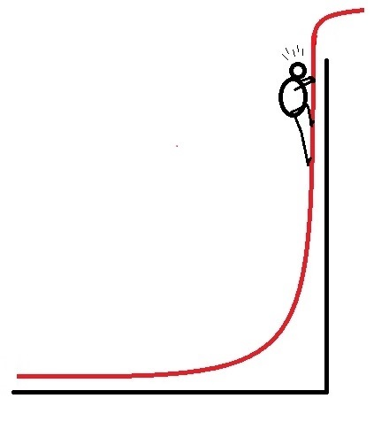

# Procedural Generation and Simulation

Prof. Dr. Lena Gieseke \| l.gieseke@filmuniversitaet.de  
Teaching Assistant: Sylvia Rybak \| sylvia.rybak@filmuniversitaet.de
  

# Chapter 02 - Unreal Engine 5

* [Procedural Generation and Simulation](#procedural-generation-and-simulation)
* [Chapter 02 - Unreal Engine 5](#chapter-02---unreal-engine-5)
    * [Tutorials and Resources](#tutorials-and-resources)
        * [Text Based](#text-based)
        * [Video Tutorials](#video-tutorials)
        * [First Steps Tutorials](#first-steps-tutorials)

*We will work on this script through out the course.*

## Tutorials and Resources

### Text Based

* [Official Unreal 5 Documentation](https://docs.unrealengine.com/5.0/en-US/)
    * Bookmark this page, this should be your go-to place for Unreal questions
    * Beginner content: [Understanding the Basics of Unreal](https://docs.unrealengine.com/5.0/en-US/understanding-the-basics-of-unreal-engine/)
* [Epic Games Dev Community](https://dev.epicgames.com/community/)
    * This is an online forum for everything Unreal related, sorted by topics and level of advancement
    * The page also has a [learning portal](https://dev.epicgames.com/community/unreal-engine/learning), where on can search through content such as [beginner tutorials](https://dev.epicgames.com/community/unreal-engine/learning?is_beginner=true).
* [Unreal Community Wiki](https://unrealcommunity.wiki/)
    * Content is provided by the Unreal community
* [80.lv](https://80.lv/)
    * Unreal news, examples and tutorials of projects created by artists sometimes along with breakdowns of their process.
    * Text and video tutorials.
* [Kodeco](https://www.kodeco.com/library?q=Unreal)
    * Text based tutorials. 
    * For example there is a [tutorial for Blueprints](https://www.kodeco.com/36212581-unreal-engine-5-blueprints-tutorial.) 

### Video Tutorials

* [Official Unreal Youtube](https://www.youtube.com/user/UnrealDevelopmentKit/playlists)
* [Artstation](https://www.artstation.com/learning/unreal-engine)
* [William Fauchner](https://www.youtube.com/channel/UCGKjGGjdl-GzEcFPf1EQwqw)
    * This is a VFX/CGI professional artist who has worked for Marvel and HBO. These tutorials are mainly for cinematics in UE in contrast to game development. They are high quality and well explained but not for absolute beginners. Also has very nice and short introductory videos explaining Unreal functionalities such as Nanite or Lumen.
* [Ben Cloward](https://www.youtube.com/@BenCloward)
    * Good resource for shaders and post-processing effects.
* [Matthew Wadstein](https://www.youtube.com/@MathewWadsteinTutorials)
    * Currently the most extensive resource for blueprints. Unfortunately all tutorials are for UE4, however the majority of the content is still applicable to UE5. 
* [Virtus Learning Hub](https://www.youtube.com/@VirtusEdu)
    * Popular youtube channel with very condensed tutorials of unreal development fundamentals. 

### First Steps Tutorials

* Official Epic Games Tutorial - [Your First Hour in Unreal Engine 5.0: Introduction](https://dev.epicgames.com/community/learning/courses/ZpX/your-first-hour-in-unreal-engine-5-0/E7L/your-first-hour-in-unreal-engine-5-0-introduction)
* Smart Poly - [Unreal Engine 5 Beginner Tutorial | Getting Started (2022)](https://www.youtube.com/watch?v=ptCN4cysDig)
    * This tutorial is a bit too simple at times for those who already have experience with 3D softwares but it provides a good overview of shortcuts and basic functionalities.
* As a start, a good idea is also to browse through the [content examples](https://docs.unrealengine.com/5.1/en-US/content-examples-sample-project-for-unreal-engine/) provided by Unreal, which contain maps showcasing different concepts and functionalities.

<!-- [Lumen](https://dev.epicgames.com/community/learning/courses/2Wo/lumen-essentials/dL16/introduction-to-lumen-essentials) ca. 20 mins

[Nanite](https://dev.epicgames.com/community/learning/courses/rwK/nanite-essentials/vK2/introduction-to-nanite-essentials) ca. 20 min

[Post-Processing](https://dev.epicgames.com/community/learning/courses/pE2/unreal-engine-introducing-post-processing/mZ11/unreal-engine-introducing-post-processing-overview) ca. 1h

[The New Procedural Generation Plugin](https://dev.epicgames.com/community/learning/tutorials/j4xJ/unreal-engine-introduction-to-procedural-generation-plugin-in-ue5-2) ca. 1h
 -->

<!-- ## Harry Houdini

  
[[newrepublic]](https://newrepublic.com/article/119015/edmund-wilson-houdini)  

Harry Houdini (March 24, 1874 – October 31, 1926) was a Hungarian-born American illusionist and stunt performer, noted for his sensational escape acts. [[Wiki: Harry Houdini]](https://en.wikipedia.org/wiki/Harry_Houdini)

> An old trick well done is far better than a new trick with no effect. - Harry Houdini

Unfortunately, this friendly fella is not topic of our lecture.

## SideFX’s Houdini

Houdini is a high-end 3D animation software, similar to Maya, 3dsMax, Cinema4D, etc.

Development for it started in 1986 and the software is under active development. Version of it differ greatly, be aware of that when you for example do a tutorial for it, which might be based on an older version.

Thankfully, SideFX offers a full free version. Next to the fact that you are not allowed to used the free version for any commercial work, you can only render up to 1280x720 with a watermark and you can not include third party renderers (it comes with [Mantra](http://renderwiki.haggi.biz/wiki-seiten/renderers/commercial/mantra.php)).

What sets Houdini apart from other packages is its full commitment to the procedural generation paradigm. This created quite a buzz in recent years in the VFX industry and Houdini is by now the standard for certain effects. Have a look at Houdini's recent [Studio Reel](https://www.youtube.com/watch?v=QVlxGNLuD4U))

Houdini also works well for abstracted and artistic effects. Here, the [Community Reel](https://www.youtube.com/watch?v=NnKgK9cFWaY) of Houdini of 2019.

### Procedural Generation in Houdini

Houdini represents the procedural generation paradigm with a node-based system:

* Every action is stored in a node
* Nodes are wired into networks
* Nodes can save and pass information
* Networks define a recipe
* Networks can be repeated, tweaked, etc.

This is a very different approach in comparison to the other 3D programs, which usually only come with a very limitedly accessible creation stack.

### Workflows

There are some practical guidelines, you can keep in mind in order to adhere to a procedural workflow:

* Always think about your work as creating a process, rather than a thing
    * For example, don't make a table, but a procedure that builds tables and which is adaptable
* Avoid viewport tool interactions
* Avoid traditional box modeling workflows
* Avoid modeling operations that are dependent on specific point or primitive numbers
* Think about what needs manual art-direction and what can be left to your system to handle
* Changes upstream should never break the network downstream

### Bad News

What shall I say, there is no hiding of the simple truth: Houdini is difficult to learn.

  
[[thestudyjournal]](http://thestudyjournal.com/2017/11/)

This class can only give you a tiny little push into the right direction. If you want to master Houdini, you will need to put in much more effort on your own time. beyond this lecture. If you are interested in becoming a Houdini Master, I recommend to first think about what you want to do with Houdini and to specialize in one topic at the beginning. Then you might feel less overwhelmed and you can branch out from there later on.

What often gives a headache to beginners, is the fact that in Houdini there are several, different ways and UI elements to archive the very same thing. This is similar in Photoshop, for example, and has the benefit that you can chose your favorite workflow. However, in the beginning this might make Houdini somewhat confusing.

What is also hard to handle in the beginning is that nodes and networks have different levels and hierarchies. You can literally go inside of a node to find a complete new network. Sometimes it is hard to keep track of where in a hierarchy one currently is. Hence, if you try to follow e.g. a tutorial, always make sure you are on the right hierarchy level.

### Good News

You can do awesome things with Houdini, and Houdini skills are quite valuable and sought after in the respective industries.  

If you do not like Houdini, you do not have to use it ever again after this class. Houdini is only the application framework for the procedural generation and simulation algorithms we are covering in the class. We will investigate these in detail also theoretically and later on you can apply these algorithms in any framework you want.

There are plenty of high quality tutorials online. Googling a specific term and looking for youtube videos usually gives already many results. 

Some of my favorite resources are:

* The [offical collections](https://www.sidefx.com/tutorials/) of tutorials on the SideFX site
* The [Houdini Foundations](https://www.sidefx.com/tutorials/houdini-foundations-book/) book
* [Entagma](http://www.entagma.com/)
* [CG Wiki](http://www.tokeru.com/cgwiki/?title=Houdini)
* [Niels Prayer](https://www.sidefx.com/tutorials/author/Niels%20PRAYER/)
* [Junichiro Horikawa](https://www.youtube.com/channel/UC5NStd0QmACnWs9DzqJ3vHg/videos)
* [Mix Training](https://www.youtube.com/channel/UC65D7DvzyyGEqIJVxK-XhDg/videos)
* [Rohan Dalvi](http://www.rohandalvi.net/free)
* [Houdini Engine for Unity](https://www.sidefx.com/docs/unity/index.html)

## VEX

VEX is a small and efficient general purpose language for writing code in Houdini. It is loosely based on the C land C++ as well as the RenderMan shading language.

* [http://www.sidefx.com/docs/houdini/vex/](http://www.sidefx.com/docs/houdini/vex/)
* [http://www.sidefx.com/docs/houdini/vex/lang.html](http://www.sidefx.com/docs/houdini/vex/lang.html)
* [http://www.sidefx.com/docs/houdini/vex/snippets.html](http://www.sidefx.com/docs/houdini/vex/snippets.html)

The usage of VEX ranges from writing short VEX expressions or snippets of VEX code in nodes to creating your own shaders and nodes. In this class, we will focus on expressions and simple scripts within given nodes. For example, the `Attribute Wrangle` geometry node runs a VEX snippet to modify any attribute values. Similarly, the `Point Wrangle` geometry node runs a VEX snippet to modify point attributes specifically, including the points' position for example. -->

---

The End

👩🏻‍🎤 🦹🏽‍♂️ 🧙🏻‍♂️