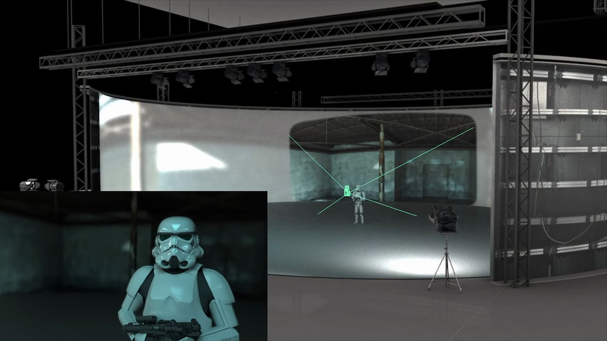

# Procedural Generation and Simulation

Prof. Dr. Lena Gieseke \| l.gieseke@filmuniversitaet.de  
Teaching Assistant: Sylvia Rybak \| sylvia.rybak@filmuniversitaet.de
  

# Chapter 02 - Unreal Engine 5

* [Procedural Generation and Simulation](#procedural-generation-and-simulation)
* [Chapter 02 - Unreal Engine 5](#chapter-02---unreal-engine-5)
    * [What is Unreal?](#what-is-unreal)
    * [Unreal vs. Unity](#unreal-vs-unity)
    * [Unreal in Virtual Production](#unreal-in-virtual-production)
    * [Tutorials and Resources](#tutorials-and-resources)
        * [Text Based](#text-based)
        * [Video Tutorials](#video-tutorials)
        * [First Steps Tutorials](#first-steps-tutorials)
        * [Procedural Content Generation Plugin](#procedural-content-generation-plugin)
    * [Features](#features)
        * [Assets and the Market Place](#assets-and-the-market-place)
        * [Marketplace](#marketplace)
        * [Quixel Bridge](#quixel-bridge)
        * [Megascans](#megascans)
        * [Content Browser](#content-browser)
        * [Project Organisation](#project-organisation)
        * [Level and Maps](#level-and-maps)
        * [Material Editor](#material-editor)
        * [Blueprints](#blueprints)
        * [The Procedural Generation Plugin](#the-procedural-generation-plugin)
            * [Tutorials](#tutorials)
            * [Procedural Workflows](#procedural-workflows)
        * [Niagara](#niagara)
        * [Post-Processing](#post-processing)
        * [Nanite](#nanite)
        * [Lumen](#lumen)
        * [HLSL](#hlsl)
    * [References](#references)

*We will work on this script through out the course.*

## What is Unreal?

[[pcgamesn]](https://www.pcgamesn.com/unreal-engine-5-demo)

* [Unreal Engine 5 | Sizzle Reel 2022](https://www.youtube.com/watch?v=bJPxq6QogKE&t=7s)
* [Unreal Challenge: Creep It Real Sizzle Reel](https://www.youtube.com/embed/fNJ4XocOwKI)

* 3D computer graphics game engine developed by Epic Games
* Made attractive changes to product offerings due to the commercial success of the Fortnite
    * Reduced Marketplace revenues (30% to 12%)
    * Waived royalties margin for games until developers have earned US$1 million in revenue and the fee is waived if developers publish on the Epic Games Store
    * Epic MegaGrants
    * Fellowships
* Direct competitor of Unity, with Unity being more popular
    * Market share is 13% (Unreal) vs. 43%

[[1]](https://en.wikipedia.org/wiki/Unreal_Engine)  

## Unreal vs. Unity

Unity

* Best for creating simple mobile apps, cross-platform
* Speedy coding with C#
* Powerful asset store
* Graphic polishing needs time and work (if at all possible)
* Rendering can get slow without optimization
* Easy to use

Unreal

* Highest quality of graphics (rendering, VFX, animation)
* Fast post-processing features
* Coding with C++ and Blueprints
* Used for film productions and virtual production
* At times a bit clumsy
* Steeper learning curve than unity

[[2]](https://externlabs.com/blogs/unity-vs-unreal/)[[3]](https://www.evercast.us/blog/unity-vs-unreal-engine)  

## Unreal in Virtual Production

[[mages.edu.sg]](https://mages.edu.sg/blog/unreal-engine-and-virtual-production/)

* [Virtual Production Sizzle Reel 2022 | Unreal Engine](https://www.youtube.com/embed/_oMH_gy7r60)

## Tutorials and Resources

### Text Based

* [Official Unreal 5 Documentation](https://docs.unrealengine.com/5.0/en-US/)
    * Bookmark this page, this should be your go-to place for Unreal questions
    * Beginner content: [Understanding the Basics of Unreal](https://docs.unrealengine.com/5.0/en-US/understanding-the-basics-of-unreal-engine/)
* [Epic Games Dev Community](https://dev.epicgames.com/community/)
    * This is an online forum for everything Unreal related, sorted by topics and level of advancement
    * The page also has a [learning portal](https://dev.epicgames.com/community/unreal-engine/learning), where on can search through content such as [beginner tutorials](https://dev.epicgames.com/community/unreal-engine/learning?is_beginner=true).
* [Unreal Community Wiki](https://unrealcommunity.wiki/)
    * Content is provided by the Unreal community
* [80.lv](https://80.lv/)
    * Unreal news, examples and tutorials of projects created by artists sometimes along with breakdowns of their process.
    * Text and video tutorials.
* [Kodeco](https://www.kodeco.com/library?q=Unreal)
    * Text based tutorials. 
    * For example there is a [tutorial for Blueprints](https://www.kodeco.com/36212581-unreal-engine-5-blueprints-tutorial.) 

### Video Tutorials

* [Official Unreal Youtube](https://www.youtube.com/user/UnrealDevelopmentKit/playlists)
* [Artstation](https://www.artstation.com/learning/unreal-engine)
* [William Fauchner](https://www.youtube.com/channel/UCGKjGGjdl-GzEcFPf1EQwqw)
    * This is a VFX/CGI professional artist who has worked for Marvel and HBO. These tutorials are mainly for cinematics in UE in contrast to game development. They are high quality and well explained but not for absolute beginners. Also has very nice and short introductory videos explaining Unreal functionalities such as Nanite or Lumen.
* [Ben Cloward](https://www.youtube.com/@BenCloward)
    * Good resource for shaders and post-processing effects.
* [Matthew Wadstein](https://www.youtube.com/@MathewWadsteinTutorials)
    * Currently the most extensive resource for blueprints. Unfortunately all tutorials are for UE4, however the majority of the content is still applicable to UE5. 
* [Virtus Learning Hub](https://www.youtube.com/@VirtusEdu)
    * Popular youtube channel with very condensed tutorials of unreal development fundamentals. 

### First Steps Tutorials

* Official Epic Games Tutorial - [Your First Hour in Unreal Engine 5.0: Introduction](https://dev.epicgames.com/community/learning/courses/ZpX/your-first-hour-in-unreal-engine-5-0/E7L/your-first-hour-in-unreal-engine-5-0-introduction)
* Smart Poly - [Unreal Engine 5 Beginner Tutorial: Getting Started (2022)](https://www.youtube.com/watch?v=ptCN4cysDig)
    * This tutorial is a bit too simple at times for those who already have experience with 3D softwares but it provides a good overview of shortcuts and basic functionalities.
* As a start, a good idea is also to browse through the [content examples](https://docs.unrealengine.com/5.1/en-US/content-examples-sample-project-for-unreal-engine/) provided by Unreal, which contain maps showcasing different concepts and functionalities.

### Procedural Content Generation Plugin

* Unreal Engine - [Procedural Content Generation in UE5: GDC 2023](https://www.youtube.com/watch?v=aoCGLW53fZg&t=324s) (from April 2023; we are pretty up-to-date 😁)
* Gorka Games - [NEW Unreal Engine 5.2 Procedural Plugin Tutorial - How to Use It Very Easy!](https://www.youtube.com/watch?v=0YiDT08W_q8)
* UnrealityBites - [UE5.2: Procedural Content Generation (inc. how to exclude zones)](https://www.youtube.com/watch?v=RBFvkfZxJJk), [UE5.2: Dramatically Improve Moving Foliage Performance using this PCG parameter](https://www.youtube.com/watch?v=9DY9Xe1KRW8)
* UNF Games - [Procedural Content Generation Tutorial Unreal Engine 5 - Create a Forest](https://www.youtube.com/watch?v=8c1t4Pok_E8)

## Features

### Assets and the Market Place

### Marketplace

The Marketplace is the source of thousands of digital assets, which on can use for their 3D projects including plugins, blueprints, animations, 3D models, characters and so on. There are many free assets available, but the ones of good quality are unfortunately, usually paid. 

### Quixel Bridge
Quixel Bridge is a very widely used plugin, which lets you access the Megascans library to bring environments, materials, and MetaHumans into Unreal Engine.

[Here](https://docs.unrealengine.com/5.0/en-US/quixel-bridge-plugin-for-unreal-engine/) is a tutorial on how to set it up.

### Megascans
Megascans is often used as a source for terrains and vegetation in Unreal scenes. It is a massive online ibrary of physically-based scans, be it full 3D scans all the way from giant objects to small debris, high-resolution vegetation atlases, tileable surfaces, sculpting brushes, scan-based 3D plants and tree systems and more. They are free for use.

Source: [80.vl](https://80.lv/articles/quixel-megascans-scanning-materials-for-games-film/)

### Content Browser

The Content Browser is the primary area of the Unreal Editor for creating, importing, organizing, viewing, and managing content Assets within your Unreal project. You can also use it to manage content folders and perform specific Asset operations, such as: 
* Browse to and interact with all of the Assets in your project.
* Find Assets using a text filter, which you can optionally combine with more advanced filtering.
* Organize Assets into private, local, or shared collections.
* Identify Assets that might contain problems.
* Migrate Assets between content folders or to a different project. 

(From the [documentation](https://docs.unrealengine.com/5.1/en-US/content-browser-in-unreal-engine/))

### Project Organisation

How you organize your project is of course completely up to your own preferences and judgement. However, it is usually good practice to establish a cohesive system, as sometimes your project folders can become very large and contain hundreds of files. There are certain general naming conventions and folder organisation strategies within the Unreal community, which might help structure your content in a way that makes it more approachable to both yourself and other developers who may want to access your project.

General Rules
* All asset dependencies should be in the same folder. (except for shared assets)
* Asset type determines prefix.
Blueprint is *BP_assetname_01*
* Certain types (eg. textures) use a suffix to specify sub-types. Eg. 
*T_Grass_01_N* for normal maps
* Use underscores to split type from identifier and numeric values. Eg. 
*SM_DoorHandle_01*
* Use numeric values with 2 digits. Eg. 
*SM_Pipe_01*

All game content is placed in a sub-folder. eg. *Content/MyGame/UI/…* This helps in migrating between projects and splitting your content from marketplace packs that are added like *Content/MyMarketplacePack/…*

Here is a [condensed naming convention guide](https://www.tomlooman.com/unreal-engine-naming-convention-guide/) and a very extensive [style guide](https://github.com/Allar/ue5-style-guide) you can apply to your Unreal projects.

### Level and Maps

https://www.youtube.com/watch?v=o7JVENd7Jq0

A **Level** is all or part of your game's "world". Levels contain everything a player can see and interact with, like environments, usable objects, other characters, and so on. Unreal Engine saves each Level as a separate .umap file, which is why you will sometimes see Levels referred to as **Maps**.

You will always have a **Persistent Level**, and you can have one or [more sublevels](https://docs.unrealengine.com/5.1/en-US/managing-multiple-levels-in-unreal-engine/) that are always loaded or are streamed in with Level Streaming Volumes, Blueprints, or C++ code. 

### Material Editor

Materials tell the engine exactly how a surface should interact with the light in your scene. Materials define every aspect of a surface, including color, reflectivity, roughness, transparency, and so on. Materials are built by combining nodes called Material Expressions in a shader graph and passing the results into the inputs on the Main Material Node. 

As with your assets, there are also certain [organisational strategies](https://docs.unrealengine.com/5.1/en-US/organizing-a-material-graph-in-unreal-engine/) you can apply to your material graphs. 

Another important concept is **Material Instances**, which allows to change the appearance of a Material without incurring an expensive recompilation of the Material. This means you do not have to edit the material graph itself each time you want to create a variation of a material, but you can **promote** certain parameters, which can be changed within the instances themselves. 

### Blueprints

The Blueprint Visual Scripting system in Unreal Engine is a complete gameplay scripting system based on the concept of using a node-based interface to create gameplay elements from within Unreal Editor. As with many common scripting languages, it is used to define object-oriented (OO) classes or objects in the engine.

This system is extremely flexible and powerful as it provides the ability for designers to use virtually the full range of concepts and tools generally only available to programmers. In addition, Blueprint-specific markup available in Unreal Engine's C++ implementation enables programmers to create baseline systems that can be extended by designers. 

https://gamedevacademy.org/unreal-blueprints-tutorial/

### The Procedural Generation Plugin
The Procedural Generation Plugin has been introduced as an experimental feature with Unreal 5.2, which has just been released. It allows for procedural workflows within real-time with which you can for example use to define rules and parameters to populate large scenes with Unreal Engine assets of your choice.

#### Tutorials

* Unreal Engine - [Procedural Content Generation in UE5: GDC 2023](https://www.youtube.com/watch?v=aoCGLW53fZg&t=324s) (from April 2023; we are pretty up-to-date 😁)
* Gorka Games - [NEW Unreal Engine 5.2 Procedural Plugin Tutorial - How to Use It Very Easy!](https://www.youtube.com/watch?v=0YiDT08W_q8)
* UnrealityBites - [UE5.2: Procedural Content Generation (inc. how to exclude zones)](https://www.youtube.com/watch?v=RBFvkfZxJJk), [UE5.2: Dramatically Improve Moving Foliage Performance using this PCG parameter](https://www.youtube.com/watch?v=9DY9Xe1KRW8)
* UNF Games - [Procedural Content Generation Tutorial Unreal Engine 5 - Create a Forest](https://www.youtube.com/watch?v=8c1t4Pok_E8)

#### Procedural Workflows

There are some practical guidelines, you can keep in mind in order to adhere to a procedural workflow:

* Always think about your work as creating a process, rather than a thing
    * For example, don't make a table, but a procedure that builds tables and which is adaptable
* Avoid viewport tool interactions
* Avoid traditional box modeling workflows
* Avoid modeling operations that are dependent on specific point or primitive numbers
* Think about what needs manual art-direction and what can be left to your system to handle
* Changes upstream should never break the network downstream

### Niagara

Niagara is Unreal Engine's VFX system, it allows you to create particle effects, complex animations, liquids and so on. 
The main terminology for Niagara is as follows:

A Niagara **system** contains all of the components that build the effect. Inside that system, you may have different building blocks that stack up to help you produce the overall effect.

**Emitters** are where particles are generated in a Niagara system. An emitter controls how particles are born, what happens to that particles as they age, and how the particles look and behave.

The emitter is organized in a **stack**. Inside that stack is several groups, inside which you can put modules that accomplish individual tasks. The groups are as follows.

* Emitter Spawn (initial setups and defaults) and Update (occur every frame)
* Particle Spawn and Update (follows same rules as above)
* Event Handler (create *Generate* and *Listening*, which trigger actions between different emitters)
* Render (define the display of the particle and set up one or more renderers for your particles)

**Modules** are the sub-blocks of emitters. They are built using High-Level Shading Language (HLSL), but can be built visually in a Graph using nodes. 
You can create functions, include inputs, or write to a value or parameter map.

**Parameters** are an abstraction of data in a Niagara simulation. Parameter types are assigned to a parameter to define the data that parameter represents.

You can find a more detailed overview of Niagara systems within the [Unreal documentation](https://docs.unrealengine.com/5.1/en-US/overview-of-niagara-effects-for-unreal-engine/). 

### Post-Processing
Post Process Effects allow us to tweak the overall look and feel of the scene. Examples of elements and effects include bloom (HDR blooming effect on bright objects), ambient occlusion, tone mapping, but also "camera lens" settings such as depth of field and exposure. 

To use Post-Processing effects within your scene, you have to first add a *Post Process Volume* into your level. It will look like an empty box, which you have to resize the cover all the elements within you scene (or just the ones you want the effect applied to). There is also an official [Post-Processing Unreal tutorial](https://dev.epicgames.com/community/learning/courses/pE2/unreal-engine-introducing-post-processing/mZ11/unreal-engine-introducing-post-processing-overview) on this very topic. 

### Nanite

Nanite is Unreal Engine 5's new virtualized geometry system, which uses a new internal mesh format and rendering technology to render pixel scale detail and high object counts.

Source: [CGHero Glossary](https://cghero.com/glossary/what-is-nanite)

To put it simply, it allows you to place complex 3D models (for example with high poly counts) into your scene and optimized them to work in real-time. Using it is rather simple as well - when you import a mesh, you can choose to import it as either a static mesh or a nanite mesh within your settings. There is also an Epic games tutorial on [Nanite Essentials](https://dev.epicgames.com/community/learning/courses/rwK/nanite-essentials/vK2/introduction-to-nanite-essentials) available as well. 

### Lumen

Lumen is a fully dynamic global illumination and reflections system, which now serves as the default illumination and reflection system in Unreal Engine 5. It is based on ray-tracing, or a more optimised, hybrid version of it. Lumen was introduced as an alternative to static light systems, which would required light [baking](https://vintay.medium.com/difference-between-realtime-mixed-and-baked-lighting-in-unity-6bda1f24bfb#:~:text=Baked%20Lighting%20Mode%3A,just%20prior%20to%20project%20release), which was a very time consuming process. 

This [video](https://www.youtube.com/watch?v=1e6oOiKh91U&t=12s&pp=ygUPbHVtZW4gZXhwbGFpbmVk) by William Fauchner, provides a clear explanation of Lumen and it's functionalities and so does this Epic Games [Lumen tutorial](https://dev.epicgames.com/community/learning/courses/2Wo/lumen-essentials/dL16/introduction-to-lumen-essentials).

Sources: [CGHero Glossary](https://cghero.com/glossary/what-is-lumen)

### HLSL
HLSL is the C-like high-level shader language. It is the default shading language within Unreal.
 
Behind the scenes, material node graphs within Unreal are silently translated to HLSL. You can view the HLSL code of a Material by going to Window > Shader Code > HLSL Code in the Material Editor. You cannot directly edit HLSL shader code within the Unreal Editor, but you can create nodes, which contain custom HLSL code.

## References
  
[[1] Wiki - Unreal Engine](https://en.wikipedia.org/wiki/Unreal_Engine)  
[[2] Extern Labs - Unity vs. Unreal](https://externlabs.com/blogs/unity-vs-unreal/)  
[[3] Evercast - Unity vs. Unreal Engine](https://www.evercast.us/blog/unity-vs-unreal-engine)  
  

---

The End

👩🏻‍🎤 🦹🏽‍♂️ 🧙🏻‍♂️