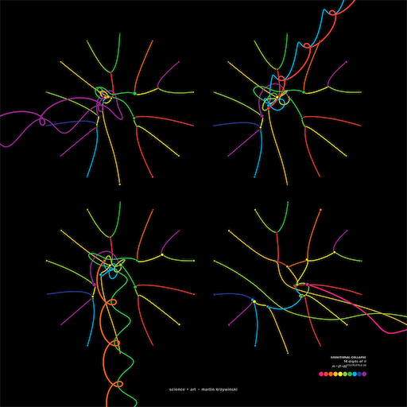
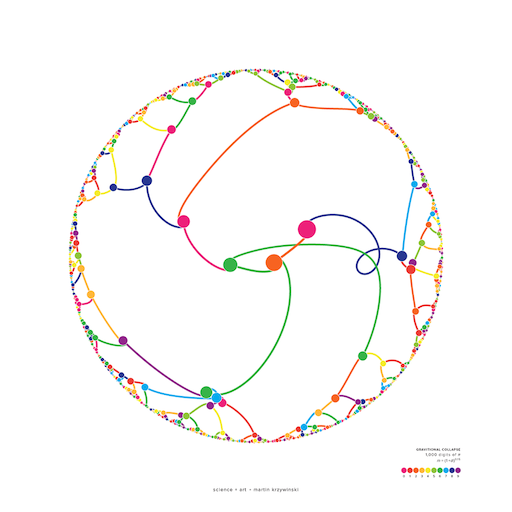
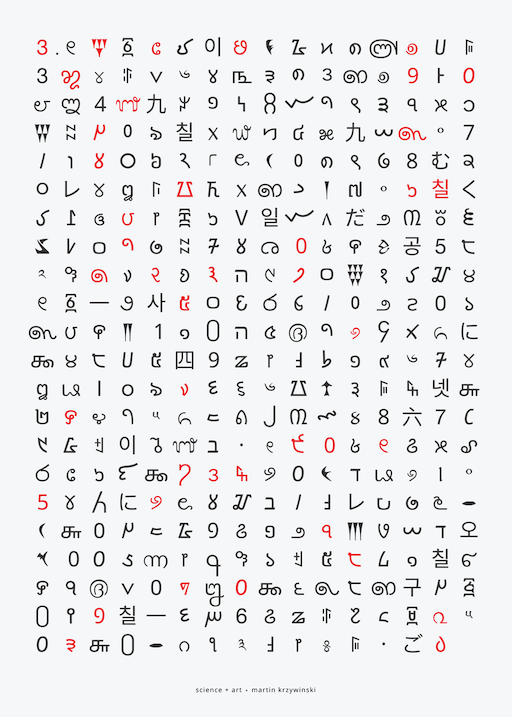

# Procedural Generation and Simulation

Prof. Dr. Lena Gieseke \| l.gieseke@filmuniversitaet.de \| Film University Babelsberg KONRAD WOLF


# Chapter 03 - Beauty in Maths

* [Procedural Generation and Simulation](#procedural-generation-and-simulation)
* [Chapter 03 - Beauty in Maths](#chapter-03---beauty-in-maths)
    * [Topics](#topics)
    * [Learning Objectives](#learning-objectives)
        * [Euler's Identity](#eulers-identity)
    * [Numbers](#numbers)
        * [The Golden Ratio](#the-golden-ratio)
        * [Famous Irrational Numbers](#famous-irrational-numbers)
        * [Pi](#pi)
        * [Fibonacci Sequence](#fibonacci-sequence)
    * [Spirals](#spirals)
        * [Polar Coordinates](#polar-coordinates)
        * [Archimedes Spiral](#archimedes-spiral)
        * [Fermat Spiral](#fermat-spiral)
        * [Logarithmic Spiral](#logarithmic-spiral)
        * [Hyperbolic Spiral](#hyperbolic-spiral)
        * [Lituus Spiral](#lituus-spiral)
        * [Cornu Spiral](#cornu-spiral)
    * [Golden Spiral](#golden-spiral)
    * [Curves](#curves)
        * [The Rose Curve](#the-rose-curve)
            * [Parameter r](#parameter-r)
            * [Parameter Theta](#parameter-theta)
            * [Parameter k](#parameter-k)
            * [Number of Loops](#number-of-loops)
            * [Parameter Offset c](#parameter-offset-c)
    * [Next](#next)
    * [References](#references)


## Topics

* Beautiful Numbers
* Beautiful Curves

$\pi:$  
  
[[Lacim]](http://www.lacim.uqam.ca/~plouffe/distributions%20modulo%201/imagepages/image10.html)

## Learning Objectives

* Learn about visual properties of some numbers and curves
* Get an intuition on how to use formulas in regard to their design space and their implementation
* Learn how to grow leaves like a plant

### Euler's Identity

Mathematicians assign to formulas aesthetic qualities. Let's have a look into the formula that is considered to be the most beautiful as of today:

$e^{i\pi} + 1 = 0$

where

* $e$ is Euler's number, the base of natural logarithms,
* $i$ is the imaginary unit, which by definition satisfies $i^{2} = −1$, and
* $\pi$ is pi, the ratio of the circumference of a circle to its diameter.

[Euler's identity](https://en.wikipedia.org/wiki/Euler%27s_identity) is named after the Swiss mathematician [Leonhard Euler](https://en.wikipedia.org/wiki/Leonhard_Euler). It is considered to be an exemplar of deep mathematical beauty, if not the most beautiful formula currently known as already mentioned. Its beauty arises from its simplicity while expressing highly complex behavior and its profound connection between the most fundamental numbers in mathematics.

Three of the basic arithmetic operations occur exactly once each: addition, multiplication, and exponentiation. The identity also links five fundamental mathematical constants. [2] A mathematical constant is a number whose value is fixed by an unambiguous definition, often referred to by a symbol or by mathematicians' names to facilitate using it across multiple mathematical problems. [3] Constants arise in many areas of mathematics, with constants such as $e$ and $\pi$ occurring in such diverse contexts as geometry, number theory, and calculus.

The five fundamental mathematical constants in Euler's identity are

* The number $0$, the additive identity.
* The number $1$, the multiplicative identity.
* The number $\pi$ ($\pi = 3.141...$).
* The number $e$ ($e = 2.718...$), which occurs widely in mathematical analysis.
* The number $i$, the imaginary unit of the complex numbers.

Furthermore, the equation is given in the form of an expression set equal to zero, which is common practice in several areas of mathematics.

Stanford University mathematics professor Keith Devlin has said,  

> ...like a Shakespearean sonnet that captures the very essence of love, or a painting that brings out the beauty of the human form that is far more than just skin deep, Euler's equation reaches down into the very depths of existence. [4]  

And Paul Nahin, a professor emeritus at the University of New Hampshire, who has written a book dedicated to Euler's formula and its applications in Fourier analysis, describes Euler's identity as being  

> ...of exquisite beauty. [4]

[[1]](https://en.wikipedia.org/wiki/Euler's_identity)

This inherent beauty *on a mathematical level* is *not* our topic (did I scare you with Euler's identity for a second here? 😎). We are more interested in the *visual representations and characteristics* of numbers and equations and with that potential visual beauty.  

There are studies that shows a connection between inherent mathematical beauty - what mathematicians consider beautiful maths and generally accepted visual beauty. But we would need a much deeper understanding of maths to go that route.

## Numbers

### The Golden Ratio

A ratio describes one quantity in relationship to another one, e.g. how long the width of an image is in relationship to its height. 

We have a *golden* ratio if the ratio of two quantities is the same as the ratio of their sum to the larger of the two quantities.

$$\frac{a+b}{a} = \frac{a}{b}$$

Line segments in the golden ratio:

  
[[wiki]](https://en.wikipedia.org/wiki/Golden_ratio)

A golden rectangle:

  
[[wiki]](https://en.wikipedia.org/wiki/Golden_ratio)

This ratio is defined as $\varphi$:

(1) $$\frac{a+b}{a} = \frac{a}{b} \stackrel{\mathrm{def}}{=} \varphi$$

One method for finding the value of $\varphi$ is to start with the left fraction. 

(2) $$\frac{a+b}{a}=\frac{a}{a}+\frac{b}{a} = 1+\frac{b}{a}$$

We can derive from (1) $\frac{a}{b} = \varphi$ that $\frac{b}{a} = \frac{1}{\varphi}$ and put that into (2)

(3) $$1+\frac{b}{a}=1+\frac{1}{\varphi}$$

Setting that equal to the right side of (1), we get

$1+\frac{1}{\varphi}=\varphi$.

One of the special properties of the Golden Ratio is that *it can be defined in terms of itself*, as shown above. This leads to a *continued fraction*, which just can't be expressed as a regular fraction not matter what.

$1+{\cfrac {1}{1+{\cfrac {1}{1+{\cfrac {1}{1+{\cfrac {1}{1+\ddots }}}}}}}}$

A number which can not be constructed from ratios (or fractions) of integers is an *irrational number*. Their decimal expansions neither terminate nor become periodic.

  
  
[[Maths is Fun]](https://www.mathsisfun.com/irrational-numbers.html)

Now, let's solve $1+\frac{1}{\varphi}=\varphi$ for $\varphi$.

Multiplying by $\varphi$ gives

$\varphi +1 = \varphi ^{2}$  

which can be rearranged to

$\varphi^{2}-\varphi -1=0$.

Using the [quadratic formula](https://en.wikipedia.org/wiki/Quadratic_formula), two solutions are obtained:

$\frac{1+{\sqrt{5}}}{2} = 1.618\,033\,988\,7\dots$  
  
and  
  
$\frac{1-{\sqrt{5}}}{2} = -0.618\,033\,988\,7\dots$

Because $\varphi$ is the ratio between positive quantities, $\varphi$ is necessarily positive:

$\frac{1+{\sqrt{5}}}{2} = 1.618\,033\,988\,7\dots$ 


In summary:

|                    |                                  $\varphi$                                  |
|--------------------|:---------------------------------------------------------------------------:|
| Decimal            |                          1.6180339887498948482...                           |
| Continued fraction | $1+{\cfrac {1}{1+{\cfrac {1}{1+{\cfrac {1}{1+{\cfrac {1}{1+\ddots }}}}}}}}$ |
| Algebraic form     |                          $\frac{1+{\sqrt{5}}}{2}$                           |

[[13]](https://en.wikipedia.org/wiki/Golden_ratio)  


Next to the genuine maths behind the ratio itself and its fascinating mathematical properties, some believe that the Golden Ratio makes the most pleasing and beautiful shapes:

 

Whether this is a *beautiful* ratio or not is up to personal taste. Be careful though to believe the widespread understanding that the golden ratio is the *natural blueprint* for beauty. There is very little *scientific* evidence for that. You can find ratios similar to the golden ratio in the world, such as in human faces, the Parthenon, etc. but the emphasis is on *similar* and also there are various other prominent ratios out there. With the golden ratio we might have a case of *you find what you are looking for*. [[14]](https://www.independent.co.uk/news/science/mathematicians-dispute-claims-that-the-golden-ratio-is-a-natural-blueprint-for-beauty-10204354.html) 
[[15]](https://www.businessinsider.com/the-golden-ratio-fibonacci-numbers-mathematics-zeising-beauty-2015-9?r=DE&IR=T)  


What we indeed find in regard to $\varphi$ prominently in nature is an approximation of the *golden angle*.

Imagine you are a plant and you can spread leaves all around your stem. Now, being a plant, needing Photosynthese and such, you want all of your leaves to soak up as much sun (and rain) as possible. So when you sprout a new leaf, you don’t want it to block your other leaves.

  
[[gofiguremath]](http://gofiguremath.org/natures-favorite-math/the-golden-ratio/the-golden-angle/)

What you want is to turn for every new leaf a certain degree as the following (the numbers indicate the order in which the leaf grew).

  
  
  

Being a plant and all, you already know what you have to do. Each turn you make to grow a new leaf or place a new seed you have to turn with the *golden angle*.

  

And we keep on doing so...

  
  
  
  
  
  

  
[[gofiguremath]](https://gofiguremath.org/natures-favorite-math/the-golden-ratio/the-golden-angle/)  

The same problem applies if you imagine to be a sunflower and you want to pack as many seeds as possible, while all of them getting as much sun as possible.

  
[[wsimag]](https://wsimag.com/science-and-technology/34023-the-fascination-with-the-golden-ratio)

And now, back to being a CTech student, now you know what makes that angle *golden*.   

In geometry, the golden angle is the smaller of the two angles created by sectioning the circumference of a circle according to the golden ratio; that is, into two arcs such that the ratio of the length of the smaller arc to the length of the larger arc is the same as the ratio of the length of the larger arc to the full circumference of the circle: [[23]](https://en.wikipedia.org/wiki/Golden_angle)

  
[[gofiguremath]](http://gofiguremath.org/natures-favorite-math/the-golden-ratio/the-golden-angle/)

The best solution to *how far to turn from the last leaf* in degree is therefore $~137.5°$, and that is what all kinds of plants do:

  
  
[[LeerZelfBeleggen]](https://leerzelfbeleggen.com/wp-content/uploads/2018/08/Fibonacci-trading-leren-traden-met-de-geheime-formule-voorbeelden.jpeg)


  
[[fineartamerica]](https://fineartamerica.com/featured/1-golden-angle-thomas-festerscience-photo-library.html)

Such an arrangement of leaves, which applies the golden angle, is also called *phyllotaxis* (*leaf arrangement* in Greek) in botany. Helmut Vogel specified an easy generation model for phyllotaxis patterns in

Vogel, H (1979). **A better way to construct the sunflower head**. Mathematical Biosciences 44 (44): 179–189.

Again in [polar coordinates](#polar-coordinates), it comes down to 

$r = c\sqrt{n}$

$\theta = n \times 137.508^\circ$

with

* angle $\theta$,
* radius $r$,
* index number of the current element $n$, and
* a constant scaling factor $c$.

Implemented in p5:

```js
let n = 0;
let c = 20; 
let color_ramp = 100;

function setup()
{
    createCanvas(1024 , 1024);
    angleMode(DEGREES);
    color_ramp = width * 0.4;
    colorMode(HSB, color_ramp, 1, 1);
    background(1);
    noStroke();
}

function draw()
{
    // Place drawing in the middle
    translate(width * 0.5, height * 0.5);

    // Vogel's algorithm (in polar coordinates)
    let r = c * sqrt(n);
    let theta = n * 137.5;

    // Polar to Cartesian coordinates
    let x = r * cos(theta);
    let y = r * sin(theta);

    fill(n % color_ramp, 1 , 1);
    ellipse(x , y , c * 1.25 , c * 1.25);

    n++
}
```

  

But the fascination doesn't stop here. If we change the angle from the golden angle to an arbitrary angle between 0..360 we get vastly different designs for only very small changes. The following code maps the angle to turn to the mouse position in x. Try the code for yourself!

```js
let ELEMENT_COUNT = 1000;
let c = 20; 

function setup()
{
    createCanvas(1024 , 1024);
    angleMode(DEGREES);
    colorMode(HSB, ELEMENT_COUNT, 1, 1);
    background(1);
    noStroke();
}

function draw()
{
    background(1);
    translate(width * 0.5, height * 0.5);
  
    let ratio = map(mouseX, 0, width, 0, 1);
    text(ratio, -width * 0.49, -height * 0.48);
  
    for (let n=0; n < ELEMENT_COUNT; n++) 
    {
      let r = c * sqrt(n);
      let theta = n * ratio * 360;


      let x = r * cos(theta);
      let y = r * sin(theta);

      fill(n, 1 , 1);
      ellipse(x , y , c * 1.25 , c * 1.25);
    }
}
```

Fractions for the `ratio` value lead to spikes, while getting closer to an irrational number produces dense distributions:

  

If you would like to understand better which values lead to which design (and how to be a flower...), I highly recommend this video the Numberphile's video [The Golden Ratio (why it is so irrational)](https://www.youtube.com/watch?v=sj8Sg8qnjOg).

What to do with this? Well, now it is up to being creative. Just connecting the element by lines already give interesting designs:


  
[[codeproject]](https://www.codeproject.com/Articles/1221341/The-Vogel-Spiral-Phenomenon)

  
[[Chisato den Engelsen]](https://dribbble.com/shots/5873691-Arranging-Dots)


  
[[p5 sketch by willgeary]](https://editor.p5js.org/willgeary/sketches/0koqjcxEk)


Of course forumlas such as the phyllotaxis one above have been used over and over,... and over again. We have seen these visuals. That doesn't mean that there aren't plenty of options left to work with these fascinating structures. What I am trying to say is that by just simply plotting the base examples, you will not get a creativity medal. You will have to really think about a visualization / application to make them interesting anew.

$\varphi$ is not the only irrational number, as you might know. 

### Famous Irrational Numbers

$\varphi = 1.61803398874989484820...$

* The most irrational of them all

$\pi = 3.1415926535897932384626433832795..$

* The rockstar of the irrational numbers
* The popular approximation of $\frac{22}{7} = 3.1428571428571$ is close but not accurate
* Over a quadrillion decimal places have been calculated and *still there is no pattern!!!*

$e = 2.7182818284590452353602874713527$

* Euler's Number
* Base of the Natural Logarithms

Many square roots, cube roots, etc. are also irrational numbers.

* $\sqrt{3} = 1.7320508075688772935274463415059...$
* $\sqrt{99} = 9.9498743710661995473447982100121...$
* But e.g. $\sqrt{4} = 2$ (rational), and $\sqrt{9} = 3$ (rational), so not all roots are irrational.

[[16]](https://www.mathsisfun.com/irrational-numbers.html)

### Pi

$\pi$ is a real crowd-pleaser. Why is that?

$\pi = 3.14159 26535 89793 23846 26433 83279 50288 41971 ...$

$\pi$ appears in formulae for areas and volumes of geometrical shapes based on circles, such as ellipses, spheres, cones, and tori. Below are some of the more common formulae that involve $\pi$.[18]

  
[[wiki]](https://en.wikipedia.org/wiki/Pi#/media/File:Pi_eq_C_over_d.svg)


* The circumference of a circle with radius r is $2\pi r$.
* The area of a circle with radius r is $\pi r^2$.
* The volume of a sphere with radius r is $\frac{4}{3}\pi r^3$
* The surface area of a sphere with radius r is $4\pi r^2$.

The trigonometric functions rely on angles, and mathematicians generally use radians as units of measurement. $\pi$ plays an important role in angles measured in radians, which are defined so that a complete circle spans an angle of $2\pi$ radians. The angle measure of $180^\circ$ is equal to $\pi$ radians, and $1^\circ = \frac{\pi}{180}$ radians.[19]

Common trigonometric functions have periods that are multiples of $\pi$; for example, sine and cosine have period $2\pi$:

  
[[wiki]](https://en.wikipedia.org/wiki/Pi#/media/File:Sine_cosine_one_period.svg)

$\pi$ appears in many, many other formulas in all areas of mathematics and physics. Its omnipresence and usefulness plays a big role for $\pi$'s popularity. But its inherent characteristic are also truly captivating.

[[17]](https://en.wikipedia.org/wiki/Pi)  

The digits of $\pi$ are uniformly randomly distributed, meaning that its digits 0 through 9 appear equally often, as do pairs of digits, trios of digits, and so forth. If you don't believe it you can count digits in its first [10 million decimal places](https://introcs.cs.princeton.edu/java/data/pi-10million.txt).

  
[[sas blogs]](https://blogs.sas.com/content/iml/2015/03/12/digits-of-pi.html#prettyPhoto)

The digits of $\pi$ pass every test for randomness, yet $\pi$ is a precise mathematical value that describes the relationship between the circumference of a circle and its diameter. This dichotomy between *very random* and *very structured* blows my mind. [[20]](https://blogs.sas.com/content/iml/2015/03/12/digits-of-pi.html#prettyPhoto)

In honor of $\pi$ day, which is on March, 14th according to the north american date formating of 03.14., several artists visually represent $\pi$ each year anew in a creative and beautiful manner.

  
[[fineartamerica]](https://fineartamerica.com/featured/flow-of-life-flow-of-pi-cristian-ilies-vasile.html)

Here, the digits of $\pi$ are represented as a path traced by links between successive digits. Each digit is assigned a segment around the circle and a link between segment $i$ and $j$ corresponds to the appearance of $ij$ in $\pi$. For example, the $14$ in $3.14...$ is drawn as a link between segment $1$ and segment $4$. [[21]](http://mkweb.bcgsc.ca/pi/art/method.mhtml)

  
[[mkweb]](http://mkweb.bcgsc.ca/pi/art/method.mhtml)

As more digits are added to the path, the image becomes a weaving mandala.

Here the same idea with a different mapping of the colors:

  
[[lacim]](http://www.lacim.uqam.ca/~plouffe/distributions%20modulo%201/imagepages/image10.html)

The digits of $\pi$ are, as we already know, randomly distributed. Art based on its digits therefore has a quality that is influenced by this random distribution. To provide a reference of what such a random pattern looks like, below are 16 random numbers represented in the same way. They're all different, yet strangely the same. [[21]](http://mkweb.bcgsc.ca/pi/art/method.mhtml)

  
[[mkweb]](http://mkweb.bcgsc.ca/pi/art/method.mhtml)

[Simon Plouffe](http://plouffe.fr/Simon%20Plouffe.htm) offers [a whole collection](http://plouffe.fr/distributions%20modulo%201/) of similarly visualized equations.

The following visualization of $\pi$ is generated by running a simulation of gravity in which digits of $\pi$ are each assigned a mass and allowed to collide and orbit each other.

  
[[mkweb]](http://mkweb.bcgsc.ca/pi/art/method.mhtml)

Visualizing the [accuracy of 10,000 rational approximations](http://mkweb.bcgsc.ca/pi/pi.approximation.day/) of $\pi$:

  
[[mkweb]](http://mkweb.bcgsc.ca/pi/art/method.mhtml)  

Or 351 digits of $\pi$ [in 54 different alphabets](http://mkweb.bcgsc.ca/pi/piday2019/) (left) and spelling out the digits  in a variety of languages and alphabets. The artists leaves it up to us to work out the rule for the red highlights.

  
[[mkweb]](http://mkweb.bcgsc.ca/pi/art/method.mhtml)  

As you can see certain numbers alone come with a vast range of interesting properties and it is up us to use them in a visually interesting and creative manner.


*Do you recognize the following sequence of numbers? How is the sequence constructed?*

$0, 1, 1, 2, 3, 5, 8, 13, 21, 34, 55, 89, 144, ...$

Yes, you are right, it is the...

### Fibonacci Sequence

In mathematics, the Fibonacci numbers, commonly denoted $F_n$, form a sequence, called the Fibonacci sequence, such that each number is the sum of the two preceding ones, starting from $0$ and $1$. That is, [6]

$F_{0}=0,  F_{1}=1,$  
  
and  
  
$F_{n}=F_{n-1}+F_{n-2}$,  
  
for $n > 1$.


```java
int nthFibonacci(int n) 
{
    if (n <= 1) 
        return n; 

    return nthFibonacci(n-1) + nthFibonacci(n-2);
}
```

Knowledge of the Fibonacci sequence was expressed from the Indian mathematician [Acharya Pingala](https://en.wikipedia.org/wiki/Pingala) in connection with a study of poetic metres and verse in Sanskrit as early c. 450 BC–200 BC. Outside India, the Fibonacci sequence first appears in the book [Liber Abaci](https://en.wikipedia.org/wiki/Liber_Abaci) (1202) by [Fibonacci](https://en.wikipedia.org/wiki/Fibonacci) using it to calculate the growth of rabbit populations. [7][8][9][10]

There is a special relationship between the Golden Ratio and Fibonacci Numbers in that the ratio of two successive Fibonacci numbers is close to the golden ratio:

  
[[hydrogen2oxygen]](https://hydrogen2oxygen.net/en/2012/06/21/the-fibonacci-sequence-is-the-mathematical-first-cousin-of-the-golden-ratio/)


Geometrically the Fibonacci Sequence can be expressed as follows.

  
[[wiki]](https://commons.wikimedia.org/wiki/File:34*21-FibonacciBlocks.png)

The above segmentation of an rectangle approximates the *golden spiral*. 

  
[[wiki]](https://commons.wikimedia.org/wiki/File:FibonacciSpiral.svg)

This is easily constructed by placing a quarter of a circle in each segment

  
[[wiki]](https://commons.wikimedia.org/wiki/File:FibonacciSpiral.svg)

[[5]](https://en.wikipedia.org/wiki/Fibonacci_number)

But wait. What is a *spiral* and why is it *golden*? Don't we need $\varphi$ for anything to be golden?

## Spirals

In mathematics, a spiral is a curve which starts from a point and when moving farther away, it revolves around the startpoint. The phyllotaxis code we have seen above is actually also creating spirals.

Spirals are usually represented in polar coordinates $(r, \theta)$.

### Polar Coordinates

Quick reminder, what is the Polar Coordinate System? In mathematics, the polar coordinate system is a two-dimensional coordinate system in which each point on a plane is determined by a distance from a reference point and an angle from a reference direction.

  
[[wiki]](https://de.wikipedia.org/wiki/Datei:Ebene_polarkoordinaten.svg)

(here with $\phi$ as name for the angular coordinate, often called the polar angle)

Hence,  
  
$x = r \cos{\phi}$  
$y = r \sin{\phi}$

and

$r = \sqrt{{x^2 + y^2}}$  
$\phi = \tan^{-1}{\left (\frac{y}{x}\right )}$

Polar coordinates are most appropriate in any context where the phenomenon being considered is inherently tied to *direction* and *length* from a *center point*, such as with spirals. Please make sure that you know what polar coordinates are and how to use them. We are going to need them all the time.

  
[[theedge]](https://theedge.com.hk/decomplexifying-complex-numbers/)


[[11]](https://en.wikipedia.org/wiki/Polar_coordinate_system)

In polar coordinates different spiral designs can be compactly expressed with

* $r$ as the distance from the origin,
* $\theta$ as the angle (in radians) from the horizontal axis, and
* $a$ and $b$ as constants that allow for shaping the different designs.

### Archimedes Spiral

$r = a \theta$

  
[[Wolfram]](https://mathworld.wolfram.com/ArchimedesSpiral.html)

```js
let a = 2;
let r = 0;
let theta = 0;

function setup()
{
    createCanvas(512, 512);
    fill(100);
    background(255);
    noStroke();
} 

function draw()
{
    translate(width * 0.5, height  * 0.5);

    r = a*theta;
    let x = r * cos(theta);
    let y = r * sin(theta);

    ellipse(x, y, 2, 2);

    theta += 0.1;
}
```


### Fermat Spiral

$r^2 = a^2 \theta$

  
[[Wolfram]](https://mathworld.wolfram.com/FermatsSpiral.html)

### Logarithmic Spiral

$r = ae^{b\theta}$
  
[[Wolfram]](https://mathworld.wolfram.com/LogarithmicSpiral.html)

### Hyperbolic Spiral

$r = \frac{a}{\theta}$
  
[[Wolfram]](https://mathworld.wolfram.com/HyperbolicSpiral.html)

### Lituus Spiral

$r^2 = \frac{a^2}{\theta}$
  
[[Wolfram]](https://mathworld.wolfram.com/Lituus.html)

### Cornu Spiral

This spiral is also known as [Euler’s spiral](https://en.wikipedia.org/wiki/Euler_spiral) and its curvature changes linearly with its curve length. Mathematically it is quite complex. If interested, ask [Wolfram](https://mathworld.wolfram.com/CornuSpiral.html).

  
[[Wolfram]](https://mathworld.wolfram.com/CornuSpiral.html)

## Golden Spiral

The [formal description](https://en.wikipedia.org/wiki/Golden_spiral#Mathematics) of the golden spiral, which above, we have approximated geometrically, is based on a logarithmic spiral with a special value of the growth factor $b$. Guess what the special value is! Remember we want to be golden again...

$r = ae^{b\theta}$

  
[[Wolfram]](https://mathworld.wolfram.com/GoldenSpiral.html)

The special value for the growth factor $b$ is based on $\varphi$, the golden ratio. The golden spiral gets wider (or further from its origin) by a factor of $\varphi$ for every quarter turn it makes.

  
[[wiki]](https://commons.wikimedia.org/wiki/File:FakeRealLogSpiral.svg)

Golden spirals are self-similar. The shape is infinitely repeated when magnified.

  
[[wiki]](https://commons.wikimedia.org/wiki/File:GoldenSpiralLogarithmic_color_in.gif)

[[12]](https://en.wikipedia.org/wiki/Golden_spiral)  

## Curves

Next to spirals as curve designs, there are several similarly simple functions that create aesthetically pleasing curves. At first sight, the Wikipedia and Wolfram pages of these functions can appear a bit intimidating. But I would like to show you that it is actually not that hard to get a grip on these functions.

Let's have a look into the rose curve.

  
[[wiki]](https://en.wikipedia.org/wiki/Rose_(mathematics))  

### The Rose Curve

First, check [its wikipedia](https://en.wikipedia.org/wiki/Rose_(mathematics)) page. This page is still somewhat simple and well-arranged. Sometimes these pages overflow with explanations, different representations, history and proofs, etc.. Fear not! What you always want to look out for is the *coordinates* you can plot, be it polar or cartesian coordinates (we know how to go from one to the other so it does not really matter what we get).

For the rose curve, the parametric equations are right under *General overview* ready for us to use (how convenient!):

The polar equation:

$r=\cos(k\theta )$  

The Cartesian parametric equations of the form  

$x=\cos(k\theta )\cos(\theta )$  
$y=\cos(k\theta )\sin(\theta )$  

#### Parameter r

But *wait*, you will say, *where is $r$* you will ask! Well, often times these formulas assume a radius of 1 and drop the variable altogether. If you would like to include $r$ as a scaling factor to your rose implementation, it would look as follows
  
$x=r \cos(k\theta )\cos(\theta )$  
$y=r \cos(k\theta )\sin(\theta )$  

So, we have also $\theta$ and $k$ as parameters here. Let's try to understand what they do.

#### Parameter Theta

$\theta$ is once again the angular coordinate or polar angle:

  
[[wolfram]](https://mathworld.wolfram.com/PolarAngle.html)  

*What do we need to do with $\theta$ in order to draw for example this version of the rose?*

  
[[wikimedia]](https://commons.wikimedia.org/wiki/File:7_Petal_rose.svg)  

Yes, you are right, in order to draw the whole rose and not only one point, we need to iterate $\theta$ over the circumference of a circle, hence $2\pi$ in radians or $360^\circ$ in degree. The diligent reader would have known that by simply reading the wiki text:

> ...the entire graph of the rose will be traced out exactly once when the value of $\theta$ changes from $0$ to $2\pi$.

Therefore, a code basis for drawing the rose in p5 could look as follows (feel free to follow along with the code in p5):

```js
    // The usual p5 setup code

    // ...

    function draw()
    {
        background(255);

        // Moving whatever we are drawing to the center
        // of the canvas to have the center as origin
        translate(width * 0.5, height * 0.5);

        // Defining r in reference to the canvas size
        let r = width * 0.4;

        beginShape();
        for (let theta = 0; theta < TWO_PI; theta+= 0.01)
        {
            let x = ...
            let y = ...
            vertex(x, y);
        }

        endShape(CLOSE);
    }
```

#### Parameter k

Wiki also gives us some more information about $k$.

If k is an integer, the curve will be rose-shaped with

* 2k petals if k is even, and
* k petals if k is odd.

Nice, we want that controllability for our rose, so let's add that to the code and compute the (cartesian) coordinates. All code snippets here are optimized for readability and understanding - some things could be implemented more efficiently, e.g. computing `cos(k*theta)` twice...

```js
    // ...

    function draw()
    {
        background(255);
        translate(width * 0.5, height * 0.5);

        let r = width * 0.4;
        //2k petals if k is even, and
        //k petals if k is odd
        let k = 6;

        beginShape();
        for (let theta = 0; theta < TWO_PI; theta+= 0.01)
        {
            let x = r * (cos(k*theta) * cos(theta));
            let y = r * (cos(k*theta) * sin(theta));
            vertex(x, y);
        }

        endShape(CLOSE);
    }
```


What shall I say? So easy... 👩🏼‍🎨

Let's map k to the with position of the mouse to explore the design space:

```js
let k = floor(map(mouseX, 0, width, 1, 20));
```

But *wait*, you will say. *Why don't we see all the designs from the wiki preview image*?

  
[[wiki]](https://commons.wikimedia.org/wiki/File:7_Petal_rose.svg)  

Because, dear student, look at the parameterization. For the image above, not $k$ is used but $k = \frac{n}{d}$.

Let's add that


```js
    function draw()
    {
        background(255);
        translate(width * 0.5, height * 0.5);

        let r = width * 0.4;
        let n = floor(map(mouseX, 0, width, 1, 10));
        let d = floor(map(mouseY, 0, height, 1, 10));  
        let k = n / d;

        beginShape();
        for (let theta = 0; theta < TWO_PI; theta+= 0.01)
        {
            let x = r * (cos(k*theta) * cos(theta));
            let y = r * (cos(k*theta) * sin(theta));
            vertex(x, y);
        }
        endShape(CLOSE);
    }
```

Uhhh, what is happening? Why do we see something like this:


#### Number of Loops

Well, if we skim the wiki page, there is an animation that gives us an intuition that we need $\theta$ to go around a circle more than once, meaning we need more *loops*, to draw the whole shape.

  
[[wiki]](https://commons.wikimedia.org/wiki/File:Rose_Curve_animation_with_Gears_n4_d5.gif)

But wiki is not really clear about how many loops we need. Now we have two options: 1. read the wiki page in detail to gain a better understanding or 2. find another resource which gives us the infos we are looking for more directly. As I am lazy, I go for option 2 and my second place to look at for maths is usually Wolfram.

And, we are successful! [Wolfram](https://mathworld.wolfram.com/Rose.html) says on first sight something about *closing the curve*: 

> If $n=r/s$ is a rational number, then the curve closes at a polar angle of $\theta=\pi s p$, where $p=1$ if $rs$ is odd and $p=2$ if rs is even.

Unfortunately, and this happens usually when you use multiple resources, the parameter are named differently. But, we can easily translate them by setting n = k, r = n, s = d

> If k = n / d is a rational number, then the curve closes at a polar angle of  $\theta=\pi d p$, where $p=1$ if $nd$ is odd and $p = 2$ if $nd$ is even.


Meaning, we need $\theta=2d\pi$ loops!

That was easy - now we know without having used our brain too much. And we will go again the easy route with the code and draw the rose $\theta=2d\pi$ times, independently of $k$ being rational or not.

```js
...

for (let theta = 0; theta < TWO_PI * d; theta+= 0.01)
{
    ...
}
...
```

#### Parameter Offset c

As last thing we could add an offset, which wiki mentions:

$r=\cos(k\theta) + c$

Integrating this, could look as follows (but then again, which parameter to control with the mouse is up to you):

```js
    function draw()
    {
        background(255);
        translate(width * 0.5, height * 0.5);

        let r = width * 0.4;
        let n = floor(map(mouseX, 0, width, 1, 20));
        let d = 5;
        let k = n / d;
        let c = floor(map(mouseY, 0, height, 1, 200));

        beginShape();
        for (let theta = 0; theta < TWO_PI * d; theta+= 0.01)
        {
            let radius = r * cos(theta * k) + c;
            let x = radius * cos(theta);
            let y = radius * sin(theta);
            vertex(x, y);
        }

        endShape(CLOSE);
    }
```

Now, have fun exploring the design space. If you couldn't follow the above explanation, feel free to ask [Dan](https://www.youtube.com/watch?v=f5QBExMNB1I).

E.g. the [maurer rose](https://en.wikipedia.org/wiki/Maurer_rose) and the [starr rose](https://mathworld.wolfram.com/StarrRose.html) are versions of the basic rose algorithm (even though the starr rose will take some more figuring out...)

  
[[wolfram]](https://mathworld.wolfram.com/MaurerRose.html)  
  
[[wolfram]](https://mathworld.wolfram.com/MaurerRose.html)  


If you feel adventourus, for example implement the heart curve: [wiki](https://en.wikipedia.org/wiki/Heart_symbol#Parametrisation), [wolfram](https://mathworld.wolfram.com/HeartCurve.html), [shiffman](https://www.youtube.com/watch?v=oUBAi9xQ2X4)

  
[[wolfram]](https://mathworld.wolfram.com/HeartCurve.html)  


## Next

Next we are going to have a look into how to design and put together functions ourselves.

## References
  
[[1] Wiki - Euler's identity](https://en.wikipedia.org/wiki/Euler's_identity)  
[2] Paulos, John Allen (1992), Beyond Numeracy: An Uncommon Dictionary of Mathematics, Penguin Books.  
[3] Dunham, William (1999), Euler: The Master of Us All, Mathematical Association of America.  
[4] Nahin, Paul J. (2006), Dr. Euler's Fabulous Formula: Cures Many Mathematical Ills, Princeton University Press.  
[[5] Wiki - Fibonacci Number](https://en.wikipedia.org/wiki/Fibonacci_number)  
[[6] Lucas, Édouard (1891), Théorie des nombres (in French), 1, Paris.](https://en.wikipedia.org/wiki/Fibonacci_number)  
[7] Pisano, Leonardo (2002), Fibonacci's Liber Abaci: A Translation into Modern English of the Book of Calculation, Sources and Studies in the History of Mathematics and Physical Sciences, Sigler, Laurence E, trans, Springer.  
[[8] Fibonacci's Liber Abaci (Book of Calculation). The University of Utah. 2009.](https://www.math.utah.edu/~beebe/software/java/fibonacci/liber-abaci.html)  
[9]  Hemenway, Priya (2005). Divine Proportion: Phi In Art, Nature, and Science. New York: Sterling. pp. 20–21..  
[[10] Knott, Dr. Ron (2016). The Fibonacci Numbers and Golden section in Nature – 1. University of Surrey.](http://www.maths.surrey.ac.uk/hosted-sites/R.Knott/Fibonacci/fibnat.html#Rabbits)  
[[11] Wiki - Polar Coordinate System](https://en.wikipedia.org/wiki/Polar_coordinate_system)  
[[12] Wiki - Golden Spirals](https://en.wikipedia.org/wiki/Golden_spiral)  
[[13] Wiki - Golden Ratio](https://en.wikipedia.org/wiki/Golden_ratio)  
[[14] Independent - Mathematicians dispute claims that the 'golden ratio' is a natural blueprint for beauty](https://www.independent.co.uk/news/science/mathematicians-dispute-claims-that-the-golden-ratio-is-a-natural-blueprint-for-beauty-10204354.html)  
[[15] Business Insider - The one formula that's supposed to 'prove beauty' is fundamentally wrong](https://www.businessinsider.com/the-golden-ratio-fibonacci-numbers-mathematics-zeising-beauty-2015-9?r=DE&IR=T)  
[[16] Math is Fun - Irrational Numbers](https://www.mathsisfun.com/irrational-numbers.html)  
[[17] Wiki - Pi](https://en.wikipedia.org/wiki/Pi)  
[18] Bronshteĭn, Ilia; Semendiaev, K.A. (1971). A Guide Book to Mathematics.  
[19] Ayers, Frank (1964). Calculus. McGraw-Hill.  
[[20] Sas Blogs - Analyzing the first 10 million digits of pi](https://blogs.sas.com/content/iml/2015/03/12/digits-of-pi.html#prettyPhoto)  
[[21] Martin Krzywinski - The art of Pi, Phi and e](http://mkweb.bcgsc.ca/pi/art/method.mhtml)  
[[22] All That Glitters: A Review of Psychological Research on the Aesthetics of the Golden Section](https://journals.sagepub.com/doi/10.1068/p240937)  
[[23] Wiki - Golden Angle](https://en.wikipedia.org/wiki/Golden_angle)  


---

The End

🌻 🥧 ➰