# Procedural Generation and Simulation

Prof. Dr. Lena Gieseke \| l.gieseke@filmuniversitaet.de \| Film University Babelsberg KONRAD WOLF


# Chapter 04 - Function Design

* [Procedural Generation and Simulation](#procedural-generation-and-simulation)
* [Chapter 04 - Function Design](#chapter-04---function-design)
    * [Topics](#topics)
    * [Learning Objectives](#learning-objectives)
    * [2D Design](#2d-design)
        * [Different Dimensions](#different-dimensions)
    * [Transitions](#transitions)
        * [Step Function](#step-function)
        * [Linear Interpolation](#linear-interpolation)
        * [Bilinear Interpolation](#bilinear-interpolation)
        * [Trilinear Interpolation](#trilinear-interpolation)
        * [Interpolation Functions](#interpolation-functions)
        * [Smooth Step](#smooth-step)
        * [Bias and Gain](#bias-and-gain)
            * [Bias](#bias)
            * [Gain](#gain)
        * [Interpolation in Houdini](#interpolation-in-houdini)
        * [Interpolation in CSS](#interpolation-in-css)
    * [Function Primitive Components](#function-primitive-components)
        * [Modulo](#modulo)
        * [Floor](#floor)
        * [Sign](#sign)
        * [Absolute](#absolute)
        * [Min and Max](#min-and-max)
    * [Periodicity](#periodicity)
        * [Square](#square)
        * [Sawtooth](#sawtooth)
        * [Triangle](#triangle)
    * [Advanced Shapes](#advanced-shapes)
        * [Pulse](#pulse)
        * [Parabola](#parabola)
        * [Impulse](#impulse)
        * [Power Curve](#power-curve)
        * [Sinc Curve](#sinc-curve)
    * [Design Goals](#design-goals)
    * [Example](#example)
        * [One Cell](#one-cell)
        * [Repetitive Cells](#repetitive-cells)
    * [Next](#next)
    * [References](#references)

In the last chapter we were looking at existing numbers and curve equations. Even though that was a lot of fun and beautiful those equations are also somewhat limited in their possible usage and designs. Hence, in this chapter we are going to have a look into how to combine functions to come up with individual designs. 

For function designs the ultimate rock star / god / person of incredible awesomeness is [Inigo Quilez](http://www.iquilezles.org). His [articles page](http://www.iquilezles.org/www/index.htm) is a resource of unmeasurable value. If interested, check out his explanations on [Making a heart with mathematics](https://www.youtube.com/watch?v=aNR4n0i2ZlM) (which is a somewhat advanced example though).

[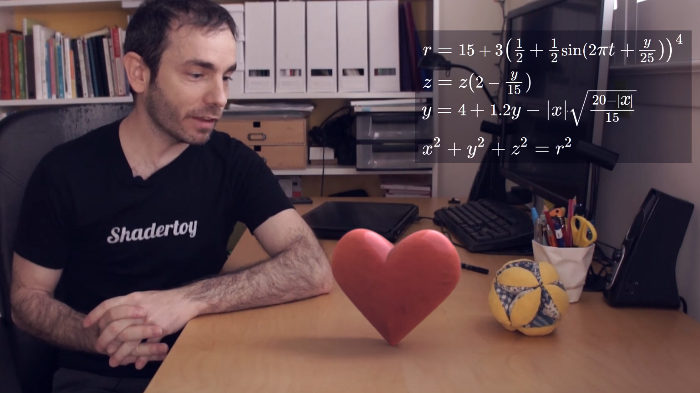](https://www.youtube.com/watch?v=aNR4n0i2ZlM)

If you ever try to win the heart of a mathematician, here some inspiration:

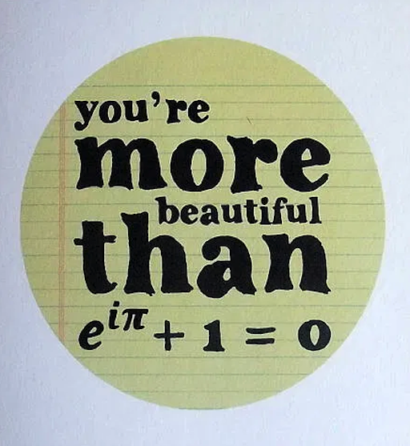  
[[notonthehighstreet]](https://i2.wp.com/www.notonthehighstreet.com/system/product_images/images/001/458/342/original_mathematics-formula-valentine-s-day-card.jpg)  
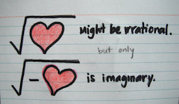  
[[melaniedreams]](https://melaniedreams.files.wordpress.com/2012/02/v1.jpg?w=329&h=192)  
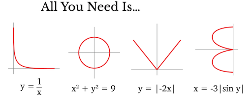  
[[mor.news]](https://mor.news/2019/07/07/all-you-need-is/)  
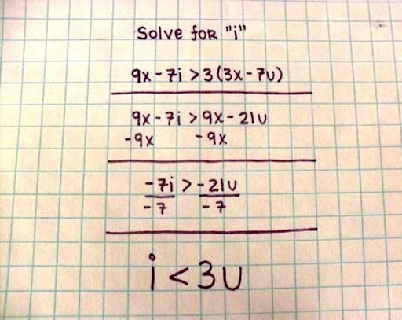  
[[pinimg]](https://i.pinimg.com/originals/1b/cc/d7/1bccd7db44c93fac51ad995aa5996dfd.jpg)  

or [TED Talk: The Mathematics of Love by Hannah Fry.](https://www.ted.com/talks/hannah_fry_the_mathematics_of_love)  

You are welcome.

## Topics

* Transitions
* Primitive Components
* Periodicity

## Learning Objectives

With this chapter, you will

* gain an intuitive understanding of the visual qualities of different operators and function components.
* gain some understanding of how to put the different function components together to create a specific design goal.

*How does the following look like when plotted in a 2D cartesian coordinate system?*

  
[[geogebra]](https://www.geogebra.org/m/Wkjz2X92)  

You are right, [it is Batman!](https://www.youtube.com/watch?v=oaIsCJw0QG8&feature=youtu.be)

[](https://www.geogebra.org/m/Wkjz2X92)  
[[geogebra]](https://www.geogebra.org/m/Wkjz2X92)  

By slicing together different functions, you can archive many different curve designs.

  
[[math.stackexchange]](https://math.stackexchange.com/questions/54506/is-this-batman-equation-for-real)  

For now, we are having a look into somewhat simpler equations.  

The underlying idea is to modify and shape different functions and by combining these we can almost draw anything. Such individually shaped functions can be used for a variety of applications, such as textures, shading, animation, geometry, dance, etc. 

  
[[wiki]](https://en.wikipedia.org/wiki/File:Tiling_procedural_textures.jpg)  

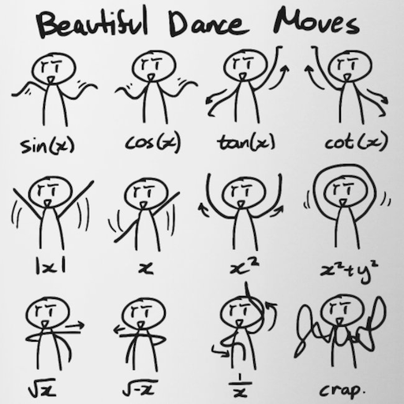  
[[webcomicms]](https://webcomicms.net/clipart-9428627-math-related-pictures)  

We will focus in this script on the generation of 2D graphics but please keep in mind that most functions are equally useful in different contexts and even dimensions.

## 2D Design

Let’s assume we want to color a canvas, meaning giving each pixel a color value, e.g. when computing a texture.

  

To color this area, we can use a 2D function, meaning a function depending on two input parameters such as *x, y* in 3D space. Please note that in the following examples *z* is the up-axis of the coordinate system.

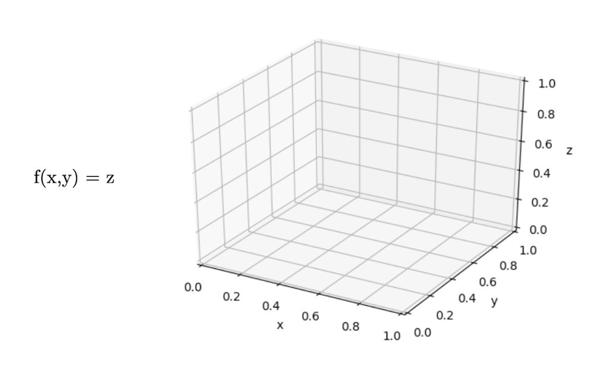  

Then we interpret the value of *f(x,y) = z*, hence *z*, as color value.

For example,

  

with *z* interpreted as color value between 0..1 on a 2D canvas:

.  

Or

  
  

You can imagine this as if looking in -z direction onto the plotted gray value, or as if projecting the plot onto the xy-plane.

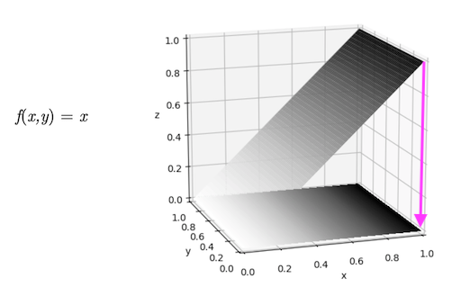  
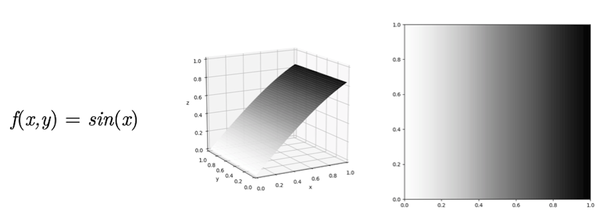  
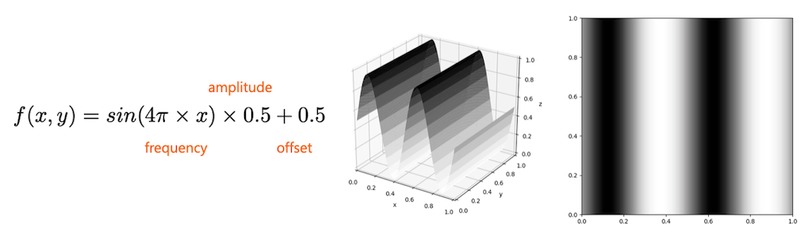  

You could also map the function value to a color range such as

  

Also, the combination of simple  functions can already lead to pleasing patterns

  

In the above plots frequency, amplitude and offset have been adjusted but left out in the equation for simplicity.

```glsl
#ifdef GL_ES
precision mediump float;
#endif

#define PI 3.14159265359
uniform vec2 u_resolution;

void main() {
    vec2 pt = gl_FragCoord.xy/u_resolution;

    // Increase frequency to fit more sin waves 
    // between 0..1
    float verti = sin(8.0 * PI * pt.x);
    float hori = sin(8.0 * PI * pt.y);

    // Create vec3 from value
    vec3 color = vec3(hori + verti);

    // Assign frag color with alpha
    gl_FragColor = vec4(color,1.0);
}
```

Code rendering:  
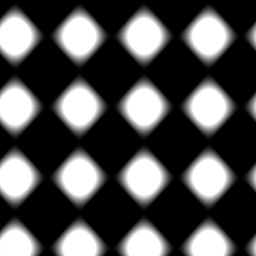  

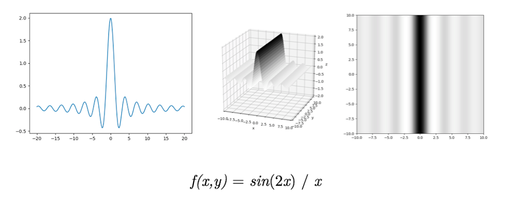  

### Different Dimensions

You will often find examples and explanations in lower dimensions, meaning in 1D, as the graphs for these functions are easier to visualize:

*f(x) = c*

with *c* as the gray or color value.

  
[[tobyschachman]](http://tobyschachman.com/Shadershop/)

How to interpret in this scenarios the needed second dimension depends on the context. Often it is simply left out as an influencing parameter such as in our start example

  

## Transitions

The above examples have already shown one overall principle, namely *how to get from one value to another value* or in our context *how to get from one color (e.g. white) to another color (e.g. black)*?

  

In more general terms we can understand this as defining a transition function *t*:

  

### Step Function

The simplest of transitions is the step function, which switches between values based on a threshold, meaning with a fixed value that *t* is smaller or larger to.

  

```glsl
#ifdef GL_ES
precision mediump float;
#endif

#define PI 3.14159265359
uniform vec2 u_resolution;

void main()
{
    vec2 pt = gl_FragCoord.xy/u_resolution;

    // The following step function returns
    //  0.0 when x is smaller than 0.4 and
    //  1.0 otherwise
    float step_value = step(0.4, pt.x);

    // Our "pattern":
    float hori = sin(8.0 * PI * pt.y);

    // Multiplying 0 or 1 with the pattern
    // depending on the step function value
    vec3 color = vec3(step_value * hori);

    // Assign frag color with alpha
    gl_FragColor = vec4(color,1.0);
}
```

Code rendering:  
  


More often we want a smoother transition, e.g.

  

<!-- TODO: Fix image to have t on horizontal line not diagonal -->

This is called an *interpolation*.

### Linear Interpolation

  

[[1]](https://www.scratchapixel.com/lessons/procedural-generation-virtual-worlds)

```glsl
#ifdef GL_ES
precision mediump float;
#endif

#define PI 3.14159265359
uniform vec2 u_resolution;

void main()
{
    vec2 pt = gl_FragCoord.xy/u_resolution;

    // Our "pattern":
    float hori = sin(8.0 * PI * pt.y);

    // Interpolating between the pattern and 1.
    // depending on the x coordinate, meaning
    // with t = pt.x
    vec3 color = vec3(pt.x * hori + (1.0 - pt.x));

    // Assign frag color with alpha
    gl_FragColor = vec4(color,1.0);
}
```

Code rendering:  
  

### Bilinear Interpolation

  
[[scratchapixel]](https://www.scratchapixel.com/lessons/procedural-generation-virtual-worlds)

A bilinear interpolation is the linear interpolation of two linear interpolations, hence

* two linear interpolations to get `a` and `b` in one direction (here `tx`)
* one linear interpolation of `a` to `b` in the second direction (here `ty)`

```
a = c00 * (1 - tx) + c10 * tx; 
b = c01 * (1 - tx) + c11 * tx; 

c = a * (1) - ty) + b * ty; 
```

Linear and bilinear interpolation is usually called `lerp()`, e.g. [`lerp` in p5](https://p5js.org/reference/#/p5.Vector/lerp) or [`lerp` in vex](http://www.sidefx.com/docs/houdini/vex/functions/lerp.html) or [`mix`](https://www.khronos.org/registry/OpenGL-Refpages/gl4/html/mix.xhtml) in glsl.

### Trilinear Interpolation

  
[[scratchapixel]](https://www.scratchapixel.com/lessons/procedural-generation-virtual-worlds)

A trilinear interpolation is the linear interpolation of two bilinear interpolations.

```
e = bilinear(tx, ty, c000, c100, c010, c110); 
f = bilinear(tx, ty, c001, c101, c011, c111); 

g = e * ( 1 - tz) + f * tz; 
```

By the way, *what is a voxel*?

A voxel is like a pixel but in 3D and represents a value on a regular 3D grid. We need voxels for volumes, for example.

  
[[wiki]](https://en.wikipedia.org/wiki/Voxel)

### Interpolation Functions

To move between values, we have many options. Simply taking different exponents for *t* in a linear interpolations changes the transition between the values notably.

  

For example, in 3D software such as Houdini, there are several interpolations functions to chose from. Here, some comparisons:

  
[[paulbourke]](http://paulbourke.net/miscellaneous/interpolation/)

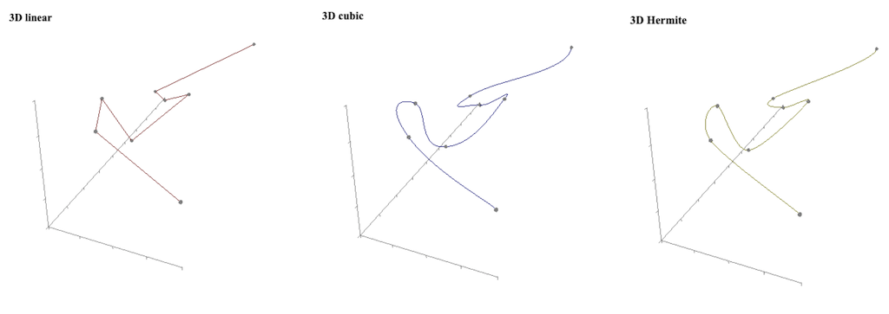  
[[paulbourke]](http://paulbourke.net/miscellaneous/interpolation/)

These different functions lead to different visual designs, depending on the context, e.g. for interpolating between colors for an image or positions for an animation. From left to right, Nearest Neighbor, Bilinear, Lagrange Bicubic interpolation (only interpolates values, not slopes), Hermite Bicubic interpolation:

  
[[demofox]](https://blog.demofox.org/2015/08/15/resizing-images-with-bicubic-interpolation/)  


  
[[gfxile]](http://sol.gfxile.net/interpolation/)  

### Smooth Step

Smoothstep is one of the most commonly used interpolation and clamping function in graphics and is often given as a build-in function from a framework. 

*On a side note:* What is a *clamping* function? In computer graphics, clamping is the process of limiting a value to a range. Unlike wrapping, clamping merely moves the point to the nearest available value. [[2]](https://en.wikipedia.org/wiki/Clamping_(graphics))


*S* is a [sigmoid function](https://en.wikipedia.org/wiki/Sigmoid_function), which is bounded and often used in the context of mapping a potentially indefinite range of values to a range.

Often smoothstep implements a cubic Hermite interpolation after clamping:


```glsl
float smoothstep(float edge0, float edge1, float x)
{
    x = clamp((x, 0.0, 1.0); 
    return x * x * (3 - 2 * x);
}

float clamp(float x, float lowerlimit, float upperlimit)
{
    if (x < lowerlimit)
        x = lowerlimit;
    if (x > upperlimit)
        x = upperlimit;
    return x;
}
```

Smoother Steps is an improved version of the smoothstep function, created by Ken Perlin.

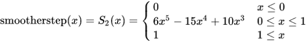


  
[[gfxile]](http://sol.gfxile.net/interpolation/)  

  [[4]](https://cis700-procedural-graphics.github.io/)

[[3]](https://en.wikipedia.org/wiki/Smoothstep)

### Bias and Gain

Bias and gain are parameters that give further control for the fine-tuning of a interpolation function curve. This has been, once again, [Ken Perlin's idea](http://demofox.org/biasgain.html).

#### Bias

Bias represents *how much time is spent at either end of the transition*? The larger the values, the faster grows the value at the beginning.

 

```glsl
float get_bias(float t, float bias)
{
    return (t / (((1.0 / bias) - 2.0) * (1.0 - t)) + 1.0);
}
```

#### Gain

Gain represents *how much time is spent in the middle of the transition*? The larger the value, the slower changes the value around the middle.


```glsl
float get_gain(float t, float gain)
{
    if(t < 0.5)
        return get_bias(t * 2.0, gain) / 2.0;
    else
        return get_bias(t * 2.0 - 1.0, 1.0 - gain) / 2.0 + 0.5;
}
```

 [[4]](https://cis700-procedural-graphics.github.io/)

For further information, read Perlin's blog post [Bias And Gain Are Your Friend](https://blog.demofox.org/2012/09/24/bias-and-gain-are-your-friend/).

### Interpolation in Houdini

In Houdini interpolation is relevant in numerous places, e.g. for the [ramp parameter control](https://www.sidefx.com/docs/houdini/network/ramps.html).

  
[[houdini]](https://www.sidefx.com/docs/houdini/network/ramps.html)  

With the interpolation functions

  

* Constant
    * Holds the value constant until the next key.
* Linear
    * Does a linear (straight line) interpolation between keys.
* Catmull-Rom
    * Interpolates smoothly between the keys. See [Catmull-Rom_spline](https://en.wikipedia.org/wiki/Cubic_Hermite_spline#Catmull%E2%80%93Rom_spline).
* Monotone Cubic
    * Another smooth interpolation that ensures that there is no overshoot. For example, if a key’s value is smaller than the values in the adjacent keys, this type ensures that the interpolated value is never less than the key’s value.
* Bezier
    * Cubic Bezier curve that interpolates every third control point and uses the other points to shape the curve. See [Bezier curve](https://en.wikipedia.org/wiki/B%C3%A9zier_curve).
* BSpline
    * Cubic curve where the control points influence the shape of the curve locally (that is, they influence only a section of the curve). See [B-Spline](https://en.wikipedia.org/wiki/B-spline).
* Hermite
    * Cubic Hermite curve that interpolates the odd control points, while even control points control the tangent at the previous interpolation point. See [Hermite spline](https://en.wikipedia.org/wiki/Cubic_Hermite_spline).

[[5]](http://www.sidefx.com/docs/houdini/hom/hou/rampBasis.html)

### Interpolation in CSS

These discussed principles and properties of interpolation are the same as *easing functions* in CSS.

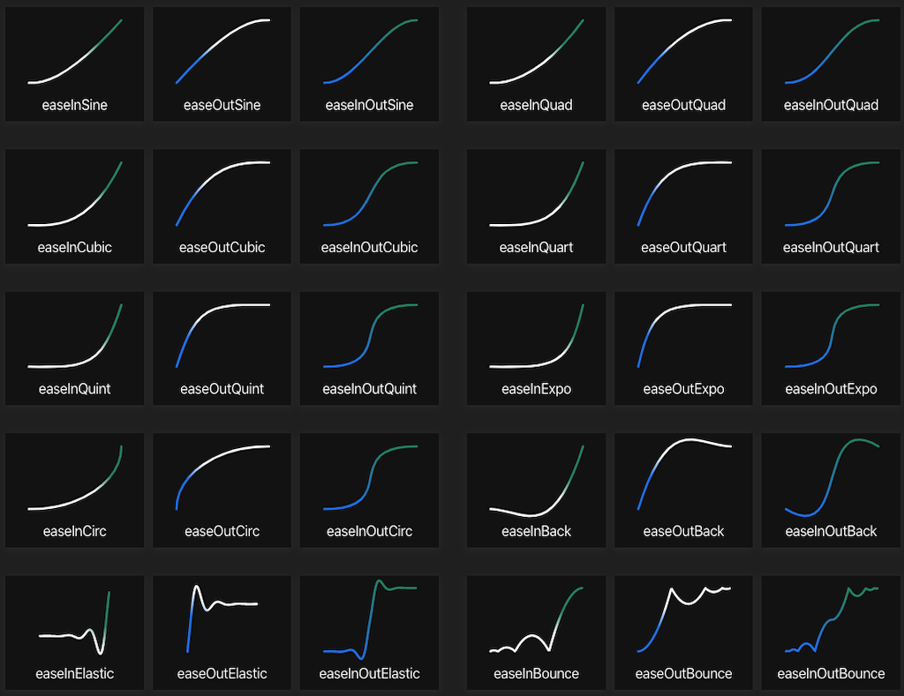  
[[easings]](https://easings.net/)  

## Function Primitive Components

So far, we can only transition from one value or function exemplar to another one. That is a bit boring. The following presents a list of the most commonly used function components for putting together an individual design goal.

A great tool to work with function components and test how to put them together is the [Graph Toy](https://graphtoy.com/).

### Modulo

With modulo you can easily iterate ranges and therefore loops, for example.

```js
y = x % 0.5;
```


### Floor

Floor ignores fraction and creates with that a continuous step function.

```js
y = floor(x);
```


### Sign

Sign extracts the sign of a real number and is therefore either `1` or `-1`.

```js
y = sign(x);

//-1 if x < 0, 0 if x==0, 1 if x > 0
```


### Absolute

The absolute keeps values always positive.

```js
y = abs(x);
```


### Min and Max

Min and Max are used to define lower and upper borders.

```js
y = min(x, 0.5);

y = min(x, 0.2);
```


## Periodicity

Often times we want to repeat certain visual features, which can be done in its simplest form e.g. with a `sin` function. However, there are several other design options. The following functions are also often called *wave functions*.


  
[[wiki]](https://en.wikipedia.org/wiki/Square_wave#/media/File:Waveforms.svg)

Wave functions have two common properties

* frequency (“*how often*”), and
* amplitude (“*how much*”).

used as

```glsl
(t * frequency) % amplitude;
```


### Square

The square wave enables a sharp oscillation between two values.

```glsl
float wave_square(float t, float frequency, float amplitude)
{
  return floor(t* frequency) % 2 * amplitude;
}
```


### Sawtooth

The sawtooth wave enables a jagged oscillation — a value increases linearly and then resets.

```glsl
float waveSawTooth(float t, float frequency, float amplitude)
{
  return (t * frequency - floor(t* frequency)) * amplitude;
}
```


### Triangle

The triangle wave enables a linear oscillation between two values.

```glsl
float waveTriangle(float t, float frequency, float amplitude)
{
  return abs((t * frequency) % amplitude - (0.5 * amplitude));
}
```


Again, the formula starts with:

```glsl
float waveTriangle(float t, float frequency, float amplitude)
{
  return ((t * frequency) % amplitude);
}
```


Then, we scale the triangle site by half in order to fit two of them :

```glsl
float waveTriangle(float t, float frequency, float amplitude)
{
  return ((t * frequency) % amplitude - (0.5 * amplitude));
}
```


Lastly, we take the `abs` value in order to repeat the triangle site in the other direction:

```glsl
float waveTriangle(float t, float frequency, float amplitude)
{
  return abs((t * frequency) % amplitude - (0.5 * amplitude));
}
```


## Advanced Shapes

There are various other [function shapes](http://www.iquilezles.org/www/articles/functions/functions.htm), which you could integrate into your design. The following examples are somewhat advanced and it is fine if you just skim through them and come back to them in case of need.

### Pulse

The pulse function mimics a gaussian shape. Parameters:

* `c` controls centering
* `w` controls taper length

This function is useful for isolating a feature or for turning something on and off.

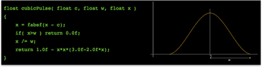  
[[iquilezles]](http://www.iquilezles.org/www/articles/functions/functions.htm)

### Parabola

The parabola function remaps the `[0, 1]` interval such that `f(0) = f(1) = 0` and `f(1/2) = 1`. Parameters:

* `k` controls steepness


Similar to pulse, use this function for symmetric shapes and for turning something on and off.

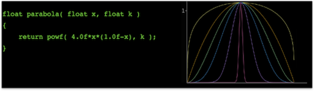  
[[iquilezles]](http://www.iquilezles.org/www/articles/functions/functions.htm)


### Impulse

The impulse function reaches a maximum value and then gradually decays. Parameters:

* `k` controls the rate of decay

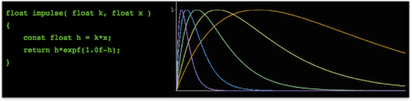  
[[iquilezles]](http://www.iquilezles.org/www/articles/functions/functions.htm)

### Power Curve

The power curve function skews a pulse-like curve to one side. Parameters:

* `a` and `b` control the bias toward either side

This function is good for creating shapes and for nudging signals off-center.

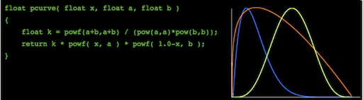  
[[iquilezles]](http://www.iquilezles.org/www/articles/functions/functions.htm)

### Sinc Curve

The sinc curve function is a phase shifter. Parameters:

* `k` tweaks the amount of bounces

This function is useful for e.g. the creation of bounces.

  
[[iquilezles]](http://www.iquilezles.org/www/articles/functions/functions.htm)

[[6]](http://www.iquilezles.org/www/articles/functions/functions.htm)

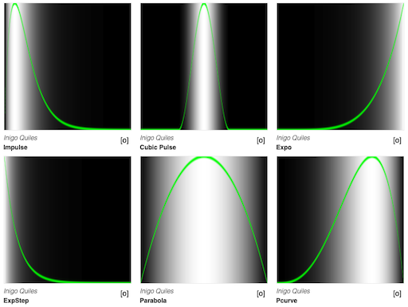  
[[thebookofshaders]](https://thebookofshaders.com/05/)


More functions

* [Polynomial Shaping Functions](http://www.flong.com/texts/code/shapers_poly/)
* [Exponential Shaping Functions](http://www.flong.com/texts/code/shapers_exp/)
* [Circular & Elliptical Shaping Functions](http://www.flong.com/texts/code/shapers_circ/)
* [Bezier and Other Parametric Shaping Functions](http://www.flong.com/texts/code/shapers_bez/)

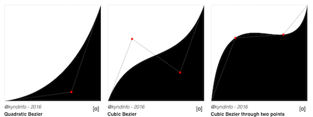  
[[thebookofshaders]](https://thebookofshaders.com/05/)

<!--   
[[Creation by Silexars]](https://www.shadertoy.com/view/XsXXDn) -->

[[7]](https://thebookofshaders.com/)  

## Design Goals

To understand the above described different components is hopefully with some brain power manageable. But putting components together can be quite daunting. Also, don't be scared away by cryptic examples you will find on the web. Function design code is notoriously difficult to read as it is often optimized for performance.

The best side for finding shader inspirations is [Shadertoy](https://www.shadertoy.com/) run by Inigo Quilez. ShaderToy is packed with very good examples (but also some bad ones...) and code to steal. Unfortunately, ShaderToy is slightly its own world with different variables namings and core functions. We will come back to the awesomeness that is ShaderToy in the Shader Programming workshop.

Whenever you find function designs that you would like to understand, you should try to find the overall *gist* of the design.

*How to find the gist of a function design?*

Divide and conquer:

* Test different values for constants and defines
* Separate functionalities, e.g. turn of animation, sound, interaction etc.
* Go line by line and display the result of each line separately
* Take out all scaling factors, offsets, etc.

Here, only practice and patience help.  

Then, at some point you will not only be as happy as this blobby creature but you might also be able to program this fully procedurally generated scene (including the renderer and such!), which is one of [the masterpieces of Inigo Quilez](https://www.shadertoy.com/view/3lsSzf).

  
[[Happy Jumping by Iq]](https://www.shadertoy.com/view/3lsSzf)

If you are interested in how Inigo build this scene, there is a 6 hours (!) recorded live stream, deconstructing the [Happy Jumping mathematical animation](https://www.youtube.com/watch?v=Cfe5UQ-1L9Q). I tried to watch the video several times but terribly failed each time. Inigo might be a shader mastermind, didactically he is not always.

## Example

In this example, I am walking you through the steps to re-create this subtle pattern. It is a fairly easy design but include several of the most common approaches when putting functions together.

  

*What do you see? What could be the steps to recreate this pattern?*

### One Cell

When working on repetitive patterns, one usually starts with one cell and repeats that cell in a second step.  

Let's start with creating a circle by plotting the distance of each coordinate to the center point `0.5`, `0.5`.

* The [`distance()`](https://www.khronos.org/registry/OpenGL-Refpages/gl4/html/distance.xhtml) function calculates the distance between two points.
* The [`mix()`](https://www.khronos.org/registry/OpenGL-Refpages/gl4/html/mix.xhtml) function linearly interpolate between two values.


```glsl
#ifdef GL_ES
precision mediump float;
#endif

uniform vec2 u_resolution;
uniform float u_time;

float CELLSIZE = 0.2; //relative, hence 0..1
vec2 OFFSET = vec2(0.3);

void main()
{

    vec2 coord = gl_FragCoord.xy/u_resolution;

    // 1. One Cell, distance to center point
    float d = distance(coord, vec2(0.5));

    vec3 color = mix(vec3(0.5, 0.0, 0.0), vec3(0.35, 0.2, 0.5), d);
    gl_FragColor = vec4(color, 1.0);
}
```

  

Next, let's create ridges with the [`floor`](https://www.khronos.org/registry/OpenGL-Refpages/gl4/html/floor.xhtml) function.

```glsl
#ifdef GL_ES
precision mediump float;
#endif

uniform vec2 u_resolution;
uniform float u_time;

float CELLSIZE = 0.2; //relative, hence 0..1
vec2 OFFSET = vec2(0.3);

void main()
{

    vec2 coord = gl_FragCoord.xy/u_resolution;

    // 2. Ridges
    float d = distance(coord, vec2(0.5));
    d *= 8.0;
    d -= floor(d);

    vec3 color = mix(vec3(0.5, 0.0, 0.0), vec3(0.35, 0.2, 0.5), d);
    gl_FragColor = vec4(color, 1.0);
}
```

  

### Repetitive Cells

Next, let's create the cells by dividing the 0..1 original x,y coordinate by the cell size.

```glsl
#ifdef GL_ES
precision mediump float;
#endif

uniform vec2 u_resolution;
uniform float u_time;

float CELLSIZE = 0.2; //relative, hence 0..1
vec2 OFFSET = vec2(0.3);

void main()
{

    vec2 coord = gl_FragCoord.xy/u_resolution;

    // 3. Create Cells
    // Get into one cell
    float x = coord.x / CELLSIZE;
    float y = coord.y / CELLSIZE;
    x -= floor(x);
    y -= floor(y);
    
    float d = distance(vec2(x, y), vec2(0.5));
    d *= 8.0;
    d -= floor(d);

    vec3 color = mix(vec3(0.5, 0.0, 0.0), vec3(0.35, 0.2, 0.5), d);
    gl_FragColor = vec4(color, 1.0);
}
```

  

Now, we simply move the center point (the one that we are computing the distance to for the circles).

```glsl
#ifdef GL_ES
precision mediump float;
#endif

uniform vec2 u_resolution;
uniform float u_time;

float CELLSIZE = 0.2; //relative, hence 0..1
vec2 OFFSET = vec2(0.3);

void main()
{

    vec2 coord = gl_FragCoord.xy/u_resolution;

    // 4. Move center point by OFFSET to compute distance to
    float x = coord.x / CELLSIZE;
    float y = coord.y / CELLSIZE;
    x -= floor(x);
    y -= floor(y);
    
    float d = distance(vec2(x, y), OFFSET);
    d *= 8.0;
    d -= floor(d);

    vec3 color = mix(vec3(0.5, 0.0, 0.0), vec3(0.35, 0.2, 0.5), d);
    gl_FragColor = vec4(color, 1.0);
}
```

  


Lastly, we want to repeat the pattern within the cell as well and also flip it. For this we remap the original value range from 0..1 to -1..1 and take the absolute of those values.

```glsl
#ifdef GL_ES
precision mediump float;
#endif

uniform vec2 u_resolution;
uniform float u_time;

float CELLSIZE = 0.2; //relative, hence 0..1
vec2 OFFSET = vec2(0.3);

void main()
{

    vec2 coord = gl_FragCoord.xy/u_resolution;

    
    // 5a. Remapping the range

    float x = coord.x / CELLSIZE;
    float y = coord.y / CELLSIZE;
    x -= floor(x);
    y -= floor(y);

    // Modify value range from 0..1 to -1..1
    float x_remap = (x - 0.5) * 2.0;
    float y_remap = (y - 0.5) * 2.0;
    
    float d = distance(vec2((x_remap), (y_remap)), OFFSET);
    d *= 8.0;
    d -= floor(d);

    vec3 color = mix(vec3(0.5, 0.0, 0.0), vec3(0.35, 0.2, 0.5), d);
    gl_FragColor = vec4(color, 1.0);
}
```

  

... and taking the absolute of the new value range

```glsl
#ifdef GL_ES
precision mediump float;
#endif

uniform vec2 u_resolution;
uniform float u_time;

float CELLSIZE = 0.2; //relative, hence 0..1
vec2 OFFSET = vec2(0.3);

void main()
{

    vec2 coord = gl_FragCoord.xy/u_resolution;

    
    // 5a. Remapping the range to -1..1
    // 5b. and taking the absolute values

    float x = coord.x / CELLSIZE;
    float y = coord.y / CELLSIZE;
    x -= floor(x);
    y -= floor(y);

    // Modify value range from 0..1 to -1..1
    float x_remap = (x - 0.5) * 2.0;
    float y_remap = (y - 0.5) * 2.0;
    
    float d = distance(vec2(abs(x_remap), abs(y_remap)), OFFSET);
    d *= 8.0;
    d -= floor(d);

    vec3 color = mix(vec3(0.5, 0.0, 0.0), vec3(0.35, 0.2, 0.5), d);
    gl_FragColor = vec4(color, 1.0);
}
```

  

I hope you didn't go blind by this example... sorry.


## Next

Next we are going to add one more brush to our tool box: noise functions!

.center[  [[thebookofshaders]](https://thebookofshaders.com/11/)]


---

## References

[[1] Scratch a Pixel](https://www.scratchapixel.com/lessons/procedural-generation-virtual-worlds)  
[[2] Wiki - Clamping](https://en.wikipedia.org/wiki/Clamping_(graphics))  
[[3] Wiki - Smooth Step](https://en.wikipedia.org/wiki/Smoothstep)  
[[4] CIS 700 - Special Topics in Computer Graphics, University of Pennsylvania, Rachel Hwang](https://cis700-procedural-graphics.github.io/)  
[[5] Houdini Docs - Ramp Basics](http://www.sidefx.com/docs/houdini/hom/hou/rampBasis.html)  
[[6] Inigo Quilez - Functions](http://www.iquilezles.org/www/articles/functions/functions.htm)  
[[7] Vivo, Patricio Gonzalez, and Lowe, Jen (2015). The Book of Shaders.](https://thebookofshaders.com/)  
[[8] Floersch, Brian (2019). Intro to 2D signed distance functions and drawing touch controls with the GPU](https://blog.sb1.io/intro-to-2d-signed-distance-functions/)  
[[9] Böhringer, Ronja (2018). 2D Signed Distance Field Basics](https://www.ronja-tutorials.com/2018/11/10/2d-sdf-basics.html)  


---

The End

📐 🔵 ➕ 🔸 🟩  
