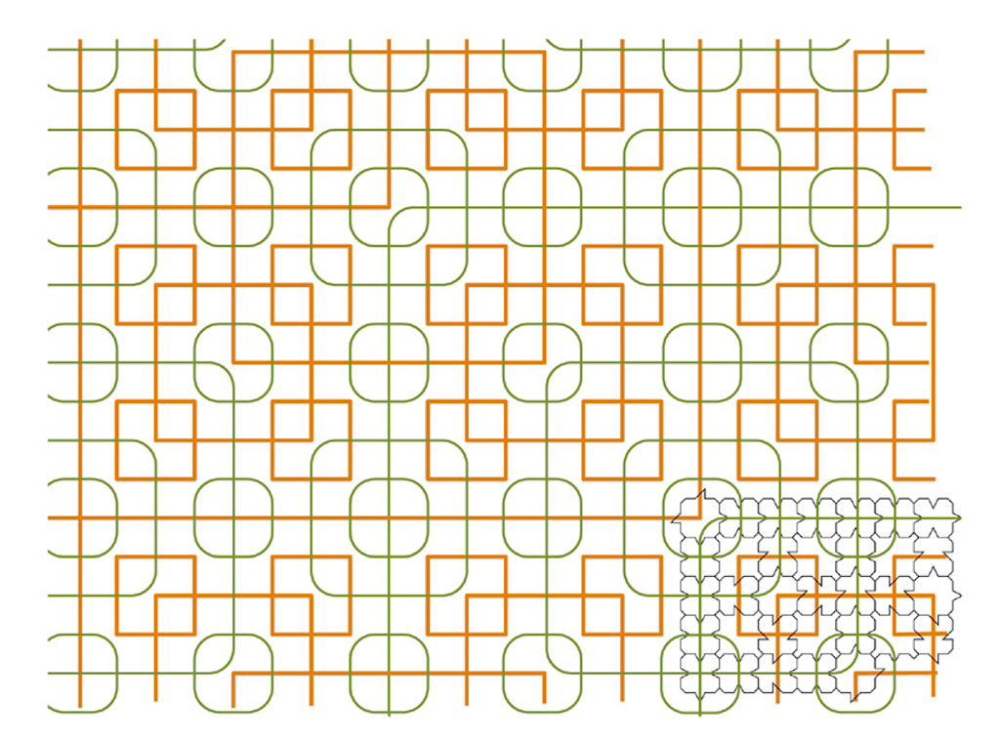
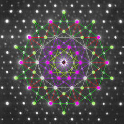
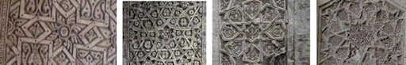

# Procedural Generation and Simulation

Prof. Dr. Lena Gieseke \| l.gieseke@filmuniversitaet.de \| Film University Babelsberg KONRAD WOLF

# Chapter 05 - Tilings and The Universe

* [Procedural Generation and Simulation](#procedural-generation-and-simulation)
* [Chapter 05 - Tilings and The Universe](#chapter-05---tilings-and-the-universe)
    * [Learning Objectives](#learning-objectives)
    * [Tilings](#tilings)
        * [Prototiles](#prototiles)
        * [Symmetries](#symmetries)
        * [Symmetry Groups](#symmetry-groups)
        * [Periodic Tilings](#periodic-tilings)
        * [Non-Periodic Tilings](#non-periodic-tilings)
        * [Aperiodic Tilings](#aperiodic-tilings)
        * [Penrose Tilings](#penrose-tilings)
            * [Crystallography](#crystallography)
        * [Final Thoughts](#final-thoughts)
    * [Islamic Art](#islamic-art)
        * [Calligraphy](#calligraphy)
        * [Arabesque](#arabesque)
        * [Geometry](#geometry)
        * [Tilings](#tilings-1)
    * [Composition](#composition)
        * [Construction Example](#construction-example)
        * [Final Thoughts](#final-thoughts-1)
        * [Adapting Patterns to the Modern World](#adapting-patterns-to-the-modern-world)
    * [Sacred Geometry](#sacred-geometry)
        * [The Pentagram of Venus](#the-pentagram-of-venus)
        * [The Seed of Life](#the-seed-of-life)
        * [Motion Art Therapy](#motion-art-therapy)
    * [References](#references)

This chapter aims to give insights about tilings and geometric designs. Islamic art is one of, if not the most prominent application of such design goals. These specific design goals, tilings and geometry, are the driving factor for my selection of topics in this chapter. Other cultures and religions also include patterns - but less prominently than the Islamic culture. That is why I haven't included any of the other world religions. Also, it is a questionable approach that I discuss Islamic designs side by side with the more esoteric topic of sacred geometry. I mean no offense - once again, this collection is made based on visuals and not meanings! 

## Learning Objectives

* Know about the formal world of tilings and be aware of their mathematical complex constructions
* Know which terms to investigate if you are further interested in the formal aspects of tilings
* Understand the design of Islamic art and its characteristics
* Be able to construct an Islamic design (this comes more through the exercise though)
* Learn about contexts and Islamic of geometry

---

## Tilings

The problem of tiling a plane has fascinated builders and mathematicians alike since time immemorial. [[20]](https://www.technologyreview.com/2010/03/25/205077/first-aperiodic-tiling-with-a-single-shape/)

This upcoming section about tilings is more meant as a brief introduction, so that you have heard about it and might dive into it on your own time if you ever need advanced tiling techniques. I don't expect you to follow the nitty-gritty (and actually quite complex) details in the following. Also, again, I want to show you that many patterns are not just pretty but visualize heavy-duty maths. Last but not least, I want to introduce you to topics, which go beyond the average *hey I made a processing grid pattern for the zillionst time*. Mastering topics such as the following tillings will give you access to more unique and complex visuals. But like I said, going further with this topic is optional, I do not require you to (and I, myself, am just starting to work with advanced (aperiodic) tilings...)(do you want to join a study group with me? 😊).

Given a bunch of little pieces, it is human nature to wonder how they fit together. In the most general sense of the word, a tiling is just a way of decomposing some space into lots of little pieces that fit together without gaps or overlaps.  

Hence, as definition, a flat surface with some pattern of geometric shapes (*tiles*), with no overlaps or gaps, is called a *tiling* or a *tesselation* (we will use the terms tiling and tesselation interchangeably). There is one more detail to add to this definition – we want a tile to consist of a single connected piece without holes or lines (for example, we don't want to think of two disconnected pieces as being a single tile). 
  
Tilings have been widely used and they show up in many places in the world around us, from the tiles on our kitchen floors to the bees' honeycombs. Most humans perceive the repetitive quality of tilings as visually pleasing.  

The first systematic mathematical treatment of tilings was that of Kepler in his [Harmonices Mundi](https://en.wikipedia.org/wiki/Harmonices_Mundi) (Latin: The Harmony of the World, 1619). 

The most familiar tilings, such as covering a floor with squares meeting edge-to-edge, are examples of *monohedral* tilings. A *monohedral* tiling is one in which all the tiles are the same shape. Tilings with a single type of regular polygon as tile is possible only with triangles, squares and hexagons.

  
[[pi.math.cornell]](http://pi.math.cornell.edu/~mec/2008-2009/KathrynLindsey/PROJECT/Page2.htm)

Think about it: how would you repeat evenly a regular pentagon?

  

### Prototiles

Tilings can be made of of more than one tile. In the mathematical theory of tessellations, a *prototile* is one of the shapes of a tile in a tessellation. A set of prototiles is said to *admit a tiling* or to *tile the plane* if there is a tiling of the plane using only these shapes. A *dihedral* tiling is a tiling in which every tile is congruent (meaning roughly, the same size and shape) to one or the other of two distinct prototiles.

  
[[wiki]](https://en.wikipedia.org/wiki/Penrose_tiling#/media/File:RegularRhombs.svg) *Part of a periodic tiling with two prototiles is called a dihedral tiling.*

  
[[pi.math.cornell]](http://pi.math.cornell.edu/~mec/2008-2009/KathrynLindsey/PROJECT/Page2.htm) *Dihedral tiling whose prototiles are two squares of different sizes.*

 Similarly, *trihedral*, *4-hedral*, ..., *n-hedral* tilings refer to tilings in which there are *3, 4, ..., n* distinct prototiles, respectively. 

  
[[oreilly]](https://www.oreilly.com/library/view/classical-geometry-euclidean/9781118679142/OEBPS/c12.htm) *The tiling has a set of three prototiles, so it is called an order-3 or a trihedral tiling.*

[[13]](http://pi.math.cornell.edu/~mec/2008-2009/KathrynLindsey/PROJECT/Page1.htm) 
[[14]](http://www.ams.org/publicoutreach/feature-column/fcarc-penrose) 

Recognizing the *fundamental unit*, meaning the repeating *tile* of a pattern is a crucial step for constructing it. And in the other way around, it is necessary to understand how the repetition of a tile will look like, when designing a tile. You will need to differentiate the shape of a tile, and what is shown on the tile. These two aspects are dependent, but often different. Also, many have more than one solution of how the tiles and designs might look like. The above trihedral tiling could also be recreated as the following:

  
[[ams]](http://www.ams.org/publicoutreach/feature-column/fcarc-penrose) *Monohedral tiling with parallelograms.*

  
[[wiki]](https://en.wikipedia.org/wiki/Translational_symmetry)

The following tiling can be understood as being generated from the triangle by using translations and rotations, also called *translational and rotational symmetries* whereas it can also be generated from the hexagon by using only translations, hence *translational symmetries*.

  
[[wiki]](https://en.wikipedia.org/wiki/Aperiodic_set_of_prototiles#/media/File:Fund_un_prim_cell.svg)

### Symmetries

Tilings possess *symmetries*. Understanding symmetries is important for any kind of pattern, not only for tilings. For example, looking at the parallelogram example above, notice how the region inside each parallelogram is the same. We could pick up a copy of a tiling, shift it in some direction (without rotating it), and when we put the copy down again it matches up exactly with the original. In this case, this shift is a translation and we say that this translation is a symmetry of the tiling. *Translational symmetry* of an object means that a particular translation does not change the object. 

  
[[wiki]](https://en.wikipedia.org/wiki/Translational_symmetry) *Translation symmetry or invariance: The shapes of *A* and *A+t* are the same.*

There are *rotational symmetries* as well. For instance, there is 3-fold rotational symmetry about the center of any of the triangles, 4-fold symmetry about the centers of the squares and 6-fold symmetry about the center of the hexagons. An *n* fold rotational symmetry operation rotates an object by *360°/n*.

  
[[doitpoms]](https://www.doitpoms.ac.uk/tlplib/crystallography3/symmetry.php?printable=1)

The transformations that do not change the shape of a given object form a group, which is called the *symmetry group*. 

### Symmetry Groups

The symmetry group of a geometric object is the group of all transformations under which the object is *invariant*, meaning that the object remains unchanged. 

For example, the following table describes all ten symmetries that can be applied to a regular pentagon:

  
[[mathonline]](http://mathonline.wikidot.com/the-group-of-symmetries-of-the-pentagon) *The top five symmetries correspond to counterclockwise rotations of 0°, 72°, 144°, 216°, and 288° respectively. The bottom five symmetries corresponding to axial flips along the five axes of symmetry drawn in earn of the bottom five pentagons.*

In comparison have a look at symmetry group of a regular hexagon from the website [Hexnet - Global Hexagonal Awareness Resource Center](https://hexnet.org/) (did you know that [March is hexagonal awareness month](https://hexnet.org/content/hexagonal-awareness-month-2012)? We missed it!).

The symmetry group of a regular hexagon consists of six rotations and six reflections:

  
[[hexnet]](https://hexnet.org/content/symmetry-group-regular-hexagon)

<!-- The composition of two or more symmetries is itself one of the twelve symmetries. Below you see a table of hexagonal rotation and reflection compositions. Note that any combination of two or more of these operations will still result in one of these twelve configurations. While rotations are commutative (meaning changing the order of the operands does not change the result) in two dimensions, reflections are not, so any composition of symmetries involving reflection is dependent on the order in which they are applied. In the table below, the row operation is applied before the column operation.

  
[[hexnet]](https://hexnet.org/content/symmetry-group-regular-hexagon) -->

### Periodic Tilings

A tiling is said to be *periodic* if there exist, among the symmetries of the tiling, at least two translations in non-parallel directions. 

The tiling below is an example of a periodic tiling; the green arrows indicate two non-parallel translations that are symmetries of the tiling. 

  
[[pi.math.cornell]](http://pi.math.cornell.edu/~mec/2008-2009/KathrynLindsey/PROJECT/Page2.htm)

Also, an example of a periodic tiling:

  
[[pi.math.cornell]](http://pi.math.cornell.edu/~mec/2008-2009/KathrynLindsey/PROJECT/Page2.htm)

[[13]](http://pi.math.cornell.edu/~mec/2008-2009/KathrynLindsey/PROJECT/Page1.htm)  

### Non-Periodic Tilings

A *non-periodic* tiling can not simply be constructed based on two translations in non-parallel directions.

The monohedral tiling (top, left) and the dihedral tiling (top, bottom) are examples of non-periodic tilings.  

  
[[pi.math.cornell]](http://pi.math.cornell.edu/~mec/2008-2009/KathrynLindsey/PROJECT/Page2.htm) *Above, the central star occurs nowhere else in the tiling, and so no translations are possible.*

Non-periodic:  
  
[[pi.math.cornell]](http://pi.math.cornell.edu/~mec/2008-2009/KathrynLindsey/PROJECT/Page2.htm)

Mathematicians have a lot of fun with the formal site of tilings. For example, they might want to prove how many distinct monohedral tilings a given prototile admits to.  

Some tiles, for example, only admit one tiling. For the following tiles, there is only one way to use it to tile the plane.

   
[[pi.math.cornell]](http://pi.math.cornell.edu/~mec/2008-2009/KathrynLindsey/PROJECT/Page2.htm)

Some prototiles admit precisely two distinct monohedral tilings; such tiles are called *dimorphic*.  A prototile is said to be trimorphic if it admits precisely three distinct monohedral tilings, and *n-morphic* if it admits precisely *n* distinct monohedral tilings, where *n* is a positive integer. 

  
[[pi.math.cornell]](http://pi.math.cornell.edu/~mec/2008-2009/KathrynLindsey/PROJECT/Page2.htm) *An example of two tilings admitted by a dimorphic prototile.*

So, now mathematicians are still scratching their heads about so far unanswered questions such as 

> For every positive integer n, is it possible to find a tile which is n-morphic?

> Does there exist a tile that admits to a countable infinity of distinct tilings (but not uncountably many)? 

An infinite set is said to be countably infinite if the elements of that set are in one-to-one correspondence with the positive integers.  In other words, a set is countably infinite if you can make an (infinitely long) list of all the elements of that set. The square, for example, does not satisfy this question, as it admits to uncountable distinct tilings.

Feel free to give it a try answering these questions! 😁

[[13]](http://pi.math.cornell.edu/~mec/2008-2009/KathrynLindsey/PROJECT/Page1.htm)  

### Aperiodic Tilings

  
[[aperiodictiling]](https://www.aperiodictiling.org/wpaperiodictiling/) *Penrose rhomb tile*

Squares, triangles, hexagons all do the trick producing well known periodic structures. Ditto any number of irregular shapes and combinations of them. A much more complex question is to ask which shapes can tile a plane in a pattern that does not repeat? [[20]](https://www.technologyreview.com/2010/03/25/205077/first-aperiodic-tiling-with-a-single-shape/)

Such a non-repeating pattern, is call an *aperiodic* tiling, which is a non-periodic tiling (meaning not constructable by simple translations) with the additional property that it does not contain arbitrarily large periodic patches. Shifting an aperiodic tiling cannot produce the same tiling. A set of prototiles is aperiodic if copies of these tiles can form only non-periodic tilings.  

There are only a few constructions of aperiodic tilings known. The first aperiodic set was constructed by Robert Berger in 1966 and it contained 20426 prototiles!  

The next obvious question is 
> Can we find a smaller set of aperiodic prototiles?  

and, in particular,

> What is the smallest number of prototiles necessary to tile the plane aperiodically?
 
After Berger's discovery, various mathematicians considered this question and discovered sets of aperiodic prototiles with fewer and fewer prototiles.  

One well-known set of six aperiodic prototiles was in 1971 by [Raphael M. Robinson](https://en.wikipedia.org/wiki/Raphael_M._Robinson). The set is a *aperiodic hierarchical tiling*, meaning something along the lines of *a set of tiles admitting only non-periodic tilings with a hierarchical structure*.

  
[[wiki]](https://en.wikipedia.org/wiki/Penrose_tiling#/media/File:Robinson_tiles.svg) *The Robinson Tiles*

Any tiling by these tiles can only exhibit a hierarchy of squares: each orange square is at the corner of a larger orange square, ad infinitum. Any translation must be smaller than some size of square, and so cannot leave any such tiling unchanged 🤯.

  
[[wiki]](https://en.wikipedia.org/wiki/Aperiodic_tiling#/media/File:Robinson_tiling.jpg)

The most famous example of aperiodic tilings are known as *Penrose tilings*, discovered by [Roger Penrose](https://en.wikipedia.org/wiki/Roger_Penrose) in the 1970s, having only two prototiles. The current record for the lowest number of prototiles in a aperiodic set is two (such as the Penrose tilings); it is not known whether there exists a single prototile that tiles the plane aperiodically.

[[12]](https://en.wikipedia.org/wiki/Aperiodic_tiling)  

### Penrose Tilings

Not only are [Penrose tilings](https://en.wikipedia.org/wiki/Penrose_tiling) aperiodic, they have no translational symmetry at all – meaning that their group of symmetries does not include a translation in any direction. So imagine it somewhat as a tiling - with no gaps or overlapping - without ever repeating itself! 

The original form of Penrose tiling used tiles of six different prototiles (P1), but this was later reduced to only two shapes: either two different rhombi (Rhombus tiling - P3, see the example above), or two different quadrilaterals called kites and darts (Kite and dart tiling - P2).

The different forms have many common features. In each case, the tiles are constructed from shapes related to the pentagon (speaking of pentagon: the diagonals of a convex regular pentagon are in the *golden ratio* to its sides - hence penrose tilings are said to relate to the golden ratio...), but the basic tile shapes need to be supplemented by matching rules in order to tile aperiodically.

  
[[wiki]](https://en.wikipedia.org/wiki/Penrose_tiling#/media/File:Penrose_Tiling_(P1).svg) *P1 tiling using Penrose's original set of six prototiles.*

  
[[wiki]](https://en.wikipedia.org/wiki/Penrose_tiling#/media/File:Penrose_Tiling_(Rhombi).svg) *P3 tiling using two rhombuses.*

  
[[wiki]](https://en.wikipedia.org/wiki/Aperiodic_set_of_prototiles#/media/File:Penrose_tiling.svg) *P3 tiling using two rhombuses.*
<!-- 
#### Example Kite and Dart Tiling

Both the kite and dart are composed of two triangles, based on the following principles:

  
[[wiki]](https://en.wikipedia.org/wiki/Penrose_tiling#/media/File:Kite_Dart.svg)

The matching rules can be described in several ways. One approach is to color the vertices (with two colors, e.g., black and white) and require that adjacent tiles have matching vertices [30, as cited in [[15]](https://en.wikipedia.org/wiki/Penrose_tiling)]. Another is to use a pattern of circular arcs (as shown above left in green and red) to constrain the placement of tiles: when two tiles share an edge in a tiling, the patterns must match at these edges [20, as cited in [[15]](https://en.wikipedia.org/wiki/Penrose_tiling)].

There are only seven possible ways for the tiles to meet at a vertex; two of these figures, see image below – namely, the "star" (top left) and the "sun" (top right) – have 5-fold dihedral symmetry (by rotations and reflections), while the remainder have a single axis of reflection (vertical in the image) [32, as cited in [[15]](https://en.wikipedia.org/wiki/Penrose_tiling)]. Apart from the ace and the sun, all of these vertex figures force the placement of additional tiles.

  
[[wiki]](https://en.wikipedia.org/wiki/Penrose_tiling#/media/File:Penrose_vertex_figures.svg)

  
[[wiki]](https://en.wikipedia.org/wiki/Penrose_tiling#/media/File:Penrose_vertex_figures.svg) *P2 Penrose tiling. Created by applying several [deflations](https://en.wikipedia.org/wiki/Penrose_tiling#Inflation_and_deflation) (we will not get into inflations and deflations).* -->

[[15]](https://en.wikipedia.org/wiki/Penrose_tiling) 
[[14]](http://www.ams.org/publicoutreach/feature-column/fcarc-penrose) 

#### Crystallography

Though Penrose tilings grew out of recreational mathematics, they were soon discovered to explain certain phenomena in [crystallography](https://en.wikipedia.org/wiki/Crystallography), the study of solids that are ordered at the atomic level.  

In 1982, [Dan Shechtman](https://en.wikipedia.org/wiki/Dan_Shechtman) and his associates discovered new structures in crystals, which were ordered but not periodic, opening the field of quasiperiodic crystals. A quasicrystalline pattern can continuously fill all available space, but it lacks translational symmetry. Sounds familiar? Yes, these are the same structures as Penrose tilings! The discovery of these aperiodic forms in nature has produced a paradigm shift in the fields of crystallography. Before Shechtman, all crystals were considered to be periodic.

   
[[wiki]](https://en.wikipedia.org/wiki/Quasicrystal) *Electron diffraction pattern of an icosahedral Ho–Mg–Zn quasicrystal, in short an example for a quasicrystal.*

  
[[Uwe Grimm]](http://mcs.open.ac.uk/ugg2/quasi.shtml)) *Quasicrystal diffraction patterns. Beautiful, isn't it?*

*On a side note:* Shechtman experienced open hostility from his research community when first publishing his non-periodic interpretation.

> "For a long time it was me against the world," he said. "I was a subject of ridicule and lectures about the basics of crystallography. The leader of the opposition to my findings was the two-time Nobel Laureate Linus Pauling, the idol of the American Chemical Society and one of the most famous scientists in the world. For years, 'til his last day, he fought against quasi-periodicity in crystals. He was wrong, and after a while, I enjoyed every moment of this scientific battle, knowing that he was wrong." [16, as cited in [[16]](https://en.wikipedia.org/wiki/Dan_Shechtman)]

Linus Pauling is noted saying 

> There is no such thing as quasicrystals, only quasi-scientists. [17 as cited in [[16]](https://en.wikipedia.org/wiki/Dan_Shechtman)]. 
 
The head of Shechtman's research group told him to "go back and read the textbook" and a couple of days later "asked him to leave for 'bringing disgrace' on the team." [19 as cited in [[16]](https://en.wikipedia.org/wiki/Dan_Shechtman)].

Fun times!

Thirty years later, in 2011, Shechtman was awarded the Nobel Prize in Chemistry for his work on quasicrystals.

  
[[wiki]](https://en.wikipedia.org/wiki/Dan_Shechtman#/media/File:Quasicrystal1.jpg) *Quasicrystal surface.*

[[16]](https://en.wikipedia.org/wiki/Dan_Shechtman) 

### Final Thoughts

* [Substitutions](https://en.wikipedia.org/wiki/Substitution_tiling) or also called *[inflation and deflation](https://en.wikipedia.org/wiki/Penrose_tiling#Inflation_and_deflation)* are for tilings a powerful additional design mechanism. It can give tilings a fractal feel with self similarities. There is a whole [encyclopedia of tilings](https://tilings.math.uni-bielefeld.de/), showing examples of non-periodic substitution tilings.

  
[[encyclopedia of tilings]](https://tilings.math.uni-bielefeld.de/substitution/crown/)  

  
[[encyclopedia of tilings]](https://tilings.math.uni-bielefeld.de/substitution/a-ab--b-c--c-a-dual/) *The dual tiling of the 1D tiling a->ab, b->c, c->a, resp. the version with polygonal tiles.*

* One can not talk about tilings without mentioning the work of M.C. Escher. Creating plane tiling by recognizable figures was Escher's first groundbreaking artistic technique. He called it *the regular subdivision of the plane*. Escher's works feature complex and whimsical figures, mostly animals, which magically interlock to cover the printed page. Creating these mathematically constrained outlines is no easy process, and Escher was unquestionably the master. His technique was to start with a simple tessellation by geometric shapes, and then evolve it into a recognizable figure. If interested, I recommend the site [Math and the Art of M. C. Escher](https://mathstat.slu.edu/escher/index.php/Math_and_the_Art_of_M._C._Escher) and in regard to spiral tilings [Escher-like Spiral Tilings](https://isohedral.ca/escher-like-spiral-tilings/).

  
[[wiki]](https://upload.wikimedia.org/wikipedia/en/3/33/Study_of_Regular_Division_of_the_Plane_with_Reptiles.jpg) *Hexagonal tessellation with animals: Study of Regular Division of the Plane with Reptiles (1939).*

  
[[wiki]](https://mathstat.slu.edu/escher/index.php/File:Circle-limit-IV.jpg) *M.C. Escher, Circle Limit IV (Heaven and Hell) (1960).*

* The above circular image is based on the concept of [hyperbolic geometry](https://en.wikipedia.org/wiki/Hyperbolic_geometry). It is one type of non-Euclidean geometry, satisfying all of Euclid's postulates except the *[parallel postulate](https://en.wikipedia.org/wiki/Parallel_postulate)*. The parallel postulate states that if one straight line crosses two other straight lines to make both angles on one side less than 90˚, then the two lines meet. Proving that triangles have 180˚ angle sums is an application of this postulate [4, as cited in [[19]](http://web.colby.edu/thegeometricviewpoint/category/hyperbolic-geometry/)]. However, the parallel postulate need not hold true in all cases, such as on the surface of a sphere.  For hyperbolic geometry, the postulate is modified to read: For any infinite straight line *L* and any point *P* not on it, there are many other infinitely extending straight lines that pass through *P* and which do not intersect *L*. Tilings in hyperbolic space look great, e.g. based in the [Poincaré disk model](https://en.wikipedia.org/wiki/Poincar%C3%A9_disk_model) - but this is really hard stuff...

  
[[proofmathisbeautiful]](https://proofmathisbeautiful.tumblr.com/post/81995490066)  

  
[[web.colby.edu]](http://web.colby.edu/thegeometricviewpoint/files/2016/12/crochet.jpg) *A crochet from Daina Taimina [3, as cited in [[19]](http://web.colby.edu/thegeometricviewpoint/category/hyperbolic-geometry/)]. You can clearly see that the parallel postulate does not hold here because there are three lines that go through a point and none of them intersect with the given line on the bottom.*

Btw. If you were wondering *[What happens when you mix math, coral and crochet?](https://ideas.ted.com/gallery-what-happens-when-you-mix-math-coral-and-crochet-its-mind-blowing/)*, I highly recommend to check out this [article](https://ideas.ted.com/gallery-what-happens-when-you-mix-math-coral-and-crochet-its-mind-blowing/) about the topic. 

  
[[ideas.ted]](https://ideas.ted.com/gallery-what-happens-when-you-mix-math-coral-and-crochet-its-mind-blowing/)  

  
[[plunk]](http://www.plunk.org/~hatch/HyperbolicTesselations/) *Hyperbolic plane tilings.*

If interested, I recommend the tutorials [Generating spherical and hyperbolic tilings in GLSL](http://roy.red/generating-spherical-and-hyperbolic-tilings-in-glsl-.html#generating-spherical-and-hyperbolic-tilings-in-glsl) and [Folding Animated Hyperbolic & Spherical Tilings](http://roy.red/folding-tilings-.html#folding-tilings).

* Of course you can also use tilings in higher dimensions, e.g. [spherical tilings](https://en.wikipedia.org/wiki/Spherical_polyhedron).  
* For an overview of tilings, check out good old wiki, e.g. [List of tessellations](https://en.wikipedia.org/wiki/List_of_tessellations), [List of Euclidean uniform tilings](https://en.wikipedia.org/wiki/List_of_Euclidean_uniform_tilings), [Uniform tilings in hyperbolic plane](https://en.wikipedia.org/wiki/Uniform_tilings_in_hyperbolic_plane). I really enjoy the various names of the different tillings (the following is a random selection): [Rhombitriheptagonal tiling](https://en.wikipedia.org/wiki/Rhombitriheptagonal_tiling), [Rhombitetrapentagonal tiling](https://en.wikipedia.org/wiki/Rhombitetrapentagonal_tiling), [Apeirogonal hosohedron](https://en.wikipedia.org/wiki/Apeirogonal_hosohedron), [Snub trihexagonal tiling](https://en.wikipedia.org/wiki/Snub_trihexagonal_tiling), etc. (maybe terms to throw into your next conversation?)

  
[[Craig S. Kaplan]](http://www.cgl.uwaterloo.ca/csk/projects/starpatterns/) *Computer generated star patterns, inspired by islamic art, applied to the Euclidean plane, the surface of the sphere, and the hyperbolic plane.*

[[17]](https://mathstat.slu.edu/escher/index.php/Introduction_to_Tessellations) [[18]](https://mathworld.wolfram.com/HyperbolicGeometry.html) [[19]](http://web.colby.edu/thegeometricviewpoint/category/hyperbolic-geometry/)  

The islamic culture has produced the most stunning designs in a span of hundreds of years, with tilings being an essential characteristic. For investigating islamic art and some interpretations of geometry, we will now move away from the math (yes, I know, sadly so...) and focus more on designs and their contexts.  

## Islamic Art

  
[[patterninislamicart]](https://patterninislamicart.com)

The term *Islamic art* is vastly diverse and covers a wide wide range of lands, periods, and genres. Just imagine someone would speak of *European art* and how meaningless that would be. Islamic art comes with an even greater variety. Nonetheless, we all associate a certain aesthetic with Islamic art and that is what we are interested in, with little attention to art historical details.

The Islamic Golden Age was a period of cultural, economic, and scientific flourishing in the history of Islam, traditionally dated from the 8th century to the 14th century. It was heavily influenced by Roman and Persian cultures. This period also brought fundamental advancements in science and mathematics, which also influenced the application of complex geometry in art - next to religious factors.  

  
[[wiki]](https://en.wikipedia.org/wiki/Islamic_Golden_Age#/media/File:Maqamat_hariri.jpg)
*Scholars at an Abbasid library, from the Maqamat of al-Hariri by Yahya ibn Mahmud al-Wasiti, Baghdad, 1237.*

In the following sections I will at times mention a connection between a certain design and a spiritual interpretation. I find these connections interesting to think about but I urge you to not take them as given absolutes. Also, in islamic culture artist just wanted to create pretty stuff. People like to see these deeper meanings (similar to seeing the golden ration everywhere for example) but often times there is very little scientific truth for such statements. To judge this we need expert knowledge, which I do not have in regard to islamic art. But I did curate the most interesting wikipedia snippets for you 😎.

The overall aesthetic of islamic art is influenced by some interpretations of Islam, which ban a depiction of animate beings (also known as [aniconism](https://en.wikipedia.org/wiki/Aniconism)). This stems in part from the prohibition of idolatry and in part from the belief that creation of living forms is God's prerogative.

Based on this exclusion of depicting any figural form of living creatures, there are three distinct disciplines that constitute the core elements of Islamic art, namely

* calligraphy,
* arabesques, and
* geometry.

[[1]](https://en.wikipedia.org/wiki/Islamic_Golden_Age)
[[2]](https://en.wikipedia.org/wiki/Islamic_art)
[[6]](https://ed.ted.com/lessons/the-complex-geometry-of-islamic-design-eric-broug#review)

### Calligraphy

The development of Islamic calligraphy is strongly tied to the Qur'an; chapters and excerpts from the Qur'an are a common and almost universal text upon which Islamic calligraphy is based. However, Islamic calligraphy is not limited to strictly religious subjects, objects, or spaces. Like all Islamic art, it encompasses a diverse array of works created in a wide variety of contexts [[4], as cited in [[4]](https://en.wikipedia.org/wiki/Islamic_calligraphy)]. The prevalence of calligraphy in Islamic art is not directly related to its non-figural tradition; rather, it reflects the centrality of the notion of writing and written text in Islam [[5], as cited in [[4]](https://en.wikipedia.org/wiki/Islamic_calligraphy)]. It is noteworthy, for instance, that the Prophet Muhammad is related to have said: *The first thing God created was the pen*.

Islamic calligraphy developed from two major styles: Kufic and Naskh. There are several variations of each, as well as regionally specific styles.

[[4]](https://en.wikipedia.org/wiki/Islamic_calligraphy)

[Kufic](https://en.wikipedia.org/wiki/Kufic) is the oldest calligraphic form of the various Arabic scripts and was developed around the end of the 7th century in Kufa, Iraq, from which it takes its name. Kufic script is characterized by angular, rectilinear letterforms and its horizontal orientation.

  
[[wiki]](https://en.wikipedia.org/wiki/Arabesque#/media/File:Flickr_-_jemasmith_-_Umayyad_Mosque,_Damascus,_Detail..jpg)
*Kufic script, 8th or 9th century (Surah 48: 27–28) Qur'an.*

  
[[wiki]](https://en.wikipedia.org/wiki/Arabesque#/media/File:Flickr_-_jemasmith_-_Umayyad_Mosque,_Damascus,_Detail..jpg)
*A close up to the Arabic inscription on the frame of the Mihrab in Kufic script from Madrasa Imami originally located in Iran (1354-55).*

  
[[wiki]](https://en.wikipedia.org/wiki/Kufic#/media/File:Kufic_Muhammad.jpg)
*Geometric or square Kufic script, showing four instances of the name Muhammad (in black) and four times Ali (in white); often used as a tilework pattern in Islamic architecture.*

[[3]](https://en.wikipedia.org/wiki/Kufic)

Naskh is a smaller, round script of Islamic calligraphy. Naskh is one of the first scripts of Islamic calligraphy to develop, commonly used in writing administrative documents and for transcribing books, including the Qur’an, because of its easy legibility. Naskh was standardized by Ibn Muqla as one of the six primary scripts of Islamic calligraphy in the 10th century CE.

  
[[wiki]](https://en.wikipedia.org/wiki/Islamic_calligraphy#/media/File:Folio_from_a_Qur'an_(Mamluk_dynasty).jpg)
*Muhaqqaq script (a variation of Naskh) in a 14th-century Qur'an from the Mamluk dynasty.*

  
[[wiki]](https://en.wikipedia.org/wiki/Islamic_calligraphy#/media/File:Mausol%C3%A9e_de_Touman_Aka_(Shah-i-Zinda,_Samarcande)_(6009410911).jpg)
*Thuluth script (a variation of Naskh) tile in Samarkand.*

  
[[wiki]](https://en.wikipedia.org/wiki/Islamic_calligraphy#/media/File:Kalligr%C3%A1fia_Hagia_Sophia.jpg)
*Calligraphy of Ali decorating Hagia Sophia.*

[[4]](https://en.wikipedia.org/wiki/Islamic_calligraphy)

### Arabesque

The [arabesque](https://en.wikipedia.org/wiki/Arabesque) is a form of artistic decoration consisting of *surface decorations based on rhythmic linear patterns of scrolling and interlacing foliage, tendrils or plain lines* (also called [biomorphic](https://artofislamicpattern.com/resources/introduction-to-islimi/)), often combined with other elements.

The arabesque in Islamic art is often described to symbolize the transcendent, indivisible and infinite nature of God. Mistakes in repetitions may be intentionally introduced as a show of humility by artists who believe only God can produce perfection, although this theory is disputed. 

[[5]](https://en.wikipedia.org/wiki/Arabesque)

  
[[wiki]](https://en.wikipedia.org/wiki/Kufic#/media/File:Folio_from_a_Koran_(8th-9th_century).jpg)
*Stone relief with arabesques of tendrils, palmettes and half-palmettes in the Umayyad Mosque (Damascus, Syria).*

  
[[wiki]](https://en.wikipedia.org/wiki/Arabesque#/media/File:Mantes_carpet_Louvre_OA6610_detail1.jpg)
*Detail of 16th century Persian carpet from the Louvre.*

  
[[wiki]](https://en.wikipedia.org/wiki/Arabesque#/media/File:Sheikh_Lotf_Allah_Mosque.jpg)
*Tiled panel in the Sheikh Lotfallah Mosque from Isfahan (Iran) 17th century.*

  
[[wiki]](https://upload.wikimedia.org/wikipedia/commons/f/ff/Evolution_%26_Diversity_of_Abstract_Floral_Ornaments_in_Islamic_Architecture.jpg)

### Geometry

The geometric designs in Islamic art are often built on combinations of repeated squares and circles, which may be overlapped and interlaced, as can arabesques (with which they are often combined), to form intricate and complex patterns, including a wide variety of tilings. The complexity and variety of patterns used evolved from basic geometric forms in the ninth century, through a variety of 6- to 13-point patterns by the 13th century, and finally to include also 14- and 16-point stars in the sixteenth century.

  
[[Abdullahin et al.]](https://www.sciencedirect.com/science/article/pii/S2095263513000216)

  
[[Abdullahin et al.]](https://www.sciencedirect.com/science/article/pii/S2095263513000216)

  
[[Abdullahin et al.]](https://www.sciencedirect.com/science/article/pii/S2095263513000216) *The Great Mosque of Kairouan (constructed in 670 CE); basic geometrical shapes of interior decoration. These solitary geometrical shapes are among the earliest attempts to apply geometrical ornaments in Islamic architecture.*

  
[[Abdullahin et al.]](https://www.sciencedirect.com/science/article/pii/S2095263513000216) *Mihrab of Great Mosque of Cordoba (left) and 9th century carved stucco from Samarra in Iraq. These simple 6- and 8-point geometrical patterns are among the earliest examples of woven geometrical patterns in Muslim decorative arts.*

  
[[wiki]](https://en.wikipedia.org/wiki/Islamic_geometric_patterns#/media/File:Decoration_on_the_wall_of_the_masoleoum_of_Itmad-ud-Daulah's_tomb_1.jpg)
*Decoration in Tomb of I'timād-ud-Daulah, Agra, showing correct treatment of sides and corners. A quarter of each 6-point star is shown in each corner; half stars along the sides.*

  
[[Abdullahin et al.]](https://www.sciencedirect.com/science/article/pii/S2095263513000216) *Ibn-Tulun Mosque in Egypt (first two panels from left); Abbasid Palace in Baghdad (last two panels); early examples of rosette petals introduced to 8- and 12-point star patterns.*

  
[[Abdullahin et al.]](https://www.sciencedirect.com/science/article/pii/S2095263513000216) *The Tomb Towers of Kharaqan, built from 1067 to 1093 CE in the Qazvin province of Iran, 12-point, 6-point, abstract 6-point, and 8-point geometrical patterns.*

  
[[Abdullahin et al.]](https://www.sciencedirect.com/science/article/pii/S2095263513000216) *From left: Ali-Qapu Palace; Chehel-Sutun Palace; Hakim Mosque of Isfahan; Friday Mosque of Isfahan with with 8- and 10-point pattern.*

  
[[wiki]](https://en.wikipedia.org/wiki/Girih_tiles#/media/File:Green_mosque_archway.JPG)
*Interior archway at the opening of the Sultan's Lodge in the Ottoman Green Mosque in Bursa, Turkey (1424), with 10-point stars and pentagons.*

  
[[Abdullahin et al.]](https://www.sciencedirect.com/science/article/pii/S2095263513000216) *Alhambra Palace in Spain, showing details of 6-, 8-, 12-, and 16-point geometrical patterns..*

  
[[wiki]](https://en.wikipedia.org/wiki/File:Roof_hafez_tomb.jpg)
*Complex girih patterns with 16-, 10- and 8-point stars at different scales in ceiling of the Tomb of Hafez in Shiraz, 1935.*

  
[[Abdullahin et al.]](https://www.sciencedirect.com/science/article/pii/S2095263513000216) *From left: hood of Mihrab in the Mosque of Al-Nasir Mohammad; Sultan Hassan Complex in Cairo; 16-point geometrical patterns on the entrance doors; carved wooden Minbar and dome of Qaybtay Mosque.*

### Tilings

Through their intricate design, patterns and tile work often appear to repeat infinitely, with kaleidoscopic effects. This might be understood as invitation to contemplate eternal order.

  
[[The complex geometry of Islamic design - Eric Broug]](https://ed.ted.com/lessons/the-complex-geometry-of-islamic-design-eric-broug)

  
[[wiki]](https://en.wikipedia.org/wiki/Girih#/media/File:Nasr_ol_Molk_mosque_vault_ceiling.jpg)

  
[[wiki]](https://en.wikipedia.org/wiki/Girih#/media/File:Dome_Jame_Mosque_Yazd.jpg)

[[5]](https://en.wikipedia.org/wiki/Islamic_geometric_patterns)

## Composition

Traditional islamic art is composed with only compasses and a ruler. Therefore, designs are based on circles and lines.

  
[[ricoflow]](https://www.youtube.com/watch?v=FqBWjJQKICk)

Each design starts with a circle. One can understand the circle as a symbol of unity and as ultimate source of all diversity in creation.

  

The division of the circle into regular divisions is the starting point. Then designs are based on a *grid*, *construction lines* and *tessellation*. Please watch this excellent video about the construction of geometric pattern from Eric Broug:  

[The complex geometry of Islamic design](https://ed.ted.com/lessons/the-complex-geometry-of-islamic-design-eric-broug) (5:07 min)
  

Watching this video **is not optional but part of the script**. Also, it is interesting!

### Construction Example

Here another construction example of Eric Brough. He said:

> Trying to decipher the steps that led to finished patterns is like a mathematical puzzle. Constructing new pieces involves creativity mixed with an understanding of the various styles and embellishments the ancients used.

[[theguardian]](https://www.theguardian.com/science/alexs-adventures-in-numberland/2015/feb/10/muslim-rule-and-compass-the-magic-of-islamic-geometric-design)

### Final Thoughts

If you want to learn more about how to manually construct a islamic pattern design - the internet full of tutorials. For example

* [Erik Brough](https://www.youtube.com/user/zelligh/videos) (*the* scholar for islamic pattern)
* [Nora Youssef](https://www.youtube.com/channel/UCC6wH6FY8MsONoxUhWigbBg/videos)

Recommended references

* [Pattern in Islamic Art](https://patterninislamicart.com/)
* [The Art of Islamic Patter](https://artofislamicpattern.com/#/8)

### Adapting Patterns to the Modern World

Obviously, we do not need compasses and a ruler anymore but our trusty friend, the computer can do some magic. The most extensive references are from the Computer Scientist Craig S. Kaplan.

* [Islamic Star Patterns](http://www.cgl.uwaterloo.ca/csk/projects/starpatterns/)
* Craig S. Kaplan. PhD thesis, 2002. [Computer Graphics and Geometric Ornamental Design](http://www.cgl.uwaterloo.ca/csk/phd/).
* Craig S.Kaplan. 2009.[ Introductory Tiling Theory for Computer Graphics](https://www.morganclaypool.com/doi/abs/10.2200/S00207ED1V01Y200907CGR011). Synthesis Lectures on Computer Graphics and Animation.

Craig also adapted islamic patterns to [Interwoven Islamic geometric patterns](https://isohedral.ca/interwoven-islamic-geometric-patterns/) in 3D:

 
[[isohedral]](https://isohedral.ca/interwoven-islamic-geometric-patterns/)

Here, the more recent [light installation](https://www.youtube.com/watch?v=3IB2a0ogQ7k) outside Amsterdam Central Station, which is a fivefold composition.

[[Eric Broug]](https://www.youtube.com/watch?v=3IB2a0ogQ7k)

I personally feel like there is much more to explore in regard to these type of patterns. But don't ask me for any specific ideas 🙃.

## Sacred Geometry

Speaking of religion, there is a discipline called *sacred geometry*. Sacred geometry ascribes symbolic and sacred meanings to certain geometric shapes and certain geometric proportions [1, as cited in [[7]](https://en.wikipedia.org/wiki/Sacred_geometry)]. It is associated with the belief that god is a mathematician, specializing in geometry, applying this mastery when building the world. Here, the synchronicity of the universe is determined by certain mathematical constants, which express themselves in the form of patterns and cycles in nature. The geometry used in the design and construction of religious structures such as churches, temples, mosques, religious monuments, altars, and tabernacles has then sometimes been considered sacred. 

[[7]](https://en.wikipedia.org/wiki/Sacred_geometry) [[8]](http://www.ancient-wisdom.com/sacredgeometry.htm)  

### The Pentagram of Venus

Supporting the above claims is a visualization of the path that Venus makes as observed from Earth.  

  
[[Greg Evans]](http://www.gregegan.net/) cited by [[johncarlosbaez]](https://johncarlosbaez.wordpress.com/2014/01/04/the-pentagram-of-venus/)

  
[[johncarlosbaez]](https://johncarlosbaez.wordpress.com/2014/01/04/the-pentagram-of-venus/) *Detail from James Ferguson’s, Astronomy Explained Upon Sir Isaac Newton’s Principles, 1799 ed., plate III, opp. p. 67.*

The image shows the plane of the solar system with the earth positioned at the centre of the diagram and the curve representing the direction and distance of Venus as a function of time. This is called *the pentagram of venus* or the *rose of venus*.

  

With the passage of one year, the sun goes around the earth. As the sun goes around the earth 8 times, venus goes around the sun 13 times, then the same paths start again.  

This is also called the pentagram of Venus, because the path has 5 ‘lobes’ where Venus makes its closest approach to Earth. At each closest approach, Venus move backwards compared to its usual motion across the sky: this is called [retrograde motion](https://en.wikipedia.org/wiki/Apparent_retrograde_motion). Also, when seen from a sun-centered perspective, it looks like the following.  

  
[[The (Almost) Venus-Earth Pentagram by Steven Dutch, Professor Emeritus, Natural and Applied Sciences,University of Wisconsin]](https://stevedutch.net/Astron-CosmosNotes/Earth-Venus.htm?)

*On a side note*: the orbits are approximated as circles, so this animation cannot be used for accurate predictions. The earth moves faster in December than June, so conjunctions don't occur with quite the regular spacings shown here.

As you see in the above animation, the mentioned numbers are only *approximately* true. It's remarkable, but not perfect. The earth orbits the sun once every *365.256* days. Venus orbits the sun once every *224.701* days. So, venus orbits the sun in *224.701 / 365.256 ≈ 0.615187* earth years. *8/13 ≈ 0.615385* is pretty close to the just computed *0.615187*, but, in fact, in 8 earth years, venus goes around the sun *13.004* times. So the whole pattern keeps shifting. It makes a full turn about once every 1920 years. (Remember the *The Da Vinci Code*? Dan Brown makes a big deal of the perfect five pointed star that Venus makes in the sky - which is just not true...).  

Naturally, some people get too excited about all this stuff. For example, some cherish the fact that a Latin name for the planet Venus is *Lucifer*. Lucifer, pentagrams… woahhhh.

Nonetheless, as I have said it many times before: the universe is full of mathematical beauty. It seems we need to get closer and closer to the fundamental laws of nature to make the math and the universe match more and more accurately. Maybe that’s what *fundamental laws* means. But the universe is also richly packed with beautiful *approximate* mathematical patterns, stacked on top of each other in perplexing ways - maybe following laws which are just to complex for our tiny brains.

[[10]](https://johncarlosbaez.wordpress.com/2014/01/04/the-pentagram-of-venus/)
[[11]](https://stevedutch.net/Astron-CosmosNotes/Earth-Venus.htm?)

### The Seed of Life

From the The Traveling Alchemists’ Outreach Society:  
  
[[travelingalchemists]](https://travelingalchemists.wordpress.com/)

The above image, depicts the *seed of life*, which is believed to be an ancient geometric universal symbol for all creation.

  
[[etemetaphysical]](https://blog.etemetaphysical.com/seedoflife/) *Top row, left to right:  Variations on the central rosette on 17th century BCE Greek coins, an early 15th century CE Arabic tile, and the Gundestrup cauldron of Denmark.  Middle row, left to right:  Examples of the rosette net pattern on a 1st century BCE mosaic in Israel, a monastery window on Crete, and a sketch by Leonardo da Vinci.  Bottom row, left to right: The rosette can be used to generate more complicated geometric patterns like the rose window of Saint Stephen’s cathedral in Vienna, a 2nd century CE Roman mosaic in France, and an early 17th century Chinese illumination for a Qu’ran. Image Source: Public domain, Wikimedia Commons.* [[9]](https://blog.etemetaphysical.com/seedoflife/)  

Well, believe what you want to believe. I am all for an appreciation of maths and geometry but let me just throw into the discussion here that maybe the *seed of life* design has been around for so long because it is easy to create with compasses and looks nice.

### Motion Art Therapy

Also, have a look at these designs, which are loosely based on the principles of the previous sections and what is considered sacred geometry. The authors call these examples *motion art therapy* and claim that these videos *create solutions for your customers around mindfulness, instructional videos, guided meditations, affirmations, improving mental health and managing stress*:

[[forgingmind]](https://www.forgingmind.com/)

---

## References

[[1] Wiki - Islamic Golden Age](https://en.wikipedia.org/wiki/Islamic_Golden_Age)  
[[2] Wiki - Islamic Art](https://en.wikipedia.org/wiki/Islamic_art)  
[[3] Wiki - Kufic](https://en.wikipedia.org/wiki/Kufic)  
[[4] Wiki - Islamic Calligraphy](https://en.wikipedia.org/wiki/Islamic_calligraphy)  
[[5] Wiki - Islamic Geometric Patterns](https://en.wikipedia.org/wiki/Islamic_geometric_patterns)  
[[6] Eric Broug - The complex geometry of Islamic design, TedEd](https://ed.ted.com/lessons/the-complex-geometry-of-islamic-design-eric-broug#review)  
[[7] Wiki - Sacred Geometry](https://en.wikipedia.org/wiki/Sacred_geometry)  
[[8] Ancient Wisdom](http://www.ancient-wisdom.com/sacredgeometry.htm)  
[[9] Metaphysical Corner](https://blog.etemetaphysical.com/seedoflife/)  
[[10] John Baez - The Pentagram of Venus](https://johncarlosbaez.wordpress.com/2014/01/04/the-pentagram-of-venus/)  
[[11] Steve Dutch - The (Almost) Venus-Earth Pentagram](https://stevedutch.net/Astron-CosmosNotes/Earth-Venus.htm?)  
[[12] Wiki - Aperiodic Tiling](https://en.wikipedia.org/wiki/Aperiodic_tiling)  
[[13] Math Explorer's Club - An Introduction to Tilings](http://pi.math.cornell.edu/~mec/2008-2009/KathrynLindsey/PROJECT/Page1.htm)  
[[14] American Mathematical Society - Penrose Tiles Talk Across Miles](http://www.ams.org/publicoutreach/feature-column/fcarc-penrose)  
[[15] Wiki - Penrose Tiling](https://en.wikipedia.org/wiki/Penrose_tiling)  
[[16] Wiki - Dan Shechtman](https://en.wikipedia.org/wiki/Dan_Shechtman)  
[[17] Math and the Art of M. C. Escher - Introduction to Tessellations](https://mathstat.slu.edu/escher/index.php/Introduction_to_Tessellations)  
[[18] Wolfram - Hyperbolic Geometry](https://mathworld.wolfram.com/HyperbolicGeometry.html)  
[[19] The Geometric Viewpoint - Hyperbolic Geometry](http://web.colby.edu/thegeometricviewpoint/category/hyperbolic-geometry/)  
[[20] First Aperiodic Tiling With A Single Shape](https://www.technologyreview.com/2010/03/25/205077/first-aperiodic-tiling-with-a-single-shape/)  

---

*On a completely unrelated note*: I read an awesome quote on [Paul Bourke's website](http://paulbourke.net/geometry/) when researching for this script:

> You may say I'm a hacker, but I'm not the only one.  
> I hope someday you'll join us, and the world will code as one.

😁

---

The End

🌛 🌞 🌑 🌜  