# Procedural Generation and Simulation

Prof. Dr. Lena Gieseke \| l.gieseke@filmuniversitaet.de \| Film University Babelsberg KONRAD WOLF


# Chapter 06 - Noise

* [Procedural Generation and Simulation](#procedural-generation-and-simulation)
* [Chapter 06 - Noise](#chapter-06---noise)
    * [Learning Objectives](#learning-objectives)
    * [Applications for Noise](#applications-for-noise)
        * [Textures and Materials](#textures-and-materials)
        * [Height Fields](#height-fields)
        * [Stylization](#stylization)
        * [Stylistic Element](#stylistic-element)
        * [Animation](#animation)
        * [Dynamics](#dynamics)
        * [Faking Complex Systems](#faking-complex-systems)
    * [Procedural Noise](#procedural-noise)
        * [Naive Smooth Randomness](#naive-smooth-randomness)
        * [Requirements For Procedural Noise](#requirements-for-procedural-noise)
        * [Noise Function Designs](#noise-function-designs)
        * [Random Number Generator (RNG)](#random-number-generator-rng)
        * [(Lattice) Value Noise](#lattice-value-noise)
        * [(Lattice) Gradient Noise](#lattice-gradient-noise)
        * [Simplex Noise](#simplex-noise)
        * [`noise()`](#noise)
    * [Using Noise Functions](#using-noise-functions)
        * [Amplitude](#amplitude)
        * [Frequency](#frequency)
        * [Offset](#offset)
        * [Component Frequencies](#component-frequencies)
        * [Turbulence Noise](#turbulence-noise)
        * [Multi-Octave Noise](#multi-octave-noise)
    * [Cellular Noise](#cellular-noise)
        * [Worley Noise](#worley-noise)
        * [Voronoi Algorithm](#voronoi-algorithm)
    * [Deluanay Triangulation](#deluanay-triangulation)
        * [Distances](#distances)
        * [Dual Graph](#dual-graph)
    * [Noise in Houdini](#noise-in-houdini)
    * [Noise in Unreal](#noise-in-unreal)
    * [References](#references)


Try to identify the aspect of *noise* in the following examples.

  
  
  
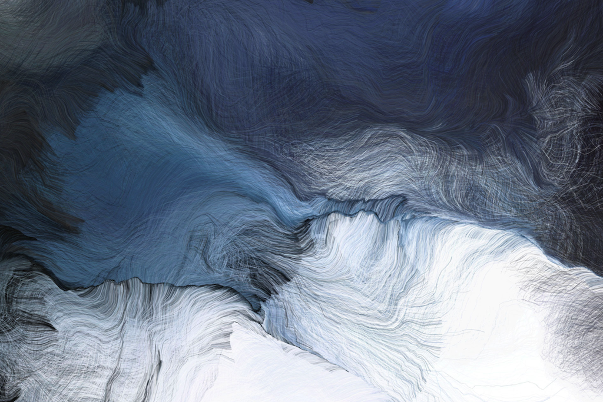  

  

  
  

Image references (top-bottom, left-right): [[hornet]](https://www.shadertoy.com/view/4ssXRX), [[scratchapixel]](https://www.scratchapixel.com), [[myNoise]](https://www.youtube.com/watch?v=zDk8pVOtiVY), [[draxe]](https://draxe.com/health/pink-noise/), [[Schwarm by A. N. Fischer]](https://www.creativeapplications.net/processing/schwarm-autonomous-drawing-agents-by-andreas-nicolas-fischer/), [[Planeta by M. Kanzler]](https://vimeo.com/411965624), [[Eve by D. Ladopoulos]](https://www.behance.net/gallery/49840921/EVE), [[Noise landscapes by D. Ladopoulos]](https://www.behance.net/gallery/57602537/make-some-NOISE), [[imgur]](http://imgur.com/gallery/zwjxC), [[moonlightrainbow]](http://moonlightrainbow.tumblr.com/post/4204875993), [[Noise landscapes by D. Ladopoulos]](https://www.behance.net/gallery/57602537/make-some-NOISE)

## Learning Objectives

With this chapter you will gain

* an understanding of what a procedural noise function is and the requirements for it,
* an understanding of the different types of noise, and
* knowledge on how to use noise.

---

## Applications for Noise

Noise is an essential component in various applications.

### Textures and Materials

For Textures and Materials, we map the output of a noise function to color, gradients and such.

  
[[Perlin, K. (1985). An Image Synthesizer.]]()

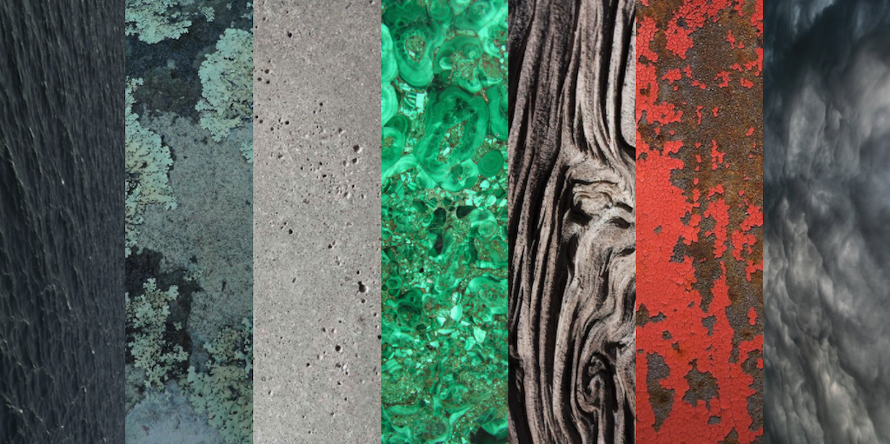  
[[thebookofshaders]](https://thebookofshaders.com/11/)

### Height Fields

With height fields, we use for example, a noise function value as a displacement along normals to make terrain.

  
[[wiki]](https://commons.wikimedia.org/wiki/File:Terragen_2.jpg#/media/File:Terragen_2.jpg)


Houdini has also a special height field functionality, for which a volume on a 2D grid represents the distance of the terrain at each point on the map from the ground plane (the values can be negative).

  
[[planetside]](https://planetside.co.uk/forums/index.php/topic,22830.0.html)

Or simply use the noise as z-value for a geometry node in Houdini, for example.


*On a side note*: Do you remember the difference between displacement vs. bump in a 3D package such as Houdini?

Working with a displacement map will add actual new geometry based on the provided displacement map at render time. For this, the renderer subdivides the existing geometry and moves it according to the noise values.

When working with a normal or bump map (different names for the same thing), only the appearance of additional surface detail is created by changing the surface's normals at render time, without actually creating additional geometry. This approach is much faster and use less memory.

  
[[talkgraphics]](https://www.talkgraphics.com/showthread.php?16280-Displacement-Maps-vs-Bump-Maps)

  
[[photigy]](https://www.photigy.com/school/bump-mapping-vs-displacement-mapping/)

### Stylization

Classic stylization algorithms offset regularly spaced coordinates (e.g. from images or texture accesses) with noise to create a turbulent effect.

  
[[Perlin, K. (1985). An Image Synthesizer.]]()

### Stylistic Element

As already seen in the intro example, noise itself can be used as visual and auditive element.

  
[[Beautiful Noise]](https://www.behance.net/gallery/16221023/Beautiful-Noise)

  
[[datalize]](https://datalize.wordpress.com/category/generative-art/)

  
[[H. Lippmann]](http://www.lumicon.de/wp/?p=3553)

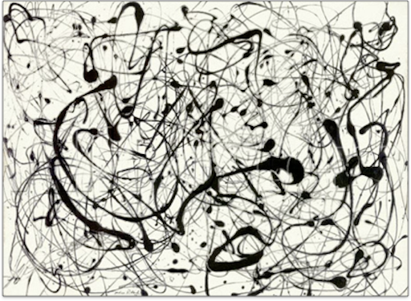  
[[Jackson Pollock - Number 14 gray (1948)]](https://thebookofshaders.com/11/)

### Animation

In animation, we use noise as a velocity or offset vector for natural movements.

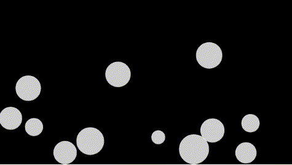  
[[processing]](https://www.processing.org/examples/bouncybubbles.html)


Or map noise to a time parameter to create waves or ripples.

  
[[processing]](https://www.processing.org/examples/noisewave.html)

### Dynamics

For dynamic simulations noise is used to animate or offset particle properties, e.g. their position.

  
[[astarobynski]](http://www.astarobynski.com/fire-particles)


### Faking Complex Systems

The above examples already touched on a crucial application of noise. 

Almost all natural systems appear to combine structure with randomness even though they in fact follow complex creation rules on different scales. As proper simulations of the underlying rules are usually quite expensive to compute, a simple addition of noise is used fake natural systems.  

Noise adds variation for designed systems to look natural and for an aesthetic appeal.

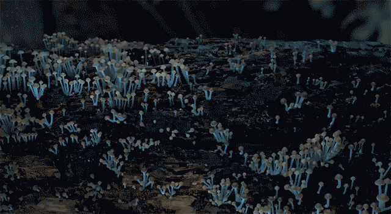  
[[thisiscolossal]](https://www.thisiscolossal.com/wp-content/uploads/2016/11/mush-1.gif) *The mushrooms appear to us to grow pretty random even though their growth is greatly controlled by factors such as light and foil properties.*


## Procedural Noise


Procedural noise engineers the appearance of randomness.

*How could we do this?*

When thinking about a practical usable random noise function, we probably think about something like this:

  
[[scratchapixel]](https://www.scratchapixel.com/lessons/procedural-generation-virtual-worlds)

However, true random values look like the following:

  
[[scratchapixel]](https://www.scratchapixel.com/lessons/procedural-generation-virtual-worlds)

*What are the differences?*  

With true random values there is no coherency or relationship between adjacent points. Also, computing these values would not guarantee the same results each time.

Here, random is too random! 🤯

So, what is it that we want? Have a look at the blurred version of the true random numbers rendering to get an intuition for what we are looking for:

  
[[scratchapixel]](https://www.scratchapixel.com/lessons/procedural-generation-virtual-worlds)

Hence, we want small variations locally and large variations globally!

### Naive Smooth Randomness

For example, a naive approach to creating a noise function is to

* assign random values at fixed position on a grid (*lattice*), 
    * using a random number generator (*RNG*)
* blur these values, e.g. with a gaussian blur
    * this is similar to bilinear interpolation

To mimic this behavior, we could for example build the following smooth 1D pseudo-random function, which is put together by the different function blocks from the last chapter:

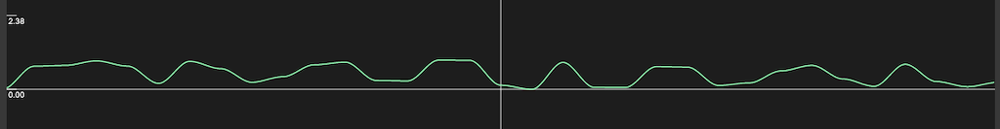

In the following, I walk you through how to build the above pseudo-random function from scratch. Feel free to follow along with these steps with [graphtoy](https://www.iquilezles.org/apps/graphtoy/). [graphtoy](https://www.iquilezles.org/apps/graphtoy/) is a great tool to quickly put together and test functions. The tool is once again, by our  - or at least my 😁 - great idol [Inigo Quilez](https://www.iquilezles.org/).

1. Pseudo random generator

We want new random values at the integer values. For that as a base, we sample `sin()` function at the integers:

```glsl
step_random(x) = sin(floor(x))
```


The frac value of f1 gives us positive 0..1 ranges:

```glsl
step_random(x) = fract(sin(floor(x)))
```


This looks far too regular though. By scaling up `sin()` we can get a noisier value distribution:

```glsl
step_random(x) = fract(sin(floor(x)) * 9999)
```


2. Smooth interpolation

Instead of stepping between values, we want to smoothly interpolate between values. We can use two `smoothstep()` versions of the `step_random(x)`, one for each "side" of the integer.

For sampling with a smooth step, we take:

```glsl
smooth_saw(x) = smoothstep(0, 1, fract(x))
```


and multiply that with our `step_random()`:

```glsl
left_side(x) = smooth_saw(x) * step_random(x)
```


For the right side, we use a flipped and shifted version of the above. First the flip:

```glsl
right_side(x) = smooth_saw(x) * (step_random(x) * -1)
```

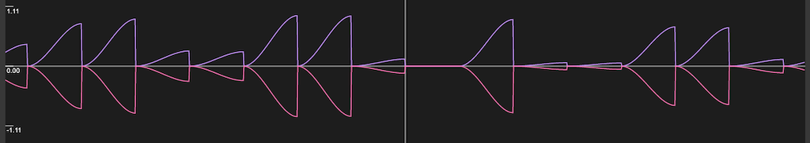

...then a shift up:

```glsl
right_side(x) = smooth_saw(x) * (step_random(x) * -1 + 1)
```


...and right:

```glsl
right_side(x) = smooth_saw(x - 1) * (step_random(x - 1) * -1 + 1)
```


Now adding both sides together, gives the final smooth pseudo random function:

```glsl
smooth_pseudo_noise(x) = left_side(x) + right_side(x)
```


Of course, in graphtoy (and most environments) you also could have simply used the given noise function `noise()` 🙃


<!-- add 2D shadertoy example? -->

### Requirements For Procedural Noise

For good noise functions there are overall the following requirements.

1. Spatial correlation

    Minimal location shifts should not result in huge value differences, creating a smooth behavior. This means that local value changes are gradual, while global changes can be large.

2. No Periodicity

    At least, we do not want to see it.

      
    *[Visible periodicity]*

3. Rotational and Translational Invariance

    Following the same creation principles everywhere.

4. A Defined Distribution

    We want some control over the function, e.g. how smooth it is.

5. Reproducibility

    The noise should look the same every time we compute is, e.g. in every frame we render unless we explicitly want a change e.g. for an animation.

6. Band Limited Frequency Content

    This means frequencies should not get too high, otherwise we might get aliasing.  
      
    [[scratchapixel]](https://www.scratchapixel.com/lessons/procedural-generation-virtual-worlds/procedural-patterns-noise-part-1)

7. Continuity and Differentiability

    Often the derivates of noise functions are needed.

      
    *Non-differential or non-continues function examples.*

### Noise Function Designs

  
[[scratchapixel]](https://www.scratchapixel.com/lessons/procedural-generation-virtual-worlds/procedural-patterns-noise-part-1/creating-simple-1D-noise)

Back to the original question, how do we go from random numbers (left example, image above) to a well behaved noise function, which fullfills the requirements of the last section (right example, image above)?


### Random Number Generator (RNG)

At the core of all noise functions is a seeded random number generator, which takes some input parameters, e.g. a point coordinate and returns a random (looking) number. Seeded means that the same input parameters will always produce the same output for the same seed (usually a number) and if you change the seed there will be a different distribution of random numbers.

    y = rng(x) 

There are many, many random number generation methods… (for example the method we used above with `sin()`) it is almost a science in itself. If you are interested, you can start with this [Introduction to Randomness and Random Numbers](https://www.random.org/randomness/).

You will often see so-called *hash functions* for the generation of random numbers. A hash function is any function that can be used to map data of arbitrary size to data of fixed size. [[1]](https://en.wikipedia.org/wiki/Hash_functione)  

Hence, what the hash function in the context of RNGs does is to transform input with math operations into output a that looks random. These function actually do repeat after a long period but usually non-noticable for our applications.

To generate a random looking output, typically bitwise operations and/or large prime numbers are used. These function are n-dimensional, meaning they can be setup for any number of input parameters and produce any number of random values for the input. The demo scene has spent a lot of time and effort to optimize these. See [Inigo Quilez's blog](https://iquilezles.org/www/articles/sfrand/sfrand.htm) for some optimization tips.

When using any kind of RNG it is important that you pay attention to its output range and wether that fits to your needs. Usually you can assume a range from [-1, 1].

In the following some example hash functions, from [Hash without Sine](https://www.shadertoy.com/view/4djSRW) (you don't have to understand the code!). Not using any trigonometric functions in the generation of random numbers has the advantage that how trigonometric functions are executed still highly depends on the graphics card and on certain systems (mine for example) will lead to visible periodicity:

```glsl

//  1 out, 1 in...
float hash11(float p)
{
    p = fract(p * .1031);
    p *= p + 33.33;
    p *= p + p;
    return fract(p);
}

//  1 out, 2 in...
float hash12(vec2 p)
{
    vec3 p3  = fract(vec3(p.xyx) * .1031);
    p3 += dot(p3, p3.yzx + 33.33);
    return fract((p3.x + p3.y) * p3.z);
}

///  2 out, 2 in...
vec2 hash22(vec2 p)
{
    vec3 p3 = fract(vec3(p.xyx) * vec3(.1031, .1030, .0973));
    p3 += dot(p3, p3.yzx+33.33);
    return fract((p3.xx+p3.yz)*p3.zy);
}

...
```

### (Lattice) Value Noise

The principle of a value noise is simple:

* A fixed grid (the *lattice*)
    * Relates the noise to space
    * Defines the basic scale
* A random number for each grid point
* Interpolate in-between
    * Again, many interpolation algorithms available… we have already talked about these
    * Ensures spatial correlation


### (Lattice) Gradient Noise

Ken Perlin was commissioned to generate more realistic textures for the movie Tron in the early 1980s. He task was to break with the solid shaded look that have been used so far. The idea was to add to the solid colors a noise texture. For that he came up with an elegant noise algorithm, the *Perlin noise*. In 1997 he won the Academy Award for Technical Achievement from the Academy of Motion Picture Arts.

 [3]

Perlin published is results in the seminal publication

Ken Perlin. 1985. An image synthesizer. In Proceedings of the 12th annual conference on Computer graphics and interactive techniques (SIGGRAPH ’85). Association for Computing Machinery, New York, NY, USA, 287–296. DOI:https://doi.org/10.1145/325334.325247


And in 2002 to follow-up (a Siggraph paper with only two pages!)

Ken Perlin. 2002. Improving noise. In Proceedings of the 29th annual conference on Computer graphics and interactive techniques (SIGGRAPH ’02). Association for Computing Machinery, New York, NY, USA, 681–682. DOI:https://doi.org/10.1145/566570.566636

The Perlin noise function got further improved and extended over the years primarily by Ken Perlin himself but also by others.

So what did Perlin invent? Instead of values, Perlin uses random normalized *gradients* on a grid for each sample point. But let's go step by step to understand this.

We want a smooth noise, meaning regular in frequency such as  

  
[[scratchapixel]](https://www.scratchapixel.com/lessons/procedural-generation-virtual-worlds/perlin-noise-part-2) *Even changes*

When choosing random values the distribution of frequencies might lead to an irregular interpolation of values such as

  
[[scratchapixel]](https://www.scratchapixel.com/lessons/procedural-generation-virtual-worlds/perlin-noise-part-2) *Uneven changes*

To get the uneven frequency changes under control, we can define random normalized gradients, meaning random vectors, on a grid for each sample point instead of simply using values. Then, we interpolate a smooth function between those vectors.

  
[[scratchapixel]](https://www.scratchapixel.com/lessons/procedural-generation-virtual-worlds/perlin-noise-part-2)

This causes the curve to go up on one side of the lattice point and down on the other side of that same point such as


  
[[scratchapixel]](https://www.scratchapixel.com/lessons/procedural-generation-virtual-worlds/perlin-noise-part-2)

The worst case in regard to a uneven frequency distribution happens when two successive lattice points have gradients that aim at opposite directions (one points up and the other points down). Then the noise function will have a "S" like shape between the two points.

  
[[scratchapixel]](https://www.scratchapixel.com/lessons/procedural-generation-virtual-worlds/perlin-noise-part-2)

Through the use of random vectors, the distribution of frequencies in the Perlin noise is more regular than the value noise's frequency spectrum. As Perlin notes in his paper:

> The above texture has a band-limited character to it; there is no detail outside of a certain range of size.

  
[[scratchapixel]](https://www.scratchapixel.com/lessons/procedural-generation-virtual-worlds/perlin-noise-part-2)

In 2D, at each grid point a pseudo-random 2D gradient is picked such as 

  
[[webstaff.itn.liu.se]](http://webstaff.itn.liu.se/~stegu/simplexnoise/simplexnoise.pdf)

But how to go from vectors to random numbers, which we ultimately want? We apply the dot product between the gradient at the corner of a cell and the vector from that corner to the point such as

  
[[scratchapixel]](https://www.scratchapixel.com/lessons/procedural-generation-virtual-worlds/perlin-noise-part-2)

For an arbitrary point the noise value is computed from the four closest grid points. 

  
[[webstaff.itn.liu.se]](http://webstaff.itn.liu.se/~stegu/simplexnoise/simplexnoise.pdf)

To interpolate between *n<sub>00</sub>*, *n<sub>10</sub>*, *n<sub>01</sub>*, *n<sub>11</sub>* rather than just using linear interpolation, Perlin uses as a fade function the Hermit blending function, which we already know from `smoothstep()`

*f(t) = 3t<sup>2</sup> - 2t<sup>3</sup>*

Perlin later changed that to a fifth degree polynomial 
f(t) = 6t5 - 15t4 + 10t3

*f(t) = 6t<sup>5</sup> - 15t<sup>4</sup> + 10t<sup>3</sup>*

  
[[webstaff.itn.liu.se]](http://webstaff.itn.liu.se/~stegu/simplexnoise/simplexnoise.pdf)

The difference vector is *(0,0,0)* (and the dot product 0) when *P* lies exactly on the grid such as

  
[[wiki]](https://en.wikipedia.org/wiki/Perlin_noise)

Here, an overall comparison of the gradient noise to a simple value noise

  
[[iquilezles]](http://www.iquilezles.org/)

Changing the interpolation also leads to visible differences

  
[[2]]

### Simplex Noise

Perlin was still not satisfied with his gradient noise and presented 2001 the *simplex noise*. For the simplex noise Perlin replaced a grid tiling of a space with a triangular tiling such as

  
[[webstaff.itn.liu.se]](http://webstaff.itn.liu.se/~stegu/simplexnoise/simplexnoise.pdf)

Perlin correctly argues that a square has more corners than necessary. The simplest and most compact shape that can be repeated to fill a space is an equilateral triangle. For more details about the simplex noise, please refer to [this detailed explanation](http://webstaff.itn.liu.se/~stegu/simplexnoise/simplexnoise.pdf).

  
[[iquilezles]](http://www.iquilezles.org/)

### `noise()`

As mentioned before, almost in all environments we are using you have pre-defined noise functions such as 

```glsl
// 1D
noise(x); 

//2D
noise(x, y);
```

For full control over your results, check which algorithm the `noise()` function is based and whether the noise creates the distribution you want. If not you can always go back to defining your own noise function. An excellent resource for different noise functions is this [State of the Art Report](http://graphics.cs.kuleuven.be/publications/LLCDDELPZ10STARPNF/).

## Using Noise Functions

Noise functions are usually used as

```glsl
value = amplitude * noise(frequency * x + offset);
```

### Amplitude

The amplitude controls the maximum absolute value that a specific noise function can output. For example, for a 1D `y = noise(x)` this would mean the range the noise can spread in `y`:

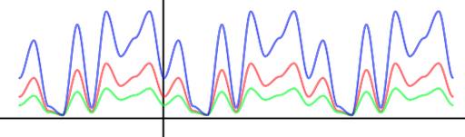

### Frequency

The frequency parameter can be understood as the density of the noise, or its *bumpiness*.


   
[[2]]()

### Offset

The offset selects different locations of the noise function. Hence, the offset enables you to use the same noise function multiple times, each version looking differently.

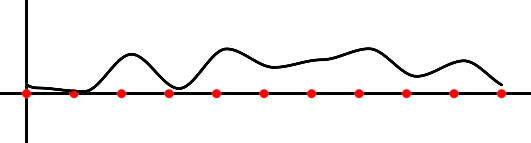

### Component Frequencies

Which characteristic feature of noise do you see here, which we haven't discussed yet?

  
[[thebookofshaders]](https://thebookofshaders.com/11/)

In the above example we can observe well that organic patterns have *multiple levels* of detail with self-similar structures.


The represent this, we remember the insights we gained from Fourier transformations and that any function, or signal, can be decomposed into simple component signals at different frequencies.

  
[[pgfplots]](http://pgfplots.net/tikz/examples/fourier-transform/)

To represent this, we can sum up multiple noise functions (so-called *octaves*) at different frequencies and amplitudes.

1D:

  
[[2]]()

2D:

  
[[hugo.elias]](https://web.archive.org/web/20150316212611/http://freespace.virgin.net/hugo.elias/models/m_perlin.htm)

There are several techniques for computing such multi-level noises and all follow the same principle of defining a relationship between frequency and amplitude and successive octaves.

Such noises are for example Turbulent noise, Fractal Brownian Motion (fBM), Fractal noise or Multi-Octave noise.

### Turbulence Noise

The generalized formula for turbulence is 


with

* Number of octaves *n*
* Lacunarity *L*
    * Multiplier to determine how quickly the frequency increases for each successive octave
    * The frequency of each successive octave is equal to the product of the previous octave's frequency and the lacunarity value
* Amount of fractal noise *H* (weighting the octaves)

This function adds details proportional to the size of the noise in each octave and creates self-similar structures.

[[4]](http://libnoise.sourceforge.net/glossary/index.html#lacunarity)

*On a side note:* Turbulent noise is often considered as Perlin noise. This is not true. Perlin’s main contribution is the noise function itself. He used in his paper a specific turbulent noise setup as an example application for his noise function. But the internet doesn't understand this.

Perlin’s specific turbulence noise uses *H = 1*, *L = 2* 


Hence, the levels are


  
[[2]]()


This type of turbulence noise is also known as Fractal Brownian Motion (fBM) or Fractal Noise.

For example, Inigo Quiles applied fbm noise to wrap the space of a fbm noise again with the following results:

  
[[Warping by Iq]](https://www.shadertoy.com/view/4s23zz)

If you want to understand this better, Inigo also wrote [an article](https://www.iquilezles.org/www/articles/warp/warp.htm) about it.

### Multi-Octave Noise

A similar property to lacunarity is *persistence*. Again, this is a multiplier to determine how quickly the amplitudes diminish for each successive octave.

Here, the amplitude of each successive octave is equal to the product of the previous octave's amplitude and the persistence value, meaning

*frequency = 2<sup>i</sup>*  
*amplitude = persistence<sup>i</sup>*

This means that increasing the persistence produces rougher noise.

  
[[libnoise]](http://libnoise.sourceforge.net/glossary/index.html#persistence)

  
[[hugo.elias]](https://web.archive.org/web/20150316212611/http://freespace.virgin.net/hugo.elias/models/m_perlin.htm)

```

// Pseudo Code

function MultiOctaveNoise2D(float x, float y)

      total = 0
      n = Number_Of_Octaves - 1

      loop i from 0 to n

          frequency = 2^i
          amplitude = persistence^i

          total += noise(x * frequency, y * frequency) * amplitude


      return total

end function
```


<!-- ### Voronoi
Save for each pixel the closest point
And assign the color of the closest point for example


Partitioning of a plane and set of n points on the plane into n convex polygons, (aka cells or regions).
Each region has a single generating point
Each point in a region is guaranteed to be closer to the region’s generating point than any of the other n possible generating points.
Line segments are equidistant to two points. Nodes (corners) are equidistant to three (or more) points.
Concept can be extended to higher dimensions.  -->


## Cellular Noise

Cellular noise describes random variability in quantities arising in cellular biology [[5]](https://en.wikipedia.org/wiki/Cellular_noise). Steven Worley adapted cellular noise principles for computer graphics in:

Steven Worley. 1996. A cellular texture basis function. In Proceedings of the 23rd annual conference on Computer graphics and interactive techniques (SIGGRAPH '96). ACM, New York, NY, USA, 291-294.

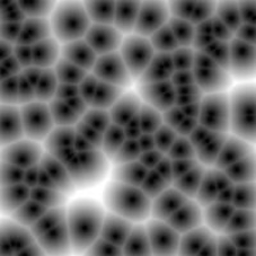  
[[wiki]](https://en.wikipedia.org/wiki/Worley_noise)

### Worley Noise

Worley noise is based on a distance field, for which you compute for each pixel the distance to a set of points. This set of points are often randomly distributed feature points. Then, we take the closest distance to all points found and use that as color information, e.g. black and white.

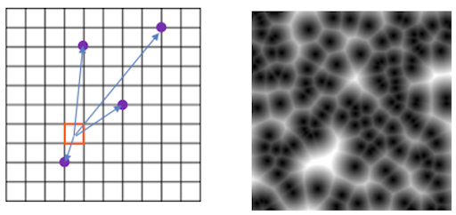  

```glsl

// Iterate through the points positions
float minimum_dist = 1.;

for (int i = 0; i < TOTAL_POINTS; i++) 
{
   float dist = distance(pix, point[i]);

  // Keep the closer distance
  minimum_dist = min(minimum_dist, dist);
}

pix.color = minimum_dist;
```

To check all points for all pixels is costly and the algorithms becomes with the naive implementation as shown above, almost 
non-usable. As optimization we rather divide the space into tiles and have one point per tile. Then you only need to check a pixel’s tile and the neighboring ones for the closes distance. For a detailled explanations, please see [[The Book of Shaders]](https://thebookofshaders.com/12/) (highly recommended).

  
[[thebookofshaders]](https://thebookofshaders.com/12/)


  
[[thebookofshaders]](https://thebookofshaders.com/12/)

This algorithm gives many design options, e.g. inverting the colors or by setting thresholds and clamping the last quarter of the distance.

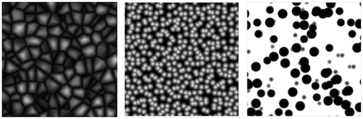  
[[thebookofshaders]](https://thebookofshaders.com/12/)

You could also understand the algorithm from the perspective of the points (not the pixels). This would mean that each point grows its area until it finds the growing area from another point. This mirrors some of the growth rules in nature.  

  
[[wiki]](https://de.wikipedia.org/wiki/Datei:Voronoi_growth_euclidean.gif)

Living forms are shaped by this tension between an inner force to expand and grow, and limitations by outside forces.

### Voronoi Algorithm

A Voronoi diagram is a slight variation from the Worley noise in the sense that is doesn't save the closest distance for each pixel to a feature point, but it saves for each pixel the feature point itself, e.g. by assigning the color of the closest point, disregarding the actual distance. 

  
[[wiki]](https://en.wikipedia.org/wiki/Voronoi_diagram#/media/File:Euclidean_Voronoi_diagram.svg)

```glsl
// Iterate through the points positions
float minimum_dist = 1.;
vec2 closest_point;

for (int i = 0; i < TOTAL_POINTS; i++) 
{
    float dist = distance(pix, point[i]);

    if ( dist < minimum_dist )
    {
        // Keep the closer distance
        minimum_dist = dist;

        // Also keep the position of the closer point
        closest_point = point[i];
    }
}
pix.color = closest_point.color;
```

A Voronoi diagram has the following characteristics:

* Partitioning of a plane into *n* convex polygons (aka cells or regions).
* Each point in a region is guaranteed to be closer to the region’s generating point than any of the other *n* possible generating points.
* Line segments are equidistant to two points. Nodes (corners) are equidistant to three (or more) points.

This concept can be extended to higher dimensions.

  
[[thebookofshaders]](https://thebookofshaders.com/12/)*Extended Voronoi - Leo Solaas (2011)*

  
[[thebookofshaders]](https://thebookofshaders.com/12/)

  
[[iquilezles]](https://iquilezles.org/www/articles/cellularffx/cellularffx.htm)*Using a bitmap as cell color*

  
[[thebookofshaders]](https://thebookofshaders.com/12/) *Cloud Cities - Tomás Saraceno (2011)*

  
[[thebookofshaders]](https://thebookofshaders.com/12/) *Accretion Disc Series - Clint Fulkerson*


## Deluanay Triangulation

Deluanay Triangulation is a technique for creating a mesh of contiguous, non-overlapping triangles from a set of points.

  
[[samuelp]](http://www.geom.uiuc.edu/~samuelp/del_project.html)

There are three possible triangulations for this set of points.

*Which one do we want?*

  
[[samuelp]](http://www.geom.uiuc.edu/~samuelp/del_project.html)

Deluanay Triangulation is a triangulation such that no point is inside the circumcircle of any triangle.

  
[[samuelp]](http://www.geom.uiuc.edu/~samuelp/del_project.html)

If you are interested in the computation of the delaunay trinagulation, refere e.g. to [this explanation](http://www.geom.uiuc.edu/~samuelp/del_project.html).

Delaunay triangulation is related with Voronoi diagrams in that the circumcircle centers of the triangulation are voronoi cell corner points!

  
[[wiki]](https://de.wikipedia.org/wiki/Delaunay-Triangulierung)

Hence, [Delaunay triangulation](https://www.youtube.com/watch?v=PdV7sCb0k3M&t=1s) is one method to compute voronoi diagrams. There are furthermore 

* [Fortune’s Algorithm](https://www.youtube.com/watch?v=Y5X1TvN9TpM)
* [Weighted Lloyd's Method](https://elrnv.com/blog/weighted-lloyds-method-for-voronoi-tesselation/)
* [Sweeping Line Algorithm](https://www.youtube.com/watch?v=k2P9yWSMaXE)

[](https://medium.com/@jakerice_7202/voronoi-for-the-people-60c0f11b0767)  
[[jakerice]](https://medium.com/@jakerice_7202/voronoi-for-the-people-60c0f11b0767)

### Distances

We are free to define any kind of distance. So far we have used the most common one, the *Euclidian distance*.

Note:
Euclidean distance, Manhattan distance and Chebyshev distance are all distance metrics which compute a number based on two data points. All the three metrics are useful in various use cases and differ in some aspects. 

  
[[wiki]](https://en.wikipedia.org/wiki/Euclidean_distance)

Different distance might look as

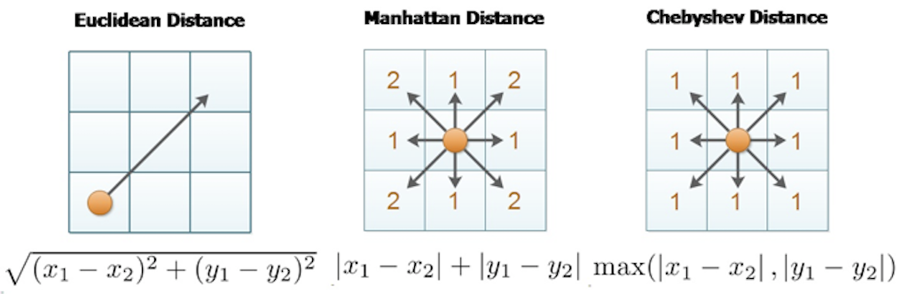  
[[wiki]](https://en.wikipedia.org/wiki/Taxicab_geometry)

Manhattan distance with the taxicab metric vs. Euclidean distance

  
[[improvedoutcomes]](www.improvedoutcomes.com/docs/WebSiteDocs/Clustering/Clustering_Parameters/Manhattan_Distance_Metric.htm)

with

  
[[wiki]](https://en.wikipedia.org/wiki/Taxicab_geometry)

  
[[iquilezles]](http://iquilezles.org/www/articles/cellularffx/cellularffx.htm)


### Dual Graph

A variation to Voronoi diagrams is the *dual graph*. For the dual graph imagine we have two triangles, that share one complete edge. Now for every shared edge, you would remove that shared edge, and connect the centers of the two triangles, passing through the position where the old edge was.


[[jakerice]](https://medium.com/@jakerice_7202/computing-the-dual-ff2a93077e2e)

[](https://medium.com/@jakerice_7202/computing-the-dual-ff2a93077e2e)  
[[jakerice]](https://medium.com/@jakerice_7202/computing-the-dual-ff2a93077e2e)


## Noise in Houdini

There are several different generation approaches in Houdini.

  
[[sidefx]](https://vimeo.com/75313908)

  
[[evaw7]](https://evaw7.tistory.com/362)

In VEX you have

* Perlin noise (`noise`)
* Original perlin noise (`onoise`)
* Worley noise (`wnoise`)
* Sparse Convolution noise (`snoise`)
* Alligator noise (`anoise`)
* And some more, I think...


## Noise in Unreal

Well, ...

---

## References

[[1] Wiki - Hash Functions](https://en.wikipedia.org/wiki/Hash_function)  
[2] Image Synthesis Lecture, Universität Stuttgart, Martin Fuchs.  
[3] [CIS 700 - Special Topics in Computer Graphics](https://cis700-procedural-graphics.github.io/), University of Pennsylvania, Rachel Hwang.  
[[4] Libnoise](http://libnoise.sourceforge.net/glossary/index.html#lacunarity)
[[5] Wiki - Cellular Noise](https://en.wikipedia.org/wiki/Cellular_noise)  
[[6] Scratchapixel - Procedural Generation](https://www.scratchapixel.com/lessons/procedural-generation-virtual-worlds)  
[[7] The Book of Shaders - Noise](https://thebookofshaders.com/11/)  
[[8] The Book of Shaders - Cellular Noise](https://thebookofshaders.com/12/)  
[[9] The Book of Shaders - Fractal Brownian Motion](https://thebookofshaders.com/13/)  

---

In case something wasn't clear in this script, I recommend the following chapters of the Book of Shaders, which cover almost identical topics:  
  
[The Book of Shaders - Noise](https://thebookofshaders.com/11/)  
[The Book of Shaders - Cellular Noise](https://thebookofshaders.com/12/)  
[The Book of Shaders - Fractal Brownian Motion](https://thebookofshaders.com/13/)  

---

The End

🍪 🕸 🌫  
