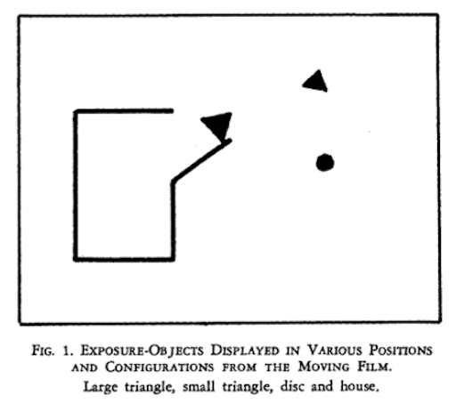
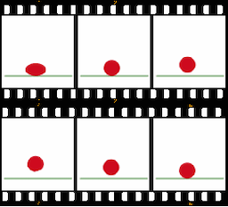
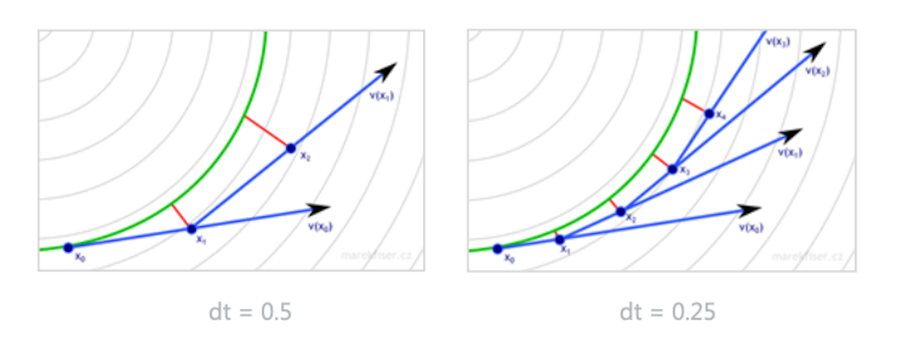

# Procedural Generation and Simulation

Prof. Dr. Lena Gieseke \| l.gieseke@filmuniversitaet.de \| Film University Babelsberg KONRAD WOLF

# Chapter 07 - Dynamics

* [Procedural Generation and Simulation](#procedural-generation-and-simulation)
* [Chapter 07 - Dynamics](#chapter-07---dynamics)
    * [Learning Objectives](#learning-objectives)
    * [Moving Stuff](#moving-stuff)
        * [How To Move Stuff](#how-to-move-stuff)
        * [Keyframe Animation](#keyframe-animation)
        * [Kinematic Animation](#kinematic-animation)
            * [Indirect Kinematic Animation](#indirect-kinematic-animation)
    * [Dynamics](#dynamics)
        * [Forces](#forces)
    * [Mathematical Basics](#mathematical-basics)
        * [Velocity](#velocity)
            * [Slope](#slope)
            * [Differentiation](#differentiation)
        * [Acceleration](#acceleration)
        * [Things To Remember](#things-to-remember)
        * [Newton’s Three Laws of Motion](#newtons-three-laws-of-motion)
            * [Newton’s First Law of Motion](#newtons-first-law-of-motion)
            * [Newton’s Third Law of Motion](#newtons-third-law-of-motion)
            * [Newton’s Second Law of Motion](#newtons-second-law-of-motion)
        * [Euler Integration](#euler-integration)
        * [Summary](#summary)
    * [Creating Forces](#creating-forces)
        * [Example Air and Fluid Resistance](#example-air-and-fluid-resistance)
    * [References](#references)

## Learning Objectives

With this script you gain

* an understanding of the different approaches to moving stuff,
* an understanding of the theoretical backgrounds of dynamics
    * Calculus
    * Velocity, acceleration, forces, ...
    * Newton’s Laws of Motion
* the ability to transfer the theory to examples of dynamic systems in Houdini.

## Moving Stuff

The more common term for *moving stuff* is *animation*.  

For visual properties, animation can be understood as the depiction of spatially and temporally varying structures and behavior. You can animate the position of an object, its form and Gestalt and also its environment with e.g. animating lights and cameras.

*Animation* comes from the Latin *animatus*, the past participle of *animare*, meaning *to give life to*. *Animare* comes from the Latin word *anima*, meaning *breath* or *soul*. From *anima* comes, among other words, also *animal* for example. A characteristic of animals is their ability to move. When a cartoon is drawn and filmed in such a way that lifelike movement is produced, it is animated. An animated film seems to have a life of its own. [[1]](https://www.merriam-webster.com/dictionary/animate)

There has been various research that shows that movement is one of, if not the most crucial aspect, for humans to assign liveness to objects. For example, the study  

> Heider, Fritz; Simmel, Marianne (1944). *[An Experimental Study of Apparent Behavior](https://doi.org/10.2307%2F1416950)*. American Journal of Psychology. 57 (2): 243–259. doi:10.2307/1416950

explores with which sentiments the animation of simple geometric objects is perceived.

Test it yourself, if you want - watch [the animation](https://www.youtube.com/watch?v=VTNmLt7QX8E) and ask yourself what is happening:

[](https://www.youtube.com/watch?v=VTNmLt7QX8E)  
[[ajp, Heider and Simmel]](https://doi.org/10.2307%2F1416950)

The study shows that humans are inclined to ascribe intentions to simple visualization of movements. What Heider and Simmel discovered is that many people who watched this abstract film of simple shapes roaming around were quick to see a story unfold. In those simple shapes, viewers often saw characters with emotions, motivations, and purpose. Simmel and Heider established a *human instinct for storytelling* and served important data in the study of theory of mind. 

More recently, [seven comedians gave their interpretation of the classic short film](https://www.youtube.com/watch?v=ZAnt9II-5Co&feature=youtu.be). How funny their interpretations actually are, is up to personal taste.  

You can also [create your own animations](https://hsit.ict.usc.edu/), a project of the [Narrative Group](https://ict.usc.edu/groups/narrative/) at the [Institute for Creative Technologies](https://ict.usc.edu/) at University of Southern California. Their project aims for using the created data to train computers to impose a story on the Heider-Simmel film.

I personally find this line of research truly fascinating but know very little about it. Maybe it is time for a project in regard to this? Who wants to participate? 😁

[[2]](http://trbq.org/play/)  

### How To Move Stuff

There are two main principles to animate objects.

You can define an animation explicitly, meaning you tell each object precisely where to go. This is done directly with *keyframe animation* and indirectly with *inverse kinematics*.

The second principle to animation is the application of a *dynamic system*. This constitutes a *physically motivated animation* and implements how *forces* act on masses. As part of a dynamic system, objects can have influencing properties such as a mass or agency, but overall they do not know where to go next but mainly react to their environment.

Let's have a brief look into keyframe animation. But as this class is about proceduralism and the manual placement of keyframes is kind of an opposing principle to that, we will not spent much time on this. Instead we will focus on dynamics in a bit.

### Keyframe Animation

A keyframe in traditional animation is a drawing that defines the starting and ending points of any smooth transition. The drawings are called *frames* because their position in time were measured in frames on a strip of film. A sequence of keyframes defines an overall movement. Keyframes have the advantage that they give direct control to the animator.


For example, this bouncing ball animation

   
[[wiki]](https://en.wikipedia.org/wiki/Animation#/media/File:Animexample.gif)

consists of these six frames:

  
[[wiki]](https://en.wikipedia.org/wiki/Animation#/media/File:Animexample3edit.png)


  
[[pinimg]](https://i.pinimg.com/564x/f1/38/6e/f1386ee03fbbda3dfc5cf6f2d0c7dad4.jpg)

To create a smooth and fluent animation the remaining frames are filled with *inbetweens*. For hand-drawn animations these are usually done by the assistants of the animator, while for computer animations the missing frames are interpolated by the software. Keep in mind, that for computer animation there are no explicit keyframes. Rather there are object attributes, which are keyed, resulting in a set of frames for which there are keys.

  
[[script-tutorials]](https://www.script-tutorials.com/css-animation-guide-for-novices/)

Once again, there are different interpolation formulas, which are crucial for the final look.

  
[[paulbourke]](http://paulbourke.net/miscellaneous/interpolation/)

  [interpolation_07](img/07/interpolation_07.gif)  
[[sol.gfxile]](sol.gfxile.net/interpolation/)

If you want to know how to set keyframes in Houdini, check out this 2 minutes [video](https://vimeo.com/116173730). The most important tool to work with keyframes is the Graph Editor or [Graph View](https://www.sidefx.com/docs/houdini/ref/panes/changraph.html), which exists in some form or the other in all 3D animation packages.

  
[[sidefx]](https://www.sidefx.com/docs/houdini/ref/panes/changraph.html)

Keyframe animation is truly an art in itself. It takes practice and overall a lot of time and effort. To me personally it has always been the hardest aspect of doing 3D. I think, I have just no eye for it, I only know when it is wrong but I have no understanding and intuition about what to change to make it right. I have spent countless hours with practicing to animate walk cycles, with very disappointing results. Why am I telling you this? Because I want you to internalize to never underestimate what it takes to create a keyframe animation in regard to time, effort and experience. Ideally, have an expert around to do it for you!

### Kinematic Animation

Kinematics, as a field of study, is often referred to as the *geometry of motion*. A kinematics problem begins by describing the geometry of the system and declaring all initial conditions of any known values within the system such as of the position. Then, any unknown parts of the system, such as the position in the next frame can be derived from the geometry of the system.  

Path animation, a common approach within 3D animation, is an example for *direct kinematic animation*. For path animation an object follows a specified path from control points. Aspects to look out for are the orientation of the object and whether velocity control, meaning slow-in/slow-outs, are needed.  

  
[[coherent-labs]](https://coherent-labs.com/posts/create-motion-path-animation-animate/)

In Houdini this is done with the  
[](http://www.sidefx.com/docs/houdini/shelf/constraintpath.html)

[[3]](https://en.wikipedia.org/wiki/Kinematics)  

#### Indirect Kinematic Animation

For indirect kinematic animation there is no direct information such as a path for certain object of the scene, but these objects derive their movement from the movement of other objects, e.g. with a hierarchy of joints. 

  
[[wiki]](https://en.wikipedia.org/wiki/Inverse_kinematics#/media/File:Modele_cinematique_corps_humain.svg)

There are two types of indirect kinematic animation, namely *forward kinematics* and *inverse kinematics*.

For forward kinematics we map the space of the joints to the cartesian space of the scene. This means that we are moving the joints (e.g. from an arm) and get back a position and a orientation in scene space (e.g. for a hand).

  
[[generationrobots]](https://www.generationrobots.com/de/403512-roboterarm-reactorx-200.html) *The joints in green are rotated and the postion of the hand is moved by that.*

For inverse kinematic, it is the other way around. We are mapping the cartesian space of the scene to the space of the joints. This means that we are moving a target handle, also called the *end effector* (e.g. a hand) and from that the orientation of the joints (e.g. for an arm) is derived. The addition of constraints, limits, collision detections, etc. play a crucial part in inverse kinematic. E.g when building a human leg system, you want to make sure that you can rotate the knee joints only about 135° in the direction of the back of the leg.

  
[[generationrobots]](https://www.generationrobots.com/de/403512-roboterarm-reactorx-200.html) *The handle in green is moved in space and the rotation of the joint is computed from that.*

  
[[grandscratchybluetonguelizard]](https://gfycat.com/grandscratchybluetonguelizard) *An inverse Kinematic setup.*

If you are interested in implementing kinematics, have a look at the tutorials from our BFF, Dan Shiffman:

[](https://www.youtube.com/watch?v=xXjRlEr7AGk) [](https://www.youtube.com/watch?v=hbgDqyy8bIw)

Now, onwards to the topic we are actually interested in: moving suff without lifting a finger. Or something like that. Well, at least without creating a zillion keyframes...

## Dynamics

A dynamic system derivates the movement of objects from properties and laws of nature. Specifically, it computes the motion of point masses, solid rigid bodies, systems of points etc. under the influence of *forces*.

A dynamic system is, for example, useful for the animation of a large amount of objects, such as a *particle system*. Particle systems are easily made of thousands of particles and most sane people would not want to set keyframes for every single particle.

So, imagine the scenario that we have an object or a collection of objects, such as an ball or debris, and we have two forces, such as gravity and wind. Now, we want to compute the movement of all objects under the influence of gravity and wind. Specifically we want to compute the location of all objects for each frame.

### Forces

Intuitively, the application of a force can be described as a *push* or a *pull*. More precisely, in physics, a force is any interaction that, when unopposed, will change the motion of an object. A force can cause an object with mass to change its *velocity* (which includes to begin moving from a state of rest), that is to *accelerate*. Velocity, acceleration? We will come to that in a second. A force has potentially both *magnitude* and *direction*, making it a vector quantity. [[4]](https://en.wikipedia.org/wiki/Force)  

For using the magic of forces, we first have to dig into some mathematical backgrounds. 🤓

## Mathematical Basics

We are now going through the math that is needed to compute how a force changes the location of an object. For that we start the other way around, by investigating first what is happening when we change the location of an object.

### Velocity

Let's say we want to get from **a** to **b**. For that we add a vector to **a**, which moves it to **b**.

 

This is the *velocity* vector (*Geschwindigkeit*) that is telling us where to go. The velocity of an object is the *rate of change of its location* and it is a function of time. Velocity is equivalent to a specification of an object's speed and direction of motion (e.g. 60 km/h to the north). Do not confuse velocity and speed here. *Speed* (*Tempo*) is the scalar magnitude of a velocity vector and denotes only how fast an object is moving. Velocity also includes the change of direction. Hence, velocity as physical vector quantity needs to define both, magnitude and direction. For example, *5 metres per second* is a scalar, whereas *5 metres per second east* is a vector. [[7]](https://en.wikipedia.org/wiki/Velocity)


In short,

> velocity is a *rate of change*.

Computations in regard to moving objects and changing locations are part of *[Calculus](https://en.wikipedia.org/wiki/Calculus)*, *the study of change*.  

> Calculus is the mathematical study of change, in the same way that Geometry is the study of shape, and Algebra is the study of operations and their application to solving equations. - [[5]](https://books.google.de/books?id=-WC_AAAAQBAJ&printsec=frontcover&hl=de&source=gbs_ge_summary_r&cad=0#v=onepage&q&f=false)

#### Slope

In mathematical terms, the velocity to move from *(x1, y1)* to *(x2, y2)* relates to the slope **m** as follows


where the symbol Δ (Delta) is an abbreviation for *change in*.

*But how do we compute a slope at a single point?*

For that, we shrink the difference to the neighboring point towards zero

  
[[wiki]](https://en.wikipedia.org/wiki/Derivative)

  
[[wiki]](https://en.wikipedia.org/wiki/Derivative)

  
[[wiki]](https://en.wikipedia.org/wiki/Derivative)

Similarly, imagine we are animating the position of one red particle in y, based on the formula *y = 2(t-0.5)^3*. We can visualize the particle's movement in regard to the time in x with the following graph:

  
[[6]](https://entagma.com/particles-part-03-the-principle-of-particle-simulation/)

Visualization of the red particle's slope in regard to the time in x at each frame:

  
[[6]](https://entagma.com/particles-part-03-the-principle-of-particle-simulation/)

#### Differentiation

*Differentiation* is a method to find an *exact value for the slope*, hence the rate of change at any given time t (or in these graphs at any value of *x*). 

  
[[wiki]](https://en.wikipedia.org/wiki/Derivative)

This means in our context

> The first derivative of the function *y = f(t)* is a measure of the rate at which the value *y* of the function changes with respect to the change of the time *t*.

We can easily plot the derivative of the location of the particle, hence its velocity, based on its analytically computed derivative (in yellow):

  
[[6]](https://entagma.com/particles-part-03-the-principle-of-particle-simulation/)

For many functions there are [differentiation rules](https://en.wikipedia.org/wiki/Differentiation_rules) to find a function's derivatives such as analytical solution in yellow shown above. If an analytical solution (meaning to calculate the exact solution by well-defined steps, such as the rules to derivate a function statement) is not possible, numerical approximations are used instead. We will come back to that.

In summary:

> Velocity measures the change in location over a certain time. Therefore, velocity can be described as the first derivative of location.

To have a *constant* velocity, an object must have a constant speed in a constant direction. 

### Acceleration

If there is a change in speed, direction or both, then the object has a changing velocity and is said to be undergoing an *acceleration* (*Beschleunigung*). For example, a car moving at a constant 20 kilometers per hour in a circular path has a constant speed, but does not have a constant velocity because its direction changes. Hence, the car is considered to be undergoing an acceleration.

> Acceleration measures the the change in velocity over a certain time. Therefore, acceleration can be described as the first derivative of velocity and the second derivative of location.

Again, we can easily plot the analytical solution of the derivative of the velocity of the particle, or the second derivative of the location, hence its acceleration (in blue):

  
[[6]](https://entagma.com/particles-part-03-the-principle-of-particle-simulation/)

### Things To Remember

* Velocity measures the change in location over a certain time.
* Acceleration measures the change in velocity over time

If we want to compute a new location for a point **p** over time t, we apply its velocity **v** and acceleration **a**:

**v'** = **v** + **a** · **Δt**  
**p'** = **p** + **v'** · **Δt**  

A simple representation of the above in [Processing](https://natureofcode.com/book/chapter-1-vectors/):

```java
class Mover
{
    PVector location;
    PVector velocity;
    PVector acceleration;

    Mover()
    {
        location = new PVector(width/2,height/2);
        velocity = new PVector(0,0);
        acceleration = new PVector(-0.001,0.01);
     }

    void update()
    {
        velocity.add(acceleration);
        location.add(velocity);

        // Depending on the scenario you
        // might want to set the acceleration
        // back to zero here.
        // If not you should have a variable
        // that checks and limits the speed.
    }

    void display()
    {
        ...
    }
}

```

Well, that is all fun and games but didn't we want to figure out how a *force* changes the location of an object? Remember that we earlier learned that a force is a vector that causes an object with mass to *accelerate*. To accelerate, acceleration...? It seems like we are getting closer. But first, some more background theory 😁! 

[[7]](https://en.wikipedia.org/wiki/Velocity)

### Newton’s Three Laws of Motion

  
[[wiki]](https://en.wikipedia.org/wiki/Isaac_Newton) *Sir Isaac Newton is widely recognized as one of the most influential scientists of all time and as a key figure in the scientific revolution, which marked the emergence of modern science.*

We are actually only really interested in [Newton's](https://en.wikipedia.org/wiki/Isaac_Newton) *second* law of motion. But as we are currently overall in the business of movement and as we also want to be overall well educated people, let's also have a brief look into the first and third law.

#### Newton’s First Law of Motion

> An object at rest stays at rest and an object in motion stays in motion.

...for a constant speed and direction - as we already know! A force will mix things up. For example, a ball tossed in the earth’s atmosphere slows down because of the air resistance, which is a force.

#### Newton’s Third Law of Motion

> For every action there is an equal and opposite reaction.

This law is a bit tricky to understand. The third law states that all forces between two objects exist in equal magnitude and opposite direction: if one object A exerts a force **F**<sub>A</sub> on a second object B, then B simultaneously exerts a force **F**<sub>B</sub> on A, and the two forces are equal in magnitude and opposite in direction: **F**<sub>A</sub> = −**F**<sub>B</sub> [29, as cited in [8]]. The third law means that all forces are interactions between different bodies [30, 31, as cited in [8]] and thus that there is no such thing as a force that is not accompanied by an equal and opposite force. This law is sometimes referred to as the *action-reaction law*, with one force called the *action* and the other one as the *reaction*.  

From a conceptual standpoint, Newton's third law is seen when a person walks: they push against the floor, and the floor pushes against the person. In swimming, a person interacts with the water, pushing the water backward, while the water simultaneously pushes the person forward — both the person and the water push against each other. The reaction forces account for the motion in these examples. These forces depend on friction; a person or car on ice, for example, may be unable to exert the action force to produce the needed reaction force to move [32, as cited in [8]].

The good news is that in computer graphics we don't have to stay true to physics but only need to model the perceived visual results of the law such as a character walking.

[[8]](https://en.wikipedia.org/wiki/Newton%27s_laws_of_motion#Newton's_third_law)  

And now, drum roll please, the second law of motion.

#### Newton’s Second Law of Motion

> Force equals mass times acceleration, hence **F** = **M** · **A**.  

With **F** as force, **M** as mass and **A** as acceleration.

Why is this exciting? Well, now we have a formula that directly ties a force to acceleration, which we had already tied to a change of location, meaning, moving stuff. 

The law says that acceleration is directly proportional to force and that acceleration is inversely proportional to mass. This means if you get pushed, the harder you are pushed, the faster you’ll move (or accelerate) and the bigger you are, the slower you’ll move!

*On a Side Note*: Weight vs. Mass vs. Density

* The *mass* of an object is a measure of the amount of matter in the object (measured in kilograms).
* *Weight*, though often mistaken for mass, is technically the force of gravity on an object. From Newton’s second law, we can calculate it as mass times the acceleration of gravity (w = m * g). Weight is measured in newtons.
* *Density* is defined as the amount of mass per unit of volume (grams per cubic centimeter, for example).
* An object that has a *mass* of one kilogram on earth and would have a *mass* of one kilogram on the moon. However, it would *weight* only one-sixth as much.

We can also now express acceleration simply as


Once again, let's keep in mind that we work with a pretend pixel world. If we want to, objects can have a mass equal to 1. Then we have **F** = **A**, meaning that the acceleration of an object is equal to the force applied. How easy is that!

If we have more than one force such as gravity and wind, we refer to a more precise formulation of the second law as *the net force equals mass times acceleration*, meaning in turn that acceleration is equal to the *sum of all forces* divided by mass.

Ok, now. Back to the question: how does a force change the location of an object? We know that with a mass of one, the force equals the acceleration of the object. So, we start with the acceleration and want to compute the velocity and location from that. Seems like we somehow need to go the steps we took to get from location to acceleration the other way around.

*What is this other way around?*  
*What is the inverse of a derivation?*

Exactly, it is integration!


Imagine integration like filling a tank from a tap. The input (before integration) is the flow rate from the tap (velocity). Integrating the flow (adding up all the little bits of water) gives us the volume of water (new location) in the tank. Imagine the flow starts at 0 and gradually increases (maybe a motor is slowly opening the tap). As the flow rate increases, the tank fills up faster and faster. With a flow rate of 2x, the tank fills up at x<sup>2</sup>. We have integrated the flow to get the volume. [[9]](https://www.mathsisfun.com/calculus/integration-introduction.html)  

  
[[mathsisfun]](https://www.mathsisfun.com/calculus/integration-introduction.html)

Hence, the integral of an object’s velocity over time tells us the object’s new location when that time period ends. The integral of the object’s acceleration over time tells us the velocity when that time period ends. 

<!-- TODO: check and align to code example: -->


**v'** = **v** + **a** · **Δt**  
**p'** = **p** + **v'** · **Δt**  

with

* Velocity as the integral of acceleration, which is the sum of all forces divided by mass
* Location as the integral of velocity

> In short, in a dynamic system we define forces, these forces create acceleration, from these we compute the velocity and from that the location.

As dynamic forces might change over time, we need to integrate in certain time steps separately in order to detect any changes of the force. Hence, at each time step we compute the force, add it to the velocity and add the velocity to the location. Additionally, we might not be able to solve the integral analytically, as it is very likely that a system e.g. of many particles and forces is too complex for that. We can approximate the analytical solution with *numerical integration*, which also requires to make small steps over time. A method, which is also called the *method of small steps* is the *Euler method*.

<!-- 
TODO: add

void update() {
Motion 101 from Chapter 1
    velocity.add(acceleration);
    location.add(velocity);
Now add clearing the acceleration each time!
    acceleration.mult(0);
  } -->

### Euler Integration

So, we are in the situation that we want to integrate the acceleration function (blue) to get the velocity function (yellow). Then, we want to integrate the velocity function to get the location function (red) and with that the location of the object that is moved by a force.

Remember, the acceleration function (blue) is defined by the rate of change of the velocity function (yellow). This rate of change is also described by the slope at a certain point of the yellow velocity graph.

  
[[6]](https://entagma.com/particles-part-03-the-principle-of-particle-simulation/)

Now, instead of integrating the acceleration function (because we don't know how), we can approximate the velocity function by following its slope in small time steps. We start at an initial condition, e.g. zero and travel a small step along the line of the slope (the line tangent to that point) and add that velocity to the initial velocity. Then we travel on the tangent of that point a small step, finding the next velocity, and again and again. This is called *Euler Integration*.  

> From any point on a curve, you can find an approximation of a nearby point on the curve by moving a short distance along a line tangent to the curve.


  
[[?]]()

The smaller the time-steps the smoother the integration. However smaller steps might lead to performance issues.

There are a number of different numerical integration methods, such as [Verlet Integration](https://en.wikipedia.org/wiki/Verlet_integration) or the famous [Runge-Kutta Integration](https://en.wikipedia.org/wiki/Runge%E2%80%93Kutta_methods). These methods are mathematically more complex but potentially more accurate and / or more efficient. Most of the time Euler integration is good enough and has the advantage of being fast.

### Summary

For computing a dynamic system, e.g. a particle simulation, we start with the forces, the forces create acceleration, the acceleration is integrated to find the velocity and the velocity is integrated again to find the location. That location is then assigned to the moving element / particle.

[[6]](https://entagma.com/particles-part-03-the-principle-of-particle-simulation/)


## Creating Forces

Once again, a force is just a vector, which is applied to an object. We need to divide the force by the object's mass and add it to the object’s acceleration vector.

*But how do we get such a force vector?*

Well, there are several ways. For one, we can simply make one up for our make-believe pixel worlds (e.g. we do so in the exercise) 🎉.  
  
Or, we can model a force according to physics of the real world. For this we need to look up their defining formulas and translate them into source code. I would like to guide you through one example for this, as this is a really good exercise to become more familiar with scary looking formulas, which are not scary at all, once you have a closer look.

Such existing forces include for example gravity, electromagnetism, friction, tension, elasticity, etc. Now, we want to model a force according to physics of the real world but of course there is still quite some flexibility for our purposes. For which characteristics we are flexible depends on the force and the context. But as always with coding you can just decide on this with testing different values and trail & error (my favorite approach 🙃).

Always keep in mind that forces usually highly depend on the existing velocity of the object we want to apply the force to. So most of the time you need to integrate the object's velocity into the formula of a force. Also, it is always helpful to really understand the overall concept behind a force. What does e.g. tension mean? How does the effect look like? What do we want to do with it?  

Then, when we look up a formula, we always follow the same principle for working with any force, namely that we need to deconstruct the force’s formula into two parts:

1. How do we compute the force’s *direction*?
2. How do we compute the force’s *magnitude*?

### Example Air and Fluid Resistance

Friction occurs when a body passes through a liquid or gas. This force is called a *drag force*, or a *viscous force*, or *fluid resistance*. With that we want to model e.g. a drag force for a liquid (the gray area):

  
[[codingtrain]](https://editor.p5js.org/codingtrain/sketches/5V8nSBOS)  

Or the air resistance for a plane:

  
[[10]](http://natureofcode.com/book/chapter-1-vectors/)  


A textbook, meaning [wikipedia](https://en.wikipedia.org/wiki/Drag_(physics)), gives you the formula for a drag force as

  

where

* F<sub>D</sub> is the drag force,
* 𝞺 (rho) is the density of the fluid,
* *v* is the speed of the object,
* A is the cross sectional area, and
* C<sub>D</sub> is the drag coefficient.

Ok, let's understand that better. First of all, what can we understand about the force's direction and magnitude? We have a magnitude with v as the speed of the object, meaning the magnitude of the object's velocity. But there is no obvious direction. Well, that means that the drag force doesn't change the objects direction. Nonetheless we always need to have a direction for a force.
  
But, wait. In our scenario visualized above, the balls slow down and the F<sub>drag</sub> in the image is *facing* the airplane. Turning our brains on, we figure out that this mean we have to use the opposite direction of the object's current velocity vector! But we don't want to interfere with the formula with the incoming velocity magnitude (after all the formula comes with its own speed information). Hence, to have a direction, we multiply the formula with the inverse of the incoming unit velocity vector v̂, meaning it has the length of one, only giving us information about the velocity's direction.

Ok, now that we have an overall understanding of the force, let's decipher the formula step by step, shall we?

  

1. Factors like that are usually irrelevant for our make-believe worlds as we can set our own values anyways (we are not limited matching e.g. other constants given by nature). Hence, we simply ignore this.

  

2. As wikipedia tells us, this is the density of the liquid. This is also something we normally don’t need to worry about as long as we don’t want to change it over time. We can simplify the problem and consider this to have a constant value of 1.

  

3. We already identified this as the magnitude of the velocity vector (which is then squared), hence the speed of the object moving.

  

4. *C<sub>D</sub>* stands for the coefficient of drag. This is the only constant we’ll keep to determine the strength of the drag force (and by that also indirectly considering the 1/2 and 𝞺).


  

5. *A* stands for the frontal area of the object that is pushing through the liquid. The geometry of the area is usually simplified, e.g. with a sphere or bounding box. For a basic simulation, we can also just ignore it.

With the steps taken above, now

  

reduces to

  
[[10]](http://natureofcode.com/book/chapter-1-vectors/)  

and a simple implementation in Processing could look like (I like this example for its clarity) the following:

```java
//https://natureofcode.com/book/chapter-2-forces/

void drag(Liquid l)
{
    float speed = velocity.mag();

    // magnitude
    float dragMagnitude = l.c * speed * speed; // The force’s magnitude: CD * v^2

    // direction
    PVector drag = velocity.get();
    drag.mult(-1); // The force's direction: -1 * velocity
    drag.normalize();

    // Putting mag and dir together
    drag.mult(dragMagnitude);

    // Apply the force.
    applyForce(drag);
}

...

void applyForce(PVector force)
{
    PVector f = PVector.div(force,mass);
    acceleration.add(f);
}
```

The above code gives us something like the already shown example:

  
[[codingtrain]](https://editor.p5js.org/codingtrain/sketches/5V8nSBOS)  


You can also have a look at the [live demo in p5](https://editor.p5js.org/codingtrain/sketches/5V8nSBOS) from Dan Shiffman and test different values for the drag coefficient. There is also a [video about the drag force](https://thecodingtrain.com/tracks/the-nature-of-code-2/noc/2-forces/4-drag-force) from him (updated in 2020!).  
  
One last question about this force:

*Why do the smaller objects slow more than the larger objects?*

In this implementation, the balls have a mass related to their size, meaning smaller balls have a smaller mass. The mass is considered in the example above by the line

```java
PVector f = PVector.div(force,mass);
```

Back to our favorite insight of this chapter, Newton’s second law with *A = F / M*. Hence, we know that acceleration is inversely proportional to mass and with that we know that the smaller the mass, the higher the acceleration. In this example, we compute the force and use that as acceleration. This means that the smaller the mass, "the stronger the force" or better the stronger the force affects the object's movement.

If you are further interested in creating your own forces and working with them, I recommend [Chapter 2. Forces](https://natureofcode.com/book/chapter-2-forces/) in Dan's[ Nature of Code book](https://natureofcode.com/) and his [video series about forces](https://www.youtube.com/playlist?list=PLRqwX-V7Uu6ZV4yEcW3uDwOgGXKUUsPOM). 


[[10]](http://natureofcode.com/book/chapter-1-vectors/)  
  

---

## References

[[1] Merriam Webster - animate](https://www.merriam-webster.com/dictionary/animate)  
[[2] TRB - Heider-Simmel: Is there a story?](http://trbq.org/play/)  
[[3] Wiki - Kinematics](https://en.wikipedia.org/wiki/Kinematics)  
[[4] Wiki - Force](https://en.wikipedia.org/wiki/Force)  
[5] Kadry, S., 2014. [Mathematical Formulas For Industrial And Mechanical Engineering](https://books.google.de/books?id=-WC_AAAAQBAJ&printsec=frontcover&hl=de&source=gbs_ge_summary_r&cad=0#v=onepage&q&f=false). London: Elsevier.  
[[6] Entagma - Particles Part 03 – The Principle Of Particle Simulation](https://entagma.com/particles-part-03-the-principle-of-particle-simulation/)  
[[7] Wiki - Velocity](https://en.wikipedia.org/wiki/Velocity)  
[[8] Wiki - Newton's Third Law](https://en.wikipedia.org/wiki/Newton%27s_laws_of_motion#Newton's_third_law)  
[[9] Maths is Fun - Introduction to Integration](https://www.mathsisfun.com/calculus/integration-introduction.html)  
[[10] The Nature of Code - Forces](https://natureofcode.com/book/chapter-2-forces/)  
[[11] The Nature of Code - Autonomous Agents](https://natureofcode.com/book/chapter-6-autonomous-agents/)  
[[12] Wiki - Boids](https://en.wikipedia.org/wiki/Boids)  

---

The End

🦾 🌪 🔥 
