# Procedural Generation and Simulation

Prof. Dr. Lena Gieseke \| l.gieseke@filmuniversitaet.de \| Film University Babelsberg KONRAD WOLF


# Chapter 08 - Particles

* [Procedural Generation and Simulation](#procedural-generation-and-simulation)
* [Chapter 08 - Particles](#chapter-08---particles)
    * [Learning Objectives](#learning-objectives)
    * [Particle Systems](#particle-systems)
        * [Setup](#setup)
        * [Emitter](#emitter)
        * [Life Cycles](#life-cycles)
        * [A System of Systems](#a-system-of-systems)
        * [Unreal](#unreal)
    * [Advanced Behavior](#advanced-behavior)
    * [Autonomous Agents](#autonomous-agents)
        * [Agency](#agency)
        * [Agents](#agents)
        * [Steering Force](#steering-force)
    * [Complex Systems](#complex-systems)
        * [Non-Linearity](#non-linearity)
        * [Competition and cooperation](#competition-and-cooperation)
        * [Feedback](#feedback)
    * [Boids](#boids)
        * [Example: Separation](#example-separation)
    * [References](#references)

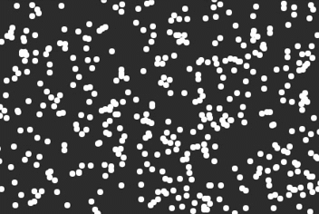 [[11]](https://natureofcode.com/book/chapter-6-autonomous-agents/)  

## Learning Objectives

With this chapter you gain

* an overview of the components of particles systems,
* an understanding of the characteristics for more natural movements with agents, and
* the ability to transfer the theory to examples of dynamic particle systems in Houdini (also through the exercise of next week).

## Particle Systems

I have already mentioned that with particles we almost always want to work with a dynamic system to make the particles move as we don't want to animate each particle manually. The process of making the particles move is also called *simulation*.  

So what are we talking about here exactly?

> A particle system is a collection of many many minute particles that together represent a fuzzy object. Over a period of time, particles are generated into a system, move and change from within the system, and die from the system.  
>  
> — William Reeves, *Particle Systems—A Technique for Modeling a Class of Fuzzy Objects*, ACM Transactions on Graphics 2:2 (April 1983), 92.

Reeves created [these particle effects](https://www.youtube.com/watch?v=zXFNypyMJCc) in the 80s as the first one to do so.

From this quote we can gather that we have a large amount of particles ("many many"), that time ("over a period of time") and movement ("move") matter and that there is some sort of lifecycle ("are generated" and "die").

Such systems of *many* things can 

* represent a variety of natural systems such as birds flocking, fish schooling, ecosystems evolving, etc., and
* model irregular types of natural phenomena auch as fire, smoke, waterfalls, fog, grass, bubbles, etc.

  
[[princeton.edu]](https://www.princeton.edu/news/2013/02/07/birds-feather-track-seven-neighbors-flock-together) *Flocks of birds.*

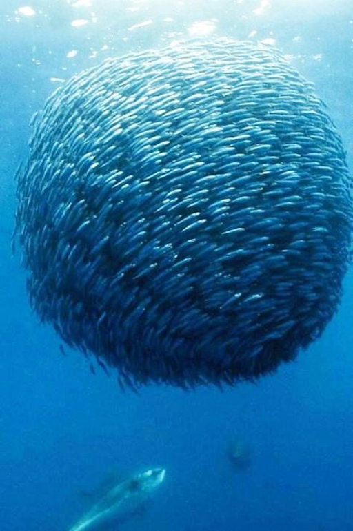  
[[pinterest]](https://www.pinterest.de/pin/31243791139408749/) *A school of fish.*

These systems are dynamics systems, often simulating based on insights from physics and based on Newton’s laws of motion about how to apply forces.

### Setup

A single particle is an independent body that moves.

For building a system of moving particles, you need

1. A constructor initializing the system
2. Computation of acceleration, velocity and location for each particle
3. Application of the newly computed values

Step 2. and 3. are usually executed by your 3D environment and, e.g., a solver node. If you are building a particle system from scratch, e.g., in Processing or p5, you would code all steps yourself.


### Emitter

As an emitter we understand the source of the particles. The emitter can emit a single burst of particles, a continuous stream of particles, or both. Emitter control the initial settings of the particles such as their location, velocity, etc. 

### Life Cycles

A particle usually does not live forever so the particle system might make old particles die depending of various possible reasons such as upon collision, running off screen, etc. Oftentimes particles have a well defined lifespan and e.g. die after a certain amount of time.

In regard to life cycles make sure to actually delete the affected particles. For example (up to my current knowledge), when you work with Processing and objects wander off-screen they continue to exists as normal objects and are recomputed.

### A System of Systems

A particle system is in itself an object. As such you can easily build a system of systems of systems of systems of systems...

  

We have already seen this principles in self-similar structures such as fractals or turbulence noise. But we can find this principle of *nesting* in all aspects of the world. E.g. an organ is a system of cells, a human body is a system of organs, a neighborhood is a system of human bodies, a city is a system of neighborhoods, and so own.


### Unreal

Please see the overall introduction to particles in Unreal in [Chapter 02 - Unreal](pgs_ss23_02_unreal_script.md#niagara). 

At there very least make sure that you know everything that is explained in the tutorial [UE5 Niagara in 300 Seconds](https://www.youtube.com/watch?v=Wxx_2ZLoKbI).

Helpful are also the [Niagara Overview](https://docs.unrealengine.com/5.1/en-US/overview-of-niagara-effects-for-unreal-engine/) and [Niagara Key Concepts](https://docs.unrealengine.com/5.1/en-US/key-concepts-in-niagara-effects-for-unreal-engine/) in the Unreal documentation.


## Advanced Behavior

So far, when working with forces only, influences, e.g., on the particles came only from the outside.

*With which concepts could we extend a simulation for creating more advanced behavior?*

There are two approaches towards more complex behavior:

1. Autonomous agents and group behaviors

Autonomous agents not only react to e.g. forces but they also take certain actions themselves. Furthermore, we might want to create not just a single agent but a group of agents. For these we also might assign behavior to the group as whole. For grouping, agents need to know about the members of their group and adjust their specific behavior in regard to the group, e.g. when flocking and schooling.

  
[[science-junkies]](https://science-junkies.com/meet-the-swirlon-a-new-state-of-active-matter-discovered-by-physicists/17)

  
[[david.li]](http://david.li/fluid/)    

2. Soft Body Deformations

Certain appearances and deformations, such as fluids and cloths, are actually often modeled as a system of connected particles. These are topics that a quite complex and for now we will not dive deeper into them on a theoretical level.

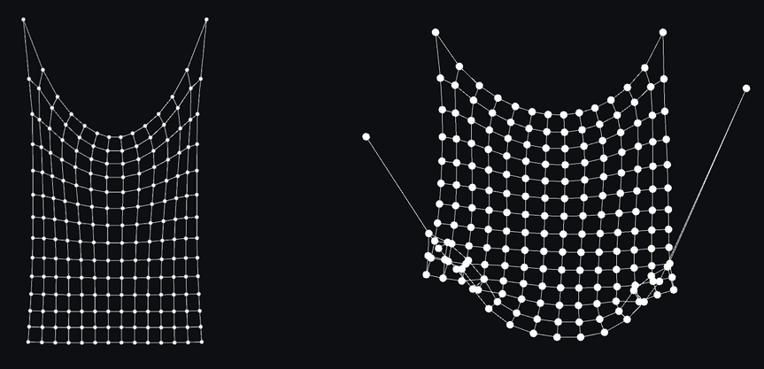  
[[jklintan]](https://jklintan.github.io/html/cloth-simulation.html)  

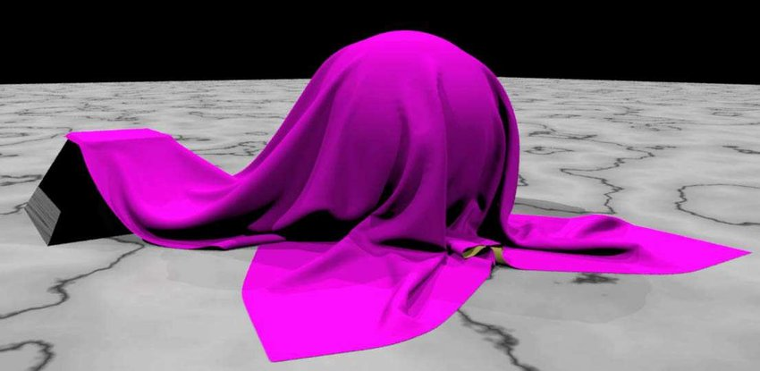  
 [[Gabriel-Zachmann]](https://www.researchgate.net/profile/Gabriel-Zachmann)


## Autonomous Agents

Autonomous agents not only react to their environment but also take actions and make their own choices. This is called agency, which can be described as a *desire* to move. Such desires can be differentiated for example as fleeing, wandering, arriving, pursuing, evading, etc. depending how the movement is expressed. Often, with agents the goal to create live-like behavior and an impression of liveliness.

### Agency

Agency requires some knowledge of the environment. This can be anything, from having an understanding of the whole scene, to just recognizing the closest neighbor. Which knowledge we need to implement depends on the system and the behavior we want to create.

Agency, or the desire to move must be a *computable action*. Hence, we usually implement it in the same way we were working with forces and understand agency as the application of *forces from within*. For group behaviors we need to enable local interactions between the elements themselves.

  


### Agents

Agents are nothing more than smart particles. However in the context of agency, we usually call them *vehicles* or *agents*. This is based on 

* Braitenberg, V. (1984). Vehicles, experiments in synthetic psychology. Cambridge, Mass.: MIT Press.
* Reynolds, C. W. (1999) [Steering Behaviors for Autonomous Characters](https://www.red3d.com/cwr/steer/), GDC proceedings, San Jose, Ca. Miller Freeman Game Group. Pages 763-782.

As agency often includes to go in a certain direction an to make turn, agents are often visualized as slim triangles.

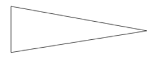  

An agent's actions can be based on its own characteristics, on a goal, its environment or a combination of these aspects. Characteristics can be that the agent is slow or fast for example. Goals can be to seek, to flee, to follow a path, to follow a vector field, to flock with your neighbors, etc. The environment could slow an agent down for example, when the agent wants to move left but there is also heavy wind coming from the left.

*How would you express goals such as fleeing, wandering and seeking? What properties does an agent have that e.g. flees?*  
  
*How could you express characteristics such as love, fear, surprise, anger, etc.?*

One of the simplest desires to move is the desire to move in a certain direction or towards an aim. This is implemented with a *steering force*.

### Steering Force

Imagine you have an agent that moves in a certain direction with a certain speed. But that vehicle has also the desire to move to a target, hence it is *seeking* a target, such as the following example shows it (find the Processing code for all following examples in Dan's [Chapter 6. Autonomous Agents](https://natureofcode.com/book/chapter-6-autonomous-agents/)).

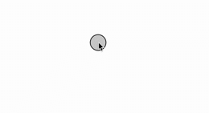  
[[11]](https://natureofcode.com/book/chapter-6-autonomous-agents/)  

  
[[11]](https://natureofcode.com/book/chapter-6-autonomous-agents/)  


  
 

Here, the steering force is the difference between the desired velocity and the current velocity, as defined by Reynolds in *Steering Behaviors for Autonomous Characters*.

```bash
// Reynolds’s steering formula
steering force = desired velocity - current velocity
```

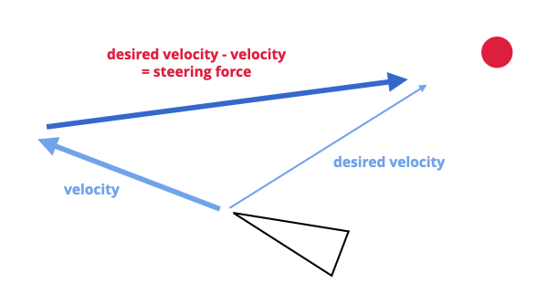  

You can understand this as a form of error correction and the difference between where I want to go and where I am currently going.

  
[[11]](https://natureofcode.com/book/chapter-6-autonomous-agents/)  

The agent desires to move towards the target usually has a constant *maximum speed*, which is also called the *steering strength*.

  
[[11]](https://natureofcode.com/book/chapter-6-autonomous-agents/)  

  
[[11]](https://natureofcode.com/book/chapter-6-autonomous-agents/) *Increased maximum speed.*

```java
// Pseudo Code

void seek(vec2 target)
{
    vec2 desired = target - location;
    desired.normalize();

    // Calculating the desired velocity
    // to target at max speed
    desired *= maxspeed;

    // Reynolds’s formula for steering force
    vec2 steer = desired - velocity;

    // Applying the force
    // to the object’s acceleration
    applyForce(steer);
}
```

Depending on the behavior you want to archive, you might not want the agent to get to the target as fast as possible. If that were the case, we would just say “location equals target” and there the agent would be. Our goal, as Reynolds puts it, is to move the vehicle in a *lifelike and improvisational manner*. For making it appear that the agent is slowly steering towards the target, you can also add a *maximum force* to limited the magnitude of the steering force.


  
  
[[11]](https://natureofcode.com/book/chapter-6-autonomous-agents/) *Increased maximum force.*

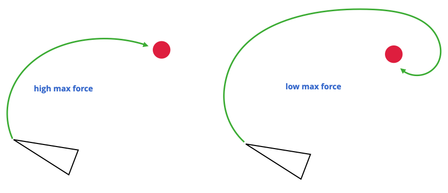

  
*How would you convert this seeking behavior into a fleeing behavior?*

To create even more live like behavior, often you want to create certain behavior when an agents comes closer to a target or arrives at a target. Reynolds suggests to slow down if we are a certain (small) distance from the target. This supports the appearance of the agent that it knows and perceives its environment.

For that, if the distance from the target is less than r, we map the range of zero to the desired speed and maximum speed to that distance.

  
[[11]](https://natureofcode.com/book/chapter-6-autonomous-agents/)  

  
[[11]](https://natureofcode.com/book/chapter-6-autonomous-agents/)  

If you are further interested in steering behaviors and how to make them appear life-like, check out Craig Reynold's original, in-depth [website about steering](https://www.red3d.com/cwr/steer/).

[[11]](https://natureofcode.com/book/chapter-6-autonomous-agents/)  

## Complex Systems

If we want to create more complex and more live-like systems than e.g. agents seeking a target, we can make use of the fact that often simple individual elements and rules combined, create a much more complex effect than just the sum of its parts. Such individual elements might be agents that have only a limited perception of their environment but they operate in parallel and create a complex whole with emergent behaviors. Examples for that are ant colonies, termites, migration patterns, earthquakes, snowflakes, etc.

### Non-Linearity

Complex systems also often include non-linear effects. Such a non-linear effect is also often casually referred to as *the butterfly effect* coined by mathematician and meteorologist Edward Norton Lorenz, a pioneer in the study of chaos theory. In 1961, Lorenz was running a computer weather simulation for the second time and, perhaps to save a little time, typed in a starting value of 0.506 instead of 0.506127. The end result was completely different from the first result of the simulation. In other words, the theory is that a single butterfly flapping its wings on the other side of the world could cause a massive weather shift and ruin our weekend at the beach. We call it *non-linear* because there isn’t a linear relationship between a change in initial conditions and a change in outcome. A small change in initial conditions can have a massive effect on the outcome. Non-linear systems are a superset of chaotic systems. 

[[11]](https://natureofcode.com/book/chapter-6-autonomous-agents/)  

### Competition and cooperation

One of the things that often makes a complex system tick is the presence of both competition and cooperation between the elements. In a flocking system, for example, elements have to cooperate, that is work together to stay together and move together. However, they also need to compete for space. We will come back to this. Competition and cooperation are a big factor for making a complex system appear to be alive.

[[11]](https://natureofcode.com/book/chapter-6-autonomous-agents/)  

### Feedback

Complex systems often include a feedback loop where the output of the system is fed back into the system to influence its behavior in a positive or negative direction. Let’s say you drive to work each day because the price of gas is low. In fact, everyone drives to work. The price of gas goes up as demand begins to exceed supply. You, and everyone else, decide to take the train to work because driving is too expensive. And the price of gas declines as the demand declines. The price of gas is both the input of the system (determining whether you choose to drive or ride the train) and the output (the demand that results from your choice). I should note that economic models (like supply/demand, the stock market) are one example of a human complex system. Others include trends, elections, crowds, and traffic flow.

[[11]](https://natureofcode.com/book/chapter-6-autonomous-agents/)  

The classic example for a complex system that appears to be more than the sum its parts is *[boids](https://www.youtube.com/watch?v=86iQiV3-3IA)*.

## Boids

Boids are again, the doing of Craig Reynolds:

Reynolds, Craig (1987). *[Flocks, herds and schools: A distributed behavioral model](https://dl.acm.org/doi/10.1145/37402.37406)*. SIGGRAPH '87

Boids is, what Reynolds calls an artificial life program, which simulates the flocking behavior of birds - with very simple rules. The name *boid* corresponds to a shortened version of *bird-oid object*, which refers to a bird-like object [2, as cited in 12]. Incidentally, *boid* is also a New York Metropolitan dialect pronunciation for *bird*.

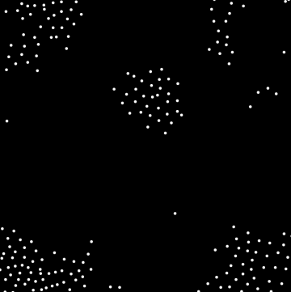  
[[codingtrain]](https://editor.p5js.org/codingtrain/sketches/ry4XZ8OkN)  

As with most artificial life simulations, Boids is an example of emergent behavior; that is, the complexity of Boids arises from the interaction of individual agents (the boids, in this case) adhering to a set of simple rules. The rules applied in the simplest Boids world are as follows:

1. *separation*  (also known as *avoidance*): Steer to avoid colliding with your neighbors.
2. *alignment* (also known as *copy*): Steer in the same direction as your neighbors.
3. *cohesion*  (also known as *center*): Steer towards the center of your neighbors (stay with the group).

  
[[11]](https://natureofcode.com/book/chapter-6-autonomous-agents/)  

  
[[codingtrain]](https://editor.p5js.org/codingtrain/sketches/ry4XZ8OkN) *The left slider adjusts the influence of alignment, the middle one cohesion and the right one separation*

You can also try [this implementation](https://boids.cubedhuang.com/) to get a feel for the boid algorithm.


### Example: Separation

If a given agent is too close to you, steer away from that agent. This is the same as the above discussed seeking behavior of an agent. We only need to inverse the direction of the force to point away from the crowd. For this we take the average of all the vectors pointing away from any agent within a certain range. 


The desired velocity to seek a target:  
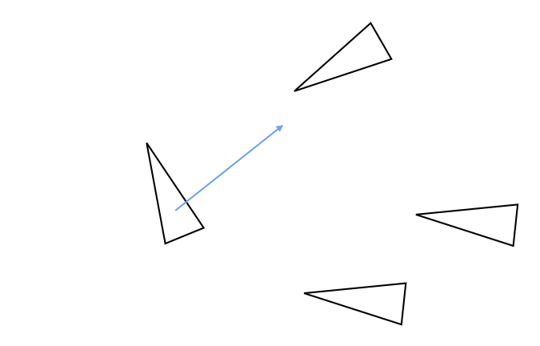

For separating oneself going the opposite direction:  
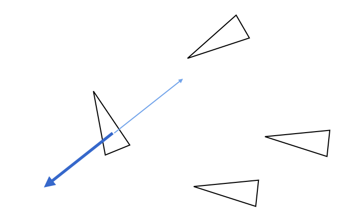

Iterating over all neighbors in a certain distance, computing the fleeing direction:  
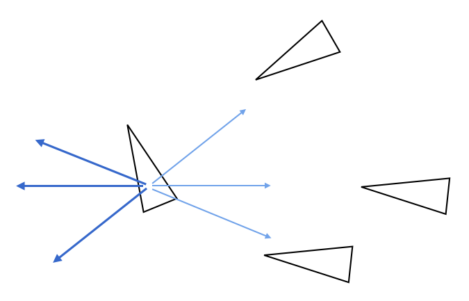

Weighting the forces by the distance to the agent:  
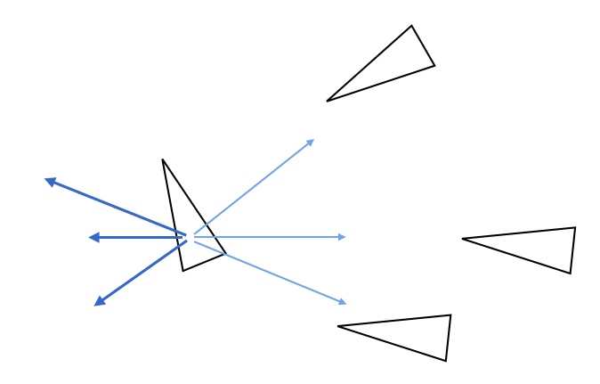

Averaging over all fleeing vectors to get the final separation force:  
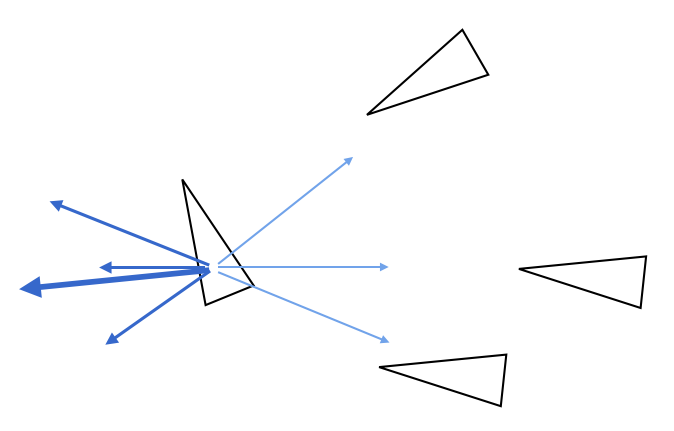

All in all, the steps to compute the separation force for a single agent (the "main agent") are

1. Get all agents within a certain radius.
2. Get the difference between the main agent and those neighboring agents within the radius.
3. Compute the average of all differences (of the main agent and a neighbor) and weight each contribution by its distance.
4. Set the steering strength.
5. Apply Reynolds’s steering formula (steering force = desired velocity - current velocity).
6. Clamp at the maximum force for the resulting separation steering force.
7. Update the acceleration and velocity for the main agent.
8. Reset the main agent's acceleration.
9. Start all over again in the next frame.

Similarly, for the alignment rule, we take the average of the velocity of all agents within a certain radius in order to move in a similar direction as them. For the cohesion rule,  we want to stay close to our group. Hence for cohesion we take the average of the positions of all agents within a certain radius.

For inspiration
* Beautiful [javascript version](http://www.basis64.nl/flocking3D/) (only works in Chrome) 
* Basic [p5 sktech in 2D](https://editor.p5js.org/codingtrain/sketches/ry4XZ8OkN) from Dan based on his [video tutorial](https://thecodingtrain.com/CodingChallenges/124-flocking-boids). The same as the p5 sketch in 2D but with a [quadtree optimization](https://editor.p5js.org/TheTastefulToastie/sketches/BJNaRITyE).
* [p5 sktech in 3D](https://editor.p5js.org/SebastienR/sketches/ryDc4qaJE)
* [Emoji version](https://editor.p5js.org/jcponce/present/ECrShIcB8)
* [Worm version](https://editor.p5js.org/RobinAndersson/sketches/r1-91uVxV) (nice idea but the visuals could be improved in my opinion).


More complex rules can be added, such as obstacle avoidance and goal seeking, as discussed in [Turtles, Termites, and Traffic Jams (Complex Adaptive Systems)](https://www.amazon.de/Turtles-Termites-Traffic-Complex-Adaptive/dp/0262680939).

  
[[basis64]](http://www.basis64.nl/flocking3D/) (only works in Chrome) 

Or boids can be combined with a fluid simulation:

  
[[davidar]](https://www.shadertoy.com/view/7dlcW7)

[[11]](https://natureofcode.com/book/chapter-6-autonomous-agents/) [[12]](https://en.wikipedia.org/wiki/Boids)  

---

## References

[[1] Merriam Webster - animate](https://www.merriam-webster.com/dictionary/animate)  
[[2] TRB - Heider-Simmel: Is there a story?](http://trbq.org/play/)  
[[3] Wiki - Kinematics](https://en.wikipedia.org/wiki/Kinematics)  
[[4] Wiki - Force](https://en.wikipedia.org/wiki/Force)  
[5] Kadry, S., 2014. [Mathematical Formulas For Industrial And Mechanical Engineering](https://books.google.de/books?id=-WC_AAAAQBAJ&printsec=frontcover&hl=de&source=gbs_ge_summary_r&cad=0#v=onepage&q&f=false). London: Elsevier.  
[[6] Entagma - Particles Part 03 – The Principle Of Particle Simulation](https://entagma.com/particles-part-03-the-principle-of-particle-simulation/)  
[[7] Wiki - Velocity](https://en.wikipedia.org/wiki/Velocity)  
[[8] Wiki - Newton's Third Law](https://en.wikipedia.org/wiki/Newton%27s_laws_of_motion#Newton's_third_law)  
[[9] Maths is Fun - Introduction to Integration](https://www.mathsisfun.com/calculus/integration-introduction.html)  
[[10] The Nature of Code - Forces](https://natureofcode.com/book/chapter-2-forces/)  
[[11] The Nature of Code - Autonomous Agents](https://natureofcode.com/book/chapter-6-autonomous-agents/)  
[[12] Wiki - Boids](https://en.wikipedia.org/wiki/Boids)  

---

The End

💦 ⚽️ 🤹🏾
