name: inverse
layout: true
class: center, middle, inverse
---


# Procedural Generation and Simulation

### Prof. Dr. Lena Gieseke | l.gieseke@filmuniversitaet.de  

#### Film University Babelsberg KONRAD WOLF


---
layout: false

## Today

--

* Introduction 

--
* Pattern

--
* Procedural Generation

--
* Course Setup

---
template: inverse

## Introduction

---

## Introduction

> What type of visual are we talking about?

---

## Patterns!

--

> What is a specific example for a pattern?


???
.task[COMMENT:]  

* In this lecture we will focus on patterns in all shape and forms. 
* Patterns can not only be found in designs such as the famous islamic patterns but also in nature - be it visually or on a structural level. 
* So, let's start with thinking about pattern some more.

---

## Patterns!

> *What is a pattern?*


???
.task[COMMENT:]  

* Any explanations?
* https://dictionary.cambridge.org/dictionary/english/pattern

---
.header[Patterns]

## Repetitive Structures

Repetitive structures that follow some sort of creation principles.

--

> Bottomless wonders spring from simple rules, which are repeated without end.

\- Benoît Mandelbrot 

---
.header[Patterns]

## Ubiquitous

Patterns are ubiquitous in our world, from

--
* galaxies to 

--
* molecular micro-patterns.

---

.center[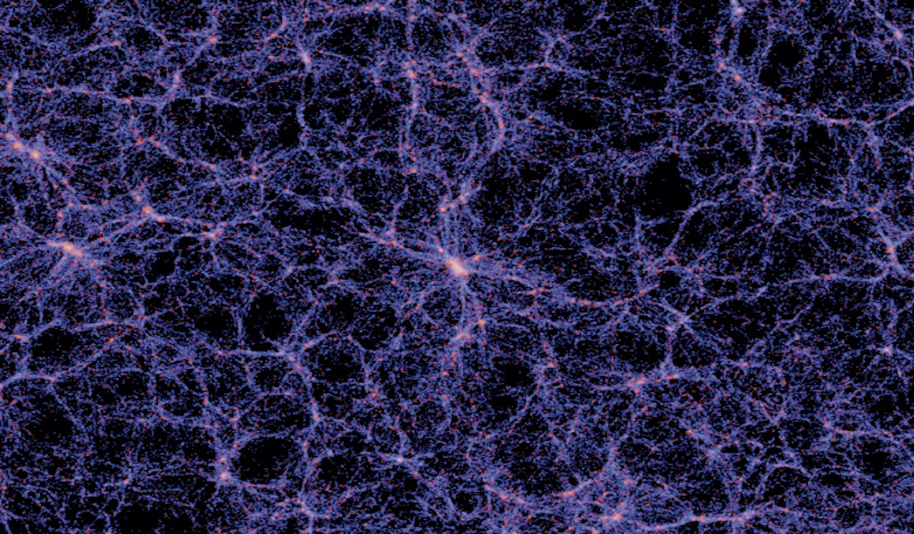]  
[[room.eu.com]](https://room.eu.com/news/astronomers-detect-a-trio-of-unusual-dwarf-galaxies-in-the-voids-of-the-cosmic-web)


???
.task[COMMENT:]  

* Above an image of the 'cosmic web', the large scale structure of the universe. 
* Each bright knot is an entire galaxy, while the purple filaments show where material exists between the galaxies.

---

.center[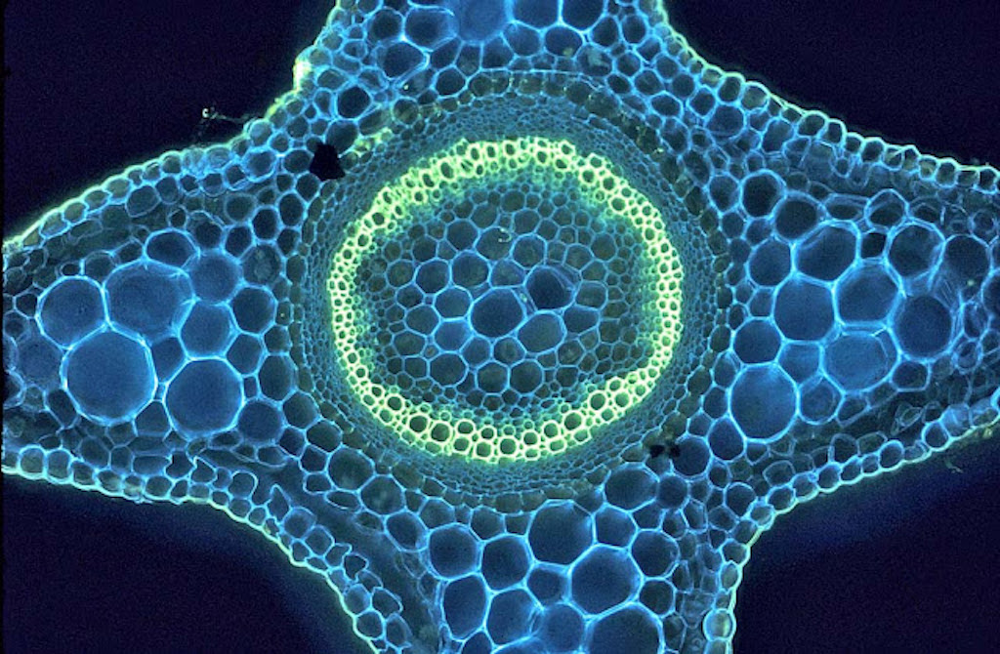]  
[[beyondthehumaneye]](https://beyondthehumaneye.blogspot.com/2010/12/sticky-jack.html)

???
.task[COMMENT:]  

* The above image shows a cross section of the stem of the plant commonly known as goosegrass or sticky Jack and more scientifically as Galium aparine. 
* This image was produced using fluorescence microscopy, staining the cells with compounds that bind to the cell walls and fluoresce.
* https://www.pinterest.de/aaziah/pattern/

---

.center[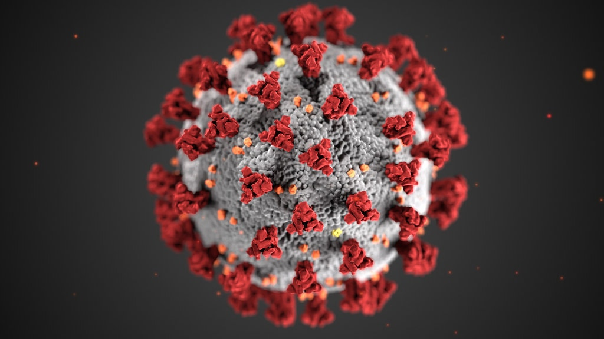]  
[[How C.D.C. medical illustrators created the coronavirus pandemic’s most iconic image - NYTimes]](https://www.nytimes.com/2020/04/01/health/coronavirus-illustration-cdc.html)


???
  
*On a side note*: If you are interested in scientific micro-scale visualization this [Nerd Chat: Dr. Jeroen Claus - Covid, Proteins, Visualisation](https://www.youtube.com/watch?v=qxIbzABH4PU&t=506s) is interesting. And if you want to go straight to Houdini, you can complete the [Guest Tutorial: Dr. Jeroen Claus - Rendering The Corona Virus' Spike Protein](https://www.youtube.com/watch?v=M3ldQBVb-ZA&t=3s).


---
.header[Patterns]

## Ubiquitous

Patterns are ubiquitous in our world, from

--

* natural to

--
* man-made.

---

.center[]  
[[boredpanda]](https://www.boredpanda.com/geometry-symmetry-plants-nature/?utm_source=google&utm_medium=organic&utm_campaign=organic)

---

.center[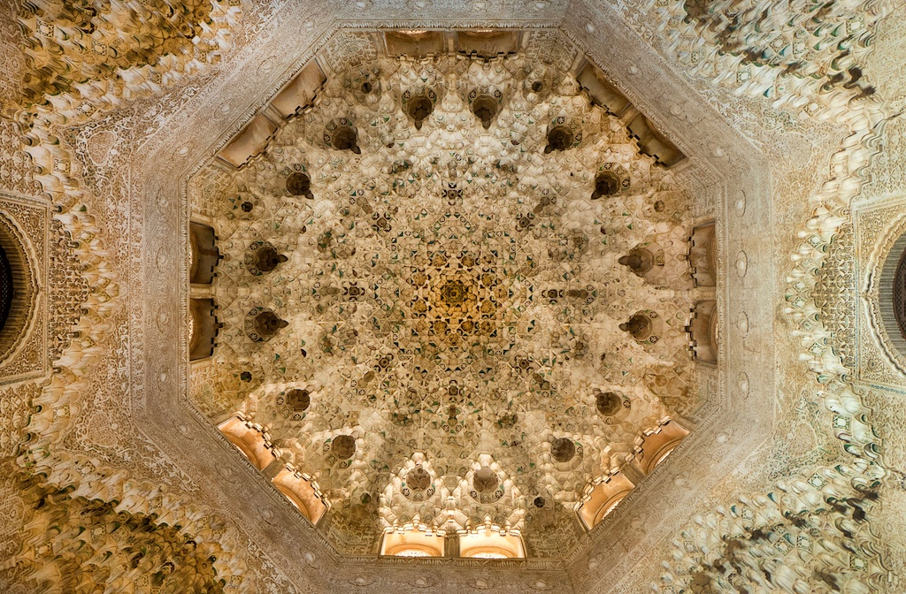]  
[[reddit]](https://www.reddit.com/r/pics/comments/4c9zey/ceiling_of_the_abencerrajes_room_la_alhambra_spain/)  
.footnote[Alhambra, Granada]

---

.center[]  
[[boredpanda]](https://www.boredpanda.com/geometry-symmetry-plants-nature/?utm_source=google&utm_medium=organic&utm_campaign=organic)

---
.header[Patterns]

## Properties

> Which characteristic do many patterns have?

???
.task[COMMENT:]  

* Look at the pattern carefully and try to identify a characteristic

---

.center[]  
[[robin-noorda]](https://www.robin-noorda.com/structure-in-nature.html)  

---

.center[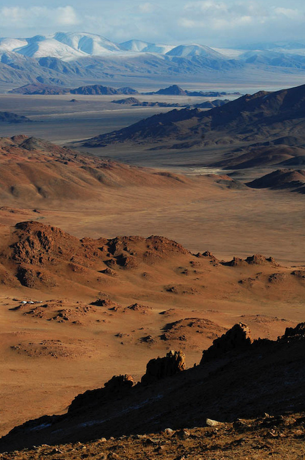]  
[[robin-noorda]](https://www.robin-noorda.com/structure-in-nature.html)  

---

.center[]  
[[robin-noorda]](https://www.robin-noorda.com/structure-in-nature.html)  

---

.center[]  
[[tcpermaculture]](https://tcpermaculture.blogspot.com/2012/04/permaculture-plants-wild-angelica.html)  


---
.header[Patterns]

## Self-similarity

One of the most prominent pattern principles is self-similarity.

---

.center[]  
[Turbosquid, Ales Rajar](https://www.turbosquid.com/3d-models/rocky-mountain-ready-3d-model/654659)

---

.center[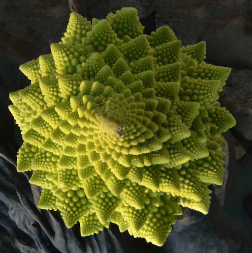]  
[[robin-noorda]](https://www.robin-noorda.com/structure-in-nature.html)  

---
.header[Patterns]

## Self-similarity

.center[ ]  

> Based on these images, how would you describe self-similarity?


???
.task[COMMENT:]  

* In mathematics, a self-similar object is exactly or approximately similar to a part of itself (i.e., the whole has the same shape as one or more of the parts). Many objects in the real world, such as coastlines, are statistically self-similar: parts of them show the same statistical properties at many scales.

---
.header[Patterns]

## Self-similarity

.center[]  
[[wiki]](https://en.wikipedia.org/wiki/Koch_snowflake)  

???
.task[ASK:]  

* What is the creation rule of the following example?

---
.header[Patterns]

## Self-similarity

.center[]  
[[stackexchange]](https://tex.stackexchange.com/questions/404925/animated-koch-snowflake)  


---
.header[Patterns | Self-similarity]

##  Fractals

In maths, probably the most famous self-similar structure are fractals, e.g. the Mandelbrot set.

.center[]  
[[Wiki]](https://en.wikipedia.org/wiki/Mandelbrot_set)  

---
.header[Patterns | Self-similarity]

##  Fractals

.center[]  
[[Wiki]](https://en.wikipedia.org/wiki/Mandelbrot_set)  

<!--

If you are interested in how these patterns are created, I recommend this [The Mandelbrot Set - Numberphile](https://www.youtube.com/watch?v=NGMRB4O922I) video.

By the way, this is Benoît B. Mandelbrot, the French and American mathematician, who is considered to be the father of fractal geometry:

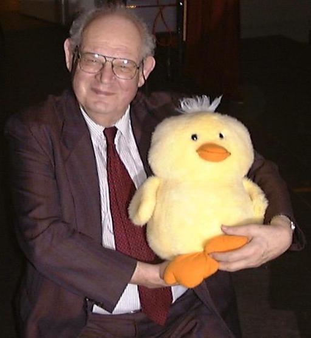  
[[thepassengertimes]](https://thepassengertimes.com/2010/06/27/benoit-mandelbrot/)

I also recommend Mandelbrot's [TED Talk - Fractals and the art of roughness](https://www.ted.com/talks/benoit_mandelbrot_fractals_and_the_art_of_roughness).

Even though mathematical sets such as the Mandelbrot set are stunningly beautiful, they are very limited in their designs, meaning, you can't really adjust them flexibly. They look how they look and that is that. This is the reason why we are not spending more time on these beautiful but limited structures.

<!-- Board:

This happens in the world of complex numbers
Numbers of the form a + bi plotted on a complex plane
a, and b are real numbers, i^2 = -1

Mandelbrot: we have complex number c and function f_c(z) = z^2 + c
Look at the behavior of 0 under the iteration of f_c (what happens if I take 0 and plug it into the function?) and I keep doing that to the result

f_1(z) = z^2 + 1

f_1(0) = 0^2 + 1 -> 1
f_1(1) = 1^2 + 1 -> 2
f_1(2) = 2^2 + 1 -> 5
f_1(5) = 5^2 + 1 -> 26

What happens to the size of the result? The magnitude (the distances of a and b on the plane). Do they blow up or stay bounded?

The above is the “blowing up” case

The bounded case, e.g. happens for c = -1

f_-1(0) = 0^2 + -1 -> -1
f_-1(-1) = -1^2 + -1 -> 0
f_-1(0) = 0^2 + -1 -> -1


The Mandelbrot set defines only numbers that are bounded (never larger than 2)

For the pretty pictures you color complex number on the complex plane depending in this behavior

The boundaries are where it gets interesting: when you move c a little you can’t predict what happens

https://www.youtube.com/watch?v=NGMRB4O922I -->


---
.header[Patterns]

## Abstraction

--

.center[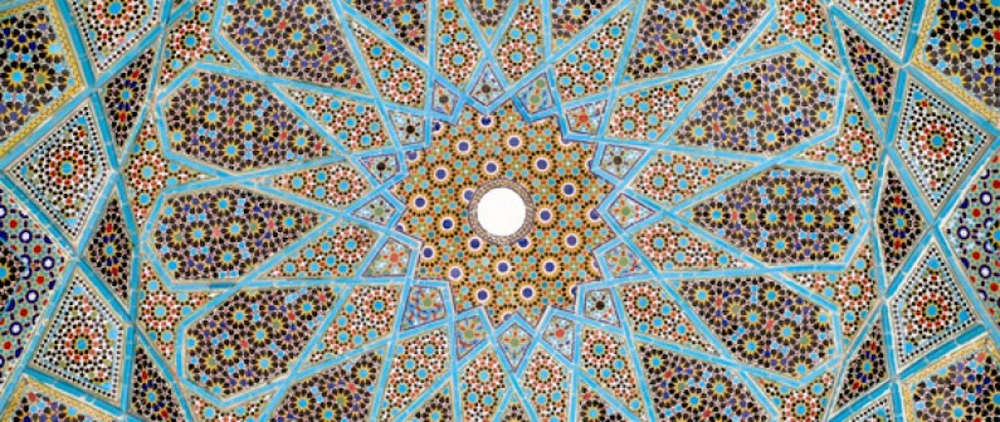]  
[[gulenmovement]](http://www.gulenmovement.com/gulens-rethinking-of-islamic-pattern-and-its-socio-political-effects-2.html)  

---

.center[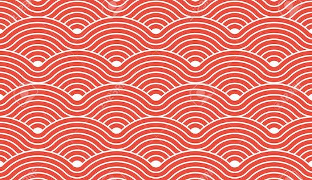]
[[123rf]](https://www.123rf.com/photo_30452572_stock-vector-curvy-waves-repetitive-pattern-vector-texture-background.html)  

---

.center[]  
[[colourbox]](https://www.colourbox.com/vector/repetitive-violet-pattern-vector-4908641) 

---

.center[]  
[[artlebedev]](https://www.artlebedev.com/pattern/rustle/)


---

.center[]  
[Holger Lippmann](http://e-art.co/)

---

.center[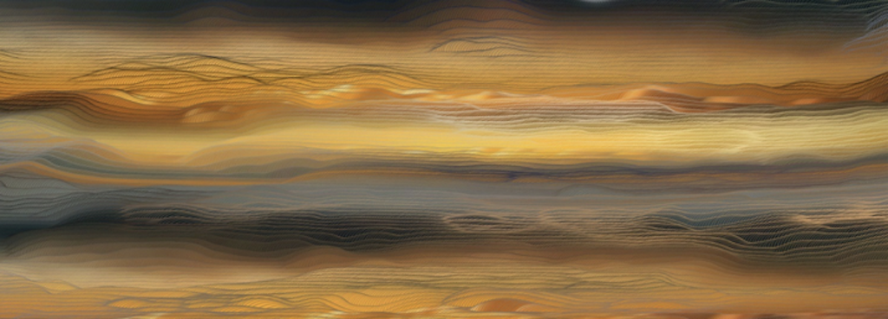]  
[Holger Lippmann](http://e-art.co/)

---


.center[]  
[[artsper]](https://www.artsper.com/en/contemporary-artworks/print/183841/sans-titre)  

.footnote[Keith Haring]

---

.center[]  

[Major Lazer – Light it Up (feat. Nyla & Fuse ODG)](https://www.youtube.com/watch?v=r2LpOUwca94)

---
template:inverse


# Abstraction in Art

---
## Abstraction in Art

Looking for inspiration and examples is to me always a good idea!

???
.task[COMMENT:]  

Ideally, we want to use patterns as elements for an overall artistic or *design goal*. I personally love patterns so much that creating an interesting pattern is often enough already full-filling to me.  

However, I would like to encourage you to think about a bigger context - maybe even *meaning* - for your work. Ideally, patterns and the design elements we are going to learn in this class, will be elements for a larger creative design goal, which you set with *intention* and *reflection*.

Please, don't be worried about being *artistic*. I do not expect from you to be artistic - but *creative*. What is the difference? Well, you need to be creative to be artistic but you can be creative without being artistic - now, it is clear right ? For this lecture, I think it will become clear in regard to the results of our work. 

*On a side note:* If you are more interested in creating tools for others to be creative and artistic, and you do not necessarily want to be the artist yourself, I believe our upcoming creative tasks will also be beneficial to you as they make you understand your "clients" better.

To me, an artistic piece conveys meaning and / or emotion beyond an immediate practicability or aesthetic. I do want to encourage you to think about these aspects. However in this class it is completely fine to come up with results that simply look good / interesting / the way you want. Hence, we focus on the *aesthetics*. But to come up with these, I expect intention and reflection from you.

Also, what I am trying to say is that we are now going to have a brief look into abstractions in art because it can be a great inspiration (and because we strive to be *academics*, right?). But I don't expect from you this level of work, if you don't want to.

--

> The following exploration is from a purely European-centric perspective!

---
## Abstraction in Art

Artists moved away from 

--
* visually representing reality

???
.task[COMMENT:]  

* In art, abstraction came to live when artists moved away from visually representing reality in a literal fashion. All through history, art has been complex with different levels meaning. However, up until a certain time, artists transported meaning with visuals that did aim to replicated reality.
* With the start of the last century, artists broke with visuals from reality and became more and more *non-representational*. 

--
* aiming to convey a certain, specific *subject matter*.

---
.header[Abstraction in Art]

## Fauvism

  
[[Luxe, Calme et Volupté, Henri Matisse, 1904]](https://en.wikipedia.org/wiki/File:Matisse-Luxe.jpg)


???
.task[COMMENT:]  

* What do you see?
* Early Abstract Art, Fauvism
* Fauvism as a style began around 1904 and continued beyond 1910, lating only a few years. The name comes from *fauves* meaning *wild beasts*. It was still representational but more and more emphasized painterly qualities, such as bold colors, coming straight from the tube or exposing the canvas. Artist rendered their subjects to portray emotion, rather than representation. Key artists are Henri Matisse, André Derain and  Maurice De Vlaminck.


---
.header[Abstraction in Art]

## Cubism

  
[[Girl with a Mandolin, Pablo Picasso, 1910]]()  


???
.task[COMMENT:]  

* What do you see?
* Cubism revolutionized during the 1910s and throughout the 1920s European painting and sculpture, and inspired related movements in music, literature and architecture. It remains representational but forms appear fragmented. Artists attempt to show multiple sides of an object and reject the recreation of perspective, and realistic shading. Key artists are Pablo Picasso and Georges Braque.


---
.header[Abstraction in Art]

## Futurism

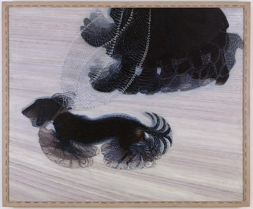  
[[Giacomo Balla, Dynamism of a Dog on a Leash, 1912]](https://en.wikipedia.org/wiki/File:Giacomo_Balla,_1912,_Dynamism_of_a_Dog_on_a_Leash,_oil_on_canvas,_89.8_x_109.8_cm,_Albright-Knox_Art_Gallery.jpg)  

???
.task[COMMENT:]  

* What do you see?
* Cubism contributed to the formation of the Italian artistic style of *Futurism*, an artistic and social movement that sought to break every known rule of art. While still representational, the style emphasizes speed and visualizing movement. You can go as far as saying futurists fetishized speed, technology, violence and industrialization and many of them are said to be fascists. Key artist are Joseph Stella, Umberto Boccioni and Giacomo Balla.


---
.header[Abstraction in Art]

## Surrealism

  
[[Dorothea Tanning, Tamerlan, 1959]](https://www.sothebys.com/en/auctions/ecatalogue/lot.90.html/2015/cherchez-la-femme-n09398)  


???
.task[COMMENT:]  

* What do you see?


---
.header[Abstraction in Art]

## Pure Abstraction

  
[[Hilma af Klint, Group V, The Seven-Pointed Star, 1908]](https://medium.com/as-mag/modern-mystic-hilma-af-klint-c4ef6c27467c)  


???
.task[COMMENT:]  

* What do you see?
* Even though Kandinsky is commonly considered to be the first artist of the modern era to abandon representational imagery, Hilma af Klint's abstract work predates the first purely abstract compositions by Kandinsky. Her paintings, which sometimes resemble diagrams, were a visual representation of complex spiritual ideas.


---
.header[Abstraction in Art]

## Pure Abstraction


  
[[Several Circles, Wassily Kandinsky, 1926]](https://en.wikipedia.org/wiki/File:Vassily_Kandinsky,_1926_-_Several_Circles,_Gugg_0910_25.jpg)


???
.task[COMMENT:]  

* What do you see?
* Next to his paintings, Kandinsky put his thoughts and reflections in theoretical writings on art. Kandinsky saw the communication between artist and viewer as being available to both the senses and the mind. Also, Kandinsky had synesthesia and heard tones and chords as he painted and music served as a big inspiration to his visual forms.

---
.header[Abstraction in Art]

## Pure Abstraction

    
[[Composition II in Red, Blue, and Yellow, Piet Mondriaan, 1930]](https://en.wikipedia.org/wiki/File:Piet_Mondriaan,_1930_-_Mondrian_Composition_II_in_Red,_Blue,_and_Yellow.jpg)


???
.task[COMMENT:]  

* What do you see?
* De Stijl was a Dutch art movement founded in 1917, aiming to abstract through the reduction to the essentials of form and colour. The style is famous for its flat colors with no shading or modeling and geometric shapes. Key Artists are Theo van Doesburg and Pier Mondrian.


---
.header[Abstraction in Art]

## Suprematism

  
[[Quadrato rosso, Kazimir Malevich, 1915]](https://en.wikipedia.org/wiki/File:Francis_Picabia,_1912,_La_Source,_The_Spring,_oil_on_canvas,_249.6_x_249.3_cm,_Museum_of_Modern_Art,_New_York._Exhibited,_1912_Salon_d%27Automne,_Paris.jpg)


???
.task[COMMENT:]  

* What do you see?
* Suprematism is an art movement focused on basic geometric forms, such as circles, squares, lines, and rectangles, painted in a limited range of colors. Emphasis is put on the relationships between shapes and bordes of canvas. The key artist is Kazimir Malevich.


---
.header[Abstraction in Art]

## Action Painters

  
[[Vawdavitch, Franz Kline, 1955]](https://www.artsy.net/artwork/franz-kline-vawdavitch)  

???
.task[COMMENT:]  

* What do you see?
* Action painting is a style of painting in which paint is spontaneously dribbled, splashed or smeared onto the canvas, rather than being carefully applied. The resulting work often emphasizes the physical act of painting itself as an essential aspect of the finished work or concern of its artist. Key artist are  Jackson Pollock, Franz Kline, Lee Krasner and Willem de Kooning.


---
.header[Abstraction in Art]

## Color Field Artists

  
[[Riverhead, Helen Frankenthaler, 1963]](https://awarewomenartists.com/en/magazine/helen-frankenthaler-le-triomphe-de-la-couleur/)  


???
.task[COMMENT:]  

* What do you see?
* Color field is characterized primarily by large fields of flat, solid color spread across or stained into the canvas creating areas of unbroken surface and a flat picture plane. The movement places less emphasis on gesture, brushstrokes and action in favour of an overall consistency of form and process. In color field painting "color is freed from objective context and becomes the subject in itself." Key artist are Mark Rothko, Helen Frankenthaler, Barnett Newman, Ellsworth Kelly.


---
template:inverse


## Abstracted Artistic Expression in CGI


???
.task[COMMENT:]  

* Of course, also the medium of computer generated imagery (CGI) has been explored for abstracted artistic expressions.  

How artistic and how abstracted the following examples are in contrast to being purely design, I leave it up to you to judge.  

Question: *How do these CGI images relate to the traditional art styles, we just discussed?*  

In the fairly new field CGI art, there are no generally established movements of style - yet. Nonetheless, you can summarize certain approaches, such as attempted in the following.  

Please note, that these images are not necessarily done with Houdini. Here, it is about the imagery, not the tool.


---
## Abstracted Artistic Expression in CGI

--
* Reinterpreting Human Forms

--
* Forms and Textures

--
* Geometric Forms

---
.header[Abstracted CGI]

## Reinterpreting Human Forms

--

  
[[Albert Omoss]](https://www.instagram.com/p/BB6LoHcEQog/)  


???
.task[COMMENT:]  

* What do you see?

---
.header[Abstracted CGI]

## Reinterpreting Human Forms

  
[[Lee Griggs]](https://leegriggs.com/volume-mesh)  

???
.task[COMMENT:]  

* What do you see?


---
.header[Abstracted CGI]

## Reinterpreting Human Forms

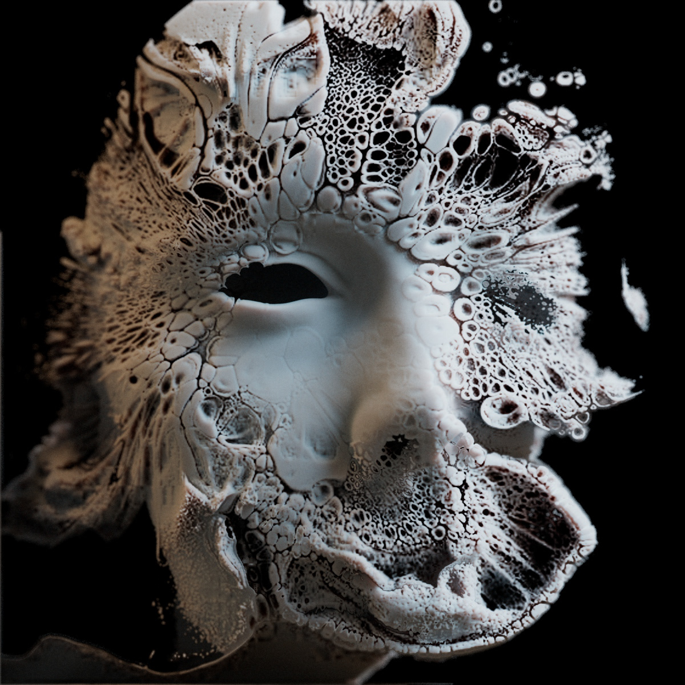  
[[Lee Griggs]](https://leegriggs.com/volume-mesh)  

???
.task[COMMENT:]  

* What do you see?

---
.header[Abstracted CGI]

## Forms and Textures

--

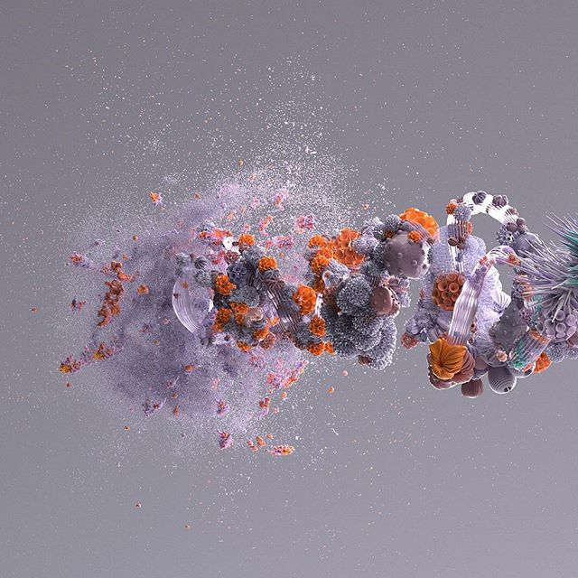  
[[Lukas Vojir]](https://www.instagram.com/lukasvojir/)  


---
.header[Abstracted CGI]

## Forms and Textures

  
[[Peter Tarka]](https://www.instagram.com/petertarka/?hl=en)  


---
.header[Abstracted CGI]

## Forms and Textures

  
[[Albert Omoss]](https://omoss.io/)  

---
.header[Abstracted CGI]

## Forms and Textures

  
[[Albert Omoss]](https://omoss.io/)  

---
.header[Abstracted CGI]

## Forms and Textures

  
[[Lukas Vojir]](http://lukasvojir.com/flower)  

---
.header[Abstracted CGI]

## Forms and Textures

  
[[Lukas Vojir]](http://lukasvojir.com/flower)  

---
.header[Abstracted CGI]

## Forms and Textures

  
[[Lukas Vojir]](http://lukasvojir.com/flower)  


---
.header[Abstracted CGI]

## Geometric Forms

--

  
[[Chris Bjerne]](https://www.instagram.com/chris_bjerre/?hl=de)  

---
.header[Abstracted CGI]

## Geometric Forms

  
[[Nervous System]](https://n-e-r-v-o-u-s.com/projects/albums/floraform-sculptures/content/florescence-ornata-3/)

---
template:inverse

# In Summary...

---
## In Summary...

> Our aesthetic goals are patterns and abstractions.


???
.task[COMMENT:]  

* Let's turn to thinking about how we could create these.

---
template:inverse

# Procedural Generation

---
## Procedural Generation

> What means procedural generation?

---
## Procedural Generation

--
* Applying algorithms and mathematical functions

???
.task[COMMENT:]  

* We understand procedural generation as the approach of applying algorithms and mathematical functions to synthesize a model or an effect.

--
* Finding a *recipe*

???
.task[COMMENT:]  

* You can imagine it as finding a recipe to describe and synthesize content.

--
* As opposite to manual data creation

???
.task[COMMENT:]  

* A procedural approach stands in contrast to manual data creation, e.g. painting pixels, and using existing data, e.g. photographs.

--

Hence, you usually differentiate between *procedural* and *data-driven* approaches.  

--

Modern approaches are often hybrids of both.

---
.header[Procedural Generation]

## Pattern Generation

> Why does it make sense to use procedural generation for pattern creation?

--

Pattern follow underlying rules and these rules can be formally described and iteratively executed...

--
which is something a computer does quite well!


---
.header[Procedural Generation | Pattern Generation]

## Example

Remember?

  

--

```BASIC
10 PRINT CHR$(205.5+RND(1)); : GOTO 10
```

---
.header[Procedural Generation | Pattern Generation]

## Example

  


This grid-based pattern is created with an algorithm, hence procedurally. 


???
.task[COMMENT:]  

* Do you remember possible parameter?

---
.header[Procedural Generation | Pattern Generation]

## Example

As parameter we could use the spacing of the grid and the probability for choosing a certain slash.


---
## Procedural Generation

An important but notoriously difficult aspect of using procedural generation for content creation is the *parametrization* of an algorithm. 

--

Ideally, control should be

--
* intuitively understandable 

--
* expressive

--
* balance manual creation and automation

---
## Procedural Generation

Algorithms emerged in the late 1980s and gained immediate importance...

???
.task[COMMENT:]  


* History
    * Procedural Generation techniques have a long history in Computer Graphics. They emerged in the late 1980s and gained immediate importance.
    * In its earliest and purest forms, equation-based representations were considered as procedural generation. Even these math formulas are able to reproduce many natural phenomena – such as wood, stone, water, smoke and plants with just some kilobytes of code.


---
.header[Procedural Generation]

## Advantages

> What are the advantages of procedural generation techniques?

---
.header[Procedural Generation]

## Advantages

--
* Compactness

???
.task[COMMENT:]  

* Few kilobytes for textures and volumes

--
* Continuous and multi-resolution

???
.task[COMMENT:]  

* Any resolution
* Any extent
* E.g. for VR scenes

--
* Potentially randomly accessible

???
.task[COMMENT:]  

* Meaning, you can for example compute the color value for one pixel of a rasterimage independently from all other pixel in no particular order.
* It can be evaluated in a constant time, regardless of the location of the point of evaluation, and regardless of previous evaluations.
* Harness the power of multi-pipe GPU’s and multi-core CPU’s.

--
* Parametrized

???
.task[COMMENT:]  

* Often specify a whole visual category or class with controlling large amounts of details
* Fast to interact with and flexible, e.g. in an interactive system
* Remain editable throughout an entire visual effect production pipeline for example

---
.header[Procedural Generation]

## Disadvantages

--
* Parametrized
    * Non-intuitive
    * Too little control
    * Time-consuming exploration
???
.task[COMMENT:]  

* Non-intuitive
    * Too abstract characteristics of the underlying functions (e.g. *frequency*)
    * Overlapping effects
* Too little control
    * Surprising results can also be seen as positive
    * Almost never allow per-pixel control of the output 
* Time-consuming exploration

--
* Implementation effort

--
* Limited design space

--
* Potential evaluation time issues

--
* Potential aliasing issues

---
## Procedural Generation

Much research goes into an efficient and controllable parameterization of procedural representations, such as from yours, truly:

[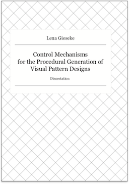](https://elib.uni-stuttgart.de/handle/11682/10357)

---
template:inverse

## Generation Models

---
.header[Procedural Generation]

## Generation Models

Over the years, a variety of different generation models were established in the Computer Graphics community. The most established generation principles are

--
* Stochastic Models

--
* Function-based Models

--
* Rule-based heuristic Models

--
* Grammar-based Models

---
.header[Procedural Generation | Generation Models]

## Stochastic

Stochastic models generate maps of random values with noise functions and map color to those random numbers. 

.center[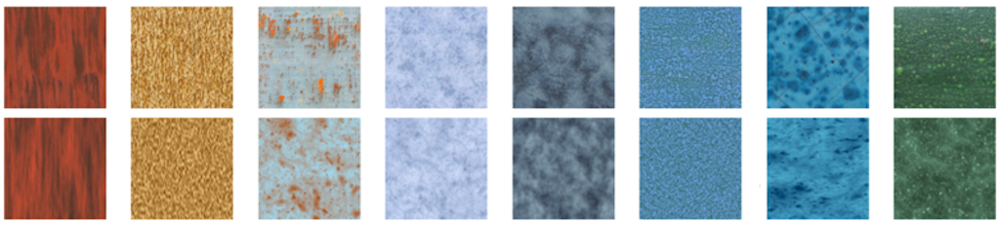]

.footnote[Gieseke, L., Koch, S., Hahn, J.-U., and Fuchs, M. 2014. **Interactive parameter retrieval for two-tone procedural textures**. Computer Graphics Forum. 33, 4:]

???
.task[COMMENT:]  

* These models a highly compact and efficient but also their design space is limited.
The top row shows real world surface materials, the bottom row their matching synthetic noise functions.

---
.header[Procedural Generation | Generation Models]

## Function-based

Function-based models extend the class of stochastic models by layering and compositing a variety of functions to form a visually complex pattern. 

--
Typical building blocks are periodic, spline, step, clamp and conditional functions for example.

.center[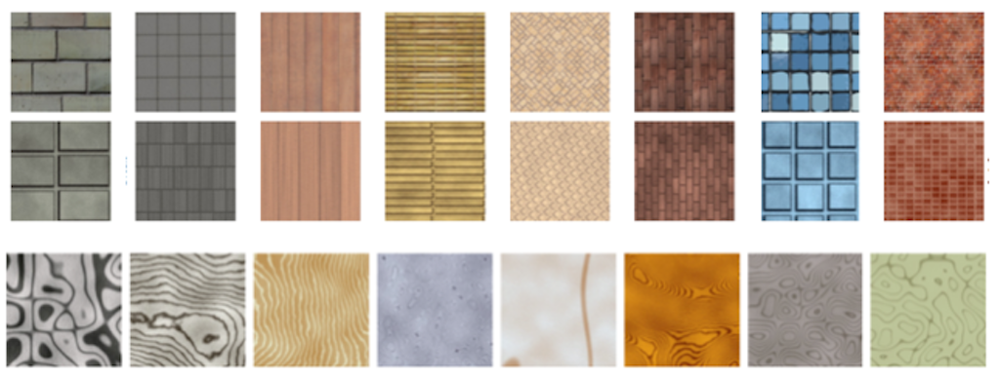]

.footnote[Gieseke, L., Koch, S., Hahn, J.-U., and Fuchs, M. 2014. **Interactive parameter retrieval for two-tone procedural textures**. Computer Graphics Forum. 33, 4.]

---
.header[Procedural Generation | Generation Models]

## Rule-based

Rule-based models further extend function-based models by adding a, potentially quite complex, framework of rules. Rule-based models often require some sort of generation engine. 

???
.task[COMMENT:]  

* This could for example mean, that a space is first partitioned based on certain criteria, e.g. by Voronoi cells, and then each cell is filled by other rules. 
* Rule-based models often require some sort of generation engine. 


---
.header[Procedural Generation | Generation Models]

## Rule-based

For example: 
* Find the largest possible space by fitting a circle and 
* Add element(s) into that space
* Repeat

.center[ ]

.footnote[Lena Gieseke, Paul Asente, Jingwan Lu, and Martin Fuchs. 2017. **Organized order in ornamentation**. In Proceedings of the symposium on Computational Aesthetics (CAE ’17). Association for Computing Machinery, New York, NY, USA, Article 4, 1–9.]

???
.task[COMMENT:]  

* Also, rule-based systems often compute procedurally an underlying structure with proxies first and then exchange the proxies with image elements, e.g. vector graphics.

---
.header[Procedural Generation | Generation Models]

## Rule-based

Example customized rule-based system:

.center[]

.footnote[Arnaud Emilien, Ulysse Vimont, Marie-Paule Cani, Pierre Poulin, and Bedrich Benes. 2015. **WorldBrush: interactive example-based synthesis of procedural virtual worlds**. ACM Trans. Graph. 34, 4, Article 106.]

---
.header[Procedural Generation | Generation Models]

## Grammar-based

Grammar-based models are a substitution system of rules and elements.  

--
* Introduced in theoretical linguistics from [Noam Chomsky](https://en.wikipedia.org/wiki/Noam_Chomsky) (late 1950s)

--
* Principle of forming only grammatically-correct sentences from individual words

--
* E.g. L-systems and shape grammars

---
.header[Procedural Generation | Generation Models | Grammar-based]

## L-systems

* Alphabet of symbols that can be used to make strings
*  Production rules that expand each symbol into some larger string of symbols
* Initial "axiom" string from which to begin
* Mechanism for translating the generated strings into geometric structures


???
.task[COMMENT:]  

* L-systems were introduced and developed in 1968 by [Aristid Lindenmayer](https://en.wikipedia.org/wiki/Aristid_Lindenmayer), a Hungarian theoretical biologist and botanist. Lindenmayer developed a type of formal language (known as L-system) to describe the behavior of plant cells and to model the growth processes of plant development. You can find Lindemayers book [The algorithmic beauty of plants](https://archive.org/details/algorithmicbeaut0000prus) online. L-systems have also been used to model a variety of organisms and can be used to generate self-similar fractals.

---
.header[Procedural Generation | Generation Models | Grammar-based | L-systems]

## Example Koch Curve


---
.header[Procedural Generation | Generation Models | Grammar-based | L-systems]

## Example Koch Curve


.left-even[
* Alphabet: {`F`}
    * `F`: Draw line of length l
    * `+`: Turn counterclockwise (by angle a = 60°)
    * `-`: Turn clockwise (by angle a)
* Axiom: `F`
]
.right-even[
* Initial length `l = 1`
    * At each step set l to l/3
* Rules
    * `F  →  F - F + + F - F`
    * `+  → +`
    * `-  →  -`
]

---
.header[Procedural Generation | Generation Models]

## Additional Models

* Probabilistic

???
.task[COMMENT:]  

* Probabilistic models are usually based on grammars. By adding probabilistic inference (or in short *probabilities*) for how a grammar should be expanded or adjusted, constraints such as a shape fitting can be added.

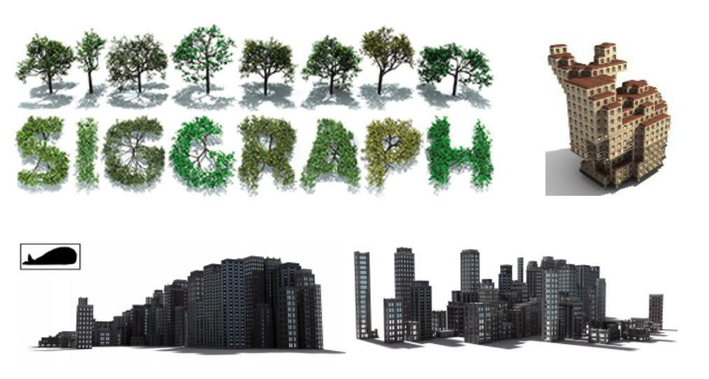

From: Jerry O. Talton, Yu Lou, Jared Duke, Steve Lesser, Radomir Mech, and Vladlen Koltun. **Metropolis Procedural Modeling**. ACM Transactions on Graphics 30(2), 2011

--
* Simulation

???
.task[COMMENT:]  

* In the context of procedural generation, in a previous step simulated vector and tensor fields are used, for example, to influence the generation process (e.g. in which direction to expand a model).


From: Chen, G., Esch, G., Wonka, P., Mueller, P., and Zhang, E. 2008a. **Interactive procedural street modeling**. ACM Transactions on Graphics. 27, 3, Article 103: 1–10

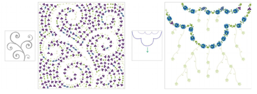

From: Gieseke, L., Asente, P., Lu, J., and Fuchs, M. **Organized order in ornamentation**. In Proceedings of the Symposium on Computational Aesthetics, pages 4:1–4:9. ACM, 2017 

--
* Machine Learning-based

???
.task[COMMENT:]  

* So far there has not been extensive research on combining procedural generation e.g. with maching learning. But I assume this is only a question of time.  

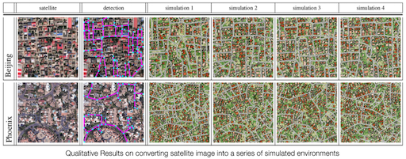

From: Hang Chu, Daiqing Li, David Acuna, Amlan Kar, Maria Shugrina, Xinkai Wei, Ming-Yu Liu, Antonio Torralba, Sanja Fidler. **Neural Turtle Graphics for Modeling City Road Layouts**. ICCV, 2019


Recently ML has been used for improving performance for example.

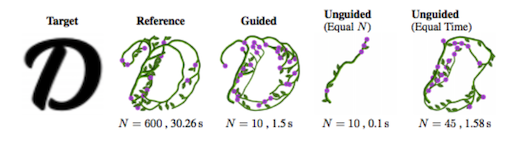

Ritchie, D., Thomas, A., Hanrahan, P., and Goodman, N.D. 2016. **Neurally-guided procedural models: Amortized inference for procedural graphics programs using neural networks**. Advances in neural information processing systems.

An interesting approach tries to learn creation rules from given examples.

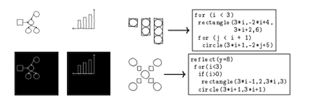

Kevin Ellis, Daniel Ritchie, Armando Solar-Lezama, Josh Tenenbaum. 2018. **Learning to Infer Graphics Programs from Hand-Drawn Images**. Advances in Neural Information Processing Systems 31 (NIPS 2018).

--


.footnote[Jerry O. Talton, Yu Lou, Jared Duke, Steve Lesser, Radomir Mech, and Vladlen Koltun. **Metropolis Procedural Modeling**. ACM Transactions on Graphics 30(2), 2011.]

---
.header[Procedural Generation]

## Generation Models

We will have a closer look onto 

* stochastic models
* function-based models
* rule-based models


???
.task[COMMENT:]  

* Grammar-based models are in their simpler form quite generic looking and it takes a bit to really master them. That is why I am didn't plan to include them - as of now. I might change my mind on this.

---
template:inverse


## Praxis Examples

---
## Praxis Examples

Outside of academia, *procedural generation* it not clearly defined. 

--

A system might be described as *procedural* mainly because it is *parameterized*, with some form of underlying algorithmic creation, which might also include the processing of input data such as images.  

--

.center[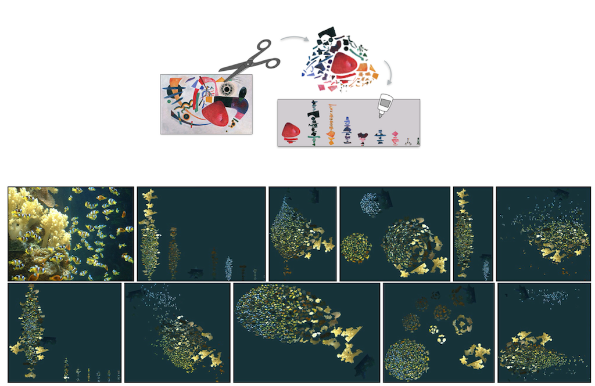]

---

## Praxis Examples

Play for example with these:
  
[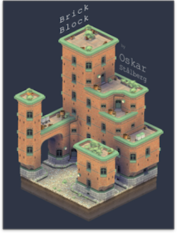](http://oskarstalberg.com/game/house/index.html) 
[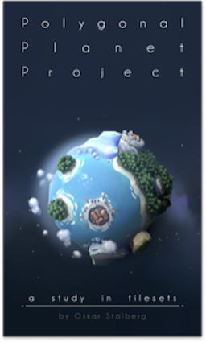](http://oskarstalberg.com/game/planet/planet.html)  
[[Oskar Stålberg]](https://oskarstalberg.tumblr.com/)


---

## Praxis Examples

A more artistic approach follow these procedural generation examples:

##### [Forms by Memo Akten and Quayola](https://vimeo.com/38017188)

[.center[]](https://vimeo.com/38017188)

???
.task[COMMENT:]  

* From their [website](http://www.memo.tv/portfolio/forms/):

> Forms is a series of studies on human motion, and its reverberations through space and time. [...] Rather than focusing on observable trajectories, it explores techniques of extrapolation to sculpt abstract forms, visualizing unseen relationships – power, balance, grace and conflict – between the body and its surroundings.
  
> The project investigates athletes; pushing their bodies to their extreme capabilities, their movements shaped by an evolutionary process targeting a winning performance. Traditionally a form of entertainment in todays society with an overpowering competitive edge, the disciplines are deconstructed and interrogated from an exclusively mechanical and aesthetic point of view; concentrating on the invisible forces generated by and influencing the movement.
  
> The source for the study is footage from the Commonwealth Games. The process of transformation from live footage to abstract forms is exposed as part of the interactive multi-screen artwork, to provide insight into the evolution of the specially crafted world in which the athletes were placed.

---

## Praxis Examples

##### [Forms by Memo Akten and Quayola](https://vimeo.com/38017188)

.center[]

---

## Praxis Examples

##### [Pleasant Places by Quayola](https://quayola.com/work/series/landscape-paintings.php)

[.center[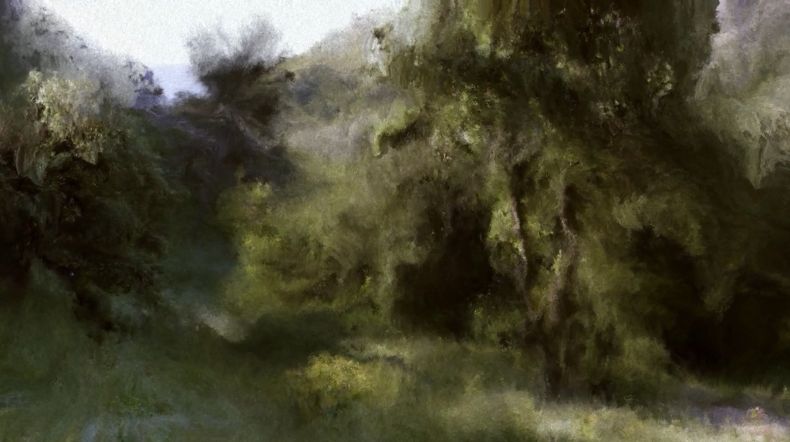]](https://vimeo.com/145404147)


???
.task[COMMENT:]  

* From their [vimeo page](https://vimeo.com/145404147):

> Titled like the first series of landscapes prints produced in Holland in the Seventeenth century, "Pleasant Places" consists of a series of digital paintings exploring the boundary between representation and abstraction. Inspired by the work of Vincent Van Gogh, Quayola has returned to the same countryside of Provence 125 years later.

> Quayola's "Pleasant Places" reimagines the countryside in Provence through the lens of contemporary technology. Visiting the same sites as Vincent Van Gogh, the works contemplate representation and abstraction in light of technological changes, as this relates to Impressionism and Post-Impressionism, as well as our contemporary moment.

---

## Praxis Examples

##### [Pleasant Places by Quayola](https://quayola.com/work/series/landscape-paintings.php)

.center[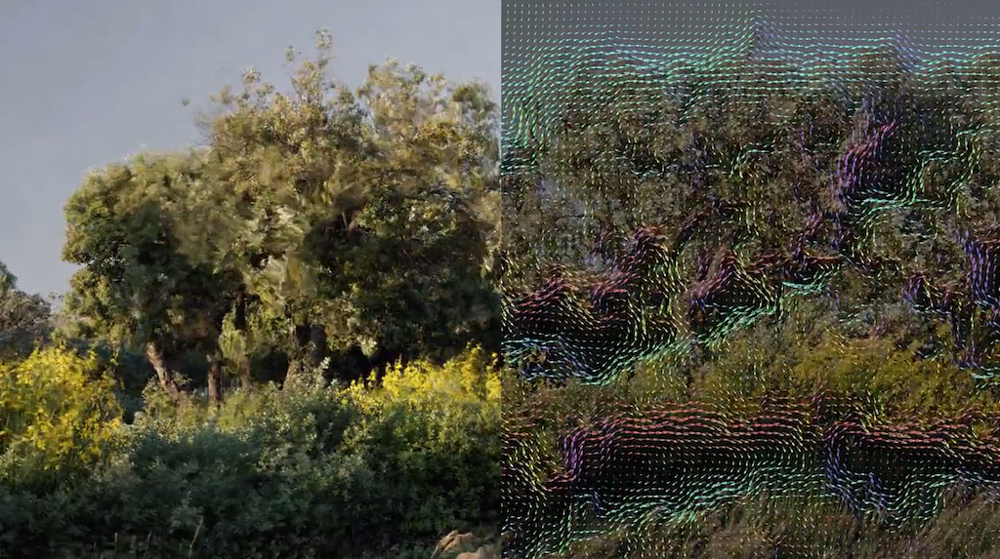]


???
.task[COMMENT:]  

* The landscapes serve as a point of departure - a pretext to shape an inner motion and vision. Through the misuse of image-analysis and manipulation algorithms, Pleasant Places challenges the photographic image and proposes alternative modes of vision and synthesis. Familiar landscapes - filmed in Ultra-High-Definition - is shown with meticulous attention to details and to the anthropomorphic shapes of the trees. Then, through the use of custom-software, the detailed texture of the foliage is reduced to two-dimensional masses of volume veering towards abstraction. As the outlines of trees and shrubs get blurred, nature becomes dense and almost impenetrable. The resulting compositions remain, suggestively, suspended between representation and abstraction, between the depth of the natural scenery and the surface of the screen.
  
> In contrast to this vision, raw data-visualisations of colour and motion information follow in sequence the contemplative digital paintings to remind us what really lies beneath the surface. Pleasant Places pays homage to the modern tradition of Western art that takes landscape as a point of departure towards abstraction, reducing the complexity of the world into new alternative synthesis.

---
template:inverse

# Simulation

---
## Simulation

> What is a simulation?

--

A simulation can be understood as an algorithmic approximation of complex generation systems or phenomena. 

--

A simulation is based on an abstract model and represents for example:

--

* Natural systems in physics, chemistry and biology
* Human systems in economics, psychology, and social science
* Engineering
* …

--

Simulations are used to predict behaviour from a set of parameters and conditions.

.footnote[[[sciencedaily]]([https://www.sciencedaily.com/terms/computer_simulation.htm])]


???
.task[COMMENT:]  

* Traditionally simulations use mathematical models with analytical solutions.  


---
## Simulation

For our context of creating visual represenations, abstractions, pattern and create designs, we are most intersted in simulations with

--

* Particle Systems
* Agents
* Mass-Spring Systems

--

.center[]  
[[Wiki]](https://en.wikipedia.org/wiki/Particle_system#/media/File:Pi-explosion.jpg)[[Boids]](http://www.red3d.com/cwr/boids/)[[Mechanics Books]](https://www.youtube.com/watch?v=lZPtFDXYQRU)

---
## Simulation

These systems can be so-called *context-driven*, meaning they can be influenced by an environment for example and simulate:

--

* Flocks, Herds & Schools
* Fluids and dynamics
* Volumes
* Cloth and fabrics
* Crowds
* …

---
## Simulation

We are speaking of a *dynamic simulation* if the behavior varies with time, and we are simulating for a certain duration of time.

.center[]  
[[innochain]](http://innochain.net/integrating-fast-fluid-dynamics-previous-work/)  

---
.header[Simulation]

## Particles

Particles are the basis for most physics simulations, such as fluids, for example.

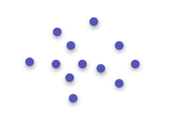

---
.header[Simulation]

## Agents

Agents can be understood as *smarter* particles, with internal rules and motivations.

.center[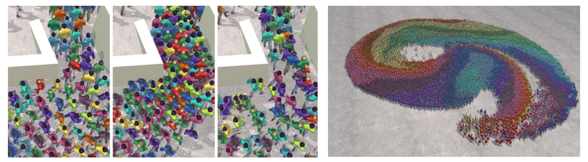]  

.footnote[R. Narain, A. Golas, S. Curtis, and M. C. Lin. **Aggregate dynamics for dense crowd simulation**. In ACM Transactions on Graphics (TOG), volu- me 28, page 122. ACM, 2009.]


???
.task[COMMENT:]  

* The paper models the large-scale behavior of a crowd with inter-agent collision avoidance in dense scenarios. The above image show the results of agentes starting arranged in a circle and then aiming to reach the opposite site of the circle.


---
.header[Simulation]

## Artistic Application

Even the simplest simulations often have a mesmerising effect.

---

##### [Blossoms by Niels Prayer](http://www.nielsprayer.com/blossoms)

[.center[]](http://www.nielsprayer.com/blossoms)

---

##### [A Particle Dream by Nop Jiarathanakul](https://www.iamnop.com/particles/)

[.center[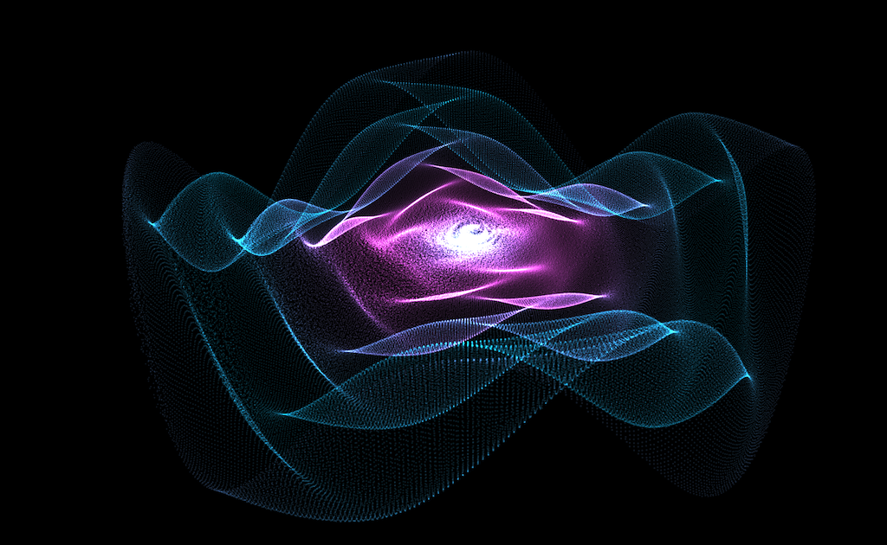]](https://www.iamnop.com/particles/)


---

##### [Machine Hallucinations--Nature Dreams](https://refikanadol.com/works/machine-hallucinations-nature-dreams/)

.center[]  
  
--
  
> [...] novel aesthetic approaches to a vast photographic dataset of nature: A giant data sculpture displaying machine-generated, dynamic pigments of nature [...]


---
template: inverse

# Our Working Environment

---
## Unreal Engine 5

.center[[[pcgamesn]](https://www.pcgamesn.com/unreal-engine-5-demo)]

---
## Unreal Engine 5

<iframe width="791" height="445" src="https://www.youtube.com/embed/bJPxq6QogKE" title="Unreal Engine 5 | Sizzle Reel" frameborder="0" allow="accelerometer; autoplay; clipboard-write; encrypted-media; gyroscope; picture-in-picture; web-share" allowfullscreen></iframe>

---
## Unreal Engine 5

<iframe width="791" height="445" src="https://www.youtube.com/embed/fNJ4XocOwKI" title="Unreal Challenge: Creep It Real Sizzle Reel | Unreal Engine" frameborder="0" allow="accelerometer; autoplay; clipboard-write; encrypted-media; gyroscope; picture-in-picture; web-share" allowfullscreen></iframe>

---
## Unreal Engine 5

* 3D computer graphics game engine developed by Epic Games

--
* Made attractive changes to product offerings due to the commercial success of the Fortnite

--
    * Reduced Marketplace revenues (30% to 12%)
    * Waived royalties margin for games until developers have earned US$1 million in revenue and the fee is waived if developers publish on the Epic Games Store
    * Epic MegaGrants
    * Fellowships


.footnote[[[wikipedia]](https://en.wikipedia.org/wiki/Unreal_Engine)]

???
.task[COMMENT:]  


pic Games, which had been valued at around $825 million at the time of Tencent's acquisition, was estimated to be worth $4.5 billion in July 2018 due to Fortnite Battle Royale, and expected to surpass $8.5 billion by the end of 2018 with projected growth of the game.[60] Player count continued to expand when Epic broke new ground by convincing Sony to change its stance on cross-platform play allowing players on any device to compete with each other in Fortnite Battle Royale.[61] Fortnite has drawn nearly 250 million players as of March 2019

Fortnite's commercial success enabled Epic to make several changes to its other product offerings. In July 2018, it reduced the revenue cut that it took for assets sold on the Unreal Engine Marketplace from 30% to 12%.[63] Epic launched the Epic Games Store digital storefront to compete with services like Steam and GOG.com, not only taking a 12% cut of revenue compared to the industry standard of 30%, but also eliminated the 5% cut for games using the Unreal engine sold via the storefront.

The latest generation, Unreal Engine 5, was launched in April 2022. Its source code is available on GitHub, and commercial use is granted based on a royalty model. Epic waives their royalties margin for games until developers have earned US$1 million in revenue and the fee is waived if developers publish on the Epic Games Store

With Unreal Engine 4, Epic opened the Unreal Engine Marketplace in September 2014. The Marketplace is a digital storefront that allows content creators and developers to provide art assets, models, sounds, environments, code snippets, and other features that others could purchase, along with tutorials and other guides. Some content is provided for free by Epic, including previously offered Unreal assets and tutorials.[143] Prior to July 2018, Epic took a 30% share of the sales but due to the success of Unreal and Fortnite Battle Royale, Epic retroactively reduced its take to 12%.[144]

Epic MegaGrants
A growing community of 3D creators is achieving their wildest dreams with the help of Epic MegaGrants, expanding the impact of real-time technology in the process. Learn more about the program here, as we explore how talented people are creating stunning projects with Unreal Engine.

Over 1,800 grants awarded—so far!

https://www.unrealengine.com/en-US/megagrants


--
* Direct competitor of Unity, with Unity being more popular
    * Market share is 13% (Unreal) vs. 43%


---
## Unreal vs. Unity

--

Unity

* Best for creating simple mobile apps, cross-platform
* Speedy coding with C#
* Powerful asset store
* Graphic polishing needs time and work (if at all possible)
* Rendering can get slow without optimization
* Easy to use

--

Unreal

* Highest quality of graphics (rendering, VFX, animation)
* Fast post-processing features
* Coding with C++ and Blueprints
* Used for film productions and virtual production
* At times a bit clumsy
* Steeper learning curve than unity

.footnote[[[externlabs](https://externlabs.com/blogs/unity-vs-unreal/), [evercast](https://www.evercast.us/blog/unity-vs-unreal-engine)]]

???
.task[COMMENT:]  

* The Unreal Engine has found use in film making to create virtual sets that can track with a camera's motion around actors and objects and be rendered in real time to large LED screens and atmospheric lighting systems. This allows for real-time composition of shots, immediate editing of the virtual sets as needed, and the ability to shoot multiple scenes within a short period by just changing the virtual world behind the actors. The overall appearance was recognized to appear more natural than typical chromakey effects. 
* Among the productions to use these technologies were the television series The Mandalorian and Westworld. Jon Favreau and Lucasfilm's Industrial Light & Magic division worked with Epic in developing their StageCraft technology for The Mandalorian, based on a similar approach Favreau had used in The Lion King.[152][153][154] Favreau then shared this technology approach with Jonathan Nolan and Lisa Joy, the producers for Westworld. The show had already looked at the use of virtual sets before and had some technology established, but integrated the use of Unreal Engine as with StageCraft for its third season.[155][156]


---
## Unreal vs. Unity

Unity

* Best for creating simple mobile apps, cross-platform
* Speedy coding with C#
* Powerful asset store
* Graphic polishing needs time and work (if at all possible)
* Rendering can get slow without optimization
* Easy to use

Unreal

* Highest **quality of graphics**
* Fast post-processing features
* Coding with **C++** and Blueprints
* Used for **film productions and virtual production**
* At times a bit clumsy
* Steeper learning curve than unity

---
## Unreal in Virtual Production


.center[[[mages.edu.sg]](https://mages.edu.sg/blog/unreal-engine-and-virtual-production/)]

---
## Unreal in Virtual Production

<iframe width="791" height="445" src="https://www.youtube.com/embed/_oMH_gy7r60" title="Virtual Production Sizzle Reel 2022 | Unreal Engine" frameborder="0" allow="accelerometer; autoplay; clipboard-write; encrypted-media; gyroscope; picture-in-picture; web-share" allowfullscreen></iframe>

---
## But What About Harry?

.center[[[newrepublic]](https://newrepublic.com/article/119015/edmund-wilson-houdini)]

???
.task[COMMENT:]  

* Harry Houdini (March 24, 1874 – October 31, 1926) was a Hungarian-born American illusionist and stunt performer, noted for his sensational escape acts. [[Wiki: Harry Houdini]](https://en.wikipedia.org/wiki/Harry_Houdini)
* An old trick well done is far better than a new trick with no effect. - Harry Houdini
* Unfortunately, this friendly fella is not topic of our lecture.

---
## SideFX’s Houdini


.center[[[newrepublic]](https://newrepublic.com/article/119015/edmund-wilson-houdini)]


* Started in 1986 and the software is under active development

???
.task[COMMENT:]  

* Version of it differ greatly, be aware of that when you for example do a tutorial for it, which might be based on an older version.

* SideFX offers a full free version: [Houdini Apprentice](https://www.sidefx.com/products/houdini-apprentice/)

???
.task[COMMENT:]  

* Next to the fact that you are not allowed to used the free version for any commercial work, you can only render up to 1280x720 with a watermark 

--
* Comes with the Mantra renderer


???
.task[COMMENT:]  

* Explain the principle of renderers
* Mention that rendering is often not part of the tutorials
* With the free version you can not include third party renderers 

---
## SideFX’s Houdini

<iframe width="791" height="445" src="https://www.youtube.com/embed/YmbEUM_mdGA" title="2022 Houdini Film &amp; TV Reel" frameborder="0" allow="accelerometer; autoplay; clipboard-write; encrypted-media; gyroscope; picture-in-picture; web-share" allowfullscreen></iframe>

---

## Why Houdini So Far?

Introduction to a 3D offline rendering package such as Blender, Maya, 3dsMax, Cinema4D, or Houdini.


???
.task[COMMENT:]  

* Explain the different packages

---

## Why Houdini So Far?

--

Houdini represents the procedural generation paradigm with a node-based system.

--

.center[  [[cg.tuwien]](https://www.cg.tuwien.ac.at/courses/Visualisierung2/HallOfFame/2018/OtherTopic02/html/detail.html)]


---

## Why Houdini So Far?

Houdini represents the procedural generation paradigm with a node-based system.

  [[cg.tuwien]](https://www.cg.tuwien.ac.at/courses/Visualisierung2/HallOfFame/2018/OtherTopic02/html/detail.html)

* Every action is stored in a node

--
* Nodes are wired into networks

--
* Nodes can save and pass information

--
* Networks define a recipe

--
* Networks can be repeated, tweaked, etc.


---

## Why Houdini So Far?

Houdini represents the procedural generation paradigm with a node-based system.

--

This is a very different approach in comparison to the other 3D programs, which usually only come with a very limitedly accessible creation stack.

--

.center[  [[goskills]](https://www.goskills.com/Course/Photoshop-Basic/Lesson/196/History-States)]

---

## Why Not Houdini Any More?

--

.center[]

---

## Why Not Houdini Any More?

* Too hard for just one term

--
* Very specialized tool (mainly for VFX)

--
* The free renderer, Mantra, is horrible

--
* Realtime is the future!

--
    * Unreal and Houdini are combinable
    * Abstract visuals not that common in Unreal yet - we can be special!

---

## Hence Unreal!


<iframe width="791" height="445" src="https://www.youtube.com/embed/Xh6CkhOH1Nw" title="Nanite &amp; Lumen are INSANE! on a Tropical Hillside - Unreal Engine 5" frameborder="0" allow="accelerometer; autoplay; clipboard-write; encrypted-media; gyroscope; picture-in-picture; web-share" allowfullscreen></iframe>


???
.task[COMMENT:]  

* https://www.unrealengine.com/en-US/solutions/games

---
template:inverse

# Next

---
## Next

Next, we will start to generate some pretty results just with numbers and simple formulas.

.center[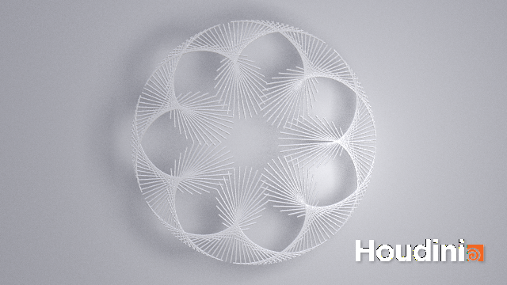]

Fear not, it is going to be fun!

---
template:inverse

### Administration

# Course Setup


???
.task[COMMENT:]  

* https://github.com/ctechfilmuniversity/lecture_procedural_generation_and_simulation

---
template:inverse

### The End

# 👋🏻
