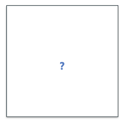

name: inverse
layout: true
class: center, middle, inverse
---


# Procedural Generation and Simulation

### Prof. Dr. Lena Gieseke | l.gieseke@filmuniversitaet.de  

#### Film University Babelsberg KONRAD WOLF


---
layout: false

## Today

--
* Re-Cap

--
* Function Components

--
    * Transitions
--
    * Primitive Components
--
    * Periodicity
--
* Example


---
## Today

.center[]

---
template: inverse

# Chapter 03 - Beauty in Maths

---
## The Golden Ratio

???
.task[COMMENT:]  

* What is the golden ratio?

--

We have a *golden* ratio if the ratio of two quantities is the same as the ratio of their sum to the larger of the two quantities.

$\frac{a+b}{a} = \frac{a}{b} =  \varphi$

???
.task[COMMENT:]  

* A ratio describes one quantity in relationship to another one, e.g. how long the width of an image is in relationship to its height. 

--

Phi represents the golden ratio and is an irrational number with a value of:

$\varphi = \frac{1+{\sqrt{5}}}{2} = 1.618\,033\,988\,7\dots$  


---
## The Golden Ratio

Some believe the Golden Ratio makes the most pleasing and beautiful shape...

.center[]

---
## The Golden Ratio

There is a special relationship between the Golden Ratio and Fibonacci Numbers.

--

The ratio of two successive Fibonacci numbers is close to the golden ratio:


.center[[[hydrogen2oxygen]](https://hydrogen2oxygen.net/en/2012/06/21/the-fibonacci-sequence-is-the-mathematical-first-cousin-of-the-golden-ratio/)]


---
## The Golden Ratio

The golden spiral gets wider (or further from its origin) by a factor of $\varphi$ for every quarter turn it makes.

.center[[[wiki]](https://commons.wikimedia.org/wiki/File:FakeRealLogSpiral.svg)]


---
## Golden Spiral

.center[[[wiki]](https://commons.wikimedia.org/wiki/File:GoldenSpiralLogarithmic_color_in.gif)]


???
.task[COMMENT:]  

* Golden spirals are self-similar. The shape is infinitely repeated when magnified.

---
## The Golden Angle

.center[ ]  
.center[[[LeerZelfBeleggen]](https://leerzelfbeleggen.com/wp-content/uploads/2018/08/Fibonacci-trading-leren-traden-met-de-geheime-formule-voorbeelden.jpeg)]


---
## $\varphi$ in Nature


.center[[[gofiguremath]](http://gofiguremath.org/natures-favorite-math/the-golden-ratio/the-golden-angle/)]


???
.task[COMMENT:]  

* What you want is to turn for every new leave a certain degree as the following (the numbers indicate the order in which the leaves grew).
* Imagine you are a plant and you can spread leaves all around your stem. Now, being a plant, needing Photosynthese and such, you want all of your leafes to soak up as much sun (and rain) as possible. So when you sprout a new leaf, you don’t want it to block your other leaves.


---
## $\varphi$ in Nature

.center[  [[gofiguremath]](http://gofiguremath.org/natures-favorite-math/the-golden-ratio/the-golden-angle/)]


???
.task[COMMENT:]  

* The same problem applies if you imagine to be a sunflower and you want to pack as many seeds as possible, while all of them getting as much sun as possible.

---
.header[Golden Angle]

## Phyllotaxis

.center[]


???
.task[COMMENT:]  

* Fractions for the `ratio` value lead to spikes, while getting closer to an irrational number produces dense distributions:
* https://editor.p5js.org/legie/sketches/iVLdC_coE


---
.header[Golden Angle]

## Phyllotaxis


H. Vogel's generation model of alternating leaf pattern

$r = c\sqrt{n}$

$\theta = n \times 137.508^\circ$

with

* angle $\theta$,
* radius $r$,
* index number of the current element $n$, and
* a constant scaling factor $c$.


.footnote[Vogel, H (1979). "A better way to construct the sunflower head". Mathematical Biosciences 44 (44): 179–189. doi:10.1016/0025-5564(79)90080-4]


???
.task[COMMENT:]  

* in polar coordinates


---
## Famous Irrational Numbers

--

* $\varphi = 1.61803398874989484820...$
    * The most irrational of them all  
* $\pi = 3.1415926535897932384626433832795..$
    * The rockstar of the irrational numbers
    * The popular approximation of $\frac{22}{7} = 3.1428571428571$ is close but not accurate
    * Over a quadrillion decimal places have been calculated and *still there is no pattern!!!*
* $e = 2.7182818284590452353602874713527$
    * Euler's Number
    * Base of the Natural Logarithms

???
.task[COMMENT:]  

* Many square roots, cube roots, etc. are also irrational numbers.
    * $\sqrt{3} = 1.7320508075688772935274463415059...$
    * $\sqrt{99} = 9.9498743710661995473447982100121...$
    * But e.g. $\sqrt{4} = 2$ (rational), and $\sqrt{9} = 3$ (rational), so not all roots are irrational.


---
## The Rose Function

.center[[[wiki]](https://en.wikipedia.org/wiki/Rose_\(mathematics\))]


???
.task[COMMENT:]  

Rose curves are defined by (as cartesian parametric equations)

$x=r \cos(k\theta )\cos(\theta )$  
$y=r \cos(k\theta )\sin(\theta )$  

for various $k = n / d$.

---
## Modular Multiplication on a Circle

.center[]


???
.task[COMMENT:]  

The algorithm connects the starting values to the ending values for a chosen modulus and multiplier .

.center[]

* Multiply the positive integers by 3
* Connect to result (mod 10)

---
## Modular Multiplication on a Circle

.center[<iframe width="767" height="431" src="https://www.youtube.com/embed/13be44CqrrI" title="The Dancing Mandala: Multiplication Tables Plotted on a Unit Circle" frameborder="0" allow="accelerometer; autoplay; clipboard-write; encrypted-media; gyroscope; picture-in-picture; web-share" allowfullscreen></iframe>]


---
template: inverse

### Chapter 04
# Function Design

---
## Function Design

.center[]
[[geogebra]](https://www.geogebra.org/m/Wkjz2X92)  


???
.task[COMMENT:]  

* *How does the following look like when plotted in a 2D cartesian coordinate system?*
* You are right, [it is Batman!](https://www.youtube.com/watch?v=oaIsCJw0QG8&feature=youtu.be)

---
## Function Design

.center[]  
[[geogebra]](https://www.geogebra.org/m/Wkjz2X92)  

--

By slicing together different functions, you can archive many different curve designs.

---
## Function Design

.center[]  
[[math.stackexchange]](https://math.stackexchange.com/questions/54506/is-this-batman-equation-for-real)  


???
.task[COMMENT:]  

* For now, we are having a look into somewhat simpler equations.  

---
## Function Design

> We want to modify, shape and to combine different functions. 

With this approach we can almost draw anything. 

--

.center[]  
[[wiki]](https://en.wikipedia.org/wiki/File:Tiling_procedural_textures.jpg)  


???
.task[COMMENT:]  

* Such individually shaped functions can be used for a variety of applications, such as textures, shading, animation, geometry, dance, etc. 
* We will focus in this script on the generation of 2D graphics but please keep in mind that most functions are equally useful in different contexts and even dimensions.
* https://www.shadertoy.com/view/llSyDh
* https://www.shadertoy.com/view/WdcBDB
* https://www.shadertoy.com/view/WdtGWf

---
## 2D Design

Let’s assume we want to color a canvas, meaning giving each pixel a color value, e.g. when computing a texture.

  

---
## 2D Design

.center[]  

Then we interpret the value of *f(x,y) = z*, hence *z*, as color value.


???
.task[COMMENT:]  

* To color this area, we can use a 2D function, meaning a function depending on two input parameters such as *x, y* in 3D space. Please note that in the following examples *z* is the up-axis of the coordinate system.

---
## 2D Design

With *z* interpreted as color value between 0..1 on a 2D canvas:

.  

---
## 2D Design

  
  


???
.task[COMMENT:]  

* You can imagine this as if looking in -z direction onto the plotted gray value, or as if projecting the plot onto the xy-plane.

---
## 2D Design

You could also map the function value to a color range such as

.center[]  

---
## 2D Design

Also, the combination of simple  functions can already lead to pleasing patterns

.center[]  


???
.task[COMMENT:]  

* In the above plots frequency, amplitude and offset have been adjusted but left out in the equation for simplicity.
* PI for sin is one huegel
* code/glsl/lecture03/sin.frag

---
## 2D Design

*f(x) = c*

.center[]  

[[tobyschachman]](http://tobyschachman.com/Shadershop/)


???
.task[COMMENT:]  

* You will often find examples and explanations in lower dimensions, meaning in 1D, as the graphs for these functions are easier to visualize: with *c* as the gray or color value. 
* How to interpret in this scenarios the needed second dimension depends on the context. Often it is simply left out as an influencing parameter such as in our start example

  

---
template:inverse

## Transitions

---
## Transitions

*How to go from one color to another?*

???
.task[COMMENT:]  

* The above examples have already shown one overall principle, namely *how to get from one value to another value* or in our context *how to get from one color (e.g. white) to another color (e.g. black)*?

--

  

---
## Transitions

In more general terms we can understand this as defining a transition function *t*:

  


???
.task[COMMENT:]  

.  

---
## Transitions


.center[]


---
.header[Transitions]

## Step Function

.center[]  

???
.task[COMMENT:]  

* The simplest of transitions is the step function, which switches between values based on a threshold, meaning with a fixed value that *t* is smaller or larger to.

---
.header[Transitions]

## Step Function

.center[]  

---
.header[Transitions]

## Step Function


```glsl
#ifdef GL_ES
precision mediump float;
#endif

#define PI 3.14159265359
uniform vec2 u_resolution;

void main()
{
    vec2 pt = gl_FragCoord.xy/u_resolution;


    // Increase frequency to fit more sin waves 
    // between 0..1
    float verti = sin(8.0 * PI * pt.x);
    float hori = sin(8.0 * PI * pt.y);

    float step_value = step(0.3, pt.x);
    vec3 color = vec3(step_value * hori);

    // Assign frag color with alpha
    gl_FragColor = vec4(color,1.0);
}
```


???
.task[COMMENT:]  

* code/glsl/lecture03/step.frag

---
## Transitions


More often we want a smoother transition, e.g.

.center[]


???
.task[COMMENT:]  

* This is called an *interpolation*.


---
.header[Transitions]

## Linear Interpolation

.center[]  

---
.header[Transitions]

## Linear Interpolation

.center[]  

---
.header[Transitions]

## Linear Interpolation

```glsl
#ifdef GL_ES
precision mediump float;
#endif

#define PI 3.14159265359
uniform vec2 u_resolution;

void main()
{
    vec2 pt = gl_FragCoord.xy/u_resolution;

    // Our "pattern":
    float verti = sin(8.0 * PI * pt.x);
    float hori = sin(8.0 * PI * pt.y);

    // Interpolating between the pattern and 1.
    // depending on the x coordinate, meaning
    // with t = pt.x

    vec3 color = vec3(pt.x * hori + ((1.0 - pt.x) * verti));

    // Assign frag color with alpha
    gl_FragColor = vec4(color,1.0);
}
```


???
.task[COMMENT:]  

* code/glsl/lecture03/interploation.frag
* https://registry.khronos.org/OpenGL-Refpages/gl4/html/mix.xhtml


---
.header[Transitions]

## Bilinear Interpolation

[[scratchapixel]](https://www.scratchapixel.com/lessons/procedural-generation-virtual-worlds)
  
---
.header[Transitions]

## Bilinear Interpolation

[[scratchapixel]](https://www.scratchapixel.com/lessons/procedural-generation-virtual-worlds)
  
--
  
A bilinear interpolation is the linear interpolation of two linear interpolations, hence
* two linear interpolations to get `a` and `b` in one direction (here `tx`)
* one linear interpolation of `a` to `b` in the second direction (here `ty)`

```
a = c00 * (1 - tx) + c10 * tx; 
b = c01 * (1 - tx) + c11 * tx; 

c = a * (1) - ty) + b * ty; 
```


???
.task[COMMENT:]  

* Linear and bilinear interpolation is usually called `lerp()`, e.g. [`lerp` in p5](https://p5js.org/reference/#/p5.Vector/lerp) or [`lerp` in vex](http://www.sidefx.com/docs/houdini/vex/functions/lerp.html) or [`mix`](https://www.khronos.org/registry/OpenGL-Refpages/gl4/html/mix.xhtml) in glsl.


---
.header[Transitions]

## Bilinear Interpolation


---
.header[Transitions]

## Bilinear Interpolation

```glsl
void main()
{
    vec2 pt = gl_FragCoord.xy/u_resolution;


    vec3 color1 = vec3(1., 0. , 0.);
    vec3 color2 = vec3(0., 1. , 0.);
    vec3 color3 = vec3(0., 0. , 1.);
    vec3 color4 = vec3(1., 1. , 0.);

    vec3 interpol1 = mix(color1, color2, pt.x);
    vec3 interpol2 = mix(color3, color4, pt.x);

    vec3 interpol3 = mix(interpol1, interpol2, pt.y);
    vec3 color = interpol3;

    gl_FragColor = vec4(color,1.0);
}
```


???
.task[COMMENT:]  

* bliniear_interpolation.frag

---
.header[Transitions]

## Trilinear Interpolation

  
[[scratchapixel]](https://www.scratchapixel.com/lessons/procedural-generation-virtual-worlds)

A trilinear interpolation is the linear interpolation of two bilinear interpolations.


???
.task[COMMENT:]  

```
e = bilinear(tx, ty, c000, c100, c010, c110); 
f = bilinear(tx, ty, c001, c101, c011, c111); 

g = e * ( 1 - tz) + f * tz; 
```

By the way, *what is a voxel*?

A voxel is like a pixel but in 3D and represents a value on a regular 3D grid. We need voxels for volumes, for example.

  
[[wiki]](https://en.wikipedia.org/wiki/Voxel)

---
.header[Transitions]

## Interpolation Functions


???
.task[COMMENT:]  

* To move between values, we have many options. Simply taking different exponents for *t* in a linear interpolations changes the transition between the values notably.
* code/glsl/lecture03/*_exponent.frag

--

.center[]  

---
.header[Transitions]

## Interpolation Functions

.center[]  
[[paulbourke]](http://paulbourke.net/miscellaneous/interpolation/)


???
.task[COMMENT:]  

* For example, in 3D software such as Houdini, there are several interpolations functions to chose from. Here, some comparisons:


---
.header[Transitions]

## Interpolation Functions

.center[]  
[[demofox]](https://blog.demofox.org/2015/08/15/resizing-images-with-bicubic-interpolation/)  


???
.task[COMMENT:]  

* These different functions lead to different visual designs, depending on the context, e.g. for interpolating between colors for an image or positions for an animation. From left to right, Nearest Neighbor, Bilinear, Lagrange Bicubic interpolation (only interpolates values, not slopes), Hermite Bicubic interpolation

---
.header[Transitions]

## Interpolation Functions


  
[[gfxile]](http://sol.gfxile.net/interpolation/)  

---
.header[Transitions | Interpolation Functions]

## Smooth Step

Smoothstep is one of the most commonly used interpolation and clamping function in graphics and is often given as a build-in function from a framework. 

--

*On a side note:* What is a *clamping* function? 

--


???
.task[COMMENT:]  

* In computer graphics, clamping is the process of limiting a value to a range. Unlike wrapping, clamping merely moves the point to the nearest available value. [[2]](https://en.wikipedia.org/wiki/Clamping_(graphics))
* *S* is a [sigmoid function](https://en.wikipedia.org/wiki/Sigmoid_function), which is bounded and often used in the context of mapping a potentially indefinite range of values to a range.

---
.header[Transitions | Interpolation Functions]

## Smooth Step

Often smoothstep implements a cubic Hermite interpolation after clamping:


--

.center[]  


???
.task[COMMENT:]  

* Smoother Steps is an improved version of the smoothstep function, created by Ken Perlin.


---
.header[Transitions | Interpolation Functions]

## Smooth Step

```glsl
float smoothstep(float edge0, float edge1, float x)
{
    x = clamp((x, 0.0, 1.0); 
    return x * x * (3 - 2 * x);
}

float clamp(float x, float lowerlimit, float upperlimit)
{
    if (x < lowerlimit)
        x = lowerlimit;
    if (x > upperlimit)
        x = upperlimit;
    return x;
}
```


???
.task[COMMENT:]  

* https://docs.gl/sl4/smoothstep

---
.header[Transitions | Interpolation Functions]

## Smooth Step

.center[]  
[[gfxile]](http://sol.gfxile.net/interpolation/)  

---
.header[Transitions | Interpolation Functions]

## Smooth Step

.center[]  
[[4]](https://cis700-procedural-graphics.github.io/)


---
.header[Transitions | Interpolation Functions]

## Bias and Gain

Bias and gain are parameters that give further control for the fine-tuning of a interpolation function curve. 


???
.task[COMMENT:]  

* This has been, once again, [Ken Perlin's idea](http://demofox.org/biasgain.html).

---
.header[Transitions | Interpolation Functions]

### Bias

*How much time is spent at either end of the transition*?  

The larger the values, the faster grows the value at the beginning.

.center[]  

---
.header[Transitions | Interpolation Functions]

### Bias

*How much time is spent at either end of the transition*?  

The larger the values, the faster grows the value at the beginning.


.center[]  

--

```glsl
float get_bias(float t, float bias)
{
    return (t / (((1.0 / bias) - 2.0) * (1.0 - t)) + 1.0);
}
```


---
.header[Transitions | Interpolation Functions]

### Gain

*How much time is spent in the middle of the transition*?  

The larger the value, the slower changes the value around the middle.

--

.center[]  

---
.header[Transitions | Interpolation Functions]

### Gain

.center[]  
[[4]](https://cis700-procedural-graphics.github.io/)


???
.task[COMMENT:]  

* For further information, read Perlin's blog post [Bias And Gain Are Your Friend](https://blog.demofox.org/2012/09/24/bias-and-gain-are-your-friend/).

???
.task[COMMENT:] 

.center[]  
[[houdini]](https://www.sidefx.com/docs/houdini/network/ramps.html)  


 

* In Houdini interpolation is relevant in numerous places, e.g. for the [ramp parameter control](https://www.sidefx.com/docs/houdini/network/ramps.html).
* With the interpolation functions

  

---
.header[Transitions | Interpolation Functions]

### Common Implementations in Software Packages

--

* Constant
* Linear
* Catmull-Rom
    * Interpolates smoothly between the keys. See [Catmull-Rom_spline](https://en.wikipedia.org/wiki/Cubic_Hermite_spline#Catmull%E2%80%93Rom_spline).
* Monotone Cubic
    * Another smooth interpolation that ensures that there is no overshoot. For example, if a key’s value is smaller than the values in the adjacent keys, this type ensures that the interpolated value is never less than the key’s value.
* Bezier
    * Cubic Bezier curve that interpolates every third control point and uses the other points to shape the curve. See [Bezier curve](https://en.wikipedia.org/wiki/B%C3%A9zier_curve).
* BSpline
    * Cubic curve where the control points influence the shape of the curve locally (that is, they influence only a section of the curve). See [B-Spline](https://en.wikipedia.org/wiki/B-spline).
* Hermite
    * Cubic Hermite curve that interpolates the odd control points, while even control points control the tangent at the previous interpolation point. See [Hermite spline](https://en.wikipedia.org/wiki/Cubic_Hermite_spline).

[[5]](http://www.sidefx.com/docs/houdini/hom/hou/rampBasis.html)


???
.task[COMMENT:]  

* Constant
    * Holds the value constant until the next key.
* Linear
    * Does a linear (straight line) interpolation between keys.


---
template:inverse

## Function Primitive Components


???
.task[COMMENT:]  

* So far, we can only transition from one value or function exemplar to another one. That is a bit boring. The following presents a list of the most commonly used function components for putting together an individual design goal.

A great tool to work with function components and test how to put them together is the [Graph Toy](https://graphtoy.com/).

---
.header[Function Primitive Components]

### Modulo

```js
y = x % 0.5;
```


???
.task[COMMENT:]  

* How would it look like?
--

.center[]  

--

With modulo you can easily iterate ranges and therefore loops, for example.


---
.header[Function Primitive Components]

### Floor


```js
y = floor(x);
```

???
.task[COMMENT:]  

* How would it look like?

--
.center[]  

--

Floor ignores fraction and creates with that a continuous step function.


---
.header[Function Primitive Components]

### Sign

```js
y = sign(x);
```

???
.task[COMMENT:]  

* How would it look like?


---
.header[Function Primitive Components]

### Sign

```js
y = sign(x);

//-1 if x < 0, 0 if x==0, 1 if x > 0
```

.center[]  

--

Sign extracts the sign of a real number and is therefore either `1` or `-1`.


---
.header[Function Primitive Components]

### Absolute

```js
y = abs(x);
```


???
.task[COMMENT:]  

* How would it look like?

--
.center[]  


--

The absolute keeps values always positive.

---
.header[Function Primitive Components]

### Min and Max

```js
y = min(x, 0.5);
```

???
.task[COMMENT:]  

* How would it look like?


--
.center[]  

--

Min and Max are used to define lower and upper borders.


---
template:inverse

## Periodicity

---
## Periodicity

  
[[wiki]](https://en.wikipedia.org/wiki/Square_wave#/media/File:Waveforms.svg)


???
.task[COMMENT:]  

* Often times we want to repeat certain visual features, which can be done in its simplest form e.g. with a `sin` function. However, there are several other design options. The following functions are also often called *wave functions*.

---
.header[Periodicity]

## Wave Functions

Wave functions have two common properties

* frequency (“*how often*”), and
* amplitude (“*how much*”).


???
.task[COMMENT:]  

* 23/code/glsl/lecture03/periodicity.frag

---
.header[Periodicity]

### Square

The square wave enables a sharp oscillation between two values.

```glsl
float wave_square(float t, float frequency, float amplitude)
{
  return floor(t* frequency) % 2 * amplitude;
}
```

.center[]  

---
.header[Periodicity]

### Sawtooth

The sawtooth wave enables a jagged oscillation — a value increases linearly and then resets.

```glsl
float waveSawTooth(float t, float frequency, float amplitude)
{
  return (t * frequency - floor(t* frequency)) * amplitude;
}
```

.center[]  

---
.header[Periodicity]

### Triangle

The triangle wave enables a linear oscillation between two values.

```glsl
float waveTriangle(float t, float frequency, float amplitude)
{
  return abs((t * frequency) % amplitude - (0.5 * amplitude));
}
```

.center[]  


---
.header[Periodicity]

### Triangle


```glsl
float waveTriangle(float t, float frequency, float amplitude)
{
  return ((t * frequency) % amplitude);
}
```


---
.header[Periodicity]

### Triangle

Then, we scale the triangle site by half in order to fit two of them :

```glsl
float waveTriangle(float t, float frequency, float amplitude)
{
  return ((t * frequency) % amplitude - (0.5 * amplitude));
}
```


---
.header[Periodicity]
### Triangle

Lastly, we take the `abs` value in order to repeat the triangle site in the other direction:

```glsl
float waveTriangle(float t, float frequency, float amplitude)
{
  return abs((t * frequency) % amplitude - (0.5 * amplitude));
}
```


---
## Function Design


There are various other [function shapes](http://www.iquilezles.org/www/articles/functions/functions.htm), which you could integrate into your design. 

---
template:inverse

# Example


???
.task[COMMENT:]  

* In this example, I am walking you through the steps to re-create this subtle pattern. It is a fairly easy design but include several of the most common approaches when putting functions together.

---
## Example

.center[]  


???
.task[COMMENT:]  

*What do you see? What could be the steps to recreate this pattern?*

---
.header[Example]

### One Cell

When working on repetitive patterns, one usually starts with one cell and repeats that cell in a second step.  

--
Let's start with creating a circle...

.center[]  


???
.task[COMMENT:]  

* How could we create this?

--

...by plotting the distance of each coordinate to the center point `0.5`, `0.5`.


???
.task[COMMENT:]  

* The [`distance()`](https://www.khronos.org/registry/OpenGL-Refpages/gl4/html/distance.xhtml) function calculates the distance between two points.
* The [`mix()`](https://www.khronos.org/registry/OpenGL-Refpages/gl4/html/mix.xhtml) function linearly interpolate between two values.

---
.header[Example]

## One Cell


```glsl
#ifdef GL_ES
precision mediump float;
#endif

uniform vec2 u_resolution;
uniform float u_time;

float CELLSIZE = 0.2; //relative, hence 0..1
vec2 OFFSET = vec2(0.3);

void main()
{

    vec2 coord = gl_FragCoord.xy/u_resolution;

    // 1. One Cell, distance to center point
    float d = distance(coord, vec2(0.5));

    vec3 color = mix(vec3(0.5, 0.0, 0.0), vec3(0.35, 0.2, 0.5), d);
    gl_FragColor = vec4(color, 1.0);
}
```


---
.header[Example]

## Ridges

Next, let's create ridges with the [`floor`](https://www.khronos.org/registry/OpenGL-Refpages/gl4/html/floor.xhtml) function.

--

.center[]  

---
.header[Example]

## Ridges


```glsl

float CELLSIZE = 0.2; //relative, hence 0..1
vec2 OFFSET = vec2(0.3);

void main()
{

    vec2 coord = gl_FragCoord.xy/u_resolution;

    // 2. Ridges
    float d = distance(coord, vec2(0.5));
    d *= 8.0;
    d -= floor(d);

    vec3 color = mix(vec3(0.5, 0.0, 0.0), vec3(0.35, 0.2, 0.5), d);
    gl_FragColor = vec4(color, 1.0);
}
```

---
.header[Example] 

## Repetitive Cells

Next, let's create the cells...
  
.center[]  

--

...by dividing the 0..1 original x,y coordinate by the cell size.

---
.header[Example] 

## Repetitive Cells

```glsl

float CELLSIZE = 0.2; //relative, hence 0..1
vec2 OFFSET = vec2(0.3);

void main()
{
    vec2 coord = gl_FragCoord.xy/u_resolution;

    // 3. Create Cells
    // Get into one cell
    float x = coord.x / CELLSIZE;
    float y = coord.y / CELLSIZE;
    x -= floor(x);
    y -= floor(y);
    
    float d = distance(vec2(x, y), vec2(0.5));
    d *= 8.0;
    d -= floor(d);

    vec3 color = mix(vec3(0.5, 0.0, 0.0), vec3(0.35, 0.2, 0.5), d);
    gl_FragColor = vec4(color, 1.0);
}
```

---
.header[Example] 

## Repetition Within Cell

.center[]  

--
1. Move Circle Center
2. Move value range from 0..1 to -1..1 and take the absolute 

---
.header[Example] 

## Move Center

Now, we simply move the center point (the one that we are computing the distance to for the circles).

--

.center[]  

---
.header[Example] 

## Move Center


```glsl
float CELLSIZE = 0.2; //relative, hence 0..1
vec2 OFFSET = vec2(0.3);

void main()
{
    vec2 coord = gl_FragCoord.xy/u_resolution;

    // 4. Move center point by OFFSET to compute distance to
    float x = coord.x / CELLSIZE;
    float y = coord.y / CELLSIZE;
    x -= floor(x);
    y -= floor(y);
    
    float d = distance(vec2(x, y), OFFSET);
    d *= 8.0;
    d -= floor(d);

    vec3 color = mix(vec3(0.5, 0.0, 0.0), vec3(0.35, 0.2, 0.5), d);
    gl_FragColor = vec4(color, 1.0);
}
```

---
.header[Example] 

## Repetition Within Cell


Lastly, we want to repeat the pattern within the cell as well and also flip it. For this we remap the original value range from 0..1 to -1..1 and take the absolute of those values.

--

.center[]  

---
.header[Example] 

## Repetition Within Cell

```glsl
float CELLSIZE = 0.2; //relative, hence 0..1
vec2 OFFSET = vec2(0.3);

void main()
{
    vec2 coord = gl_FragCoord.xy/u_resolution;

    
    // 5a. Remapping the range

    float x = coord.x / CELLSIZE;
    float y = coord.y / CELLSIZE;
    x -= floor(x);
    y -= floor(y);

    // Modify value range from 0..1 to -1..1
    float x_remap = (x - 0.5) * 2.0;
    float y_remap = (y - 0.5) * 2.0;
    
    float d = distance(vec2((x_remap), (y_remap)), OFFSET);
    d *= 8.0;
    d -= floor(d);

    vec3 color = mix(vec3(0.5, 0.0, 0.0), vec3(0.35, 0.2, 0.5), d);
    gl_FragColor = vec4(color, 1.0);
}
```

---
.header[Example] 

## Repetition Within Cell

... and taking the absolute of the new value range

--
  
.center[]  

---
.header[Example] 

## Repetition Within Cell

```glsl
float CELLSIZE = 0.2; //relative, hence 0..1
vec2 OFFSET = vec2(0.3);

void main()
{
    vec2 coord = gl_FragCoord.xy/u_resolution;

    
    // 5a. Remapping the range to -1..1
    // 5b. and taking the absolute values

    float x = coord.x / CELLSIZE;
    float y = coord.y / CELLSIZE;
    x -= floor(x);
    y -= floor(y);

    // Modify value range from 0..1 to -1..1
    float x_remap = (x - 0.5) * 2.0;
    float y_remap = (y - 0.5) * 2.0;
    
    float d = distance(vec2(abs(x_remap), abs(y_remap)), OFFSET);
    d *= 8.0;
    d -= floor(d);

    vec3 color = mix(vec3(0.5, 0.0, 0.0), vec3(0.35, 0.2, 0.5), d);
    gl_FragColor = vec4(color, 1.0);
}
```

---
## Example

.center[]  


???
.task[COMMENT:]  

* I hope you didn't go blind by this example... sorry.

---
tempalte: inverse

## Design Goals


???
.task[COMMENT:]  

* To understand the above described different components is hopefully with some brain power manageable. But putting components together can be quite daunting. Also, don't be scared away by cryptic examples you will find on the web. Function design code is notoriously difficult to read as it is often optimized for performance.

The best side for finding shader inspirations is [Shadertoy](https://www.shadertoy.com/) run by Inigo Quilez. ShaderToy is packed with very good examples (but also some bad ones...) and code to steal. Unfortunately, ShaderToy is slightly its own world with different variables namings and core functions. We will come back to the awesomeness that is ShaderToy in the Shader Programming workshop.


---
## Design Goals


Whenever you find function designs that you would like to understand, you should try to find the overall *gist* of the design.

--

*How to find the gist of a function design?*

--

Divide and conquer:

--
* Separate functionalities, e.g. turn of animation, sound, interaction etc.

--
* Test different values for constants and defines

--
* Take out all scaling factors, offsets, etc.

--
* Go line by line and display the result of each line separately

--
  
Here, only practice and patience help.  


---
## Example

.center[]  
[[Happy Jumping by Iq]](https://www.shadertoy.com/view/3lsSzf)


???
.task[COMMENT:]  

* Then, at some point you will not only be as happy as this blobby creature but you might also be able to program this fully procedurally generated scene (including the renderer and such!), which is one of [the masterpieces of Inigo Quilez](https://www.shadertoy.com/view/3lsSzf).
* If you are interested in how Inigo build this scene, there is a 6 hours (!) recorded live stream, deconstructing the [Happy Jumping mathematical animation](https://www.youtube.com/watch?v=Cfe5UQ-1L9Q). I tried to watch the video several times but terribly failed each time. Inigo might be a shader mastermind, didactically he is not always.


---
template:inverse

## Next

---
.header[Next]

## Tilings

Next we are looking into the deeper meanings of repetition:

.center[]


???
.task[COMMENT:]  

* 23/code/glsl/pattern_islamic_hex/pattern_islamic_hex.frag

---
template:inverse

### The End

# 👋🏻
